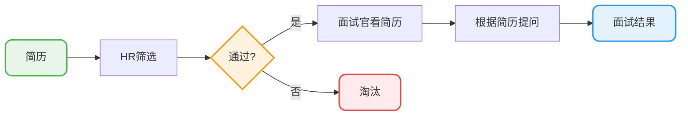
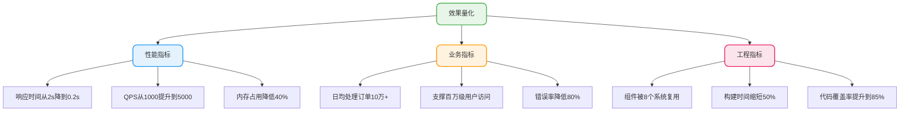

# 简历撰写指南

## 为什么简历这么重要

说实话，我见过太多技术不错但简历写得一塌糊涂的人了。技术再好，简历过不了筛选，连面试机会都没有。

### 简历的两个核心作用

**第一个作用：获取面试机会**

不管你是网申还是内推，简历都是第一道关卡。HR每天要看上百份简历，给每份简历的时间可能就10秒左右。

就算有朋友帮你内推，如果简历本身没什么亮点，人家也帮不上什么忙。而且即使过了初筛，面试官也会根据简历质量来判断值不值得花时间认真面你。

**第二个作用：决定面试官问什么**

面试官基本上都是根据你简历上的内容来提问的。你写了熟练使用Redis，那Redis相关的问题肯定跑不了；你写了项目里用了消息队列，消息队列的原理大概率会被问到。

而且技能熟练度的描述也会影响提问深度——你写"精通"和写"了解"，面试官问的问题难度完全不一样。



所以说，**花个2-3天专门打磨简历是完全值得的**。技术能力和学习能力强的人，写出来的简历一般也比较棒。

## 简历模板和排版

### 推荐的简历工具

我个人比较推荐用Markdown写简历，写完之后转成PDF投递。Markdown语法很简单，半小时就能学会。

这里推荐几个不错的简历资源：

| 资源名称 | 特点 | 价格 |
|---------|------|------|
| 适合中文的简历模板收集 | GitHub开源，资源丰富 | 免费 |
| 木及简历 | 设计美观，模板丰富 | 部分免费 |
| 简单简历 | 简洁大方，适合技术岗 | 部分免费 |
| 极简简历 | 极简风格，突出内容 | 免费 |
| Markdown简历排版工具 | 程序员友好 | 开源免费 |
| 飞书文档简历模板 | 美观实用 | 免费 |

### 排版注意事项

1. **尽量简洁**：不要太花里胡哨，面试官没时间欣赏你的设计
2. **技术名词大小写要规范**：MySQL不要写成mysql，Java不要写成java。这个细节很多面试官会在意
3. **中文和英文、数字之间加空格**：看起来会舒服很多
4. **页数控制**：校招不超过2页，社招不超过3页。看过简历写了快10页的，真的让人头皮发麻

### 投递格式

**一定要用PDF格式投递**，不要用Word或者其他格式。PDF在不同设备上显示效果是一样的，不会出现格式错乱。

## 简历各模块详解

### 个人信息模块

这部分要写的内容：

| 类型 | 内容 |
|------|------|
| **必填项** | 姓名、年龄、电话、邮箱 |
| **可选项** | 籍贯、求职意向城市 |
| **加分项** | GitHub地址、技术博客地址 |

关于GitHub和技术博客：如果上面没什么内容，就不要写了，写了反而减分。

**简历要不要放照片？**

放不放都行，影响不大。除非你投递的岗位明确要求放照片。如果要放的话，放证件照，别放生活照。

### 教育经历模块

这部分比较简单，但要确保面试官能一眼看到你的学历、专业、毕业学校和毕业时间。

**示例**：
```
北京理工大学    硕士，软件工程    2019.09 - 2022.01
湖南大学        学士，应用化学    2015.09 - 2019.06
```

### 专业技能模块

这部分很关键，HR筛选简历的时候会盯着这里的关键词看。

**先问自己两个问题**：
1. 我会什么？
2. 目标公司需要什么？

公司有要求但你不太会的技能，可以花几天时间学一下，然后写"了解"也是可以的。

#### 技能分级标准

| 写法 | 你应该达到的水平 | 面试官可能问的深度 |
|------|------------------|-------------------|
| **精通** | 看过源码，处理过疑难问题 | 底层原理、源码细节 |
| **熟练** | 项目中大量使用，能独立解决问题 | 实现原理、最佳实践 |
| **熟悉** | 了解核心概念，能完成基本任务 | 基础概念、常见用法 |
| **了解** | 知道是干什么的，用过几次 | 一般不会深问 |

**一般来说，达到"了解"级别就可以写在简历上了。但对于面试常问的技术（Java基础、集合、并发、MySQL、Redis、Spring），要尽可能达到"熟练"甚至"精通"级别。**

#### 技能介绍的正反案例

**反面教材1**：技术名词大小写乱来

```
❌ 技术栈：java，spring boot，mysql，redis
```

**反面教材2**：罗列太多，没有层次，看不出重点

```
❌ 熟悉 Java、Spring、MyBatis、MySQL、Redis、Kafka、ES、Docker、K8s、Nginx...
```

**反面教材3**：写得过于细节化

```
❌ 熟练掌握 Java 集合框架，如 ArrayList、HashMap、LinkedHashMap、TreeMap、
   ConcurrentHashMap 等，了解其底层数据结构和扩容机制...
```

这种写法把ArrayList和HashMap都写上去了，太细节了，反而掩盖了关键信息。

**正面教材**：有层次、有重点、有实战

```
✅ 核心技能：
• 精通 Java 核心技术，深入理解 JVM 原理，有线上调优实战经验
• 熟练使用 Spring Boot + MyBatis-Plus 进行企业级应用开发
• 熟悉 MySQL 索引原理和执行计划分析，有慢 SQL 优化经验
• 熟悉 Redis 常用数据结构和缓存方案设计，能处理缓存一致性问题
• 了解 Kafka 消息队列的使用，参与过异步解耦方案实现
```

**小技巧**：可以看看目标公司的招聘要求，参考他们对技能的描述方式，这有助于提高关键词匹配率。

### 实习经历/工作经历模块

工作经历针对社招，实习经历针对校招。建议采用时间倒序的方式来介绍，最近的放最前面。

**示例**：
```
XXX 公司 （2022年3月 ~ 2023年6月）

职位：Java 后端开发工程师
工作内容：
- 负责订单模块核心流程开发，支撑日均10万+订单处理
- 主导支付系统重构，引入状态机保障资金流转一致性
```

### 项目经历模块（重点）

项目经历是简历上最重要的部分。但说实话，看了这么多简历，真正能把项目经历写好的人很少。

常见问题就是：太简单、太啰嗦、或者没有亮点。

#### 项目数量建议

**项目在精不在多**：
- 校招：2个项目足够，尽量不超过3个
- 社招：尽量不超过4个
- 前2个项目最重要，放质量最高的，需要详细介绍

**以下项目不建议写**：
- Demo类项目或课程设计项目
- 自己不熟悉的项目
- 和已有项目重复度太高的项目

#### 项目介绍模板

```
项目名称（字号大一些）

2022.05 ~ 2023.06 | XXX公司 | Java后端开发工程师

【项目描述】简单描述项目是做什么的，压缩在三行之内

【技术栈】Spring Boot + MySQL + Redis + RabbitMQ + Elasticsearch

【个人职责】
- 职责1：技术 + 场景 + 效果
- 职责2：技术 + 场景 + 效果
- ...（8条左右）
```

#### 个人职责的写法

这是简历上最容易出问题的地方。

**错误写法1**：只有技术，没有场景和效果

```
❌ 使用 Redis 实现缓存功能
❌ 使用 RabbitMQ 实现消息队列
```

**错误写法2**：全是性能优化

```
❌ 优化了XX接口，响应时间从2s降到0.2s
❌ 优化了YY查询，QPS从1000提升到5000
❌ 优化了ZZ模块，内存占用降低50%
```

全是优化会让面试官质疑：真有那么多东西可以优化吗？是不是把别人做的说成自己的？

**错误写法3**：围绕单一技术写多条

```
❌ 使用 Redis 缓存用户信息
❌ 使用 Redis 缓存商品信息
❌ 使用 Redis 实现分布式锁
❌ 使用 Redis 实现排行榜
```

这样写等于告诉面试官：你就只会Redis。

**正确写法**：技术 + 场景 + 效果，多元化

```
✅ 基于 Spring Security + JWT 实现用户认证授权，使用 RBAC 模型实现动态权限控制
✅ 商品搜索场景引入 Elasticsearch，实现分词搜索和相关推荐功能
✅ 利用 RabbitMQ 延迟队列实现订单超时自动取消，日均处理超时订单500+
✅ 热门商品数据采用 Redis + Caffeine 两级缓存，解决缓存击穿问题，QPS达到10w+
✅ 使用 CompletableFuture 优化首页数据加载，响应时间从2s降低到300ms
✅ 基于 EasyExcel 实现数据批量导入导出，通过批处理优化插入性能
✅ 排查并修复扣费模块由于线程池配置不当导致的死锁问题
✅ 搭建 SkyWalking + ES 分布式链路追踪系统，实现全链路监控
```

**注意**：这只是示例，要根据自己的项目经历来写，不要照搬。不然面试被问到细节答不上来就尴尬了。

#### 效果量化技巧

技术优化取得的成果一定要量化：



**没有数据怎么办？**

1. 自己压测一下：用JMeter跑一下，得出QPS数据
2. 用优化前后对比：即使只是从1s变成500ms，也是50%的提升
3. 用相对描述：日均订单量XX+、支撑XX用户并发访问

#### 分条介绍的格式要求

- 一条介绍清楚一个功能点/模块
- 单条不要超过三行
- 大功能模块可以拆成多个子条

#### 关于项目改进

如果你觉得项目技术比较落后，可以自己私下进行改进。比如：
- 原来用的Spring MVC，可以升级说用Spring Boot
- 原来没有缓存，可以自己加上Redis缓存方案
- 原来是单体，可以思考怎么拆分成微服务

**重要的是让项目有亮点，通过什么方式就无所谓了。只要你能讲清楚，就是你的。**

### 荣誉奖项模块（可选）

如果有含金量比较高的竞赛获奖经历（比如ACM、阿里天池大赛），这块内容一定要写，而且可以往前放到更显眼的位置。

### 开源项目模块（可选）

如果参与过知名开源项目，或者自己的开源项目有一定star数，可以放在这里。

### 个人评价模块

个人评价就是对自己的解读，一定要用简洁的语言突出自己的特点和优势。

**不要写的内容**：
- 勤奋、吃苦、能加班 —— 太虚了，面试官看着就烦
- 性格开朗、乐于助人 —— 和技术岗无关

**可以从这几个角度写**：
- 学习能力、沟通能力、团队协作能力
- 对技术的追求、对代码质量的要求
- 分布式、高并发系统开发或维护经验
- 文档编写能力

**示例**：

```
• 学习能力强，大三期间快速上手Python开发了一套自动化测试工具
• 项目经验丰富，在校期间主导过3个企业级项目的后端开发
• 热爱技术，维护的技术博客累计阅读量10w+
• 具有团队协作精神，曾协调5人开发团队完成国家级软件竞赛项目
```

## STAR法则和FAB法则

### STAR法则

STAR法则在写简历和面试回答问题时都很有用：

| 字母 | 含义 | 说明 |
|------|------|------|
| S | Situation | 事情是在什么情况下发生的 |
| T | Task | 你的任务是什么 |
| A | Action | 你做了什么 |
| R | Result | 最终结果怎样 |

**实际应用示例**：

> 在电商促销活动期间（S），我负责解决订单服务的性能瓶颈问题（T）。
> 通过引入Redis缓存热点数据、优化数据库索引、使用异步处理非核心流程（A），
> 最终将订单接口的响应时间从800ms降低到120ms，支撑了10倍于日常的流量峰值（R）。

### FAB法则

FAB法则主要是让面试官知道你的优势和你能为公司带来什么价值：

| 字母 | 含义 | 说明 |
|------|------|------|
| F | Feature | 你的特征/优势是什么 |
| A | Advantage | 比别人好在哪里 |
| B | Benefit | 雇佣你能得到什么好处 |

## 常见错误避坑指南

### 避坑1：页数过多

看过简历写了接近10页的，让人头皮发麻。

- 校招：不超过2页
- 社招：不超过3页

精简表述，突出亮点。如果内容多，不需要强行压缩到一页，但要保持排版干净整洁。

### 避坑2：语义模糊

尽量避免主观表述，少用语义模糊的形容词。

```
❌ 不好的表述：我在团队中扮演了很重要的角色
✅ 好的表述：作为后端技术负责人，带领4人团队完成订单系统重构
```

### 避坑3：技术名词大小写不规范

```
❌ java、spring boot、mysql、redis
✅ Java、Spring Boot、MySQL、Redis
```

这个细节很多面试官会在意。

### 避坑4：不会的东西写上去

简历上写的东西，面试官都可能问。写了不会的，被问到就尴尬了。

**原则：不会的别写，写了的必须能说清楚。**

### 避坑5：一份简历投所有公司

简历在投递大部分公司时可以通用，但也应该根据不同的企业和岗位进行适当调整。

比如：
- 目标公司强调高并发，就多写一些性能优化的经历
- 目标公司强调业务复杂度，就多写一些复杂业务的处理经验

## 简历自检清单

投递之前，照着这个清单检查一遍：

| 检查项 | 合格标准 |
|--------|----------|
| 页数 | 校招≤2页，社招≤3页 |
| 技术名词 | 大小写正确（Java不是java） |
| 项目描述 | 每条有「技术+场景+效果」 |
| 技能匹配 | 岗位JD里的关键技术都有涉及 |
| 数据量化 | 至少有3处以上的数据支撑 |
| 格式 | PDF格式，排版整洁 |
| 真实性 | 写的都能说得清楚 |

## 最后的建议

1. **简历上的内容一定要能说得清楚**，这是面试的重点。面试官顺着简历问，你对答如流，才是好简历该有的效果。

2. **聪明的人会把面试官往自己擅长的方向引导**，而不是被面试官牵着鼻子走。

3. **面试和工作是两回事**，但你想要获得满意的offer，自身实力必须要强。

4. **适当润色没问题，但不要造假**。背调会查的，入离职时间、职位这些很容易核实。

5. **写完之后找朋友帮忙review一下**，旁观者清，别人可能会发现你自己注意不到的问题。
