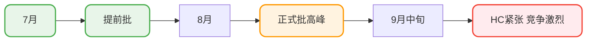
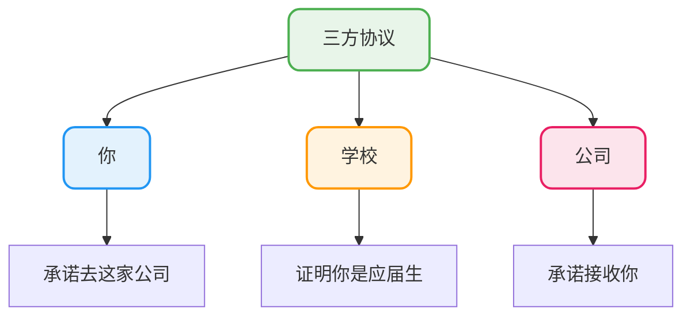

# 新人入职与背调指南

## 你最关心的10个问题

与其按部就班地介绍流程，不如直接回答你最想知道的问题。

### Q1: 秋招到底什么时候开始准备？

**简短回答**：7月就要开始投了。

**详细说明**：

很多人觉得秋招是9月的事，其实7月就已经是战场了。大厂的提前批通常7月启动，这个时候HC最充足、竞争相对较小。



**我的建议**：如果6月底你还没开始准备，现在立刻开始。

### Q2: 提前批挂了影响正式批吗？

**简短回答**：官方说不影响，但实际上要看情况。

**真相是**：

你的面试表现会被记录下来。如果面试官给你的评价是"基础不错但有待提高"，正式批还有机会。但如果评价很差，比如"技术态度有问题"、"基础很差"，那HR在正式批看到这个记录，可能直接就筛掉你了。

**我的建议**：

- 不要把最想去的公司全放在提前批
- 先拿1-2个保底公司练手
- 根据面试反馈调整后再冲刺目标公司

### Q3: 暑期实习和日常实习有什么区别？

**一句话总结**：暑期实习是进大厂的跳板，日常实习是攒经验的途径。

| 维度 | 暑期实习 | 日常实习 |
|------|----------|----------|
| 招聘时间 | 集中在2-4月 | 全年都有 |
| 面试难度 | 接近校招 | 相对容易 |
| 转正机会 | 有明确名额 | 基本没有 |
| 招聘对象 | 准应届生 | 低年级学生 |
| 竞争程度 | 激烈 | 相对缓和 |

**暗坑提醒**：

暑期实习的时间（6-8月）可能和大厂提前批冲突。如果你实习的公司转正希望不大，要及时抽身准备校招，别两头耽误。

### Q4: 内推真的有用吗？

**看情况**。

有用的内推：
- 内推人直接把简历递给部门HR
- 内推人能帮你打听面试进度
- 内推人愿意给你一些内部信息

没用的内推：
- 网上随便找个内推码
- 内推人自己都不知道简历去哪了

**怎么找靠谱的内推**：

1. 首选：直系学长学姐、熟悉的朋友
2. 次选：技术社区里愿意详细交流的员工
3. 最后：实在找不到就走官方渠道，也不是没机会

### Q5: 三方协议到底是什么？

**简单理解**：一份有法律效力的就业意向书，签了就不太好反悔。

**三方协议涉及的三方**：



**关于违约**：

- 违约要交违约金，通常5000以内
- 原公司可能拖着不给你开解约证明
- 新公司可能需要你签两方协议先锁定

**我的建议**：没想清楚之前别急着签。多拿几个offer比较一下再决定。

### Q6: 签了三方还算应届生吗？

**算**。

应届生身份的判断标准是：有没有缴过社保，不是看三方有没有签。

只要你：
- 没签劳动合同
- 没交过社保公积金
- 档案还在学校或人才市场

你就还是应届生。

### Q7: 背调会查什么？

**社招的话**，背调比较严格，主要查这些：

| 查什么 | 怎么查 | 容易翻车的点 |
|--------|--------|--------------|
| 学历 | 学信网验证 | 假学历必翻 |
| 工作经历 | 社保记录+电话核实 | 入离职时间对不上 |
| 职位真实性 | 打电话给前公司 | 虚报职级 |
| 离职原因 | 和前同事/HR沟通 | 说法前后不一 |

**校招的话**，背调一般比较简单，主要验证学历。

**我的建议**：简历上的信息一定要真实，尤其是入离职时间这种很容易查的。

### Q8: 怎么判断offer好不好？

**别只看月薪**。要看总包构成：

```
总包 = 月薪 × 月数 + 股票 + 签字费 + 其他福利
```

**举个例子**：

- Offer A：月薪18k × 14个月 = 25.2万
- Offer B：月薪15k × 16个月 + 股票3万/年 = 27万

乍一看A月薪高，但实际B的总包更高。

### Q9: SP和SSP是什么意思？

**SP = Special Offer**：比普通offer薪资高15%-30%
**SSP = Super Special Offer**：比普通offer高30%-50%甚至更多

**怎么拿SP/SSP**：

- 面试评价每轮都很好
- 有竞争对手的offer可以谈
- 面的是公司重点投入的业务线
- 学历背景优秀（名校/竞赛获奖）

**重点**：SP/SSP不是你申请的，是公司给的。你能做的就是把面试表现拉满。

### Q10: 实习经历在简历上怎么写？

**别写流水账**。

**反面教材**：
> 在XX公司实习，参与后台管理系统开发，负责部分功能模块。

**正面教材**：
> - 独立负责营销活动模块开发，支撑双十一期间300万次活动曝光
> - 封装通用的Excel导出组件，被3个业务线复用
> - 排查并修复定时任务重复执行问题，避免重复发券损失

**核心技巧**：有数据、有成果、有技术点。

## 几个容易踩的坑

### 坑1：实习不给交社保，以后算应届生

这个说法**在理论上是对的**，但风险很大：

- 不交社保意味着没有劳动保障
- 发生工伤没法理赔
- 公司可能也不太规范

除非你非常需要保留应届生身份，否则不建议这么操作。

### 坑2：两方协议没有约束力

两方协议确实法律约束力弱于三方，但：

- 违约可能会被公司拉黑
- 有些公司和学校关系好，会通过学校来约束你
- 影响个人信誉

所以也不是签了就能随便违约的。

### 坑3：HR说"等通知"就是凉了

不一定。

- 有些公司流程确实慢
- 有些是在等其他候选人的结果做对比
- 有些是HC还没最终确定

可以过几天主动问一下进展，别干等着。

## 时间规划建议

### 研究生/大四上学期（9月-12月）

| 月份 | 重点任务 |
|------|----------|
| 9月 | 秋招主战场，疯狂投递+面试 |
| 10月 | 继续面试，开始收offer |
| 11月 | 对比offer，做决定 |
| 12月 | 签三方，准备期末 |

### 研一/大三下学期（2月-6月）

| 月份 | 重点任务 |
|------|----------|
| 2月 | 关注暑期实习招聘信息 |
| 3月 | 暑期实习投递高峰 |
| 4-5月 | 暑期实习面试 |
| 6月 | 确定暑期实习offer |

早做准备，才能在关键节点不慌。
