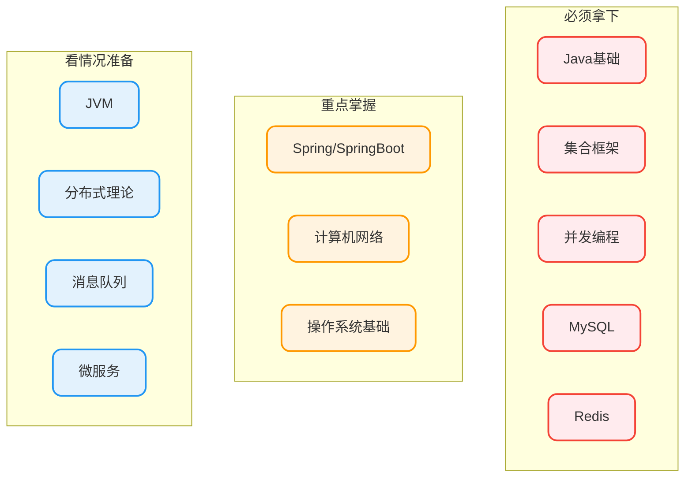

# 八股文备考策略

## 先搞清楚一个问题：八股文到底有没有用？

这个问题我听过太多抱怨了：

> "面试问的东西工作根本用不到"
> "背八股文有什么意义"
> "这就是应试教育那一套"

说实话，这些抱怨都有道理。但问题是：**你不准备，别人准备了，你就出局了**。

而且说真的，八股文也不是完全没用。你知道线程池的参数怎么配，在项目里就不会瞎配一通；你知道索引的原理，SQL就不会写得很烂。

所以，别在"有没有用"这个问题上纠结了，先拿到offer再说。

## 复习优先级矩阵

Java后端涉及的知识点多得吓人，但其实80%的面试问题集中在20%的知识点上。我按"重要程度"和"考察频率"做了个分类：



### 第一梯队详解

这五块是不管你面什么公司都会问的：

| 知识点 | 高频考点 | 深挖方向 |
|--------|----------|----------|
| **Java基础** | Object方法、异常体系、反射 | 底层实现原理 |
| **集合框架** | HashMap原理、ArrayList vs LinkedList | 红黑树、扩容机制 |
| **并发编程** | 线程池参数、锁机制、volatile | AQS源码、内存模型 |
| **MySQL** | 索引原理、事务隔离级别、MVCC | 执行计划分析、死锁排查 |
| **Redis** | 数据结构、持久化、缓存问题 | 集群方案、分布式锁实现 |

### 第二梯队详解

这三块不是每家都问，但问起来也挺深的：

| 知识点 | 考察场景 | 备注 |
|--------|----------|------|
| **Spring** | 中小厂必问，大厂看情况 | IoC、AOP、Bean生命周期 |
| **计算机网络** | 大厂必问，尤其是字节腾讯 | TCP、HTTP、HTTPS |
| **操作系统** | 大厂喜欢问 | 进程线程、内存管理、死锁 |

### 第三梯队详解

这些只有在两种情况下需要准备：

1. **你的简历/项目里提到了**
2. **目标公司明确会考**

如果你面的是中小厂，时间又紧，这部分可以先放放。

## 不同公司的考察偏好

面试风格因公司而异，了解这些能让你的准备更有针对性：

| 公司 | 侧重点 | 特点 |
|------|--------|------|
| **字节** | 算法 > 八股 > 项目 | 上来就撕代码，基础也会问但相对少 |
| **阿里** | 项目 = 八股 > 算法 | 喜欢深挖，问到你答不上来为止 |
| **腾讯** | 计算机基础 + 算法 | 网络和操作系统问得多 |
| **美团** | 项目 + JVM + 场景题 | 项目问得很细，JVM必问 |
| **中小厂** | 框架使用 + 常见八股 | 广度优先，深度要求没那么高 |

## 记忆技巧：如何不死记硬背

### 方法一：用关键词串联

别想着把答案一字一句背下来，那样太痛苦了。正确的做法是记关键词，然后用自己的话串起来。

**以"HashMap原理"为例**：

```
关键词：数组+链表+红黑树、负载因子0.75、扩容2倍、链表长度8转树、线程不安全

你的表达：
HashMap底层是数组加链表的结构，1.8之后链表长度超过8会转成红黑树。
负载因子默认0.75，超过阈值就会扩容，每次扩容是原来的2倍。
它是线程不安全的，多线程环境下要用ConcurrentHashMap。
```

看，关键词都涵盖了，但不是背书。

### 方法二：结合实际场景理解

纯背概念很容易忘，但如果和实际使用场景结合，记忆就牢固多了。

**例子**：学Redis缓存穿透

不要这样记：
> 缓存穿透是指查询一个不存在的数据，由于缓存不命中，每次都要去数据库查询...

而是这样想：
> 假设有个恶意用户，一直用不存在的用户ID查询，缓存肯定查不到，请求就会打到数据库。
> 怎么防？可以缓存空值，也可以用布隆过滤器提前拦截。

### 方法三：教给别人

学完一个知识点，试着给别人讲一遍（或者对着镜子讲）。

能讲清楚，说明你真懂了；讲不清楚，说明还有模糊的地方。

## 自测方法：怎么知道自己准备得差不多了

### 快速自测清单

每个模块准备完，问自己这些问题能不能答上来：

**Java并发**：
- [ ] synchronized和ReentrantLock区别？
- [ ] volatile能保证原子性吗？
- [ ] 线程池核心参数有哪些，怎么配置？

**MySQL**：
- [ ] 索引为什么用B+树不用B树？
- [ ] 什么情况下索引会失效？
- [ ] MVCC是怎么实现的？

**Redis**：
- [ ] 缓存穿透、击穿、雪崩怎么解决？
- [ ] Redis为什么快？
- [ ] 分布式锁怎么实现？

如果这些问题能答个七七八八，基本可以开始投简历了。

### 模拟面试

找个朋友互相模拟面试，或者用一些AI模拟面试工具。

好处是：
1. 练习表达能力（光会想不会说是大忌）
2. 暴露知识盲区
3. 模拟紧张环境

## 常见困境和解法

### 困境1："看完就忘了怎么办？"

**解法**：别一次性看太多，看完立刻做笔记，第二天复习一次，一周后再复习一次。

间隔重复比一次性猛看效果好得多。

### 困境2："面试官问的太笼统不知道怎么答"

比如面试官问："说说HashMap吧"

**解法**：主动拆解问题，引导话题。

你可以说：
> "HashMap涉及的内容挺多的，我先从底层数据结构开始说吧？"

说完一个点后，可以问：
> "这部分说完了，您希望我继续讲扩容机制还是线程安全问题？"

这样既展示了你知识全面，又把节奏控制在自己手里。

### 困境3："遇到不会的问题怎么办？"

**最差的做法**：乱答一通

**正确的做法**：

1. 先想想有没有相关的知识可以搭边
2. 如果确实不会，坦诚说"这个我不太了解"
3. 可以补一句"但我的理解是..."或者"我猜测可能是..."

面试官不会因为你不会一个问题就毙掉你，但会因为你乱答一通觉得你态度有问题。

## 复习节奏参考

假设你有6周准备时间：

| 周次 | 任务 | 目标 |
|------|------|------|
| 第1周 | Java基础+集合 | 能讲清楚HashMap、ArrayList原理 |
| 第2周 | 并发编程 | 线程池、锁、volatile都能说明白 |
| 第3周 | MySQL | 索引、事务、MVCC掌握透彻 |
| 第4周 | Redis | 数据结构、缓存问题、持久化 |
| 第5周 | Spring + 计网 | IoC/AOP原理，TCP三次握手 |
| 第6周 | 查漏补缺+模拟面试 | 整体过一遍，找问题 |

时间紧的话，优先保证第1-4周的内容，这些是重中之重。
