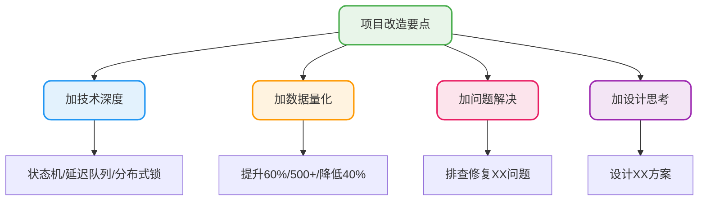
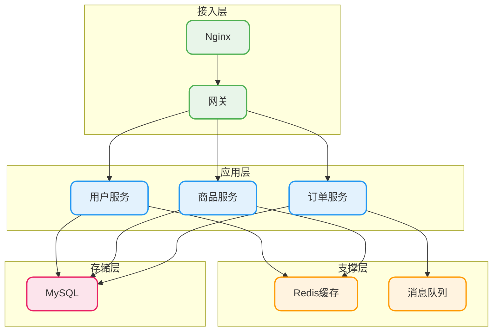

# 项目经验深度挖掘

## 一个扎心的事实

如果你的项目经历是这样的：

> 负责用户模块开发，实现了增删改查功能

面试官看到这行字的内心OS是：**这谁不会啊**。

问题不在于你真的只做了CRUD（大多数人的日常工作确实就是CRUD），而在于你没把工作背后的价值体现出来。

## 把CRUD变成亮点的三个思路

### 思路一：往技术深度挖

同样是"做了用户模块"，可以这样拆：

| 表面描述 | 深度挖掘 |
|----------|----------|
| 实现用户注册 | 设计了手机号+验证码登录，考虑了验证码防刷策略 |
| 实现用户查询 | 针对高频查询做了缓存优化，减少DB压力 |
| 实现用户列表 | 分页查询做了深分页优化，避免limit offset性能问题 |

### 思路二：往业务复杂度挖

同样是"做了订单模块"，可以这样拆：

| 表面描述 | 深度挖掘 |
|----------|----------|
| 订单创建 | 处理了库存扣减的并发问题，用分布式锁防超卖 |
| 订单状态变更 | 设计了状态机保障状态流转的一致性 |
| 订单超时取消 | 用延迟队列实现超时自动关闭 |

### 思路三：往问题解决挖

这个最讨巧，面试官特别爱问"遇到过什么问题"。

| 表面描述 | 深度挖掘 |
|----------|----------|
| 接口慢了 | 排查发现是SQL没走索引，优化后RT降低80% |
| 服务报错 | 定位到是线程池队列满了，调整参数解决 |
| 数据不一致 | 发现是缓存更新策略问题，改用延迟双删 |

## 真实案例：如何改造一个普通项目

### 原始版本

```
项目名称：校园二手交易平台

项目描述：一个校园内的二手物品交易系统

技术栈：Spring Boot + MyBatis + MySQL + Redis

个人职责：
- 负责商品模块开发
- 负责订单模块开发
- 负责用户模块开发
```

### 改造后版本

```
项目名称：校园二手交易平台

项目描述：校内二手物品交易平台，支持商品发布、在线交易、即时沟通

技术栈：Spring Boot + MyBatis-Plus + MySQL + Redis + RabbitMQ

个人职责：
- 设计商品搜索方案，基于Redis实现热门商品缓存，首页加载速度提升60%
- 负责订单核心流程开发，使用状态机管理订单生命周期，保障状态流转一致性
- 实现订单超时自动取消功能，基于RabbitMQ延迟队列，日均处理超时订单500+
- 封装统一的分页组件，解决深分页性能问题，被项目内5个模块复用
- 排查并修复用户频繁登录导致的Session堆积问题，内存占用降低40%
```

### 改造要点



## "遇到过什么困难"的准备模板

这个问题面试必问，一定要提前准备好1-2个案例。

### 模板：问题发现→原因定位→解决方案→最终效果

**案例1：接口超时问题**

> 我们有一个商品列表接口，上线后反馈响应很慢，有时候要2-3秒。
>
> 我通过慢SQL日志发现是一个联表查询没走索引，explain看了下是全表扫描。
>
> 我给查询条件加了联合索引，同时把不需要的字段移出select，避免回表。
>
> 优化后接口RT从2.3s降到180ms，问题解决。

**案例2：内存溢出问题**

> 我们的报表服务每隔几天就会OOM重启。
>
> 我dump了堆内存用MAT分析，发现是一个Excel导出功能把整个查询结果集都加载到内存了。
>
> 我改成分批查询+流式写入的方式，配合EasyExcel处理。
>
> 改完后内存占用从2G降到200M，再也没出现OOM。

**案例3：数据不一致问题**

> 我们用Redis缓存商品信息，但运营反馈后台改了价格，前台显示还是旧的。
>
> 排查发现是先更新数据库再删缓存，删缓存失败了但没重试。
>
> 我引入了延迟双删策略，同时加了删除失败的补偿机制。
>
> 问题解决后再没收到过数据不一致的反馈。

## 架构问题怎么回答

面试官可能会说："画一下你们系统的架构图"

### 不要画成这样

一堆框框连在一起，问什么都说不清楚。

### 应该画成这样

分层清晰，每层的作用能说明白：



### 介绍时的话术

> 我们系统分四层：
>
> 最外层是Nginx做负载均衡，后面是网关统一处理认证和限流。
>
> 应用层拆分成用户、商品、订单三个服务，服务之间通过Feign调用。
>
> 支撑层用Redis做缓存和分布式锁，用RabbitMQ做异步解耦。
>
> 数据层是MySQL主从架构，读写分离。

## 几个常见的坑

### 坑1：说项目是跟着教程做的

一旦说了这话，面试官就会觉得：

- 这不是你自己的思考
- 深挖下去你可能答不上来
- 含金量大打折扣

**正确做法**：即使确实是跟教程做的，也别主动说。重点是你能不能把项目讲清楚。

### 坑2：项目职责全是性能优化

全是"从XX降到XX"，看起来很厉害，但面试官会质疑：

- 你是不是把别人做的说成自己的
- 真有那么多东西可优化吗

**正确做法**：职责描述要多元化，功能开发+性能优化+问题排查混着来。

### 坑3：用了脚手架还明说

说"基于若依开发"就等于说"基础功能都是框架自带的"。

**正确做法**：研究脚手架的功能实现原理，当成你的工作来介绍。比如若依的权限控制，你吃透了完全可以说"我负责实现了RBAC权限模型"。

## 项目准备自检

投简历前，对着这个清单过一遍：

| 检查项 | 是否达标 |
|--------|----------|
| 每条职责都有「动作+效果」 | ☐ |
| 至少有3条带数据的描述 | ☐ |
| 准备了1-2个困难问题案例 | ☐ |
| 能画出系统架构图 | ☐ |
| 每个职责都能展开讲5分钟 | ☐ |

全部打勾，项目这块就准备得差不多了。
