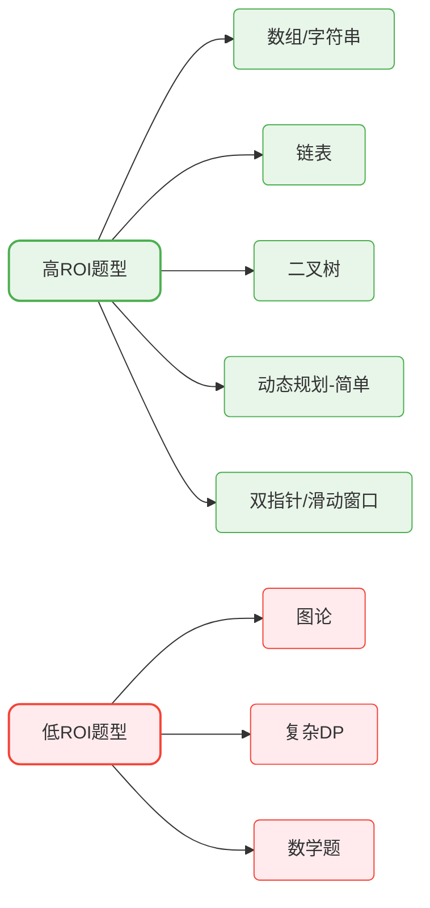
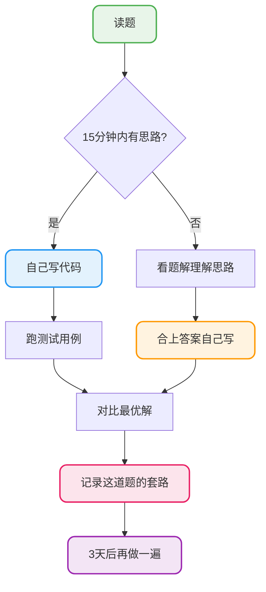

# 算法与源码面试攻略

## 算法篇：投入产出比最大化

### 一个现实问题：要刷多少题？

网上流传的说法是"刷300道"，但说实话，对于大多数人来说，这既不现实也没必要。

**我的观点**：刷题不在多，在于刷对+刷透。

150道高质量的题目 > 300道囫囵吞枣的题目

### 哪些题型ROI最高

ROI = 面试命中率 / 学习难度



**推荐的刷题分配**：

| 题型 | 建议数量 | 理由 |
|------|----------|------|
| 数组/字符串 | 25-30题 | 最基础，必考 |
| 链表 | 15-20题 | 经典题型，套路固定 |
| 二叉树 | 20-25题 | 高频，掌握遍历就成功一半 |
| 双指针/滑动窗口 | 15-20题 | 技巧性强，性价比高 |
| 动态规划 | 25-30题 | 难但高频，至少会基础的 |
| BFS/DFS | 15-20题 | 常和树、图结合考察 |
| 其他 | 20-30题 | 栈、队列、堆、哈希表等 |

总计150题左右，够用了。

### 刷题的正确姿势

**错误姿势**：

1. 看题 → 想不出来 → 看答案 → 抄一遍 → 下一题

这样刷100题和没刷差不多。

**正确姿势**：



关键点：
- 别在一道题上死磕太久
- 看了答案要合上自己写一遍
- 做完对比最优解
- 隔几天要复习

### 高频题清单

这些题目面试出现概率极高，建议优先拿下：

**数组/字符串**：
- 两数之和
- 三数之和
- 无重复字符的最长子串
- 最长回文子串

**链表**：
- 反转链表
- 合并两个有序链表
- 环形链表检测
- 相交链表

**二叉树**：
- 二叉树遍历（前中后+层序）
- 最大深度
- 对称二叉树
- 最近公共祖先

**动态规划**：
- 爬楼梯
- 最大子数组和
- 打家劫舍
- 零钱兑换

### 手撕代码的注意事项

面试手撕代码和自己刷题不一样，有几个要注意的点：

1. **先沟通再写**：确认题意、问清边界条件
2. **边写边解释**：别闷头写，说出你在干什么
3. **先写伪代码/框架**：不要上来就扣细节
4. **写完跑case**：用简单例子过一遍

## 源码篇：学什么、怎么学

### 为什么要看源码

主要有两个原因：

**面试加分**：能从源码角度回答问题，段位瞬间不一样

**实际收益**：优秀源码里全是设计模式和最佳实践

但我想说的是：**如果时间紧，源码的优先级低于算法和八股**。

### 源码学习的正确预期

别指望把一个框架的源码从头看到尾，那不现实。

正确做法是：**带着问题看**。

比如：
- Spring的Bean是怎么创建的？
- MyBatis的SQL是怎么执行的？
- HashMap为什么线程不安全？

每次只攻克一个问题，把这个点吃透就够了。

### 推荐的源码学习路径

**第一阶段：JDK源码（入门）**

| 类 | 重点看什么 |
|----|-----------|
| HashMap | 数据结构、put流程、扩容机制 |
| ArrayList | 扩容逻辑、和LinkedList的区别 |
| ConcurrentHashMap | 分段锁、1.8的CAS优化 |
| ThreadPoolExecutor | 核心参数、execute执行流程 |

**第二阶段：Spring源码（进阶）**

| 主题 | 重点理解 |
|------|----------|
| IoC容器 | Bean的生命周期、依赖注入过程 |
| AOP | 代理对象的创建时机、调用链路 |
| 事务 | @Transactional的实现原理 |
| 自动配置 | @EnableAutoConfiguration的加载机制 |

**第三阶段：其他框架（选看）**

根据你的项目和目标公司选择：
- 用了MyBatis → 看MyBatis
- 用了Dubbo → 看Dubbo
- 面试喜欢问网络 → 看Netty

### 看源码的实用技巧

**技巧1：从Demo入手**

别直接扎进源码里，先写个最简单的使用示例，debug进去一步步看。

```java
// 比如看HashMap源码，就从这行开始debug
Map<String, String> map = new HashMap<>();
map.put("key", "value");
```

**技巧2：抓主干忽略细节**

第一遍只看主流程，那些异常处理、边界判断先跳过。

**技巧3：画调用流程图**

边看边画，理清楚A调B、B调C的关系。

**技巧4：对比不同版本**

比如HashMap 1.7和1.8的区别，ConcurrentHashMap 1.7和1.8的区别。面试常问。

### 面试中怎么展示源码功底

**不要背书式回答**：

> HashMap底层是数组加链表，链表长度超过8转成红黑树...

这种答案面试官听太多了，没有区分度。

**要有自己的理解**：

> 我看过HashMap的源码。put的时候先根据hashCode计算下标，如果hash冲突就用链表存。
> 1.8有个优化，链表长度超过8会转红黑树，因为链表太长查询效率就从O(1)退化成O(n)了。
> 但我有个疑问是为什么阈值是8，后来查了资料说是按泊松分布算的，正常情况下链表长度超过8的概率极小。

看出区别了吗？后者有理解、有思考、有深入。

## 时间紧迫时的取舍建议

如果你只有1个月准备时间：

| 优先级 | 内容 | 时间分配 |
|--------|------|----------|
| P0 | 高频算法题（100道） | 40% |
| P0 | 核心八股文 | 40% |
| P1 | 项目准备 | 15% |
| P2 | 源码学习 | 5% |

源码放在最后，有余力再看。

如果你有3个月准备时间：

| 优先级 | 内容 | 时间分配 |
|--------|------|----------|
| P0 | 算法题（150道） | 30% |
| P0 | 八股文系统学习 | 30% |
| P1 | 项目深度准备 | 20% |
| P1 | 源码学习 | 20% |

时间充裕的话，源码可以好好看看，面试确实能加不少分。
