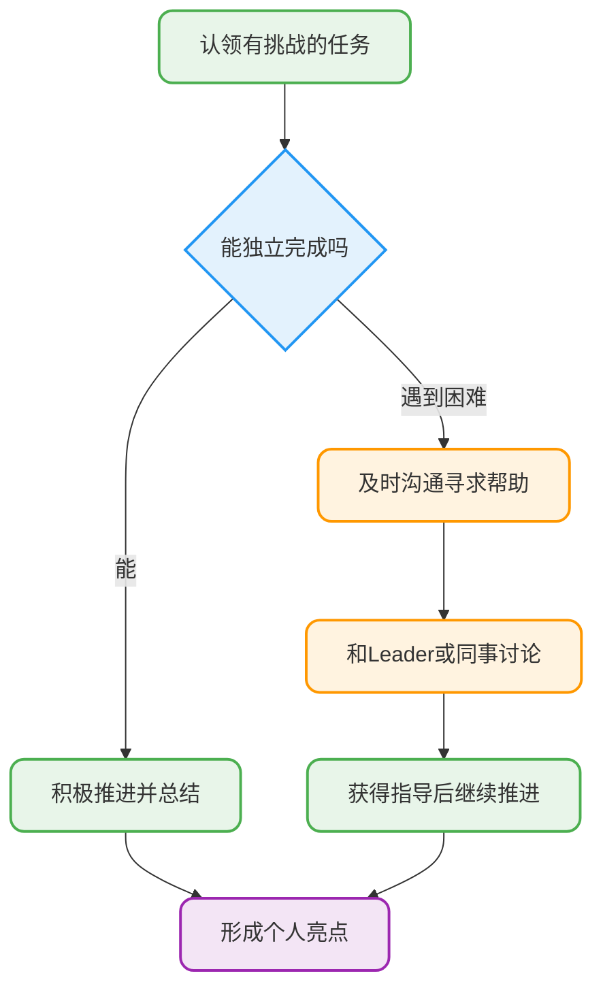
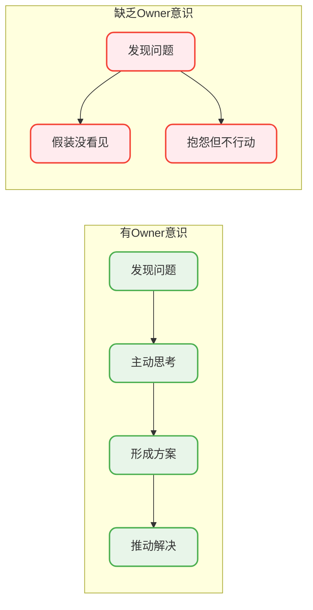
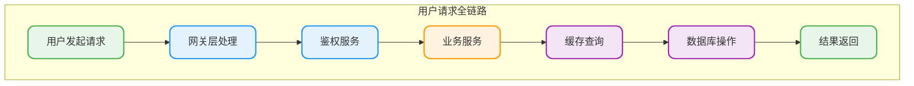
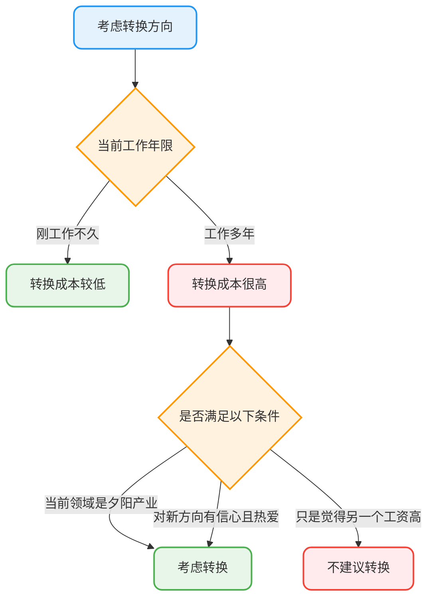
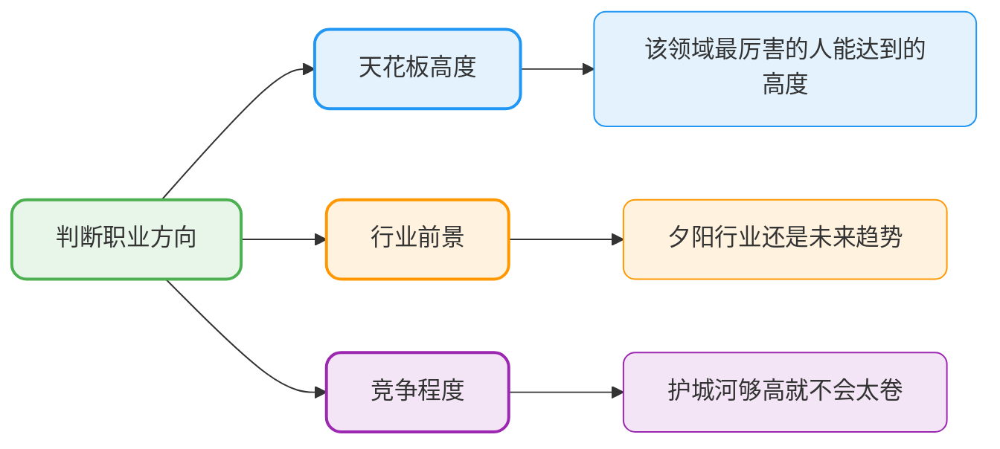

# 职场发展与绩效提升

## 绩效考核为什么这么重要

说实话，职场上绕不开绩效考核这个话题，不管你在什么公司，基本都有一套绩效评估体系。

如果你想在职场上走得更远、爬得更高，绩效考核对你来说真的很关键。绝大多数公司里，绩效直接和你的职级晋升、涨薪幅度、年终奖挂钩。更残酷的是，很多公司真的有末位淘汰机制。

公司给员工升职加薪，主要看两点：一是你过去干得怎么样，二是你未来有多大潜力。而未来的潜力，说白了还是基于你过去的表现和进步速度。只有证明自己能越做越好，升职加薪才会更有主动权。

## 如何在绩效考核中脱颖而出

### 先搞懂公司的工具和技术栈

想要持续稳定地在工作上出成果，入职后第一件事就是熟悉公司的技术栈、内部系统和各种常用工具。这些东西搞明白了，工作效率才能拉满，才能充分利用公司内部的资源。

熟悉之后更进一步，就是熟练掌握那些对当前工作比较重要的技术和工具。别小看这一步，很多人栽就栽在这里。

### 敢于挑战有难度的任务

日常开发中，我们产出价值主要是通过完成任务来体现的。建议多主动认领一些有挑战的任务，解决有难度的问题。千万不要一碰到不会的就退缩，遇到没接触过的技术就怂了。



不过也别过于自信，还是要对自己的能力有清醒的认识。如果实在搞不定，一定要找技术Leader或者其他同事聊聊，寻求建议和指导。**千万别憋着不说，等到截止日期才让大家知道你没完成任务**，那就真的凉了。

### 深入思考业务，敢于提出想法

平时要养成深入思考业务的习惯，敢于提出自己的想法和建议，而不是业务负责人说什么就是什么，技术负责人说用什么技术就用什么技术。

举个例子，假如你觉得某块业务设计不合理：

```java
/**
 * 场景示例：电商平台的商品库存扣减
 * 
 * 原方案：每次下单直接扣减库存
 * 问题：高并发场景下容易出现超卖
 * 
 * 优化建议：引入预扣库存机制
 */
@Service
public class InventoryService {
    
    @Autowired
    private RedisTemplate<String, Object> redisTemplate;
    
    /**
     * 优化后的库存扣减方案
     * 1. 先在Redis预扣库存（快速响应）
     * 2. 下单成功后异步同步到数据库
     * 3. 订单取消时释放预扣库存
     */
    public boolean preDeductStock(Long productId, int quantity) {
        String stockKey = "stock:product:" + productId;
        Long remainStock = redisTemplate.opsForValue()
            .decrement(stockKey, quantity);
        
        if (remainStock == null || remainStock < 0) {
            // 库存不足，回滚预扣
            redisTemplate.opsForValue().increment(stockKey, quantity);
            return false;
        }
        return true;
    }
    
    public void releasePreDeductStock(Long productId, int quantity) {
        String stockKey = "stock:product:" + productId;
        redisTemplate.opsForValue().increment(stockKey, quantity);
    }
}
```

如果你能针对项目的发展提出一些有用的建议，大家对你的看法肯定会不一样。但也要注意，**别太偏执，一切争论要建立在完善的逻辑之上**。

### 学会分享，多帮助同事

平时工作中要乐于帮助其他同事，也要学会寻求同事的帮助。如果公司崇尚技术分享的话，试着去做一些技术分享，即使讲的东西比较简单，讲好就行了。

### 多要反馈，让成果被看见

尽量多找你的技术Leader或者其他上级要反馈，多和他们聊聊自己做了什么，后面有什么建议给自己。

**千万不要只埋头干活，干完了还得让其他人知道你的贡献。** 很多时候你做的工作比别人多，你以为能获得更多认可和奖励，但到最后往往收获的认可度和奖励没有别人高。

## 培养Owner意识

### 什么叫有Owner意识

我举几个例子大家应该就明白了：

| 场景 | 有Owner意识的做法 |
|------|-------------------|
| 客户在群里问问题 | 及时响应，主动推动问题解决 |
| 觉得某个模块设计有问题 | 私下深度思考，给出优化方案后找Leader沟通 |
| 发现技术方案有隐患 | 主动调研分析，找技术Leader进行沟通 |



**有Owner意识，并不是说让大家都去当"奋斗逼"，故意在上级面前多表现。而是希望自己能够对工作更加负责，更积极主动地参与项目建设。**

## 全链路思维很重要

全链路可以理解为一个请求在系统中经过的完整路径。全链路意识说的是：**不仅仅对自己模块负责，还要尝试了解整个系统涉及到的所有模块，将它们串联起来。**



全链路意识是项目技术Leader的必备能力。如果你以后想往项目技术Leader的方向发展，那就先从培养自己的全链路意识开始吧！

## 持续学习的重要性

一定要有持续学习的意识！你的日常不应该只有工作，想要走的更远，工作之外一定也要抽时间用学习武装自己。

比如你的项目用到了消息队列，那你就要搞清楚：

- 常见消息队列之间的对比？如何选择？
- 如何确保消息不会丢失？
- 如何确保消息不被重复消费？
- 消息积压如何处理？
- 消息队列的底层原理是什么？

**如果刚毕业之后就没有持续学习的意识的话，那大概率未来的工作中也养不成这种习惯。刚工作的那1-3年是个人能力提升最快的阶段。**

## 如何选择职业方向

### 不要盲目跟风

发现身边有些朋友看到哪个方向工资高就转哪个方向，看到大数据工资高就立马转大数据，看到算法工程师工资高就转算法......

说实话，这种行为非常不可取，尤其是对于已经在某个领域工作了好几年的朋友来说。

如果你在某个领域比如Java后端有了几年工作经验，再换其他方向几乎相当于从头开始。虽然可能多少也能用到部分之前的经验，但这并不能让你在新方向上有太大竞争力，你几乎就是这个领域的新人。



### 什么情况下可以考虑换方向

不过，有一些情况下，换一个职业方向对你来说还是值得考虑的：

| 情况 | 建议 |
|------|------|
| 刚工作不久 | 可以换，本身就没多少工作经验 |
| 所在领域是夕阳产业 | 要尽快换，趁早跳出舒适区 |
| 对新方向有信心且热爱 | 可以换，只要确定会坚持下来 |

**过于从众，没有主见，只能让自己在技术这个道路上走得很累。**

### 如何判断一个职业方向好不好

你可以从下面几个方向来判断：



通常来说，一个好的行业必然会竞争加剧。但是！如果你所从事的行业护城河够高（对求职者的硬性要求比较高）或者你的能力足够强的话，那这个行业注定不会太卷。

**一个好的职业方向，一定是职业天花板够高，前景不错且竞争不太剧烈。**

## 多沟通交流

不喜欢沟通交流和表达的人，一般也会更难受到上级的青睐。

**做好本职工作是我们的分内之事，如果你能偶尔抽出一些时间，多和你的同事、上级或者Leader交流问题的话，你所能得到的肯定远远超过你所付出的那一会时间。**
