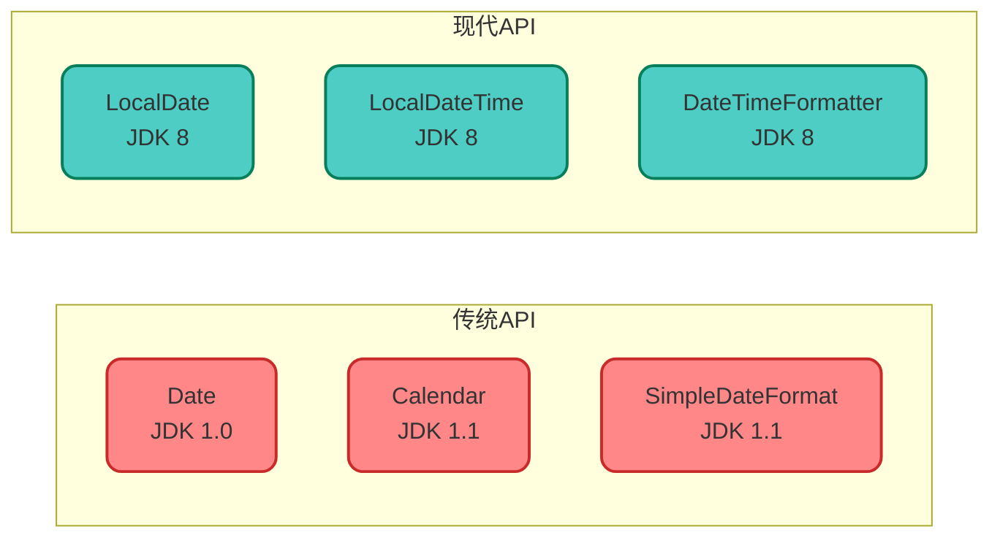
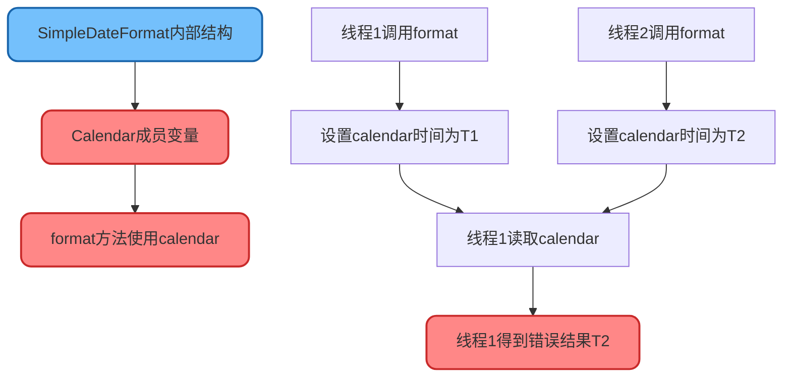
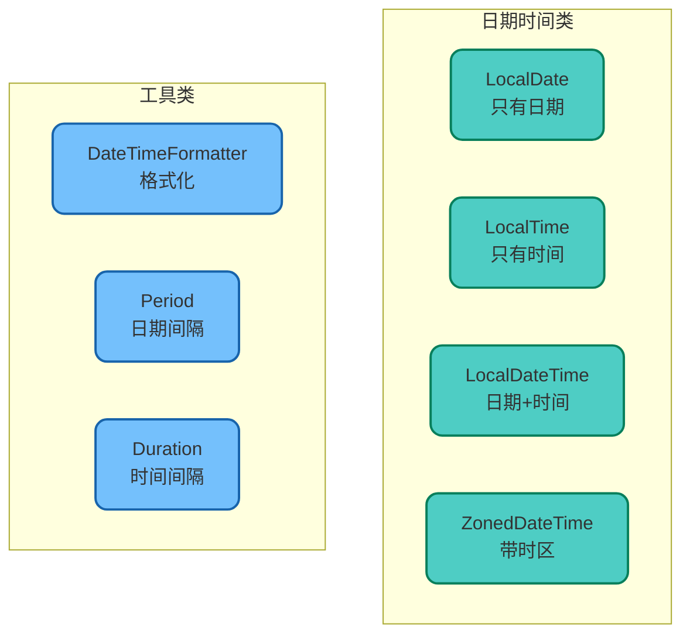

# 日期时间处理与线程安全

## 日期时间API概述

Java中的日期时间处理经历了多次演进，从最初的`Date`和`Calendar`到Java 8引入的全新时间API。理解这些API的使用场景和线程安全特性，对于编写健壮的应用程序至关重要。



## SimpleDateFormat基础用法

### 日期格式化与解析

`SimpleDateFormat`是传统的日期格式化工具，支持日期与字符串的相互转换。

```java
/**
 * SimpleDateFormat基础使用示例
 */
public class DateFormatBasicDemo {
    
    public static void main(String[] args) throws ParseException {
        // 创建格式化器
        SimpleDateFormat sdf = new SimpleDateFormat("yyyy-MM-dd HH:mm:ss");
        
        // Date转String（格式化）
        Date now = new Date();
        String dateStr = sdf.format(now);
        System.out.println("格式化结果: " + dateStr);
        // 输出: 格式化结果: 2024-12-02 15:30:45
        
        // String转Date（解析）
        String input = "2024-06-15 10:20:30";
        Date parsedDate = sdf.parse(input);
        System.out.println("解析结果: " + parsedDate);
    }
}
```

### 常用日期格式模式

| 字符 | 含义 | 示例 |
|------|------|------|
| `yyyy` | 四位年份 | 2024 |
| `MM` | 两位月份 | 01-12 |
| `dd` | 两位日期 | 01-31 |
| `HH` | 24小时制小时 | 00-23 |
| `hh` | 12小时制小时 | 01-12 |
| `mm` | 分钟 | 00-59 |
| `ss` | 秒 | 00-59 |
| `SSS` | 毫秒 | 000-999 |
| `E` | 星期 | 周一 |
| `a` | 上午/下午 | AM/PM |

**常用格式示例：**

```java
public class DateFormatPatterns {
    
    public static void main(String[] args) {
        Date now = new Date();
        
        // 各种格式示例
        printFormat("yyyy-MM-dd", now);                    // 2024-12-02
        printFormat("yyyy/MM/dd HH:mm:ss", now);           // 2024/12/02 15:30:45
        printFormat("yyyy年MM月dd日", now);                 // 2024年12月02日
        printFormat("yyyy-MM-dd HH:mm:ss.SSS", now);       // 2024-12-02 15:30:45.123
        printFormat("yyyy-MM-dd E", now);                   // 2024-12-02 周一
        printFormat("yyyy-MM-dd hh:mm:ss a", now);         // 2024-12-02 03:30:45 下午
    }
    
    private static void printFormat(String pattern, Date date) {
        SimpleDateFormat sdf = new SimpleDateFormat(pattern);
        System.out.println(pattern + " => " + sdf.format(date));
    }
}
```

### 时区处理

```java
/**
 * 不同时区的时间转换
 */
public class TimeZoneDemo {
    
    public static void main(String[] args) {
        Date now = new Date();
        SimpleDateFormat sdf = new SimpleDateFormat("yyyy-MM-dd HH:mm:ss z");
        
        // 北京时间（东八区）
        sdf.setTimeZone(TimeZone.getTimeZone("Asia/Shanghai"));
        System.out.println("北京时间: " + sdf.format(now));
        
        // 东京时间（东九区）
        sdf.setTimeZone(TimeZone.getTimeZone("Asia/Tokyo"));
        System.out.println("东京时间: " + sdf.format(now));
        
        // 纽约时间（西五区）
        sdf.setTimeZone(TimeZone.getTimeZone("America/New_York"));
        System.out.println("纽约时间: " + sdf.format(now));
        
        // 伦敦时间（零时区）
        sdf.setTimeZone(TimeZone.getTimeZone("Europe/London"));
        System.out.println("伦敦时间: " + sdf.format(now));
    }
}
```

## SimpleDateFormat线程安全问题

### 问题现象

`SimpleDateFormat`是非线程安全的，在多线程环境下共享使用会导致数据错误。

```java
/**
 * 演示SimpleDateFormat的线程安全问题
 */
public class DateFormatThreadSafetyIssue {
    
    // 危险：作为共享变量使用
    private static SimpleDateFormat sharedFormat = 
        new SimpleDateFormat("yyyy-MM-dd HH:mm:ss");
    
    public static void main(String[] args) throws InterruptedException {
        // 使用线程安全的Set收集结果
        Set<String> results = Collections.synchronizedSet(new HashSet<>());
        CountDownLatch latch = new CountDownLatch(100);
        
        ExecutorService executor = Executors.newFixedThreadPool(10);
        
        for (int i = 0; i < 100; i++) {
            int dayOffset = i;
            executor.submit(() -> {
                try {
                    Calendar cal = Calendar.getInstance();
                    cal.add(Calendar.DATE, dayOffset);
                    
                    // 多线程同时使用共享的SimpleDateFormat
                    String dateStr = sharedFormat.format(cal.getTime());
                    results.add(dateStr);
                } finally {
                    latch.countDown();
                }
            });
        }
        
        latch.await();
        executor.shutdown();
        
        // 预期应该有100个不同的日期，但实际结果小于100
        System.out.println("预期结果数: 100");
        System.out.println("实际结果数: " + results.size());
        // 输出可能是：实际结果数: 87（数据丢失或错乱）
    }
}
```

### 问题根因分析



查看`SimpleDateFormat.format()`源码：

```java
// SimpleDateFormat中的format方法
private StringBuffer format(Date date, StringBuffer toAppendTo, FieldDelegate delegate) {
    // 使用成员变量calendar保存时间
    calendar.setTime(date);  // 问题所在！
    
    // 后续基于calendar进行格式化
    // ...
}
```

当多个线程同时调用`format()`时，可能发生：
1. 线程A调用`calendar.setTime()`设置时间为`2024-01-01`
2. 线程B调用`calendar.setTime()`设置时间为`2024-12-31`
3. 线程A继续执行，但读取到的是线程B设置的时间

## 解决方案

### 方案一：使用局部变量

每次使用时创建新的实例，避免共享。

```java
public class LocalVariableSolution {
    
    public String formatDate(Date date) {
        // 每次创建新实例
        SimpleDateFormat sdf = new SimpleDateFormat("yyyy-MM-dd HH:mm:ss");
        return sdf.format(date);
    }
    
    public Date parseDate(String dateStr) throws ParseException {
        SimpleDateFormat sdf = new SimpleDateFormat("yyyy-MM-dd HH:mm:ss");
        return sdf.parse(dateStr);
    }
}
```

**优点：** 简单直接，线程安全  
**缺点：** 频繁创建对象，有一定性能开销

### 方案二：加同步锁

对共享的SimpleDateFormat加锁。

```java
public class SynchronizedSolution {
    
    private static final SimpleDateFormat FORMAT = 
        new SimpleDateFormat("yyyy-MM-dd HH:mm:ss");
    
    public static String formatDate(Date date) {
        synchronized (FORMAT) {
            return FORMAT.format(date);
        }
    }
    
    public static Date parseDate(String dateStr) throws ParseException {
        synchronized (FORMAT) {
            return FORMAT.parse(dateStr);
        }
    }
}
```

**优点：** 避免重复创建对象  
**缺点：** 锁竞争可能成为性能瓶颈

### 方案三：使用ThreadLocal

为每个线程维护独立的实例。

```java
/**
 * ThreadLocal解决方案
 * 每个线程拥有独立的SimpleDateFormat实例
 */
public class ThreadLocalSolution {
    
    private static final ThreadLocal<SimpleDateFormat> DATE_FORMAT = 
        ThreadLocal.withInitial(() -> new SimpleDateFormat("yyyy-MM-dd HH:mm:ss"));
    
    public static String formatDate(Date date) {
        return DATE_FORMAT.get().format(date);
    }
    
    public static Date parseDate(String dateStr) throws ParseException {
        return DATE_FORMAT.get().parse(dateStr);
    }
    
    // 使用完毕后清理（特别是线程池场景）
    public static void cleanup() {
        DATE_FORMAT.remove();
    }
}

// 使用示例
public class ThreadLocalDemo {
    public static void main(String[] args) {
        ExecutorService executor = Executors.newFixedThreadPool(10);
        
        for (int i = 0; i < 100; i++) {
            executor.submit(() -> {
                try {
                    String result = ThreadLocalSolution.formatDate(new Date());
                    System.out.println(Thread.currentThread().getName() + ": " + result);
                } finally {
                    // 线程池场景需要清理
                    ThreadLocalSolution.cleanup();
                }
            });
        }
        
        executor.shutdown();
    }
}
```

**优点：** 兼顾线程安全和性能  
**缺点：** 需要注意内存泄漏问题

### 方案四：使用DateTimeFormatter（推荐）

Java 8引入的`DateTimeFormatter`是线程安全的，是处理日期格式化的最佳选择。

```java
/**
 * DateTimeFormatter解决方案（推荐）
 * 天然线程安全，不可变对象
 */
public class DateTimeFormatterSolution {
    
    // 可以安全地作为共享常量
    private static final DateTimeFormatter FORMATTER = 
        DateTimeFormatter.ofPattern("yyyy-MM-dd HH:mm:ss");
    
    /**
     * 格式化LocalDateTime
     */
    public static String format(LocalDateTime dateTime) {
        return dateTime.format(FORMATTER);
    }
    
    /**
     * 解析字符串为LocalDateTime
     */
    public static LocalDateTime parse(String dateStr) {
        return LocalDateTime.parse(dateStr, FORMATTER);
    }
    
    /**
     * Date转String
     */
    public static String formatDate(Date date) {
        LocalDateTime ldt = date.toInstant()
            .atZone(ZoneId.systemDefault())
            .toLocalDateTime();
        return ldt.format(FORMATTER);
    }
    
    /**
     * String转Date
     */
    public static Date parseToDate(String dateStr) {
        LocalDateTime ldt = LocalDateTime.parse(dateStr, FORMATTER);
        return Date.from(ldt.atZone(ZoneId.systemDefault()).toInstant());
    }
}
```

## Java 8时间API

### 核心类介绍



### 常用操作示例

```java
/**
 * Java 8时间API使用示例
 */
public class Java8DateTimeDemo {
    
    public static void main(String[] args) {
        // 获取当前日期时间
        LocalDate today = LocalDate.now();
        LocalTime now = LocalTime.now();
        LocalDateTime dateTime = LocalDateTime.now();
        
        System.out.println("今天: " + today);
        System.out.println("现在: " + now);
        System.out.println("日期时间: " + dateTime);
        
        // 创建指定日期
        LocalDate birthday = LocalDate.of(1995, 6, 15);
        LocalDateTime meeting = LocalDateTime.of(2024, 12, 25, 14, 30);
        
        // 日期计算
        LocalDate nextWeek = today.plusWeeks(1);
        LocalDate lastMonth = today.minusMonths(1);
        LocalDateTime twoHoursLater = dateTime.plusHours(2);
        
        System.out.println("下周: " + nextWeek);
        System.out.println("上个月: " + lastMonth);
        System.out.println("两小时后: " + twoHoursLater);
        
        // 日期比较
        boolean isAfter = today.isAfter(birthday);
        boolean isBefore = today.isBefore(LocalDate.of(2025, 1, 1));
        
        // 计算间隔
        Period period = Period.between(birthday, today);
        System.out.printf("年龄: %d年%d月%d天%n", 
            period.getYears(), period.getMonths(), period.getDays());
        
        // 格式化
        DateTimeFormatter formatter = DateTimeFormatter.ofPattern("yyyy年MM月dd日 HH:mm");
        String formatted = dateTime.format(formatter);
        System.out.println("格式化: " + formatted);
        
        // 解析
        LocalDateTime parsed = LocalDateTime.parse("2024年12月25日 10:30", formatter);
        System.out.println("解析: " + parsed);
    }
}
```

### 时区处理

```java
/**
 * 时区转换示例
 */
public class ZonedDateTimeDemo {
    
    public static void main(String[] args) {
        // 当前时区的时间
        ZonedDateTime beijingTime = ZonedDateTime.now(ZoneId.of("Asia/Shanghai"));
        System.out.println("北京时间: " + beijingTime);
        
        // 转换到其他时区
        ZonedDateTime tokyoTime = beijingTime.withZoneSameInstant(ZoneId.of("Asia/Tokyo"));
        ZonedDateTime newYorkTime = beijingTime.withZoneSameInstant(ZoneId.of("America/New_York"));
        
        System.out.println("东京时间: " + tokyoTime);
        System.out.println("纽约时间: " + newYorkTime);
        
        // 格式化带时区的输出
        DateTimeFormatter formatter = DateTimeFormatter.ofPattern("yyyy-MM-dd HH:mm:ss z");
        System.out.println("格式化北京时间: " + beijingTime.format(formatter));
        System.out.println("格式化纽约时间: " + newYorkTime.format(formatter));
    }
}
```

## 方案对比总结

| 方案 | 线程安全 | 性能 | 推荐度 |
|------|---------|------|--------|
| 局部变量 | 安全 | 较低（频繁创建） | 一般 |
| 同步锁 | 安全 | 较低（锁竞争） | 不推荐 |
| ThreadLocal | 安全 | 较高 | 推荐 |
| DateTimeFormatter | 安全 | 最高 | 强烈推荐 |

**最佳实践建议：**
- 新项目优先使用Java 8的`DateTimeFormatter`
- 旧项目改造可以使用`ThreadLocal`方案
- 避免将`SimpleDateFormat`作为共享变量使用
- 注意`ThreadLocal`在线程池场景下的内存泄漏问题

掌握日期时间处理的线程安全问题，能够有效避免生产环境中难以排查的并发Bug。