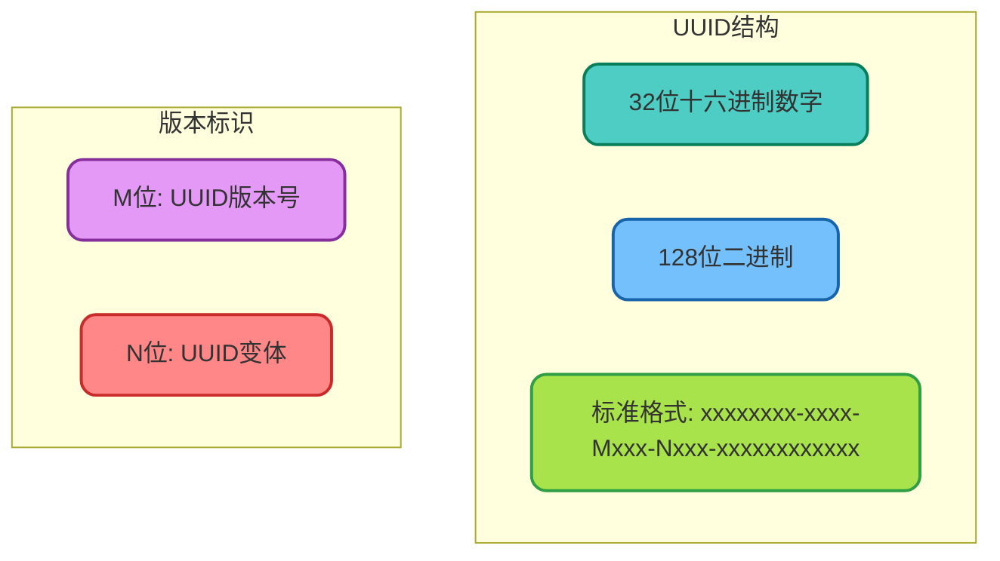
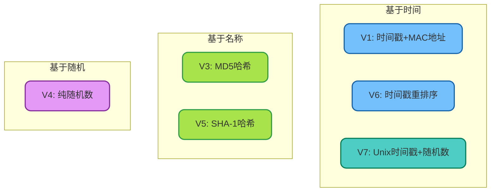
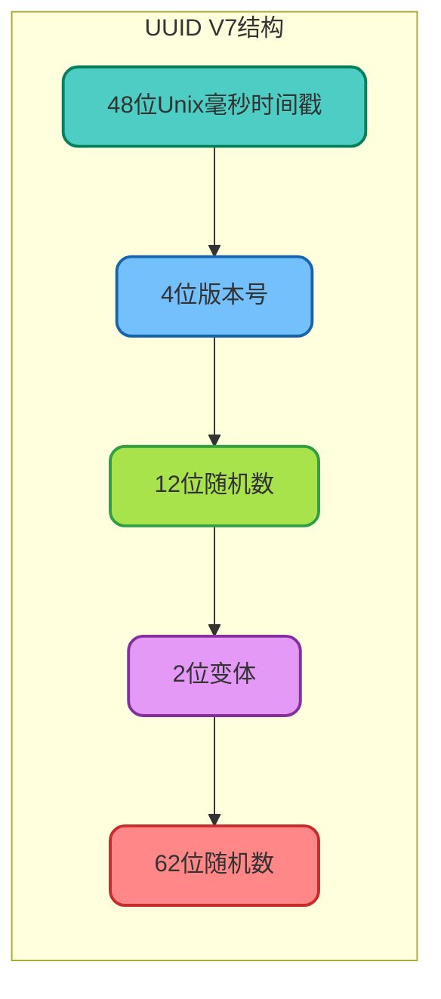
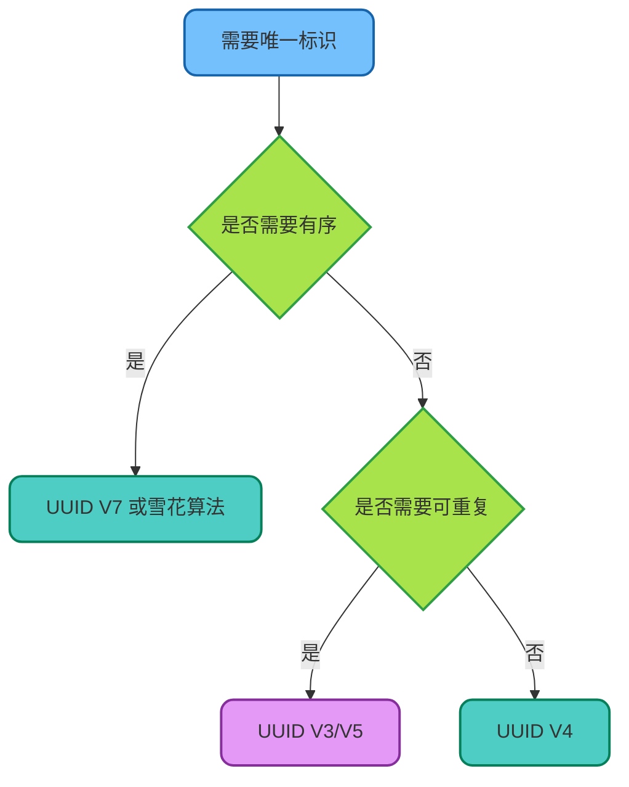

# UUID与唯一标识生成

## UUID概述

UUID（Universally Unique Identifier，通用唯一标识符）是一种用于生成全局唯一标识的机制。在分布式系统、数据库主键、消息追踪等场景中广泛应用。



## Java中的UUID使用

### 基础使用方法

```java
import java.util.UUID;

/**
 * UUID基础使用示例
 */
public class UuidBasicDemo {
    
    public static void main(String[] args) {
        // 生成随机UUID（Version 4）
        UUID randomUuid = UUID.randomUUID();
        System.out.println("随机UUID: " + randomUuid);
        // 输出示例: 550e8400-e29b-41d4-a716-446655440000
        
        // 从字符串创建UUID
        UUID fromString = UUID.fromString("550e8400-e29b-41d4-a716-446655440000");
        System.out.println("解析UUID: " + fromString);
        
        // 基于名称生成UUID（Version 3，MD5）
        UUID namedUuid = UUID.nameUUIDFromBytes("product-12345".getBytes());
        System.out.println("命名UUID: " + namedUuid);
        
        // 获取UUID的组成部分
        System.out.println("最高有效位: " + randomUuid.getMostSignificantBits());
        System.out.println("最低有效位: " + randomUuid.getLeastSignificantBits());
        System.out.println("版本号: " + randomUuid.version());
        System.out.println("变体: " + randomUuid.variant());
    }
}
```

### 实际业务应用

```java
/**
 * UUID在订单系统中的应用
 */
public class OrderIdGenerator {
    
    /**
     * 生成订单号
     * 格式：ORD + 日期 + UUID前8位
     */
    public static String generateOrderId() {
        String datePart = LocalDate.now()
            .format(DateTimeFormatter.ofPattern("yyyyMMdd"));
        String uuidPart = UUID.randomUUID().toString()
            .replace("-", "")
            .substring(0, 8)
            .toUpperCase();
        return "ORD" + datePart + uuidPart;
    }
    
    /**
     * 生成交易流水号
     * 纯UUID格式，去除横线
     */
    public static String generateTransactionId() {
        return UUID.randomUUID().toString().replace("-", "");
    }
    
    /**
     * 生成文件存储名称
     * 保留原始扩展名
     */
    public static String generateFileName(String originalName) {
        String extension = "";
        int dotIndex = originalName.lastIndexOf('.');
        if (dotIndex > 0) {
            extension = originalName.substring(dotIndex);
        }
        return UUID.randomUUID().toString() + extension;
    }
    
    public static void main(String[] args) {
        System.out.println("订单号: " + generateOrderId());
        // 输出: ORD20241202A1B2C3D4
        
        System.out.println("交易流水号: " + generateTransactionId());
        // 输出: 550e8400e29b41d4a716446655440000
        
        System.out.println("文件名: " + generateFileName("产品图片.jpg"));
        // 输出: 550e8400-e29b-41d4-a716-446655440000.jpg
    }
}
```

## UUID版本详解

### 各版本实现原理



### 版本对比分析

| 版本 | 生成方式 | 唯一性保证 | 特点 |
|------|---------|-----------|------|
| V1 | 时间戳 + MAC地址 | 极高 | 可追溯时间和机器，存在隐私问题 |
| V3 | MD5(命名空间 + 名称) | 相同输入相同输出 | 适合需要可重复生成的场景 |
| V4 | 纯随机数 | 高（取决于随机性） | 最常用，Java默认实现 |
| V5 | SHA-1(命名空间 + 名称) | 相同输入相同输出 | 比V3安全性更高 |
| V6 | 时间戳重排序 | 极高 | 可排序，解决V1排序问题 |
| V7 | Unix毫秒时间戳 + 随机 | 极高 | 新一代标准，天然有序 |

### Java中各版本UUID实现

```java
/**
 * 不同版本UUID的实现示例
 */
public class UuidVersionDemo {
    
    // Java标准库仅支持V3和V4
    // V1、V5、V7需要第三方库
    
    /**
     * Version 4: 随机UUID
     */
    public static UUID generateV4() {
        return UUID.randomUUID();
    }
    
    /**
     * Version 3: 基于MD5的命名UUID
     * 相同输入总是产生相同输出
     */
    public static UUID generateV3(String name) {
        return UUID.nameUUIDFromBytes(name.getBytes(StandardCharsets.UTF_8));
    }
    
    /**
     * 自定义实现：基于时间的UUID（类似V7思路）
     * 结合时间戳和随机数，保证有序性
     */
    public static String generateTimeBasedId() {
        long timestamp = System.currentTimeMillis();
        long random = ThreadLocalRandom.current().nextLong();
        
        // 时间戳作为前缀保证有序
        return String.format("%016x%016x", timestamp, Math.abs(random));
    }
    
    public static void main(String[] args) {
        // V4随机UUID
        System.out.println("V4: " + generateV4());
        
        // V3命名UUID - 相同输入产生相同结果
        System.out.println("V3(user:1001): " + generateV3("user:1001"));
        System.out.println("V3(user:1001): " + generateV3("user:1001"));  // 结果相同
        
        // 基于时间的ID
        System.out.println("时间ID: " + generateTimeBasedId());
    }
}
```

## UUID的优缺点分析

### 优点

```java
/**
 * UUID优势示例
 */
public class UuidAdvantages {
    
    // 优势1：本地生成，无需网络
    public void localGeneration() {
        // 不依赖任何远程服务
        String id = UUID.randomUUID().toString();
        System.out.println("本地生成ID: " + id);
    }
    
    // 优势2：全局唯一，无需协调
    public void globalUnique() {
        Set<String> ids = new HashSet<>();
        for (int i = 0; i < 1_000_000; i++) {
            ids.add(UUID.randomUUID().toString());
        }
        System.out.println("生成100万个UUID，唯一数量: " + ids.size());
        // 输出: 1000000（全部唯一）
    }
    
    // 优势3：使用简单
    public void simpleUsage() {
        // 一行代码即可生成
        String orderId = UUID.randomUUID().toString();
        String fileId = UUID.randomUUID().toString();
        String traceId = UUID.randomUUID().toString();
    }
}
```

### 缺点与解决方案

```java
/**
 * UUID的缺点及解决方案
 */
public class UuidDisadvantages {
    
    /**
     * 缺点1：长度较长（32个字符）
     * 解决：使用压缩编码或截取
     */
    public String shortenUuid() {
        UUID uuid = UUID.randomUUID();
        // 方案1：Base64编码（22字符）
        ByteBuffer buffer = ByteBuffer.wrap(new byte[16]);
        buffer.putLong(uuid.getMostSignificantBits());
        buffer.putLong(uuid.getLeastSignificantBits());
        return Base64.getUrlEncoder().withoutPadding()
            .encodeToString(buffer.array());
        
        // 方案2：截取前12位（适合非严格唯一场景）
        // return uuid.toString().replace("-", "").substring(0, 12);
    }
    
    /**
     * 缺点2：无序，不适合数据库索引
     * 解决：使用有序UUID或雪花算法
     */
    public String orderedId() {
        // 时间戳前缀 + 随机后缀
        long timestamp = System.currentTimeMillis();
        String random = UUID.randomUUID().toString().substring(0, 8);
        return timestamp + "-" + random;
    }
    
    /**
     * 缺点3：无业务含义
     * 解决：添加业务前缀
     */
    public String businessId(String prefix) {
        String uuid = UUID.randomUUID().toString()
            .replace("-", "")
            .substring(0, 12);
        return prefix + "_" + uuid;
        // 示例输出: ORDER_a1b2c3d4e5f6
    }
    
    public static void main(String[] args) {
        UuidDisadvantages demo = new UuidDisadvantages();
        
        System.out.println("压缩UUID: " + demo.shortenUuid());
        System.out.println("有序ID: " + demo.orderedId());
        System.out.println("业务ID: " + demo.businessId("PAYMENT"));
    }
}
```

## UUID V7：新一代标准

### V7的结构优势

UUID V7是2024年正式发布的新标准，结合了时间有序性和随机唯一性。



### V7的自定义实现

```java
/**
 * UUID V7 自定义实现
 * JDK标准库暂未支持，此为模拟实现
 */
public class UuidV7Generator {
    
    private static final SecureRandom RANDOM = new SecureRandom();
    
    /**
     * 生成UUID V7
     */
    public static UUID generateV7() {
        long timestamp = System.currentTimeMillis();
        
        // 高64位：时间戳(48) + 版本(4) + 随机(12)
        long msb = (timestamp << 16) | 0x7000L | (RANDOM.nextLong() & 0x0FFFL);
        
        // 低64位：变体(2) + 随机(62)
        long lsb = (RANDOM.nextLong() & 0x3FFFFFFFFFFFFFFFL) | 0x8000000000000000L;
        
        return new UUID(msb, lsb);
    }
    
    /**
     * 批量生成并验证有序性
     */
    public static void main(String[] args) {
        List<UUID> uuids = new ArrayList<>();
        
        // 生成10个UUID V7
        for (int i = 0; i < 10; i++) {
            uuids.add(generateV7());
            try {
                Thread.sleep(1);  // 确保时间戳不同
            } catch (InterruptedException e) {
                Thread.currentThread().interrupt();
            }
        }
        
        // 验证有序性
        System.out.println("UUID V7 生成结果（有序）:");
        uuids.forEach(System.out::println);
        
        // 排序验证
        List<UUID> sorted = new ArrayList<>(uuids);
        Collections.sort(sorted);
        System.out.println("\n是否保持有序: " + uuids.equals(sorted));
    }
}
```

## 唯一性保证级别

### 碰撞概率分析

```java
/**
 * UUID碰撞概率计算
 */
public class UuidCollisionAnalysis {
    
    public static void main(String[] args) {
        // UUID V4 使用122位随机数
        // 可能的组合数：2^122 ≈ 5.3 × 10^36
        
        // 根据生日悖论，要产生50%碰撞概率
        // 需要生成约 2.7 × 10^18 个UUID
        
        System.out.println("UUID V4 碰撞概率分析:");
        System.out.println("- 可能组合数: 2^122 ≈ 5.3 × 10^36");
        System.out.println("- 每秒生成10亿个UUID");
        System.out.println("- 连续生成86年才有50%碰撞概率");
        
        // 实际验证
        int testCount = 10_000_000;
        Set<UUID> uuids = new HashSet<>();
        int collisions = 0;
        
        long start = System.currentTimeMillis();
        for (int i = 0; i < testCount; i++) {
            UUID uuid = UUID.randomUUID();
            if (!uuids.add(uuid)) {
                collisions++;
            }
        }
        long duration = System.currentTimeMillis() - start;
        
        System.out.printf("%n实测 %d 个UUID:%n", testCount);
        System.out.printf("- 碰撞次数: %d%n", collisions);
        System.out.printf("- 耗时: %d ms%n", duration);
    }
}
```

## 场景选型建议

| 场景 | 推荐方案 | 说明 |
|------|---------|------|
| 分布式系统ID | UUID V4 或 V7 | 无需协调，全局唯一 |
| 数据库主键 | UUID V7 或 雪花算法 | 需要有序性支持索引 |
| 链路追踪 | UUID V4 | 简单高效 |
| 幂等性校验 | UUID V3/V5 | 相同输入相同输出 |
| 文件存储命名 | UUID V4 | 避免文件名冲突 |
| 短链接生成 | 压缩UUID或自定义 | 需要更短的标识 |



UUID是一种简单有效的唯一标识生成方案，理解其各版本特点，能够在不同场景下做出合适的选择。
