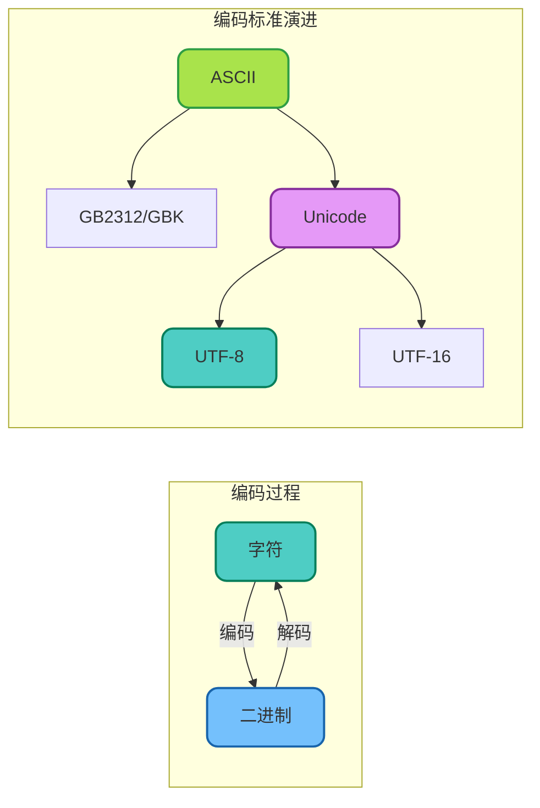
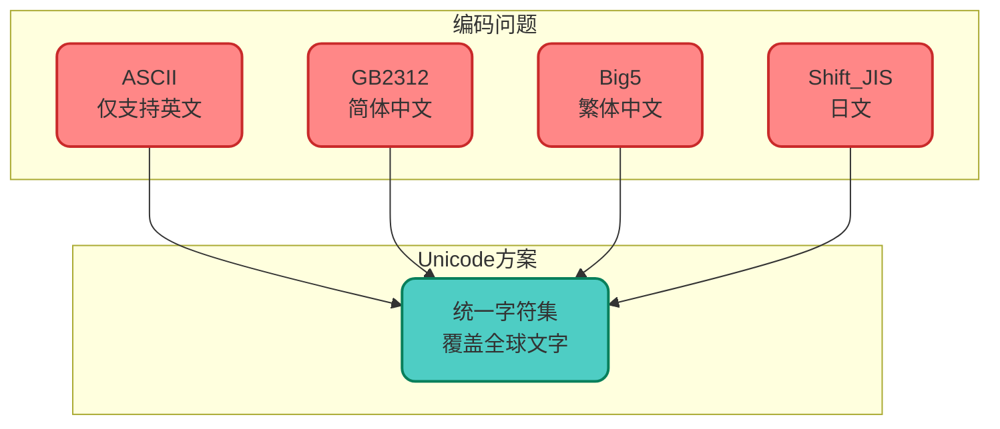
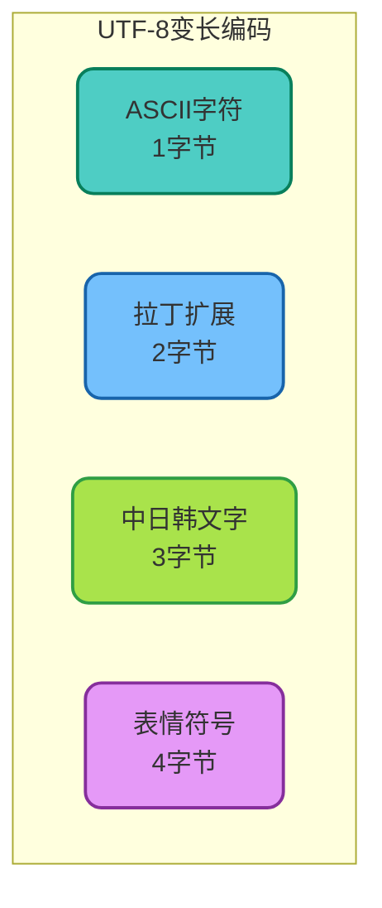
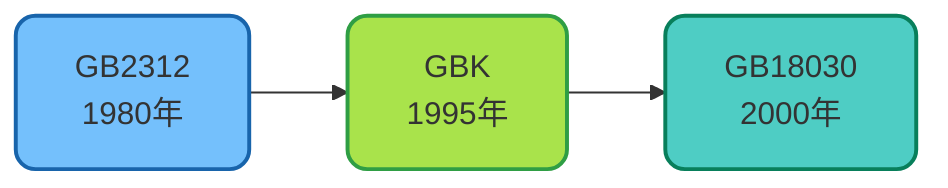
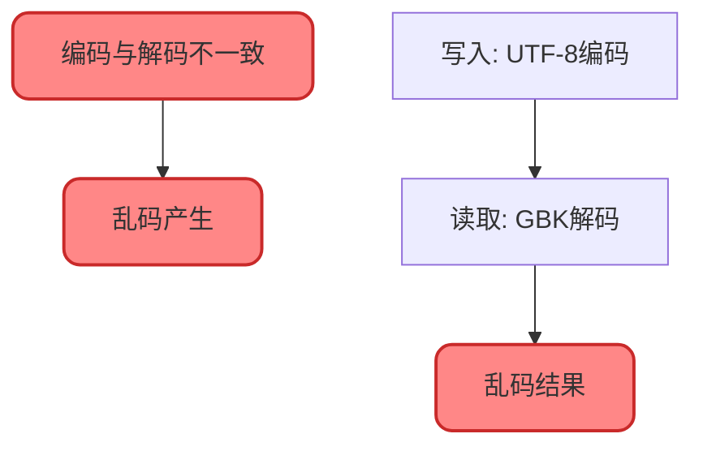
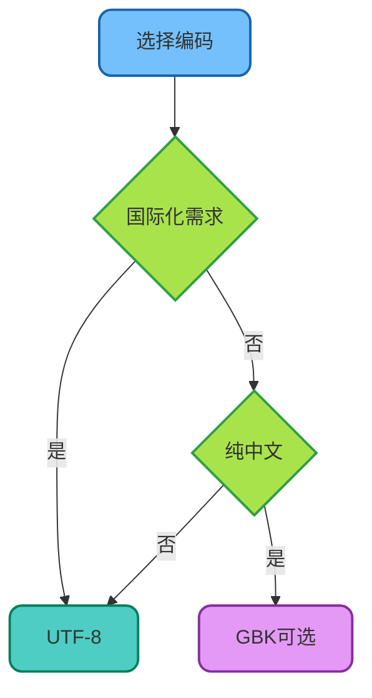

# 字符编码详解

## 字符编码概述

计算机只能处理二进制数据（0和1），而人类使用各种文字符号进行交流。字符编码就是建立字符与二进制数据之间对应关系的规则，是计算机处理文本的基础。



## ASCII编码

### 基础概念

ASCII（American Standard Code for Information Interchange）是最早的字符编码标准，使用7位二进制表示128个字符。

```java
/**
 * ASCII编码示例
 */
public class AsciiDemo {
    
    public static void main(String[] args) {
        // ASCII字符与编码对应
        System.out.println("常用ASCII编码:");
        System.out.println("'A' = " + (int)'A');  // 65
        System.out.println("'Z' = " + (int)'Z');  // 90
        System.out.println("'a' = " + (int)'a');  // 97
        System.out.println("'z' = " + (int)'z');  // 122
        System.out.println("'0' = " + (int)'0');  // 48
        System.out.println("'9' = " + (int)'9');  // 57
        System.out.println("' ' = " + (int)' ');  // 32（空格）
        
        // 大小写转换利用ASCII差值
        char lower = 'h';
        char upper = (char)(lower - 32);  // 转大写
        System.out.println(lower + " -> " + upper);  // h -> H
        
        // 判断字符类型
        char ch = '5';
        boolean isDigit = (ch >= '0' && ch <= '9');
        System.out.println("'" + ch + "' 是数字: " + isDigit);
    }
}
```

### ASCII编码表（常用部分）

| 范围 | 字符类型 | 说明 |
|------|---------|------|
| 0-31 | 控制字符 | 换行、回车等 |
| 32-47 | 标点符号 | 空格、感叹号等 |
| 48-57 | 数字 | 0-9 |
| 65-90 | 大写字母 | A-Z |
| 97-122 | 小写字母 | a-z |

## Unicode字符集

### 为什么需要Unicode

ASCII只能表示128个字符，无法涵盖世界上的各种文字。Unicode的目标是为全球所有字符分配唯一的编码。



### Unicode编码点

```java
/**
 * Unicode编码示例
 */
public class UnicodeDemo {
    
    public static void main(String[] args) {
        // Unicode编码点（Code Point）
        System.out.println("常用字符的Unicode编码:");
        printCodePoint('中');  // U+4E2D
        printCodePoint('国');  // U+56FD
        printCodePoint('A');   // U+0041
        printCodePoint('★');  // U+2605
        printCodePoint('\uD83D' + "\uDE00");  // U+1F600（笑脸表情）
        
        // 通过编码点创建字符
        String smile = new String(Character.toChars(0x1F600));
        System.out.println("笑脸表情: " + smile);
        
        // 遍历字符串的编码点
        String text = "你好World";
        text.codePoints().forEach(cp -> 
            System.out.printf("U+%04X: %s%n", cp, new String(Character.toChars(cp)))
        );
    }
    
    private static void printCodePoint(char c) {
        System.out.printf("'%c' = U+%04X%n", c, (int)c);
    }
    
    private static void printCodePoint(String s) {
        s.codePoints().forEach(cp -> 
            System.out.printf("'%s' = U+%04X%n", new String(Character.toChars(cp)), cp)
        );
    }
}
```

## UTF-8编码

### 编码规则

UTF-8是Unicode的一种实现方式，使用1-4个字节表示字符，是目前最广泛使用的编码格式。



| Unicode范围 | UTF-8字节数 | 二进制格式 |
|------------|------------|-----------|
| U+0000 ~ U+007F | 1字节 | 0xxxxxxx |
| U+0080 ~ U+07FF | 2字节 | 110xxxxx 10xxxxxx |
| U+0800 ~ U+FFFF | 3字节 | 1110xxxx 10xxxxxx 10xxxxxx |
| U+10000 ~ U+10FFFF | 4字节 | 11110xxx 10xxxxxx 10xxxxxx 10xxxxxx |

### UTF-8编码实践

```java
/**
 * UTF-8编码实践
 */
public class Utf8Demo {
    
    public static void main(String[] args) throws Exception {
        String text = "Hello中国";
        
        // 不同编码的字节长度
        byte[] utf8Bytes = text.getBytes(StandardCharsets.UTF_8);
        byte[] gbkBytes = text.getBytes("GBK");
        byte[] utf16Bytes = text.getBytes(StandardCharsets.UTF_16);
        
        System.out.println("字符串: " + text);
        System.out.println("字符数: " + text.length());
        System.out.println("UTF-8字节数: " + utf8Bytes.length);   // 11
        System.out.println("GBK字节数: " + gbkBytes.length);       // 9
        System.out.println("UTF-16字节数: " + utf16Bytes.length);  // 16
        
        // 查看各字符的UTF-8编码
        System.out.println("\n各字符UTF-8编码:");
        for (char c : text.toCharArray()) {
            byte[] bytes = String.valueOf(c).getBytes(StandardCharsets.UTF_8);
            System.out.printf("'%c': %d字节 -> %s%n", 
                c, bytes.length, bytesToHex(bytes));
        }
    }
    
    private static String bytesToHex(byte[] bytes) {
        StringBuilder sb = new StringBuilder();
        for (byte b : bytes) {
            sb.append(String.format("%02X ", b));
        }
        return sb.toString().trim();
    }
}
// 输出:
// 'H': 1字节 -> 48
// 'e': 1字节 -> 65
// 'l': 1字节 -> 6C
// 'l': 1字节 -> 6C
// 'o': 1字节 -> 6F
// '中': 3字节 -> E4 B8 AD
// '国': 3字节 -> E5 9B BD
```

## GBK编码

### 中文编码标准演进



| 标准 | 发布年份 | 收录字符 | 特点 |
|------|---------|---------|------|
| GB2312 | 1980 | 6763汉字 | 简体中文国标 |
| GBK | 1995 | 21003汉字 | 兼容GB2312，支持繁体 |
| GB18030 | 2000 | 70244字符 | 国家强制标准，支持少数民族文字 |

### GBK编码特点

```java
/**
 * GBK与UTF-8对比
 */
public class GbkDemo {
    
    public static void main(String[] args) throws Exception {
        String chinese = "数据库连接池配置";
        
        // GBK编码：每个汉字2字节
        byte[] gbkBytes = chinese.getBytes("GBK");
        System.out.println("GBK编码:");
        System.out.println("  字符数: " + chinese.length());
        System.out.println("  字节数: " + gbkBytes.length);  // 16
        
        // UTF-8编码：每个汉字3字节
        byte[] utf8Bytes = chinese.getBytes(StandardCharsets.UTF_8);
        System.out.println("UTF-8编码:");
        System.out.println("  字符数: " + chinese.length());
        System.out.println("  字节数: " + utf8Bytes.length);  // 24
        
        // 存储空间节省
        double savings = (1 - (double)gbkBytes.length / utf8Bytes.length) * 100;
        System.out.printf("GBK相比UTF-8节省: %.1f%%%n", savings);
    }
}
```

## 乱码问题分析

### 乱码产生原因



### 常见乱码类型与解决

```java
/**
 * 乱码问题演示与解决
 */
public class CharsetIssueDemo {
    
    public static void main(String[] args) throws Exception {
        String original = "中文测试";
        
        // 场景1：UTF-8编码，GBK解码 -> 乱码
        byte[] utf8Bytes = original.getBytes(StandardCharsets.UTF_8);
        String wrong1 = new String(utf8Bytes, "GBK");
        System.out.println("UTF-8编码GBK解码: " + wrong1);
        // 输出: 涓枃娴嬭瘯
        
        // 场景2：GBK编码，UTF-8解码 -> 乱码
        byte[] gbkBytes = original.getBytes("GBK");
        String wrong2 = new String(gbkBytes, StandardCharsets.UTF_8);
        System.out.println("GBK编码UTF-8解码: " + wrong2);
        // 输出: ����
        
        // 场景3：ISO-8859-1编码 -> 无法表示中文
        byte[] isoBytes = original.getBytes(StandardCharsets.ISO_8859_1);
        String wrong3 = new String(isoBytes, StandardCharsets.ISO_8859_1);
        System.out.println("ISO-8859-1编码: " + wrong3);
        // 输出: ????
        
        // 解决方案：统一使用UTF-8
        String correct = new String(utf8Bytes, StandardCharsets.UTF_8);
        System.out.println("正确解码: " + correct);
    }
    
    /**
     * 乱码恢复尝试
     */
    public static String tryRecover(String garbled) throws Exception {
        // 尝试常见的编码组合
        String[][] encodings = {
            {"GBK", "UTF-8"},
            {"UTF-8", "GBK"},
            {"ISO-8859-1", "UTF-8"},
            {"ISO-8859-1", "GBK"}
        };
        
        for (String[] pair : encodings) {
            try {
                String recovered = new String(
                    garbled.getBytes(pair[0]), pair[1]
                );
                // 检查是否包含有效中文
                if (isValidChinese(recovered)) {
                    System.out.printf("恢复成功: %s -> %s%n", 
                        pair[0] + "转" + pair[1], recovered);
                    return recovered;
                }
            } catch (Exception e) {
                // 忽略，尝试下一种
            }
        }
        return null;
    }
    
    private static boolean isValidChinese(String str) {
        return str.matches(".*[\u4e00-\u9fa5]+.*");
    }
}
```

## Java中的字符编码处理

### 读写文件时指定编码

```java
/**
 * 文件读写编码处理
 */
public class FileEncodingDemo {
    
    /**
     * 写入文件时指定编码
     */
    public static void writeFile(String content, String path, Charset charset) 
            throws IOException {
        try (BufferedWriter writer = Files.newBufferedWriter(
                Paths.get(path), charset)) {
            writer.write(content);
        }
    }
    
    /**
     * 读取文件时指定编码
     */
    public static String readFile(String path, Charset charset) throws IOException {
        return Files.readString(Paths.get(path), charset);
    }
    
    /**
     * 自动检测文件编码（简单实现）
     */
    public static Charset detectEncoding(String path) throws IOException {
        byte[] bytes = Files.readAllBytes(Paths.get(path));
        
        // 检查UTF-8 BOM
        if (bytes.length >= 3 && 
            bytes[0] == (byte)0xEF && 
            bytes[1] == (byte)0xBB && 
            bytes[2] == (byte)0xBF) {
            return StandardCharsets.UTF_8;
        }
        
        // 检查UTF-16 BOM
        if (bytes.length >= 2) {
            if (bytes[0] == (byte)0xFE && bytes[1] == (byte)0xFF) {
                return StandardCharsets.UTF_16BE;
            }
            if (bytes[0] == (byte)0xFF && bytes[1] == (byte)0xFE) {
                return StandardCharsets.UTF_16LE;
            }
        }
        
        // 默认尝试UTF-8
        return StandardCharsets.UTF_8;
    }
    
    public static void main(String[] args) throws IOException {
        String content = "这是一段中文内容";
        String path = "test.txt";
        
        // 使用UTF-8写入
        writeFile(content, path, StandardCharsets.UTF_8);
        
        // 使用UTF-8读取
        String read = readFile(path, StandardCharsets.UTF_8);
        System.out.println("读取内容: " + read);
        
        // 清理测试文件
        Files.deleteIfExists(Paths.get(path));
    }
}
```

### HTTP请求中的编码处理

```java
/**
 * HTTP请求编码处理
 */
public class HttpEncodingDemo {
    
    /**
     * URL编码
     */
    public static String urlEncode(String value) {
        return URLEncoder.encode(value, StandardCharsets.UTF_8);
    }
    
    /**
     * URL解码
     */
    public static String urlDecode(String encoded) {
        return URLDecoder.decode(encoded, StandardCharsets.UTF_8);
    }
    
    /**
     * 构建带中文参数的URL
     */
    public static String buildUrl(String baseUrl, Map<String, String> params) {
        if (params == null || params.isEmpty()) {
            return baseUrl;
        }
        
        String queryString = params.entrySet().stream()
            .map(e -> urlEncode(e.getKey()) + "=" + urlEncode(e.getValue()))
            .collect(Collectors.joining("&"));
        
        return baseUrl + "?" + queryString;
    }
    
    public static void main(String[] args) {
        // URL编码示例
        String keyword = "Java编程";
        String encoded = urlEncode(keyword);
        System.out.println("编码前: " + keyword);
        System.out.println("编码后: " + encoded);
        System.out.println("解码后: " + urlDecode(encoded));
        
        // 构建完整URL
        Map<String, String> params = new HashMap<>();
        params.put("keyword", "数据库");
        params.put("page", "1");
        
        String url = buildUrl("https://api.example.com/search", params);
        System.out.println("完整URL: " + url);
    }
}
```

## 最佳实践总结

| 场景 | 推荐编码 | 说明 |
|------|---------|------|
| 新项目 | UTF-8 | 国际通用，兼容性最好 |
| 数据库 | UTF-8或UTF8MB4 | MySQL推荐UTF8MB4支持表情 |
| 网页 | UTF-8 | HTML5默认编码 |
| API接口 | UTF-8 | 标准JSON编码 |
| Windows文件 | 注意BOM | 可能需要UTF-8 with BOM |
| 纯中文系统 | GBK | 节省存储空间 |



理解字符编码原理，能够有效避免开发中常见的乱码问题，是Java开发者必备的基础知识。