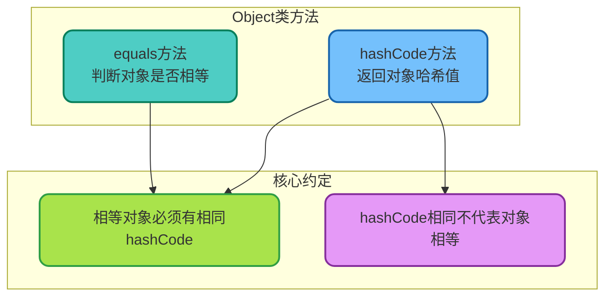
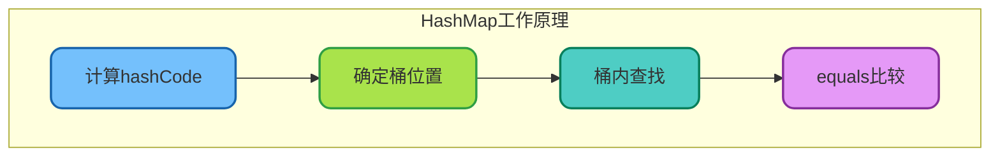
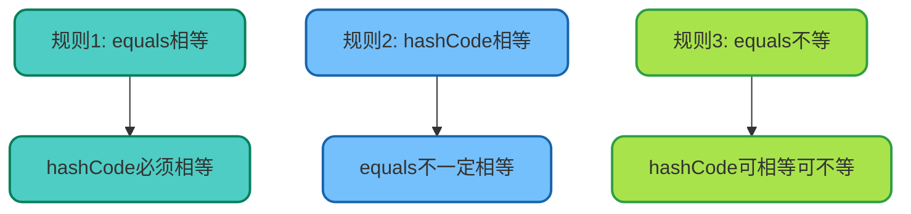
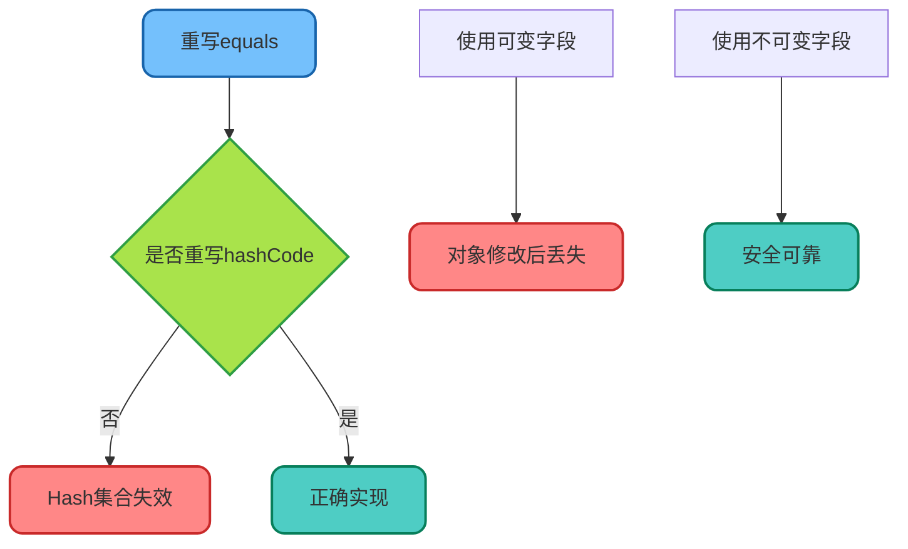

# equals与hashCode方法详解

## 方法概述

`equals()`和`hashCode()`是Object类中定义的两个重要方法，在Java中的集合操作、对象比较等场景中起着关键作用。理解这两个方法的关系和正确实现方式，对于编写高质量的Java代码至关重要。



## equals方法

### 默认实现

Object类中equals的默认实现是比较对象引用（内存地址）：

```java
// Object类中的默认实现
public boolean equals(Object obj) {
    return (this == obj);
}
```

### 重写equals的规范

根据Java规范，equals方法必须满足以下特性：

```java
/**
 * equals方法规范示例
 */
public class EqualsContract {
    
    /**
     * 1. 自反性：x.equals(x) == true
     */
    public void reflexive() {
        String x = "test";
        assert x.equals(x);  // 必须为true
    }
    
    /**
     * 2. 对称性：x.equals(y) == y.equals(x)
     */
    public void symmetric() {
        String x = "hello";
        String y = "hello";
        assert x.equals(y) == y.equals(x);
    }
    
    /**
     * 3. 传递性：x.equals(y) && y.equals(z) => x.equals(z)
     */
    public void transitive() {
        String x = "test";
        String y = "test";
        String z = "test";
        if (x.equals(y) && y.equals(z)) {
            assert x.equals(z);
        }
    }
    
    /**
     * 4. 一致性：多次调用结果不变（对象未修改时）
     */
    public void consistent() {
        String x = "test";
        String y = "test";
        boolean result1 = x.equals(y);
        boolean result2 = x.equals(y);
        assert result1 == result2;
    }
    
    /**
     * 5. 非空性：x.equals(null) == false
     */
    public void nonNull() {
        String x = "test";
        assert !x.equals(null);
    }
}
```

### 正确重写equals

```java
/**
 * 商品类 - 正确实现equals
 */
public class Product {
    private Long id;
    private String name;
    private BigDecimal price;
    
    public Product(Long id, String name, BigDecimal price) {
        this.id = id;
        this.name = name;
        this.price = price;
    }
    
    @Override
    public boolean equals(Object obj) {
        // 1. 检查是否为同一对象
        if (this == obj) {
            return true;
        }
        
        // 2. 检查是否为null或类型不匹配
        if (obj == null || getClass() != obj.getClass()) {
            return false;
        }
        
        // 3. 强制类型转换
        Product other = (Product) obj;
        
        // 4. 比较关键字段
        return Objects.equals(id, other.id) &&
               Objects.equals(name, other.name) &&
               Objects.equals(price, other.price);
    }
    
    // Getters...
}
```

## hashCode方法

### 为什么需要hashCode

hashCode方法的主要用途是支持基于哈希的集合（HashMap、HashSet、Hashtable）。



### hashCode的核心作用

```java
/**
 * hashCode在HashMap中的作用演示
 */
public class HashCodeDemo {
    
    public static void main(String[] args) {
        // 场景：使用商品作为HashMap的key
        Map<Product, Integer> inventory = new HashMap<>();
        
        Product laptop = new Product(1L, "笔记本电脑", new BigDecimal("5999"));
        inventory.put(laptop, 100);
        
        // 创建一个"相等"的商品对象查询库存
        Product queryProduct = new Product(1L, "笔记本电脑", new BigDecimal("5999"));
        
        // 如果没有重写hashCode，即使equals返回true
        // 也无法正确获取到库存
        Integer stock = inventory.get(queryProduct);
        
        System.out.println("查询库存: " + stock);
        // 没有重写hashCode时输出: null
        // 正确重写后输出: 100
    }
}
```

### 正确重写hashCode

```java
/**
 * 商品类 - 完整的equals和hashCode实现
 */
public class Product {
    private Long id;
    private String name;
    private BigDecimal price;
    
    public Product(Long id, String name, BigDecimal price) {
        this.id = id;
        this.name = name;
        this.price = price;
    }
    
    @Override
    public boolean equals(Object obj) {
        if (this == obj) return true;
        if (obj == null || getClass() != obj.getClass()) return false;
        
        Product other = (Product) obj;
        return Objects.equals(id, other.id) &&
               Objects.equals(name, other.name) &&
               Objects.equals(price, other.price);
    }
    
    @Override
    public int hashCode() {
        // 使用Objects.hash简化实现
        return Objects.hash(id, name, price);
    }
    
    // 或者手动实现
    public int hashCodeManual() {
        int result = 17;  // 非零初始值
        result = 31 * result + (id == null ? 0 : id.hashCode());
        result = 31 * result + (name == null ? 0 : name.hashCode());
        result = 31 * result + (price == null ? 0 : price.hashCode());
        return result;
    }
}
```

## equals与hashCode的契约

### 核心规则



### 违反契约的后果

```java
/**
 * 违反hashCode契约的错误示例
 */
public class BrokenHashCodeDemo {
    
    static class BadProduct {
        private Long id;
        private String name;
        
        public BadProduct(Long id, String name) {
            this.id = id;
            this.name = name;
        }
        
        // 重写了equals
        @Override
        public boolean equals(Object obj) {
            if (this == obj) return true;
            if (obj == null || getClass() != obj.getClass()) return false;
            BadProduct other = (BadProduct) obj;
            return Objects.equals(id, other.id) &&
                   Objects.equals(name, other.name);
        }
        
        // 错误：没有重写hashCode！
    }
    
    public static void main(String[] args) {
        Set<BadProduct> products = new HashSet<>();
        
        BadProduct p1 = new BadProduct(1L, "手机");
        BadProduct p2 = new BadProduct(1L, "手机");
        
        System.out.println("p1.equals(p2): " + p1.equals(p2));  // true
        System.out.println("p1.hashCode(): " + p1.hashCode());
        System.out.println("p2.hashCode(): " + p2.hashCode());
        // hashCode不同！
        
        products.add(p1);
        products.add(p2);
        
        System.out.println("Set大小: " + products.size());
        // 输出: 2（期望是1，因为p1和p2应该是"相等"的）
        
        System.out.println("包含p2: " + products.contains(p2));
        // 可能输出false，因为查找时先用hashCode定位桶
    }
}
```

## 实现技巧与最佳实践

### 使用IDE生成

```java
/**
 * IDE生成的equals和hashCode示例
 * （以IntelliJ IDEA为例）
 */
public class Order {
    private Long orderId;
    private String customerName;
    private LocalDateTime createTime;
    private BigDecimal totalAmount;
    
    // IDE生成的equals
    @Override
    public boolean equals(Object o) {
        if (this == o) return true;
        if (o == null || getClass() != o.getClass()) return false;
        Order order = (Order) o;
        return Objects.equals(orderId, order.orderId) &&
               Objects.equals(customerName, order.customerName) &&
               Objects.equals(createTime, order.createTime) &&
               Objects.equals(totalAmount, order.totalAmount);
    }
    
    // IDE生成的hashCode
    @Override
    public int hashCode() {
        return Objects.hash(orderId, customerName, createTime, totalAmount);
    }
}
```

### 使用Lombok简化

```java
/**
 * 使用Lombok自动生成equals和hashCode
 */
@EqualsAndHashCode
public class Customer {
    private Long id;
    private String name;
    private String email;
}

/**
 * 只使用部分字段
 */
@EqualsAndHashCode(onlyExplicitlyIncluded = true)
public class Article {
    @EqualsAndHashCode.Include
    private Long id;  // 只用id判断相等
    
    private String title;
    private String content;
    private LocalDateTime publishTime;
}
```

### 不可变对象的hashCode缓存

```java
/**
 * 缓存hashCode的不可变对象
 */
public final class ImmutableProduct {
    private final Long id;
    private final String name;
    private final BigDecimal price;
    
    // 缓存hashCode
    private int hashCode;
    
    public ImmutableProduct(Long id, String name, BigDecimal price) {
        this.id = id;
        this.name = name;
        this.price = price;
    }
    
    @Override
    public boolean equals(Object obj) {
        if (this == obj) return true;
        if (obj == null || getClass() != obj.getClass()) return false;
        
        ImmutableProduct other = (ImmutableProduct) obj;
        return Objects.equals(id, other.id) &&
               Objects.equals(name, other.name) &&
               Objects.equals(price, other.price);
    }
    
    @Override
    public int hashCode() {
        int h = hashCode;
        if (h == 0) {
            h = Objects.hash(id, name, price);
            hashCode = h;
        }
        return h;
    }
}
```

## 继承场景的注意事项

### 子类与父类的equals

```java
/**
 * 继承场景下的equals问题
 */
public class InheritanceDemo {
    
    static class Point {
        protected int x;
        protected int y;
        
        public Point(int x, int y) {
            this.x = x;
            this.y = y;
        }
        
        @Override
        public boolean equals(Object obj) {
            if (!(obj instanceof Point)) return false;
            Point other = (Point) obj;
            return x == other.x && y == other.y;
        }
        
        @Override
        public int hashCode() {
            return Objects.hash(x, y);
        }
    }
    
    static class ColorPoint extends Point {
        private String color;
        
        public ColorPoint(int x, int y, String color) {
            super(x, y);
            this.color = color;
        }
        
        // 错误实现：违反对称性
        // @Override
        // public boolean equals(Object obj) {
        //     if (!(obj instanceof ColorPoint)) return false;
        //     ColorPoint other = (ColorPoint) obj;
        //     return super.equals(obj) && Objects.equals(color, other.color);
        // }
        
        // 推荐：使用组合而非继承
        // 或者使用getClass()代替instanceof
        @Override
        public boolean equals(Object obj) {
            if (obj == null || getClass() != obj.getClass()) return false;
            ColorPoint other = (ColorPoint) obj;
            return x == other.x && y == other.y && 
                   Objects.equals(color, other.color);
        }
        
        @Override
        public int hashCode() {
            return Objects.hash(x, y, color);
        }
    }
    
    public static void main(String[] args) {
        Point p = new Point(1, 2);
        ColorPoint cp = new ColorPoint(1, 2, "RED");
        
        // 使用getClass()后，不同类型不相等
        System.out.println("p.equals(cp): " + p.equals(cp));   // false
        System.out.println("cp.equals(p): " + cp.equals(p));   // false
    }
}
```

## 常见错误总结

| 错误 | 后果 | 解决方案 |
|------|------|---------|
| 只重写equals不重写hashCode | HashMap/HashSet无法正常工作 | 始终同时重写两个方法 |
| hashCode使用可变字段 | 对象放入集合后修改字段会"丢失" | 使用不可变字段或避免修改 |
| equals参数类型写错 | 重载而非重写，导致行为异常 | 使用@Override注解确保重写 |
| 违反equals规范 | 集合行为不可预测 | 遵循自反性、对称性、传递性 |



正确实现equals和hashCode是Java开发的基本功，掌握这两个方法的契约关系和实现技巧，能够避免很多难以排查的Bug。