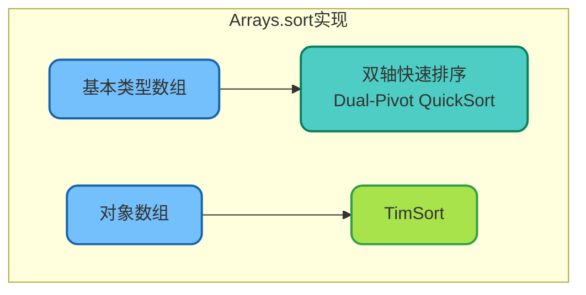
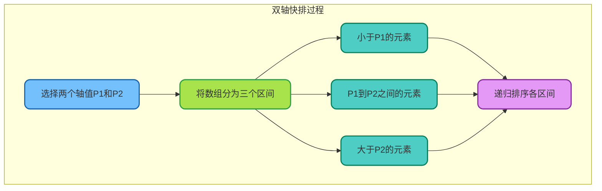
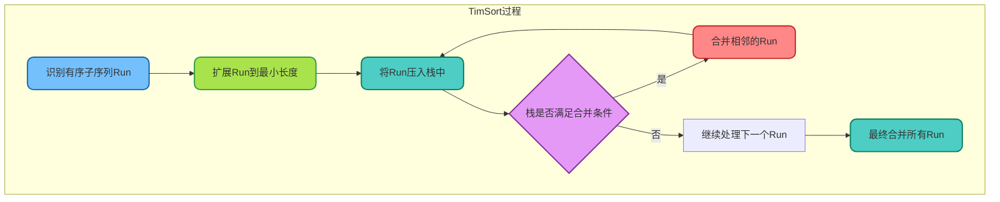
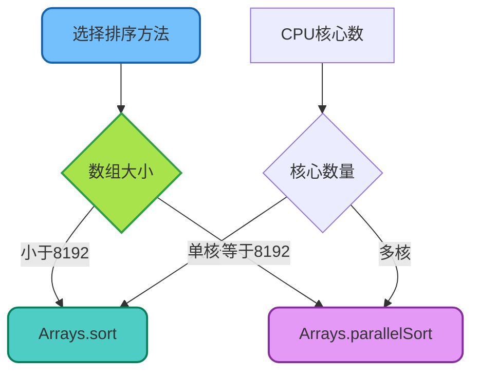

# Arrays排序算法详解

## Arrays.sort概述

`Arrays.sort()`是Java提供的数组排序方法，根据数组类型的不同，采用不同的排序算法实现，以达到最优的性能表现。



## 基本类型数组排序

### 双轴快速排序

JDK 7开始，基本类型数组采用双轴快速排序（Dual-Pivot QuickSort）算法。

```java
/**
 * 基本类型数组排序示例
 */
public class PrimitiveSortDemo {
    
    public static void main(String[] args) {
        // int数组排序
        int[] numbers = {64, 34, 25, 12, 22, 11, 90};
        System.out.println("排序前: " + Arrays.toString(numbers));
        
        Arrays.sort(numbers);
        System.out.println("排序后: " + Arrays.toString(numbers));
        // 输出: [11, 12, 22, 25, 34, 64, 90]
        
        // 部分排序
        int[] partial = {5, 2, 8, 1, 9, 3, 7};
        Arrays.sort(partial, 2, 5);  // 只排序索引2到4的元素
        System.out.println("部分排序: " + Arrays.toString(partial));
        // 输出: [5, 2, 1, 8, 9, 3, 7]
        
        // double数组
        double[] prices = {99.9, 45.5, 78.8, 23.3};
        Arrays.sort(prices);
        System.out.println("价格排序: " + Arrays.toString(prices));
        
        // char数组
        char[] chars = {'d', 'a', 'c', 'b'};
        Arrays.sort(chars);
        System.out.println("字符排序: " + Arrays.toString(chars));
    }
}
```

### 双轴快排的工作原理



**双轴快排的优势：**

| 特性 | 传统快排 | 双轴快排 |
|------|---------|---------|
| 轴值数量 | 1个 | 2个 |
| 分区数量 | 2个 | 3个 |
| 比较次数 | 约2n*ln(n) | 约1.9n*ln(n) |
| 重复元素处理 | 一般 | 更优 |

### 源码分析

```java
// JDK中的实现入口
public static void sort(int[] a) {
    DualPivotQuicksort.sort(a, 0, a.length - 1, null, 0, 0);
}

// DualPivotQuicksort核心逻辑（简化版）
static void sort(int[] a, int left, int right, int[] work, int workBase, int workLen) {
    // 小数组使用插入排序（阈值约47）
    if (right - left < QUICKSORT_THRESHOLD) {
        insertionSort(a, left, right);
        return;
    }
    
    // 选择两个轴值
    int pivot1 = a[left];
    int pivot2 = a[right];
    
    // 确保pivot1 <= pivot2
    if (pivot1 > pivot2) {
        int temp = pivot1;
        pivot1 = pivot2;
        pivot2 = temp;
    }
    
    // 分区并递归...
}
```

## 对象数组排序

### TimSort算法

对象数组采用TimSort算法，这是一种稳定的混合排序算法，结合了归并排序和插入排序的优点。

```java
/**
 * 对象数组排序示例
 */
public class ObjectSortDemo {
    
    public static void main(String[] args) {
        // 字符串数组（自然排序）
        String[] fruits = {"Banana", "Apple", "Orange", "Grape"};
        Arrays.sort(fruits);
        System.out.println("水果排序: " + Arrays.toString(fruits));
        // 输出: [Apple, Banana, Grape, Orange]
        
        // 自定义对象数组
        Product[] products = {
            new Product("笔记本", 5999.0),
            new Product("手机", 3999.0),
            new Product("平板", 2999.0),
            new Product("耳机", 999.0)
        };
        
        // 按价格排序
        Arrays.sort(products, Comparator.comparingDouble(Product::getPrice));
        System.out.println("按价格排序:");
        for (Product p : products) {
            System.out.println("  " + p.getName() + ": " + p.getPrice());
        }
        
        // 按名称排序
        Arrays.sort(products, Comparator.comparing(Product::getName));
        System.out.println("按名称排序:");
        for (Product p : products) {
            System.out.println("  " + p.getName() + ": " + p.getPrice());
        }
        
        // 降序排序
        Arrays.sort(products, Comparator.comparingDouble(Product::getPrice).reversed());
        System.out.println("价格降序:");
        for (Product p : products) {
            System.out.println("  " + p.getName() + ": " + p.getPrice());
        }
    }
    
    static class Product {
        private String name;
        private double price;
        
        public Product(String name, double price) {
            this.name = name;
            this.price = price;
        }
        
        public String getName() { return name; }
        public double getPrice() { return price; }
    }
}
```

### TimSort工作原理



**TimSort的特点：**

| 特性 | 说明 |
|------|------|
| 稳定性 | 稳定排序，相等元素保持原有顺序 |
| 最佳情况 | O(n)，当数据已基本有序时 |
| 平均情况 | O(n log n) |
| 最坏情况 | O(n log n) |
| 空间复杂度 | O(n) |

## 自定义排序规则

### Comparable接口

```java
/**
 * 实现Comparable接口的自然排序
 */
public class Employee implements Comparable<Employee> {
    private Long id;
    private String name;
    private int age;
    private BigDecimal salary;
    
    public Employee(Long id, String name, int age, BigDecimal salary) {
        this.id = id;
        this.name = name;
        this.age = age;
        this.salary = salary;
    }
    
    // 默认按薪资降序排序
    @Override
    public int compareTo(Employee other) {
        return other.salary.compareTo(this.salary);
    }
    
    @Override
    public String toString() {
        return String.format("Employee{id=%d, name='%s', salary=%s}", id, name, salary);
    }
    
    // Getters...
    public Long getId() { return id; }
    public String getName() { return name; }
    public int getAge() { return age; }
    public BigDecimal getSalary() { return salary; }
}

// 使用示例
public class ComparableDemo {
    public static void main(String[] args) {
        Employee[] employees = {
            new Employee(1L, "张三", 28, new BigDecimal("8000")),
            new Employee(2L, "李四", 35, new BigDecimal("15000")),
            new Employee(3L, "王五", 24, new BigDecimal("6000")),
            new Employee(4L, "赵六", 30, new BigDecimal("12000"))
        };
        
        // 使用自然排序（按薪资降序）
        Arrays.sort(employees);
        
        System.out.println("按薪资降序:");
        for (Employee e : employees) {
            System.out.println("  " + e);
        }
    }
}
```

### Comparator接口

```java
/**
 * 使用Comparator实现多种排序规则
 */
public class ComparatorDemo {
    
    public static void main(String[] args) {
        Employee[] employees = {
            new Employee(1L, "张三", 28, new BigDecimal("8000")),
            new Employee(2L, "李四", 35, new BigDecimal("15000")),
            new Employee(3L, "王五", 24, new BigDecimal("6000")),
            new Employee(4L, "赵六", 30, new BigDecimal("12000"))
        };
        
        // 按年龄升序
        Arrays.sort(employees, Comparator.comparingInt(Employee::getAge));
        System.out.println("按年龄升序:");
        printEmployees(employees);
        
        // 按姓名排序
        Arrays.sort(employees, Comparator.comparing(Employee::getName));
        System.out.println("按姓名排序:");
        printEmployees(employees);
        
        // 多条件排序：先按年龄，年龄相同按薪资降序
        Arrays.sort(employees, 
            Comparator.comparingInt(Employee::getAge)
                      .thenComparing(Employee::getSalary, Comparator.reverseOrder())
        );
        System.out.println("按年龄升序，薪资降序:");
        printEmployees(employees);
        
        // 处理null值
        Employee[] withNull = {
            new Employee(1L, "张三", 28, new BigDecimal("8000")),
            null,
            new Employee(2L, "李四", 35, new BigDecimal("15000"))
        };
        Arrays.sort(withNull, Comparator.nullsLast(
            Comparator.comparing(Employee::getName)
        ));
        System.out.println("null放最后:");
        for (Employee e : withNull) {
            System.out.println("  " + e);
        }
    }
    
    private static void printEmployees(Employee[] employees) {
        for (Employee e : employees) {
            System.out.println("  " + e);
        }
    }
}
```

## 并行排序

### Arrays.parallelSort

JDK 8引入了并行排序方法，利用多核CPU提升大数组的排序性能。

```java
/**
 * 并行排序示例
 */
public class ParallelSortDemo {
    
    public static void main(String[] args) {
        int size = 10_000_000;
        int[] array1 = new Random().ints(size).toArray();
        int[] array2 = array1.clone();
        
        // 普通排序
        long start1 = System.currentTimeMillis();
        Arrays.sort(array1);
        long time1 = System.currentTimeMillis() - start1;
        
        // 并行排序
        long start2 = System.currentTimeMillis();
        Arrays.parallelSort(array2);
        long time2 = System.currentTimeMillis() - start2;
        
        System.out.printf("数组大小: %,d%n", size);
        System.out.printf("普通排序耗时: %d ms%n", time1);
        System.out.printf("并行排序耗时: %d ms%n", time2);
        System.out.printf("性能提升: %.1fx%n", (double)time1 / time2);
    }
}
```

### 并行排序的适用场景



| 场景 | 推荐方法 | 说明 |
|------|---------|------|
| 小数组（&lt;8192） | Arrays.sort | 并行开销大于收益 |
| 大数组（&gt;=8192） | Arrays.parallelSort | 充分利用多核 |
| 稳定性要求高 | Arrays.sort | 对象数组保持稳定 |
| 极致性能需求 | Arrays.parallelSort | 多核并行加速 |

## 性能对比总结

```java
/**
 * 排序性能测试
 */
public class SortPerformanceTest {
    
    public static void main(String[] args) {
        int[] sizes = {1000, 10000, 100000, 1000000};
        
        System.out.println("排序性能对比（单位：毫秒）");
        System.out.println("------------------------------------------");
        System.out.printf("%-12s %-12s %-12s%n", "数组大小", "普通排序", "并行排序");
        System.out.println("------------------------------------------");
        
        for (int size : sizes) {
            int[] array1 = new Random().ints(size).toArray();
            int[] array2 = array1.clone();
            
            long t1 = measureSort(() -> Arrays.sort(array1));
            long t2 = measureSort(() -> Arrays.parallelSort(array2));
            
            System.out.printf("%-12d %-12d %-12d%n", size, t1, t2);
        }
    }
    
    private static long measureSort(Runnable sortAction) {
        long start = System.nanoTime();
        sortAction.run();
        return (System.nanoTime() - start) / 1_000_000;
    }
}
```

## 最佳实践

| 数组类型 | 推荐方法 | 算法 |
|---------|---------|------|
| int/long/double等 | Arrays.sort | 双轴快排 |
| 对象数组 | Arrays.sort | TimSort（稳定） |
| 大数组 | Arrays.parallelSort | Fork/Join并行 |
| 需要稳定性 | Arrays.sort（对象） | TimSort |
| 自定义规则 | 使用Comparator | 灵活可控 |

理解Java排序算法的底层实现，能够帮助我们在不同场景下做出最优的选择，编写出高效的排序代码。