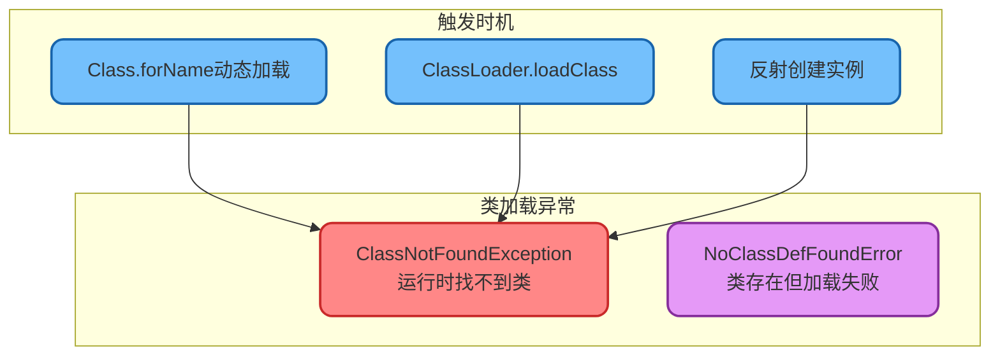
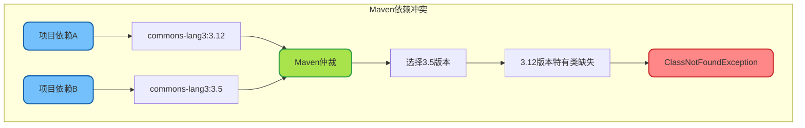
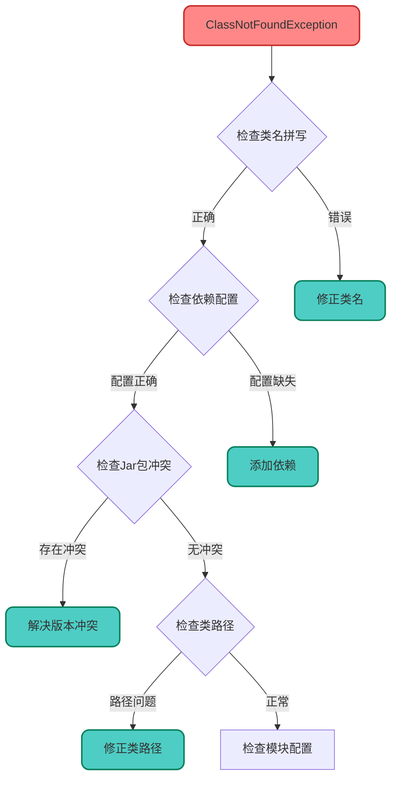

# ClassNotFoundException异常分析

## 异常概述

`ClassNotFoundException`是一个受检异常（Checked Exception），当Java在运行时尝试加载类但找不到类定义时抛出。这个异常通常在编译期不会被发现，因为它涉及运行时的动态类加载。



## 常见触发场景

### 场景一：动态加载类

```java
/**
 * 动态类加载导致的ClassNotFoundException
 */
public class DynamicLoadDemo {
    
    public static void main(String[] args) {
        // 场景1：Class.forName加载不存在的类
        try {
            Class<?> clazz = Class.forName("com.example.NonExistentClass");
        } catch (ClassNotFoundException e) {
            System.out.println("类未找到: " + e.getMessage());
        }
        
        // 场景2：从配置文件读取类名加载
        String className = loadFromConfig("driver.class");
        try {
            Class<?> driverClass = Class.forName(className);
            Object driver = driverClass.getDeclaredConstructor().newInstance();
        } catch (ClassNotFoundException e) {
            System.out.println("配置的驱动类不存在: " + className);
        } catch (Exception e) {
            System.out.println("实例化失败: " + e.getMessage());
        }
    }
    
    private static String loadFromConfig(String key) {
        // 模拟从配置文件读取
        return "com.mysql.cj.jdbc.Driver";
    }
}
```

### 场景二：反射机制

```java
/**
 * 反射操作导致的ClassNotFoundException
 */
public class ReflectionDemo {
    
    /**
     * 通用服务加载器
     */
    public Object loadService(String className) {
        try {
            // 动态加载服务类
            Class<?> serviceClass = Class.forName(className);
            return serviceClass.getDeclaredConstructor().newInstance();
        } catch (ClassNotFoundException e) {
            throw new RuntimeException("服务类不存在: " + className, e);
        } catch (ReflectiveOperationException e) {
            throw new RuntimeException("服务实例化失败: " + className, e);
        }
    }
    
    /**
     * 根据策略名称加载处理器
     */
    public void executeStrategy(String strategyName) {
        String className = "com.example.strategy." + strategyName + "Strategy";
        try {
            Class<?> strategyClass = Class.forName(className);
            // 执行策略...
        } catch (ClassNotFoundException e) {
            throw new IllegalArgumentException("不支持的策略: " + strategyName);
        }
    }
}
```

### 场景三：ClassLoader加载

```java
/**
 * 使用ClassLoader加载类
 */
public class ClassLoaderDemo {
    
    public static void main(String[] args) {
        // 获取系统类加载器
        ClassLoader classLoader = ClassLoader.getSystemClassLoader();
        
        try {
            // loadClass不会初始化类
            Class<?> clazz = classLoader.loadClass("com.example.MyService");
            System.out.println("类加载成功: " + clazz.getName());
        } catch (ClassNotFoundException e) {
            System.out.println("类加载失败: " + e.getMessage());
        }
        
        // 自定义类加载器场景
        try {
            CustomClassLoader customLoader = new CustomClassLoader("./plugins/");
            Class<?> pluginClass = customLoader.loadClass("com.plugin.AdvancedFeature");
        } catch (ClassNotFoundException e) {
            System.out.println("插件类未找到");
        }
    }
    
    // 简化的自定义类加载器
    static class CustomClassLoader extends ClassLoader {
        private String basePath;
        
        public CustomClassLoader(String basePath) {
            this.basePath = basePath;
        }
        
        @Override
        protected Class<?> findClass(String name) throws ClassNotFoundException {
            // 自定义加载逻辑...
            throw new ClassNotFoundException("Class not found: " + name);
        }
    }
}
```

## Jar包冲突导致的问题

### 问题分析



### 排查与解决

```java
/**
 * Jar包冲突排查工具类
 */
public class ClasspathDiagnostic {
    
    /**
     * 查找类所在的Jar包
     */
    public static void findClassLocation(String className) {
        try {
            Class<?> clazz = Class.forName(className);
            CodeSource codeSource = clazz.getProtectionDomain().getCodeSource();
            
            if (codeSource != null) {
                System.out.println("类: " + className);
                System.out.println("位置: " + codeSource.getLocation());
            } else {
                System.out.println("类位置未知（可能是JDK内置类）");
            }
        } catch (ClassNotFoundException e) {
            System.out.println("类未找到: " + className);
        }
    }
    
    /**
     * 列出类路径中的所有Jar
     */
    public static void printClasspath() {
        String classpath = System.getProperty("java.class.path");
        String[] paths = classpath.split(File.pathSeparator);
        
        System.out.println("类路径中的Jar包:");
        for (String path : paths) {
            System.out.println("  " + path);
        }
    }
    
    /**
     * 检查类是否可以加载
     */
    public static boolean canLoadClass(String className) {
        try {
            Class.forName(className, false, 
                Thread.currentThread().getContextClassLoader());
            return true;
        } catch (ClassNotFoundException e) {
            return false;
        }
    }
    
    public static void main(String[] args) {
        // 诊断常见类
        findClassLocation("org.apache.commons.lang3.StringUtils");
        System.out.println();
        printClasspath();
    }
}
```

**Maven排查命令：**

```bash
# 查看依赖树
mvn dependency:tree

# 分析依赖冲突
mvn dependency:analyze

# 查看特定包的依赖来源
mvn dependency:tree -Dincludes=commons-lang3
```

## 模块化系统问题（Java 9+）

### 模块可见性导致的异常

```java
/**
 * Java 9模块化导致的类访问问题
 */
public class ModuleAccessDemo {
    
    /**
     * 模块未导出包时的处理
     */
    public void accessInternalClass() {
        try {
            // 尝试访问JDK内部类（Java 9+可能失败）
            Class<?> unsafeClass = Class.forName("sun.misc.Unsafe");
            System.out.println("成功加载: " + unsafeClass);
        } catch (ClassNotFoundException e) {
            System.out.println("类未找到或模块未开放");
        }
    }
    
    /**
     * 正确的模块访问方式
     */
    public void correctModuleAccess() {
        // 使用公开API代替内部类
        // 或在启动参数中添加: --add-opens java.base/sun.misc=ALL-UNNAMED
    }
}
```

### module-info.java配置

```java
// 模块声明示例
module com.example.myapp {
    // 声明依赖的模块
    requires java.sql;
    requires com.example.common;
    
    // 导出包供其他模块使用
    exports com.example.myapp.api;
    
    // 开放包供反射访问
    opens com.example.myapp.model;
}
```

## 类路径动态变化

### 运行时类路径问题

```java
/**
 * 热部署场景下的类加载问题
 */
public class HotDeployDemo {
    
    private Map<String, Class<?>> loadedClasses = new ConcurrentHashMap<>();
    
    /**
     * 动态加载更新后的类
     */
    public void reloadClass(String className, byte[] classBytes) {
        try {
            // 创建新的类加载器
            CustomClassLoader loader = new CustomClassLoader();
            Class<?> newClass = loader.defineClass(className, classBytes);
            loadedClasses.put(className, newClass);
            System.out.println("类重新加载成功: " + className);
        } catch (Exception e) {
            System.out.println("类重载失败: " + e.getMessage());
        }
    }
    
    /**
     * 获取最新的类定义
     */
    public Class<?> getClass(String className) throws ClassNotFoundException {
        Class<?> clazz = loadedClasses.get(className);
        if (clazz == null) {
            clazz = Class.forName(className);
        }
        return clazz;
    }
    
    static class CustomClassLoader extends ClassLoader {
        public Class<?> defineClass(String name, byte[] bytes) {
            return defineClass(name, bytes, 0, bytes.length);
        }
    }
}
```

## 解决方案汇总

### 问题排查流程



### 常见解决方案

| 问题类型 | 解决方案 |
|---------|---------|
| 依赖缺失 | 添加对应的Maven/Gradle依赖 |
| 版本冲突 | 使用dependencyManagement统一版本 |
| 类名错误 | 检查全限定类名是否正确 |
| 模块问题 | 添加requires或--add-opens参数 |
| 类路径问题 | 检查打包配置和运行参数 |

### 最佳实践代码

```java
/**
 * 安全的类加载工具类
 */
public class SafeClassLoader {
    
    private static final Logger log = LoggerFactory.getLogger(SafeClassLoader.class);
    
    /**
     * 安全加载类，失败时返回Optional.empty()
     */
    public static Optional<Class<?>> loadClass(String className) {
        try {
            return Optional.of(Class.forName(className));
        } catch (ClassNotFoundException e) {
            log.warn("类加载失败: {}", className, e);
            return Optional.empty();
        }
    }
    
    /**
     * 加载类并创建实例
     */
    @SuppressWarnings("unchecked")
    public static <T> Optional<T> createInstance(String className, Class<T> expectedType) {
        return loadClass(className)
            .filter(expectedType::isAssignableFrom)
            .map(clazz -> {
                try {
                    return (T) clazz.getDeclaredConstructor().newInstance();
                } catch (Exception e) {
                    log.error("实例创建失败: {}", className, e);
                    return null;
                }
            });
    }
    
    /**
     * 检查类是否存在
     */
    public static boolean classExists(String className) {
        try {
            Class.forName(className, false, 
                Thread.currentThread().getContextClassLoader());
            return true;
        } catch (ClassNotFoundException e) {
            return false;
        }
    }
}

// 使用示例
public class ServiceFactory {
    
    public PaymentService createPaymentService(String type) {
        String className = "com.example.payment." + type + "PaymentService";
        
        return SafeClassLoader.createInstance(className, PaymentService.class)
            .orElseGet(() -> {
                log.warn("使用默认支付服务，类型 {} 不可用", type);
                return new DefaultPaymentService();
            });
    }
}
```

掌握ClassNotFoundException的排查方法，能够快速定位和解决运行时类加载问题，提升系统的稳定性。