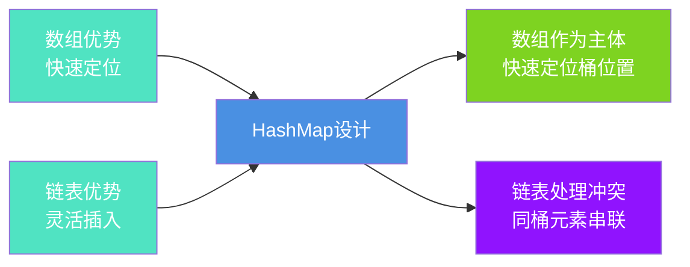
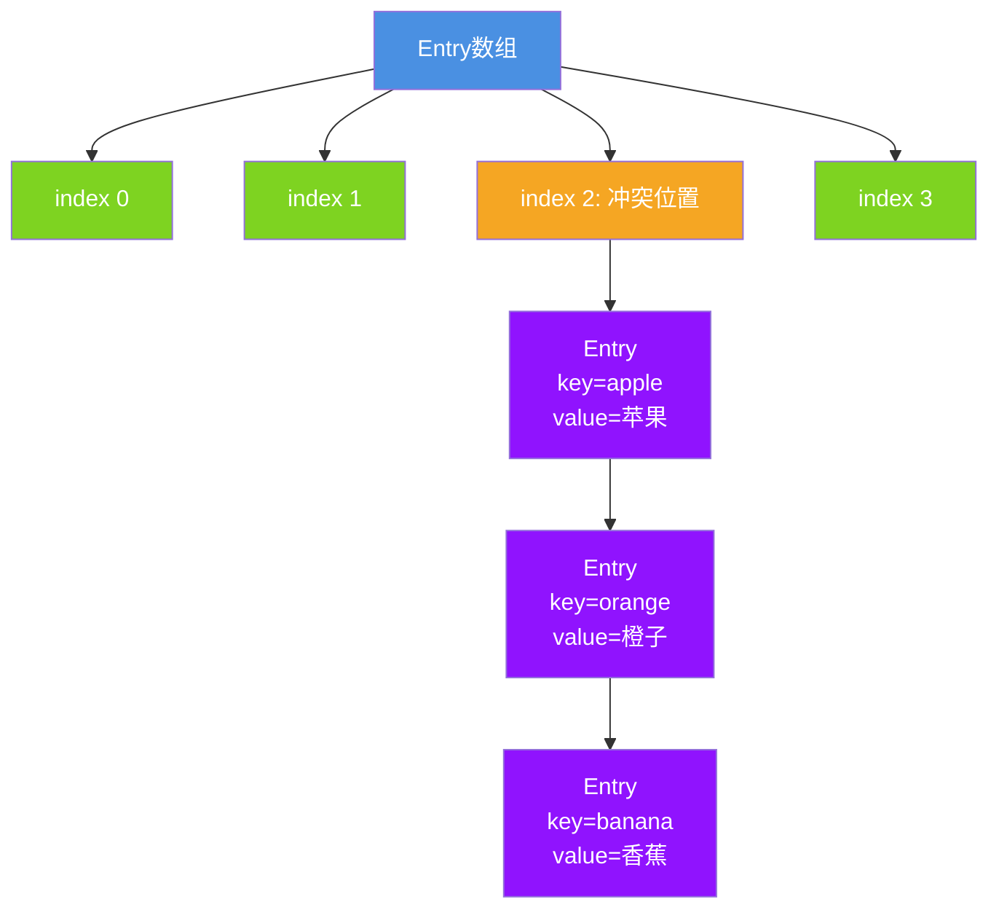
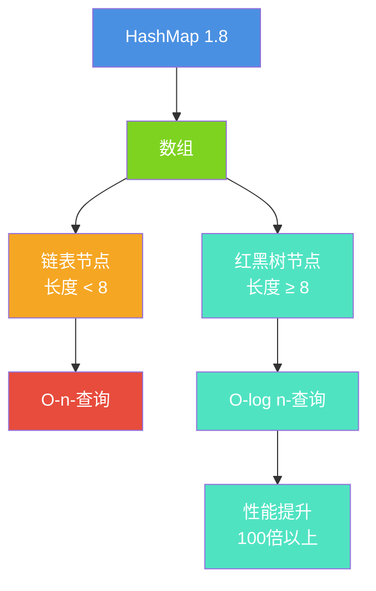
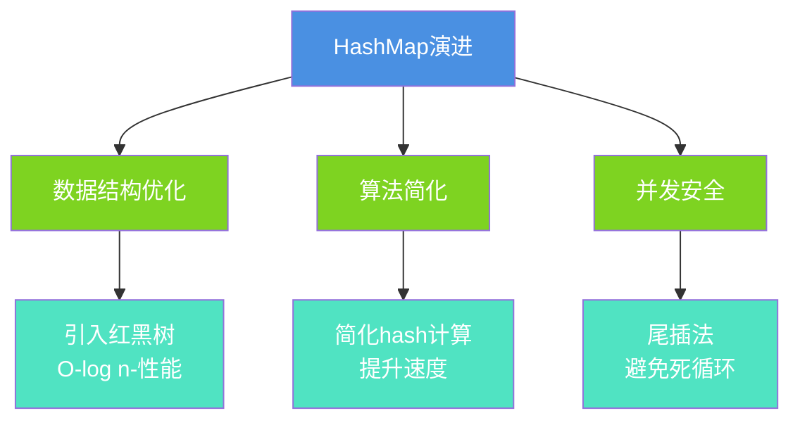

# HashMap核心原理与数据结构

## 引言

HashMap是Java中使用最广泛的集合类之一,深入理解其内部实现原理,对于编写高性能代码至关重要。本文将详细解析HashMap的核心原理、数据结构演进以及JDK版本间的重要变化。

## 基础数据结构分析

### 数组与链表的特性对比

在Java中,最基础的两种数据结构是数组和链表,它们各有优劣:

**数组的特性:**
- ✅ 优势: 通过索引可以O(1)时间直接访问元素
- ❌ 劣势: 插入和删除需要移动元素,时间复杂度O(n)

**链表的特性:**
- ✅ 优势: 插入和删除只需调整指针,时间复杂度O(1)
- ❌ 劣势: 查找需要遍历,时间复杂度O(n)

### HashMap的设计思想

HashMap巧妙地将数组和链表结合,发挥各自优势:



## JDK 1.7的实现方案

### 数组+链表结构

JDK 1.7采用经典的"拉链法"实现,结构相对简单:



### Entry节点结构

```java
// JDK 1.7的Entry节点
static class Entry<K,V> implements Map.Entry<K,V> {
    final K key;           // 键
    V value;              // 值
    Entry<K,V> next;      // 下一个节点
    int hash;             // hash值(可变)
    
    Entry(int h, K k, V v, Entry<K,V> n) {
        value = v;
        next = n;
        key = k;
        hash = h;
    }
}
```

### 存在的问题

1. **性能问题**: 链表过长时查询效率降低至O(n)
2. **并发问题**: 头插法在并发环境可能形成环形链表
3. **扩容开销**: 需要逐个节点重新计算hash

## JDK 1.8的重大革新

### 引入红黑树优化

JDK 1.8在链表基础上引入了红黑树,解决长链表性能问题:



### 树化阈值设计

```java
// HashMap中的常量定义
static final int TREEIFY_THRESHOLD = 8;      // 链表转树阈值
static final int UNTREEIFY_THRESHOLD = 6;    // 树退化为链表阈值
static final int MIN_TREEIFY_CAPACITY = 64;  // 最小树化容量

// 为什么是这些值?
// - 8: 根据泊松分布,链表长度达到8的概率极低
// - 6: 避免频繁树化和退化,保留缓冲区间
// - 64: 容量小时优先扩容,减少冲突
```

### Node节点升级

```java
// JDK 1.8的Node节点
static class Node<K,V> implements Map.Entry<K,V> {
    final int hash;        // hash值(不可变)
    final K key;          // 键(不可变)
    V value;              // 值
    Node<K,V> next;       // 下一个节点
    
    Node(int hash, K key, V value, Node<K,V> next) {
        this.hash = hash;
        this.key = key;
        this.value = value;
        this.next = next;
    }
}

// 红黑树节点
static final class TreeNode<K,V> extends LinkedHashMap.Entry<K,V> {
    TreeNode<K,V> parent;   // 父节点
    TreeNode<K,V> left;     // 左子节点
    TreeNode<K,V> right;    // 右子节点
    TreeNode<K,V> prev;     // 前驱(用于删除)
    boolean red;            // 颜色标记
}
```

## 版本差异全面对比

| 特性维度 | JDK 1.7 | JDK 1.8 |
|---------|---------|---------|
| **核心结构** | 数组+链表 | 数组+链表+红黑树 |
| **节点类型** | Entry | Node/TreeNode |
| **插入方式** | 头插法 | 尾插法 |
| **hash计算** | 4次扰动 | 1次扰动 |
| **扩容策略** | 全量rehash | 高低位分离 |
| **并发安全** | 可能死循环 | 避免死循环 |
| **查询复杂度** | O(n) | O(log n) |

### 头插法改为尾插法

这是解决并发死循环的关键改进:

```java
// JDK 1.7: 头插法(有风险)
void transfer(Entry[] newTable) {
    // ...
    do {
        Entry<K,V> next = e.next;
        e.next = newTable[i];  // 新节点作为头部
        newTable[i] = e;
        e = next;
    } while (e != null);
}

// JDK 1.8: 尾插法(安全)
Node<K,V> loHead = null, loTail = null;
do {
    next = e.next;
    if ((e.hash & oldCap) == 0) {
        if (loTail == null)
            loHead = e;
        else
            loTail.next = e;  // 添加到尾部
        loTail = e;
    }
} while ((e = next) != null);
```

### hash算法简化

```java
// JDK 1.7: 复杂扰动
final int hash(Object k) {
    int h = hashSeed;
    h ^= k.hashCode();
    h ^= (h >>> 20) ^ (h >>> 12);
    return h ^ (h >>> 7) ^ (h >>> 4);
}

// JDK 1.8: 简化扰动
static final int hash(Object key) {
    int h;
    return (key == null) ? 0 : (h = key.hashCode()) ^ (h >>> 16);
}
```

**简化原因:**
1. 红黑树的引入降低了对hash质量的依赖
2. 减少位运算次数,提升性能
3. 现代hashCode实现已足够优秀

## 实际应用示例

### 商品分类系统

```java
// 示例:电商商品管理
public class ProductManager {
    // JDK 1.8自动选择合适的数据结构
    private Map<String, List<Product>> categoryMap = new HashMap<>();
    
    public void addProduct(String category, Product product) {
        categoryMap.computeIfAbsent(category, k -> new ArrayList<>())
                  .add(product);
        
        // 当某分类下商品很多时:
        // - 链表长度 &lt; 8: 保持链表
        // - 链表长度 ≥ 8 且容量 ≥ 64: 自动转红黑树
        // - 查询效率大幅提升
    }
    
    public List<Product> getProductsByCategory(String category) {
        return categoryMap.getOrDefault(category, Collections.emptyList());
    }
    
    static class Product {
        private String id;
        private String name;
        private double price;
        
        public Product(String id, String name, double price) {
            this.id = id;
            this.name = name;
            this.price = price;
        }
    }
}
```

### 性能对比测试

```java
// 示例:链表vs红黑树性能对比
public class PerformanceTest {
    
    public static void main(String[] args) {
        testLongChain();
    }
    
    static void testLongChain() {
        Map<BadHashKey, String> map = new HashMap<>();
        
        // 使用相同hash强制冲突
        int count = 1000;
        
        long start = System.currentTimeMillis();
        for (int i = 0; i < count; i++) {
            map.put(new BadHashKey(i), "value" + i);
        }
        long putTime = System.currentTimeMillis() - start;
        
        start = System.currentTimeMillis();
        for (int i = 0; i < count; i++) {
            map.get(new BadHashKey(i));
        }
        long getTime = System.currentTimeMillis() - start;
        
        System.out.println("插入耗时: " + putTime + "ms");
        System.out.println("查询耗时: " + getTime + "ms");
        System.out.println("在JDK 1.7中链表查询会很慢");
        System.out.println("在JDK 1.8中红黑树大幅提升性能");
    }
    
    // 故意设计相同hash的key
    static class BadHashKey {
        private int value;
        
        BadHashKey(int value) {
            this.value = value;
        }
        
        @Override
        public int hashCode() {
            return 1;  // 所有实例hash相同
        }
        
        @Override
        public boolean equals(Object obj) {
            if (!(obj instanceof BadHashKey)) return false;
            return this.value == ((BadHashKey) obj).value;
        }
    }
}
```

## 总结

HashMap的演进体现了Java对性能的不断追求:

### 核心改进



### 使用建议

1. **优先使用JDK 1.8+**: 性能和安全性都有提升
2. **理解内部机制**: 合理设置初始容量
3. **避免hash冲突**: 正确实现hashCode方法
4. **单线程场景**: HashMap性能最优
5. **多线程场景**: 使用ConcurrentHashMap

理解HashMap的核心原理,是Java开发者的必修课,也是高性能编程的基础。
