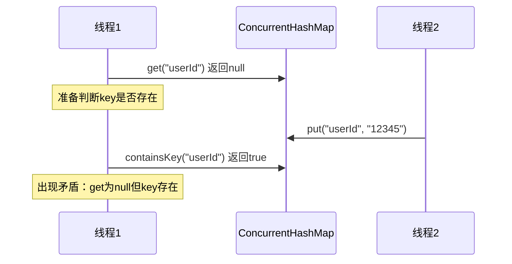

import PaidCTA from '@site/src/components/PaidCTA';

## null值的禁止与二义性问题

### 问题的本质

ConcurrentHashMap明确拒绝null作为key或value，这与HashMap的宽松策略形成鲜明对比。根本原因在于**多线程环境下的二义性**。

### 二义性的产生

当调用`get(key)`返回null时，存在两种可能：

1. 该key确实不存在于Map中
2. 该key存在，但其value被设置为null

```java
// HashMap的单线程场景
HashMap<String, String> map = new HashMap<>();
map.put("config", null);  // 允许null值

String result = map.get("config");  // 返回null
if (map.containsKey("config")) {
    // 可以通过containsKey区分两种情况
    System.out.println("key存在，值为null");
} else {
    System.out.println("key不存在");
}
```

### 多线程下的困境

在并发环境中，这种判断机制失效：

```java
ConcurrentHashMap<String, String> concurrentMap = new ConcurrentHashMap<>();

// 线程1
String value = concurrentMap.get("userId");
if (value == null) {
    // 此时准备调用containsKey判断
    
    // 但线程2可能在此刻插入了数据
    // concurrentMap.put("userId", "12345");
    
    boolean exists = concurrentMap.containsKey("userId");
    // exists的结果已不可靠，状态已发生变化
}
```

**时序图展示**



### Doug Lea的官方解释

ConcurrentHashMap的作者Doug Lea曾明确说明：

> The main reason that nulls aren't allowed in ConcurrentMaps (ConcurrentHashMaps, ConcurrentSkipListMaps) is that ambiguities that may be just barely tolerable in non-concurrent maps can't be accommodated. The main one is that if `map.get(key)` returns `null`, you can't detect whether the key explicitly maps to `null` vs the key isn't mapped.

翻译要点：
- 非并发Map中的歧义勉强可以容忍（通过containsKey）
- 并发Map中，Map状态可能在两次调用间改变，无法容忍歧义

### 替代方案：特殊标记对象

如果业务确需表示"空值"，可使用占位符：


<PaidCTA />