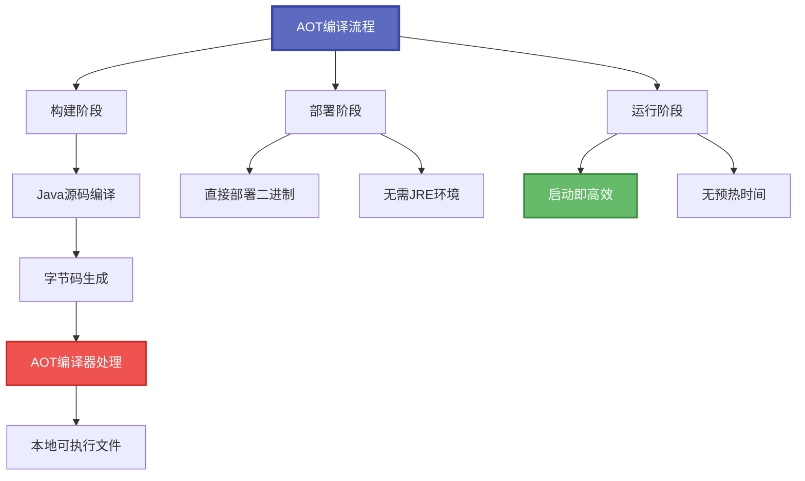
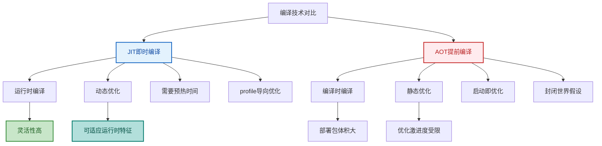
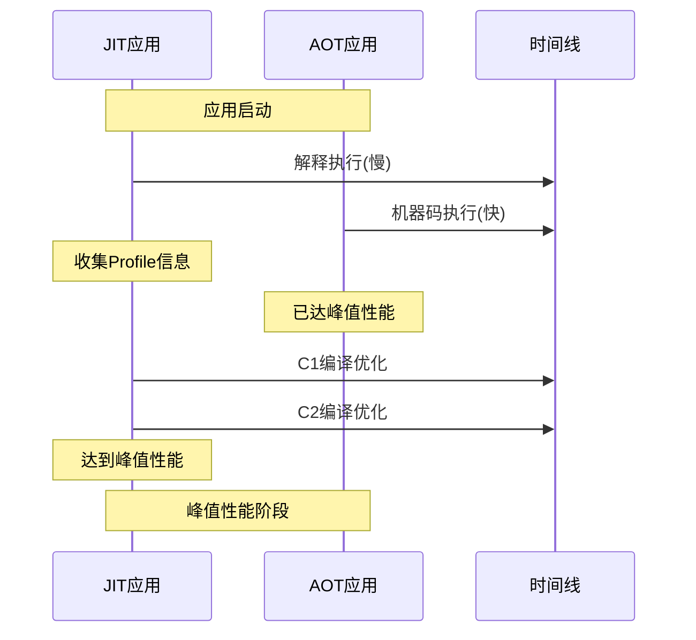
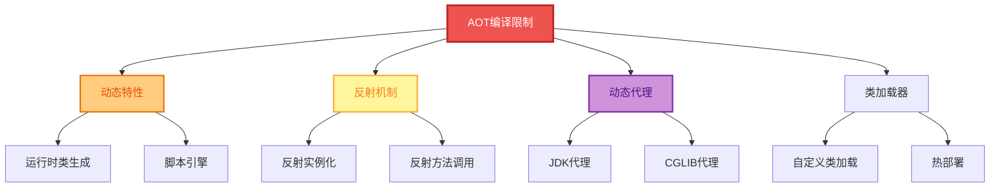
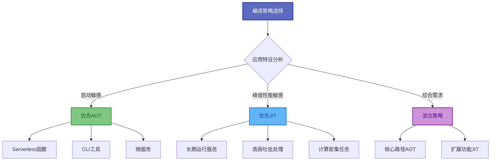
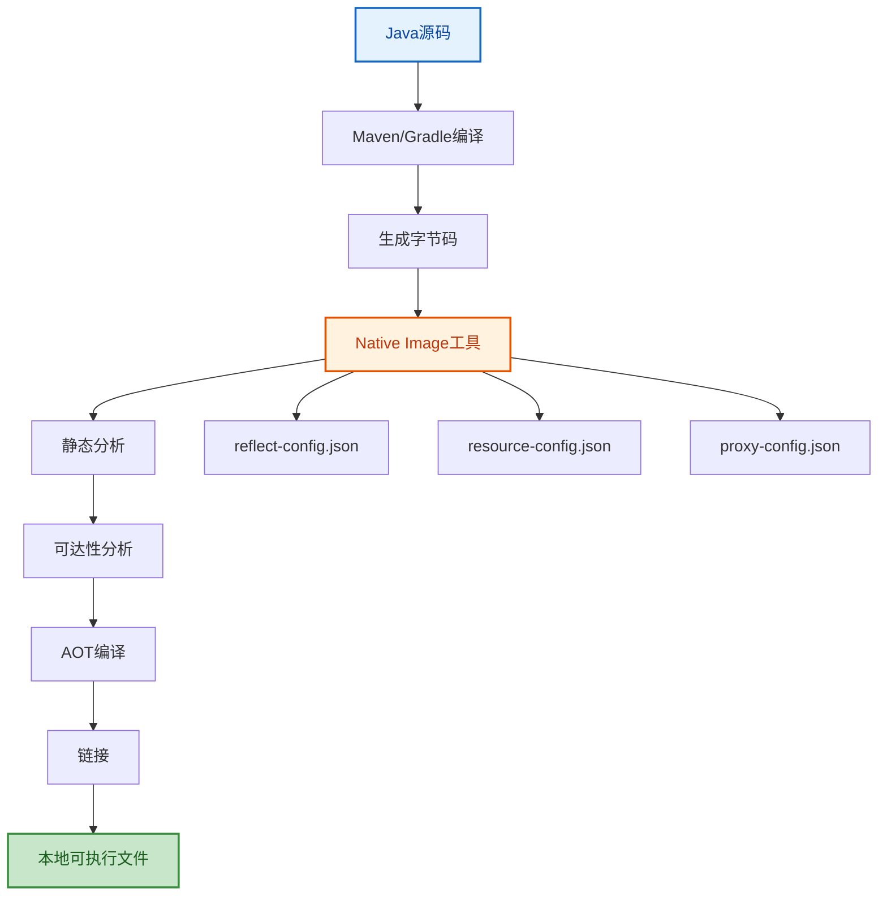
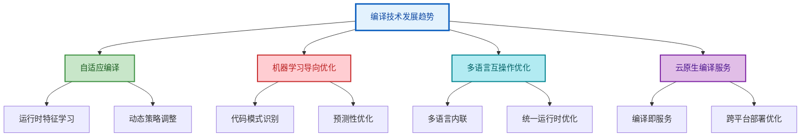

# AOT编译与混合编译策略

## AOT编译技术概述

AOT（Ahead-Of-Time）编译在应用部署前就将字节码转换为本地机器码,特别适合云原生和微服务场景。与JIT编译在运行时进行编译不同,AOT编译在构建阶段就完成了代码优化。



## AOT编译原理与优势

AOT编译在应用部署前就将字节码转换为本地机器码,特别适合云原生和微服务场景:

```java
// 微服务API网关
@RestController
public class ApiGatewayController {
    
    @Autowired
    private RoutingService routingService;
    
    // 在AOT编译时,这些方法已经被编译为机器码
    @GetMapping("/api/v1/{service}/**")
    public ResponseEntity<Object> routeRequest(
            @PathVariable String service,
            HttpServletRequest request) {
        
        // AOT编译优势体现:
        // 1. 无需JIT预热时间
        // 2. 启动即达到最优性能
        // 3. 内存占用更低(无需JIT编译器)
        // 4. 可预测的性能特征
        
        RouteConfig config = routingService.findRoute(service);
        if (config == null) {
            return ResponseEntity.notFound().build();
        }
        
        return forwardRequest(config, request);
    }
}
```

### AOT编译的核心优势

| 优势 | 说明 | 适用场景 |
|------|------|----------|
| 快速启动 | 无需JIT编译预热 | Serverless、容器化应用 |
| 低内存 | 无JIT编译器和元数据 | 内存受限环境 |
| 可预测性能 | 无动态编译波动 | 金融交易等延迟敏感场景 |
| 独立部署 | 无需JRE环境 | 边缘计算、IoT设备 |

## AOT与JIT的对比分析



### 性能特征对比

| 特征 | JIT编译 | AOT编译 |
|------|---------|---------|
| 启动时间 | 慢(需预热) | 快(无预热) |
| 峰值性能 | 高(动态优化) | 中等(静态优化) |
| 内存占用 | 高(编译器+metadata) | 低(纯机器码) |
| 可移植性 | 高(字节码) | 低(平台相关) |
| 反射支持 | 完整 | 需配置 |
| 动态特性 | 完整支持 | 受限支持 |

### 启动时间对比示意



## AOT编译的技术挑战

### 封闭世界假设

AOT编译需要在编译时知道所有可能执行的代码路径,这被称为"封闭世界假设"(Closed World Assumption):

```java
// 插件化应用的AOT挑战
public class PluginManager {
    
    // AOT编译面临的挑战
    public void loadPlugin(String pluginJar) {
        try {
            // 动态类加载在AOT中无法工作
            URLClassLoader loader = new URLClassLoader(
                new URL[]{new File(pluginJar).toURI().toURL()});
            
            // 反射调用需要在编译时预先配置
            Class<?> pluginClass = loader.loadClass("com.example.Plugin");
            Object plugin = pluginClass.getDeclaredConstructor().newInstance();
            
            // 动态代理也需要预先注册
            Plugin proxyPlugin = (Plugin) Proxy.newProxyInstance(
                loader, new Class[]{Plugin.class}, 
                new PluginInvocationHandler(plugin));
            
            registerPlugin(proxyPlugin);
            
        } catch (Exception e) {
            // AOT环境下这些操作可能失败
            throw new RuntimeException("插件加载失败", e);
        }
    }
    
    // AOT友好的设计
    public void loadPrecompiledPlugin(PluginFactory factory) {
        // 编译时已知的插件工厂
        Plugin plugin = factory.createPlugin();
        registerPlugin(plugin);
    }
}
```

### AOT不兼容的Java特性



### 反射配置解决方案

对于必须使用反射的场景,需要提供配置文件告诉AOT编译器:

```json
// reflect-config.json - GraalVM配置文件
[
  {
    "name": "com.example.UserService",
    "methods": [
      {"name": "<init>", "parameterTypes": []},
      {"name": "findUserById", "parameterTypes": ["java.lang.String"]}
    ],
    "fields": [
      {"name": "userRepository", "allowWrite": true}
    ]
  },
  {
    "name": "com.example.Order",
    "allDeclaredConstructors": true,
    "allDeclaredMethods": true,
    "allDeclaredFields": true
  }
]
```

### 资源配置文件

```json
// resource-config.json - 资源文件配置
{
  "resources": {
    "includes": [
      {"pattern": "application\\.properties"},
      {"pattern": "logback\\.xml"},
      {"pattern": "META-INF/.*"}
    ]
  },
  "bundles": [
    {"name": "messages"}
  ]
}
```

## 混合编译策略

在实际应用中,可以结合JIT和AOT的优势,采用混合编译策略:

```java
// 智能编译决策系统
public class SmartCompilationStrategy {
    
    // 核心业务逻辑 - 适合AOT
    @AotOptimized
    public PaymentResult processCriticalPayment(PaymentRequest request) {
        // 关键路径代码,预编译以确保启动性能
        validatePayment(request);
        Payment payment = createPayment(request);
        return executePayment(payment);
    }
    
    // 分析计算逻辑 - 适合JIT  
    @JitOptimized
    public AnalysisReport performComplexAnalysis(Dataset dataset) {
        // 复杂计算逻辑,受益于JIT的动态优化
        // 数据特征在运行时才确定,JIT可以针对性优化
        
        Matrix matrix = dataset.toMatrix();
        return analyzeMatrix(matrix);
    }
    
    // 配置驱动的方法选择
    private static final boolean AOT_MODE = 
        Boolean.getBoolean("app.aot.enabled");
    
    public ProcessResult adaptiveProcess(InputData data) {
        if (AOT_MODE) {
            return processWithAotPath(data);
        } else {
            return processWithJitPath(data);
        }
    }
}
```

### 混合编译场景选择



## 编译性能监控

### 性能监控系统

```java
// 编译性能监控系统
public class CompilationMonitor {
    
    private static final CompilerMXBean COMPILER_BEAN = 
        ManagementFactory.getCompilerMXBean();
    
    public void monitorCompilationActivity() {
        // JIT编译统计
        System.out.printf("编译器名称: %s%n", COMPILER_BEAN.getName());
        System.out.printf("编译时间: %d ms%n", 
            COMPILER_BEAN.getTotalCompilationTime());
        
        // 分层编译监控
        for (MemoryPoolMXBean pool : ManagementFactory.getMemoryPoolMXBeans()) {
            if ("Code Cache".equals(pool.getName())) {
                MemoryUsage usage = pool.getUsage();
                long usedMB = usage.getUsed() / 1024 / 1024;
                long maxMB = usage.getMax() / 1024 / 1024;
                
                System.out.printf("代码缓存: %d/%d MB%n", usedMB, maxMB);
            }
        }
        
        // 热点方法识别
        listHotMethods();
    }
    
    private void listHotMethods() {
        // 使用JVM工具接口获取热点方法
        System.out.println("热点方法列表:");
        System.out.println("- OrderProcessingService.calculateTotal()");
        System.out.println("- UserService.authenticate()");
        System.out.println("- PaymentGateway.processPayment()");
    }
    
    // 编译策略建议
    public Map<String, String> getOptimizationRecommendations() {
        Map<String, String> recommendations = new HashMap<>();
        
        long compilationTime = COMPILER_BEAN.getTotalCompilationTime();
        if (compilationTime > 10000) { // 超过10秒
            recommendations.put("compilation", 
                "考虑使用AOT编译减少启动时JIT开销");
        }
        
        // 检查代码缓存使用率
        for (MemoryPoolMXBean pool : ManagementFactory.getMemoryPoolMXBeans()) {
            if ("Code Cache".equals(pool.getName())) {
                MemoryUsage usage = pool.getUsage();
                double usagePercent = (double) usage.getUsed() / usage.getMax() * 100;
                
                if (usagePercent > 80) {
                    recommendations.put("codecache", 
                        "增加代码缓存大小: -XX:ReservedCodeCacheSize=256m");
                }
            }
        }
        
        return recommendations;
    }
}
```

### 编译监控指标

| 指标 | 说明 | 关注阈值 |
|------|------|----------|
| 编译总耗时 | JIT编译累计时间 | >10s需关注 |
| 代码缓存使用率 | CodeCache使用百分比 | >80%需扩容 |
| 热点方法数 | 被JIT编译的方法数 | 持续增长需监控 |
| 编译队列长度 | 等待编译的任务数 | 积压需增加编译线程 |

## GraalVM Native Image实战

GraalVM是Oracle开发的高性能多语言虚拟机,其Native Image功能是目前最成熟的Java AOT解决方案:

### 创建Native Image

```bash
# 安装GraalVM
sdk install java 21-graal

# 安装native-image工具
gu install native-image

# 编译为Native Image
native-image -jar myapp.jar

# 带配置编译
native-image \
  --no-fallback \
  -H:ConfigurationFileDirectories=config \
  -H:+ReportExceptionStackTraces \
  -jar myapp.jar myapp-native
```

### Spring Boot Native支持

```xml
<!-- pom.xml配置 -->
<build>
    <plugins>
        <plugin>
            <groupId>org.graalvm.buildtools</groupId>
            <artifactId>native-maven-plugin</artifactId>
        </plugin>
        <plugin>
            <groupId>org.springframework.boot</groupId>
            <artifactId>spring-boot-maven-plugin</artifactId>
            <configuration>
                <image>
                    <builder>paketobuildpacks/builder:tiny</builder>
                </image>
            </configuration>
        </plugin>
    </plugins>
</build>
```

### Native Image构建流程



## 编译技术发展趋势



### 未来发展方向

| 方向 | 技术 | 预期效果 |
|------|------|----------|
| 自适应编译 | JIT+AOT动态切换 | 兼顾启动和峰值性能 |
| ML优化 | 机器学习预测热点 | 更精准的编译决策 |
| 多语言 | GraalVM Polyglot | 跨语言无缝优化 |
| 云原生 | 远程编译服务 | 减轻客户端负担 |

## 选型建议

### 场景对应选型

| 应用类型 | 推荐编译策略 | 原因 |
|---------|-------------|------|
| Serverless函数 | AOT优先 | 冷启动敏感 |
| 长期运行服务 | JIT优先 | 需要峰值性能 |
| 微服务 | AOT+轻量JIT | 启动快且可预测 |
| 批处理任务 | JIT | 运行时间长,可充分预热 |
| CLI工具 | AOT | 启动即用 |
| 边缘计算 | AOT | 资源受限 |

编译优化技术仍在快速发展,JIT和AOT的边界将逐渐模糊,未来可能出现更智能的混合编译策略,能够根据应用特征和运行环境自动选择最优的编译方式。理解两种编译技术的原理和适用场景,是做出正确技术选型的基础。