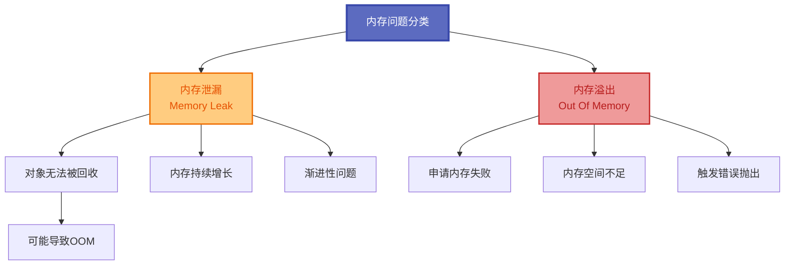
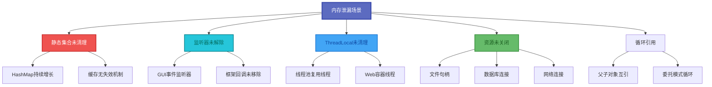
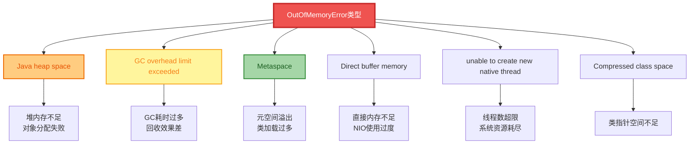
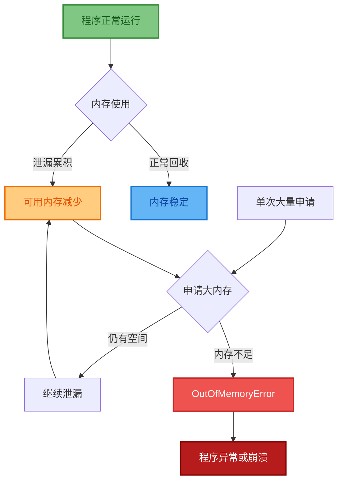
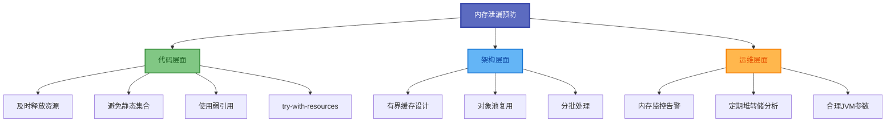

# 内存泄漏与内存溢出

## 内存异常的本质理解

在Java应用开发中,内存相关的问题往往是最具挑战性的。内存泄漏和内存溢出是两种不同但相关的内存问题,理解它们的区别和联系是解决内存问题的基础。



## 内存泄漏深度剖析

### 什么是内存泄漏

内存泄漏指程序中已经不需要的对象无法被垃圾回收器正常回收,导致内存使用量持续增长的现象。

```java
// 客户关系管理系统内存泄漏案例
public class CustomerManagementService {
    
    // 问题1: 静态集合导致的内存泄漏
    private static final Map<String, Customer> customerCache = new HashMap<>();
    private static final List<EventListener> eventListeners = new ArrayList<>();
    
    public void registerCustomer(Customer customer) {
        // 客户信息被添加到静态缓存中
        customerCache.put(customer.getId(), customer);
        
        // 问题: 客户对象永远不会被移除,即使业务上不再需要
        // 随着客户数量增长,内存使用量持续上升
    }
    
    // 问题2: 事件监听器泄漏
    public void addCustomerEventListener(CustomerEventListener listener) {
        eventListeners.add(listener);
        
        // 问题: 监听器没有移除机制
        // 即使监听器所在的组件被销毁,监听器对象仍被持有
    }
    
    // 问题3: 线程局部变量泄漏  
    private static final ThreadLocal<DatabaseConnection> connectionHolder = 
        new ThreadLocal<>();
    
    public void processCustomerRequest(CustomerRequest request) {
        DatabaseConnection conn = createConnection();
        connectionHolder.set(conn);
        
        try {
            // 处理业务逻辑
            handleRequest(request);
        } finally {
            // 忘记清理ThreadLocal,在线程池环境中会导致泄漏
            // connectionHolder.remove(); // 应该添加这行
        }
    }
}
```

### 内存泄漏的常见场景



### 各场景详细代码示例

**场景1：静态集合泄漏**

```java
public class CacheService {
    // 静态集合导致泄漏
    private static final Map<String, Object> globalCache = new HashMap<>();
    
    public void cacheData(String key, Object value) {
        globalCache.put(key, value);
        // 只有put没有remove,数据越积越多
    }
    
    // 修复方案: 使用有界缓存
    private static final Map<String, Object> boundedCache = 
        new LinkedHashMap<String, Object>(100, 0.75f, true) {
            @Override
            protected boolean removeEldestEntry(Map.Entry<String, Object> eldest) {
                return size() > 100; // 超过100个自动淘汰
            }
        };
}
```

**场景2：监听器泄漏**

```java
public class OrderEventPublisher {
    private final List<OrderEventListener> listeners = new ArrayList<>();
    
    public void addListener(OrderEventListener listener) {
        listeners.add(listener);
    }
    
    // 缺少移除方法,或者调用者忘记调用
    public void removeListener(OrderEventListener listener) {
        listeners.remove(listener);
    }
}

// 修复方案: 使用弱引用
public class SafeEventPublisher {
    private final List<WeakReference<OrderEventListener>> listeners = 
        new CopyOnWriteArrayList<>();
    
    public void addListener(OrderEventListener listener) {
        listeners.add(new WeakReference<>(listener));
    }
    
    public void fireEvent(OrderEvent event) {
        listeners.removeIf(ref -> ref.get() == null);
        for (WeakReference<OrderEventListener> ref : listeners) {
            OrderEventListener listener = ref.get();
            if (listener != null) {
                listener.onEvent(event);
            }
        }
    }
}
```

**场景3：ThreadLocal泄漏**

```java
public class RequestContextHolder {
    private static final ThreadLocal<RequestContext> contextHolder = 
        new ThreadLocal<>();
    
    public static void setContext(RequestContext context) {
        contextHolder.set(context);
    }
    
    public static RequestContext getContext() {
        return contextHolder.get();
    }
    
    // 必须提供清理方法
    public static void clear() {
        contextHolder.remove();
    }
}

// 正确使用方式
public class RequestFilter {
    public void doFilter(Request request, Response response, FilterChain chain) {
        try {
            RequestContextHolder.setContext(new RequestContext(request));
            chain.doFilter(request, response);
        } finally {
            RequestContextHolder.clear(); // 必须清理!
        }
    }
}
```

**场景4：资源未关闭**

```java
public class ResourceLeakExample {
    
    // 错误示例: 资源泄漏
    public String readFile(String path) throws IOException {
        FileInputStream fis = new FileInputStream(path);
        BufferedReader reader = new BufferedReader(new InputStreamReader(fis));
        
        StringBuilder content = new StringBuilder();
        String line;
        while ((line = reader.readLine()) != null) {
            content.append(line);
        }
        // 忘记关闭资源!
        return content.toString();
    }
    
    // 正确示例: 使用try-with-resources
    public String readFileSafely(String path) throws IOException {
        try (FileInputStream fis = new FileInputStream(path);
             BufferedReader reader = new BufferedReader(new InputStreamReader(fis))) {
            
            StringBuilder content = new StringBuilder();
            String line;
            while ((line = reader.readLine()) != null) {
                content.append(line);
            }
            return content.toString();
        } // 自动关闭资源
    }
}
```

## 内存溢出触发机制

### 内存溢出的定义

内存溢出是指程序申请内存时,可用内存空间不足以满足请求的情况:

```java
// 大数据处理系统内存溢出示例
public class BigDataProcessor {
    
    // 堆内存溢出示例
    public void processLargeDataset() {
        try {
            List<DataRecord> records = new ArrayList<>();
            
            // 不断创建大对象,直到堆内存耗尽
            for (int i = 0; i < Integer.MAX_VALUE; i++) {
                // 每个DataRecord包含大量数据(比如100KB)
                DataRecord record = new DataRecord(generateLargeData());
                records.add(record);
                
                // 当堆内存不足时,会抛出OutOfMemoryError: Java heap space
            }
            
        } catch (OutOfMemoryError e) {
            // OOM发生时的处理
            System.err.println("堆内存溢出: " + e.getMessage());
            
            // 尝试释放内存
            System.gc(); // 建议进行垃圾回收
            
            // 记录内存使用情况
            logMemoryUsage();
            
            // 重要: OOM是Error,不是Exception,程序可以继续运行
            handleOOM();
        }
    }
    
    // 栈溢出示例
    public void recursiveCalculation(int depth) {
        try {
            if (depth > 0) {
                // 递归调用导致栈帧持续增加
                recursiveCalculation(depth - 1);
            }
        } catch (StackOverflowError e) {
            // 栈空间耗尽
            System.err.println("栈溢出,递归深度过大: " + depth);
            
            // 栈溢出后需要终止递归
            return;
        }
    }
    
    // 元空间溢出示例(JDK 8+)
    public void dynamicClassGeneration() {
        try {
            ClassGenerator generator = new ClassGenerator();
            
            // 不断动态生成类,直到元空间耗尽
            for (int i = 0; i < 100000; i++) {
                String className = "GeneratedClass" + i;
                Class<?> clazz = generator.generateClass(className);
                
                // 每个类的元数据存储在元空间
                // 当元空间不足时: OutOfMemoryError: Metaspace
            }
            
        } catch (OutOfMemoryError e) {
            if (e.getMessage().contains("Metaspace")) {
                System.err.println("元空间溢出: " + e.getMessage());
                handleMetaspaceOOM();
            }
        }
    }
}
```

### OOM类型分类



### 各类型OOM详解

| OOM类型 | 错误信息 | 常见原因 | 解决方案 |
|---------|----------|----------|----------|
| 堆溢出 | Java heap space | 对象创建过多、内存泄漏 | 增大-Xmx、优化代码 |
| GC开销 | GC overhead limit exceeded | 频繁GC但回收很少 | 排查泄漏、增大堆 |
| 元空间 | Metaspace | 类加载过多、CGLIB代理 | 增大MaxMetaspaceSize |
| 直接内存 | Direct buffer memory | NIO使用不当 | 增大MaxDirectMemorySize |
| 线程 | unable to create new native thread | 线程创建过多 | 使用线程池、调整ulimit |

## 内存泄漏与溢出的关联关系



**关键洞察:**
> 内存泄漏是渐进性的问题,通过持续消耗可用内存最终可能导致内存溢出。内存溢出可能由泄漏引起,也可能由单次大量内存申请引起。

## 内存泄漏检测方法

### 手动检测方法

```java
// 内存使用监控工具类
public class MemoryMonitor {
    
    private static final MemoryMXBean memoryBean = 
        ManagementFactory.getMemoryMXBean();
    
    public static void printMemoryUsage() {
        MemoryUsage heapUsage = memoryBean.getHeapMemoryUsage();
        MemoryUsage nonHeapUsage = memoryBean.getNonHeapMemoryUsage();
        
        System.out.printf("堆内存: %d/%d MB (%.1f%%)%n",
            heapUsage.getUsed() / 1024 / 1024,
            heapUsage.getMax() / 1024 / 1024,
            (double) heapUsage.getUsed() / heapUsage.getMax() * 100);
        
        System.out.printf("非堆内存: %d MB%n",
            nonHeapUsage.getUsed() / 1024 / 1024);
    }
    
    // 内存增长趋势检测
    private static long previousUsage = 0;
    private static int growthCount = 0;
    
    public static boolean detectPotentialLeak() {
        MemoryUsage heapUsage = memoryBean.getHeapMemoryUsage();
        long currentUsage = heapUsage.getUsed();
        
        // 连续多次内存增长可能是泄漏信号
        if (currentUsage > previousUsage) {
            growthCount++;
        } else {
            growthCount = 0;
        }
        
        previousUsage = currentUsage;
        
        // 连续10次采样都在增长,可能存在泄漏
        return growthCount > 10;
    }
}
```

### 检测工具对比

| 工具 | 类型 | 优势 | 适用场景 |
|------|------|------|----------|
| jmap + MAT | 离线分析 | 详细的对象引用分析 | 深度分析 |
| VisualVM | 在线监控 | 可视化、实时监控 | 开发调试 |
| Arthas | 在线诊断 | 无侵入、功能强大 | 生产环境 |
| JProfiler | 商业工具 | 功能全面、易用 | 企业级应用 |

## 内存问题预防策略

### 编码最佳实践

```java
public class MemoryBestPractices {
    
    // 1. 使用弱引用缓存
    private final Map<String, WeakReference<LargeObject>> cache = 
        new WeakHashMap<>();
    
    // 2. 限制集合大小
    private final Queue<LogEntry> logBuffer = new LinkedBlockingQueue<>(1000);
    
    // 3. 及时清理资源
    public void processWithCleanup() {
        List<TempData> tempList = new ArrayList<>();
        try {
            // 处理数据
            processData(tempList);
        } finally {
            tempList.clear(); // 及时清理
        }
    }
    
    // 4. 使用对象池
    private final ObjectPool<ExpensiveObject> objectPool = 
        new GenericObjectPool<>(new ExpensiveObjectFactory());
    
    public void usePooledObject() {
        ExpensiveObject obj = null;
        try {
            obj = objectPool.borrowObject();
            // 使用对象
        } finally {
            if (obj != null) {
                objectPool.returnObject(obj);
            }
        }
    }
    
    // 5. 分批处理大数据
    public void processBigData(List<Record> records) {
        int batchSize = 1000;
        for (int i = 0; i < records.size(); i += batchSize) {
            int end = Math.min(i + batchSize, records.size());
            List<Record> batch = records.subList(i, end);
            
            processBatch(batch);
            
            // 处理完一批后显式建议GC(非必须)
            if (i % 10000 == 0) {
                System.gc();
            }
        }
    }
}
```

### 预防策略总结



理解内存泄漏和内存溢出的区别与联系,是排查和解决Java内存问题的基础。内存泄漏往往是渐进性的,需要通过监控和分析工具及早发现;内存溢出是最终的症状表现,需要结合具体的OOM类型来定位根本原因。预防胜于治疗,良好的编码习惯和架构设计是避免内存问题的关键。