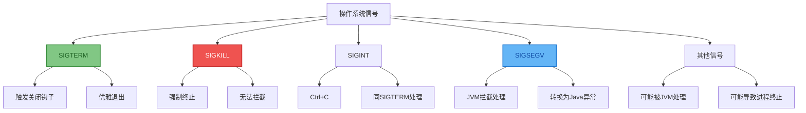
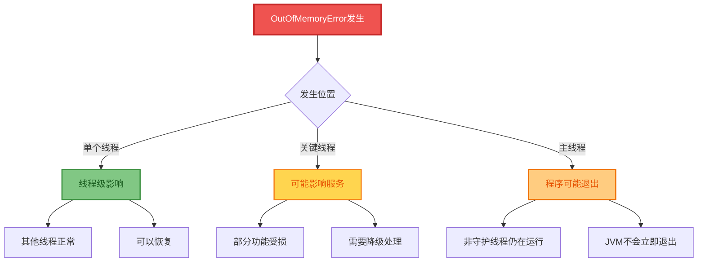
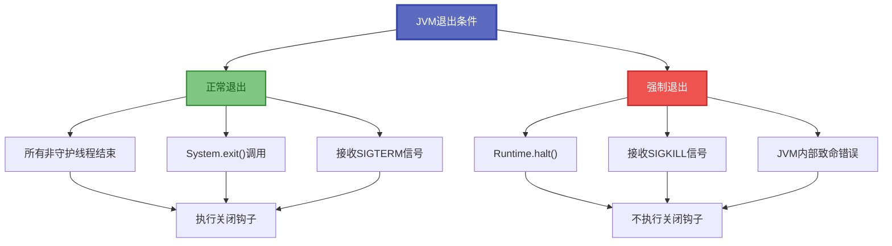
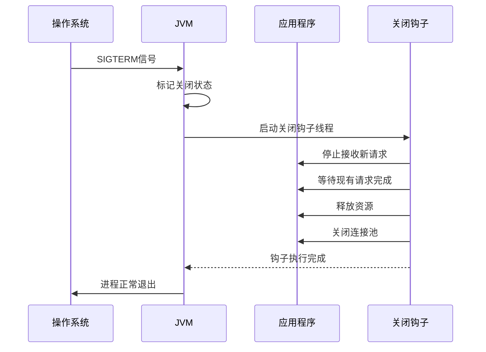
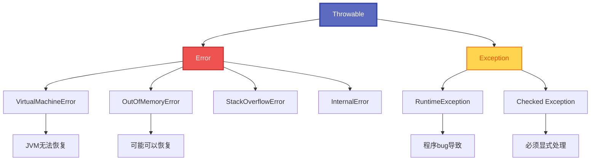

# JVM异常处理与退出机制

## JVM信号处理机制

JVM作为操作系统进程,需要处理各种系统信号以维持稳定性。理解JVM如何处理系统信号和各类异常,是构建高可用Java应用的基础。



### 关键信号说明

| 信号 | 描述 | JVM处理 | 影响 |
|------|------|---------|------|
| SIGSEGV | 段错误,非法内存访问 | 转换为异常(如NPE) | 线程级异常 |
| SIGBUS | 总线错误,内存对齐问题 | 转换为异常 | 线程级异常 |
| SIGILL | 非法指令 | 转换为异常 | 线程级异常 |
| SIGFPE | 浮点异常 | 转换为ArithmeticException | 线程级异常 |
| SIGTERM | 终止信号 | 触发关闭钩子 | 优雅退出 |
| SIGKILL | 强制杀死 | 无法拦截 | 进程强制终止 |

### 信号处理演示

```java
// JVM信号处理演示
public class JVMStabilityDemo {
    
    public static void main(String[] args) {
        // 注册关闭钩子,优雅处理SIGTERM信号
        Runtime.getRuntime().addShutdownHook(new Thread(() -> {
            System.out.println("接收到关闭信号,正在清理资源...");
            cleanupResources();
            System.out.println("资源清理完成");
        }));
        
        System.out.println("应用程序启动,PID: " + ProcessHandle.current().pid());
        
        // 模拟长期运行的服务
        startLongRunningService();
    }
    
    private static void startLongRunningService() {
        while (true) {
            try {
                // 模拟业务处理
                processBusinessLogic();
                Thread.sleep(1000);
                
            } catch (OutOfMemoryError oom) {
                // OOM不会导致JVM立即退出
                System.err.println("内存溢出,尝试恢复: " + oom.getMessage());
                handleOutOfMemory();
                
            } catch (StackOverflowError soe) {
                // 栈溢出也不会导致JVM退出
                System.err.println("栈溢出,线程继续运行: " + soe.getMessage());
                
            } catch (Exception e) {
                // 普通异常更不会影响JVM
                System.err.println("业务异常: " + e.getMessage());
            }
        }
    }
    
    private static void handleOutOfMemory() {
        // OOM恢复策略
        System.gc(); // 强制垃圾回收
        
        // 清理缓存
        clearCaches();
        
        // 降级服务
        enableLowMemoryMode();
        
        // 监控内存使用
        reportMemoryUsage();
    }
}
```

## OOM对JVM稳定性的影响

### 多线程环境下的OOM

```java
// 多线程环境下的OOM影响分析
public class OOMStabilityAnalysis {
    
    private final ExecutorService executor = Executors.newFixedThreadPool(10);
    private final AtomicInteger successCount = new AtomicInteger(0);
    private final AtomicInteger oomCount = new AtomicInteger(0);
    
    public void simulateOOMScenarios() {
        // 模拟多线程环境下的OOM场景
        for (int i = 0; i < 50; i++) {
            final int taskId = i;
            
            executor.submit(() -> {
                try {
                    if (taskId % 5 == 0) {
                        // 某些线程故意触发OOM
                        triggerOutOfMemoryError();
                    } else {
                        // 其他线程正常处理业务
                        processNormalBusiness();
                    }
                    
                    successCount.incrementAndGet();
                    
                } catch (OutOfMemoryError oom) {
                    oomCount.incrementAndGet();
                    
                    // 关键发现: OOM只影响当前线程,不影响其他线程
                    System.err.printf("线程 %d 发生OOM,但其他线程继续运行%n", 
                        taskId);
                    
                    // 线程可以从OOM中恢复
                    handleThreadLevelOOM();
                    
                } catch (Exception e) {
                    System.err.printf("线程 %d 发生异常: %s%n", 
                        taskId, e.getMessage());
                }
            });
        }
        
        // 等待所有任务完成
        executor.shutdown();
        try {
            executor.awaitTermination(30, TimeUnit.SECONDS);
        } catch (InterruptedException e) {
            Thread.currentThread().interrupt();
        }
        
        // 输出统计结果
        System.out.printf("成功任务: %d, OOM任务: %d%n", 
            successCount.get(), oomCount.get());
        System.out.println("JVM依然运行正常,证明OOM不会导致进程崩溃");
    }
    
    private void triggerOutOfMemoryError() {
        // 故意触发OOM
        List<byte[]> memoryHog = new ArrayList<>();
        while (true) {
            memoryHog.add(new byte[1024 * 1024]); // 1MB数组
        }
    }
    
    private void processNormalBusiness() {
        // 正常业务逻辑
        for (int i = 0; i < 1000; i++) {
            String data = "处理数据" + i;
            // 模拟数据处理
        }
    }
    
    private void handleThreadLevelOOM() {
        // 线程级OOM恢复
        System.gc();
        
        try {
            Thread.sleep(100); // 给GC一些时间
        } catch (InterruptedException e) {
            Thread.currentThread().interrupt();
        }
    }
}
```

### OOM与JVM稳定性关系



**关键结论:**
- OOM是Error,不是Exception,但JVM不会因此立即退出
- OOM只影响当前线程,其他线程可以继续运行
- 线程可以从OOM中恢复(如果有足够内存被释放)
- 只有所有非守护线程都结束时,JVM才会退出

## JVM退出条件分析

### 正常退出场景

```java
// JVM正常退出场景演示
public class JVMExitScenarios {
    
    // 场景1: 主线程和所有非守护线程结束
    public static void demonstrateNormalExit() {
        System.out.println("主线程开始执行");
        
        // 创建用户线程
        Thread userThread = new Thread(() -> {
            try {
                Thread.sleep(2000);
                System.out.println("用户线程执行完成");
            } catch (InterruptedException e) {
                Thread.currentThread().interrupt();
            }
        });
        userThread.start();
        
        // 创建守护线程
        Thread daemonThread = new Thread(() -> {
            while (true) {
                System.out.println("守护线程仍在运行...");
                try {
                    Thread.sleep(500);
                } catch (InterruptedException e) {
                    break;
                }
            }
        });
        daemonThread.setDaemon(true);
        daemonThread.start();
        
        System.out.println("主线程结束");
        // 当主线程和userThread都结束时,JVM退出
        // 守护线程会被强制终止
    }
    
    // 场景2: 显式调用System.exit()
    public static void demonstrateExplicitExit() {
        System.out.println("准备显式退出JVM");
        
        // 注册关闭钩子
        Runtime.getRuntime().addShutdownHook(new Thread(() -> {
            System.out.println("执行关闭钩子清理逻辑");
            cleanupApplicationResources();
        }));
        
        // 模拟一些业务逻辑
        performBusinessLogic();
        
        // 显式退出,状态码0表示正常退出
        System.exit(0);
    }
    
    // 场景3: Runtime.halt()强制退出
    public static void demonstrateForcedExit() {
        System.out.println("准备强制退出JVM");
        
        Runtime.getRuntime().addShutdownHook(new Thread(() -> {
            System.out.println("这个钩子不会被执行");
        }));
        
        // halt()不会执行关闭钩子,立即终止JVM
        Runtime.getRuntime().halt(1);
    }
}
```

### JVM退出条件总结



### 异常退出与错误处理

```java
// 系统级错误处理
public class SystemErrorHandling {
    
    // 场景: 系统级错误导致退出
    public static void handleSystemErrors() {
        // 注册未捕获异常处理器
        Thread.setDefaultUncaughtExceptionHandler((thread, exception) -> {
            System.err.printf("线程 %s 发生未捕获异常: %s%n", 
                thread.getName(), exception.getMessage());
            
            if (exception instanceof OutOfMemoryError) {
                handleGlobalOOM((OutOfMemoryError) exception);
            } else if (isSystemCriticalError(exception)) {
                // 系统级别错误,考虑退出JVM
                performEmergencyShutdown();
            }
        });
        
        // 启动多个业务线程
        for (int i = 0; i < 5; i++) {
            final int threadId = i;
            new Thread(() -> {
                try {
                    simulateBusinessLogic(threadId);
                } catch (Exception e) {
                    // 业务异常不应导致JVM退出
                    System.err.println("业务异常,线程继续运行: " + e.getMessage());
                }
            }, "BusinessThread-" + i).start();
        }
    }
    
    private static void handleGlobalOOM(OutOfMemoryError oom) {
        System.err.println("检测到全局OOM,执行紧急处理");
        
        // 尝试释放内存
        clearAllCaches();
        System.gc();
        
        // 记录内存快照
        dumpMemorySnapshot();
        
        // 决定是否需要重启
        if (isRecoveryPossible()) {
            System.out.println("OOM恢复成功,继续运行");
        } else {
            System.err.println("无法从OOM恢复,需要重启应用");
            performGracefulShutdown();
        }
    }
    
    private static boolean isSystemCriticalError(Throwable t) {
        // 判断是否为系统级别的致命错误
        return t instanceof VirtualMachineError ||
               t instanceof InternalError ||
               (t instanceof Error && !(t instanceof AssertionError));
    }
}
```

## 优雅关闭机制

### 关闭钩子实现

```java
// 信号处理与JVM稳定性
public class SignalHandlingDemo {
    
    public static void main(String[] args) {
        // 不同信号对JVM的影响
        System.out.println("JVM进程PID: " + ProcessHandle.current().pid());
        System.out.println("可以使用以下命令测试信号处理:");
        System.out.println("  kill -TERM <pid>  # 优雅关闭");
        System.out.println("  kill -9 <pid>    # 强制杀死");
        System.out.println("  kill -USR1 <pid> # 用户自定义信号");
        
        // 模拟长时间运行的应用
        CountDownLatch latch = new CountDownLatch(1);
        
        // 注册关闭钩子处理SIGTERM
        Runtime.getRuntime().addShutdownHook(new Thread(() -> {
            System.out.println("\n收到关闭信号,开始优雅关闭...");
            
            // 停止接收新请求
            stopAcceptingNewRequests();
            
            // 等待现有请求完成
            waitForActiveRequestsToComplete();
            
            // 释放资源
            releaseSystemResources();
            
            System.out.println("优雅关闭完成");
            latch.countDown();
        }));
        
        try {
            // 模拟应用运行
            System.out.println("应用运行中,按Ctrl+C测试优雅关闭...");
            latch.await();
            
        } catch (InterruptedException e) {
            Thread.currentThread().interrupt();
        }
    }
}
```

### 优雅关闭最佳实践

```java
public class GracefulShutdownService {
    
    private final ExecutorService executor;
    private final AtomicBoolean shutdownRequested = new AtomicBoolean(false);
    private final List<Runnable> shutdownHooks = new ArrayList<>();
    
    public GracefulShutdownService() {
        this.executor = Executors.newFixedThreadPool(10);
        registerShutdownHook();
    }
    
    private void registerShutdownHook() {
        Runtime.getRuntime().addShutdownHook(new Thread(() -> {
            System.out.println("开始优雅关闭...");
            shutdownRequested.set(true);
            
            // 1. 停止接收新任务
            executor.shutdown();
            
            // 2. 等待现有任务完成(最多30秒)
            try {
                if (!executor.awaitTermination(30, TimeUnit.SECONDS)) {
                    System.err.println("警告: 部分任务未能在30秒内完成");
                    executor.shutdownNow();
                }
            } catch (InterruptedException e) {
                executor.shutdownNow();
                Thread.currentThread().interrupt();
            }
            
            // 3. 执行自定义关闭钩子
            for (Runnable hook : shutdownHooks) {
                try {
                    hook.run();
                } catch (Exception e) {
                    System.err.println("关闭钩子执行异常: " + e.getMessage());
                }
            }
            
            System.out.println("优雅关闭完成");
        }, "ShutdownHook"));
    }
    
    public void addShutdownHook(Runnable hook) {
        shutdownHooks.add(hook);
    }
    
    public boolean isShutdownRequested() {
        return shutdownRequested.get();
    }
}
```

### 关闭流程图



## 异常处理层次

### Error与Exception的区别



### 异常处理策略

| 异常类型 | 处理策略 | 是否影响JVM |
|---------|---------|------------|
| RuntimeException | 捕获并处理或传播 | 不影响JVM |
| Checked Exception | 必须捕获或声明 | 不影响JVM |
| OutOfMemoryError | 可以捕获但需谨慎 | 线程级影响 |
| StackOverflowError | 可以捕获 | 线程级影响 |
| VirtualMachineError | 通常无法恢复 | 可能导致JVM不稳定 |

```java
public class ExceptionHandlingStrategy {
    
    // 业务异常处理
    public void handleBusinessOperation() {
        try {
            performBusinessLogic();
        } catch (BusinessException e) {
            // 业务异常: 记录日志,返回错误响应
            log.warn("业务异常: {}", e.getMessage());
            return ErrorResponse.of(e.getCode(), e.getMessage());
        } catch (RuntimeException e) {
            // 运行时异常: 可能是bug,需要告警
            log.error("运行时异常", e);
            alertOps("RuntimeException detected", e);
            throw e;
        }
    }
    
    // 系统错误处理
    public void handleSystemError() {
        try {
            performCriticalOperation();
        } catch (OutOfMemoryError oom) {
            // OOM处理: 尝试恢复
            log.error("OOM发生", oom);
            attemptRecovery();
            
        } catch (Error e) {
            // 其他Error: 通常无法恢复,记录并考虑退出
            log.fatal("系统错误", e);
            triggerEmergencyShutdown();
        }
    }
}
```

## 进程健康检查

### 健康检查实现

```java
public class JVMHealthChecker {
    
    private final MemoryMXBean memoryBean = ManagementFactory.getMemoryMXBean();
    private final ThreadMXBean threadBean = ManagementFactory.getThreadMXBean();
    
    public HealthStatus checkHealth() {
        HealthStatus status = new HealthStatus();
        
        // 检查内存使用率
        MemoryUsage heapUsage = memoryBean.getHeapMemoryUsage();
        double memoryUsageRatio = (double) heapUsage.getUsed() / heapUsage.getMax();
        status.setMemoryUsagePercent(memoryUsageRatio * 100);
        
        if (memoryUsageRatio > 0.9) {
            status.addWarning("内存使用率超过90%");
        }
        
        // 检查死锁
        long[] deadlockedThreads = threadBean.findDeadlockedThreads();
        if (deadlockedThreads != null && deadlockedThreads.length > 0) {
            status.addCritical("检测到死锁线程: " + deadlockedThreads.length);
        }
        
        // 检查线程数
        int threadCount = threadBean.getThreadCount();
        status.setThreadCount(threadCount);
        
        if (threadCount > 1000) {
            status.addWarning("线程数过多: " + threadCount);
        }
        
        return status;
    }
    
    public static class HealthStatus {
        private double memoryUsagePercent;
        private int threadCount;
        private List<String> warnings = new ArrayList<>();
        private List<String> criticals = new ArrayList<>();
        
        public boolean isHealthy() {
            return criticals.isEmpty();
        }
        
        // getter/setter省略
    }
}
```

理解JVM的异常处理和退出机制,对于构建高可用的Java应用至关重要。关键要点包括:OOM不会直接导致JVM退出、正确使用关闭钩子实现优雅关闭、合理处理各类异常和错误。通过健康检查机制可以及早发现问题,避免系统故障。
