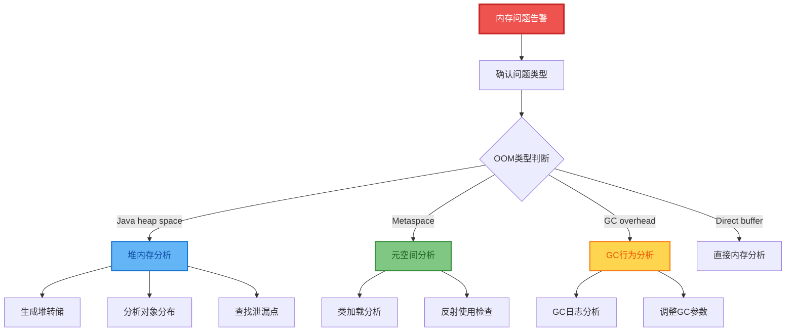
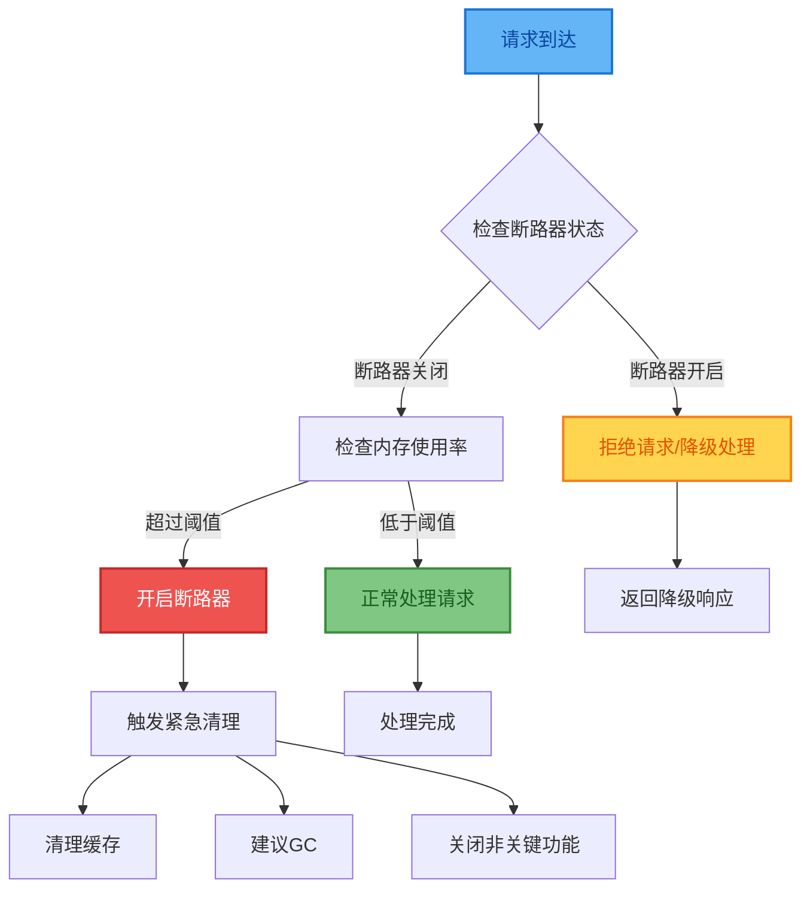
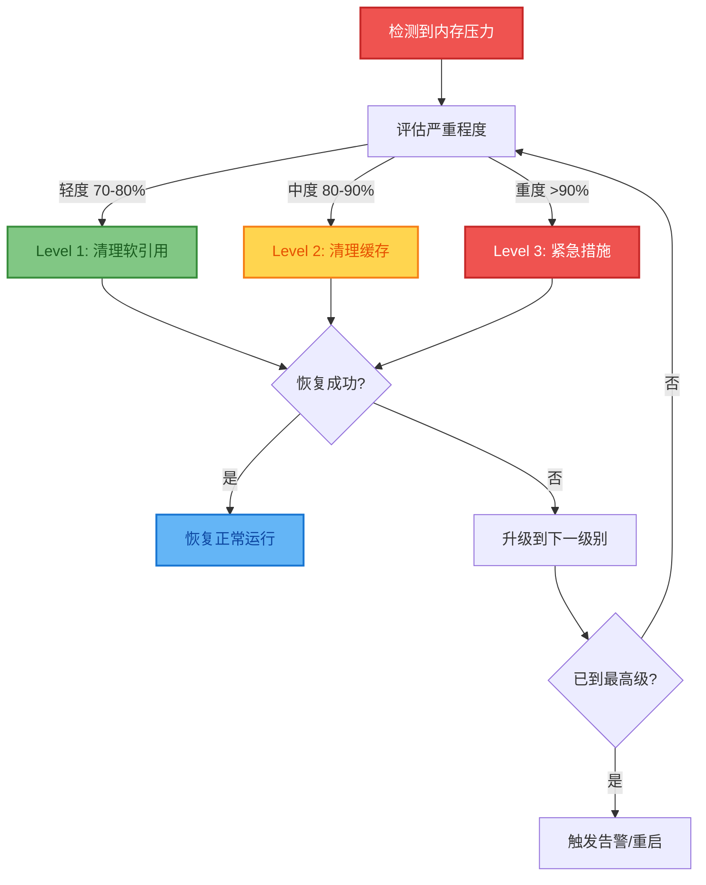
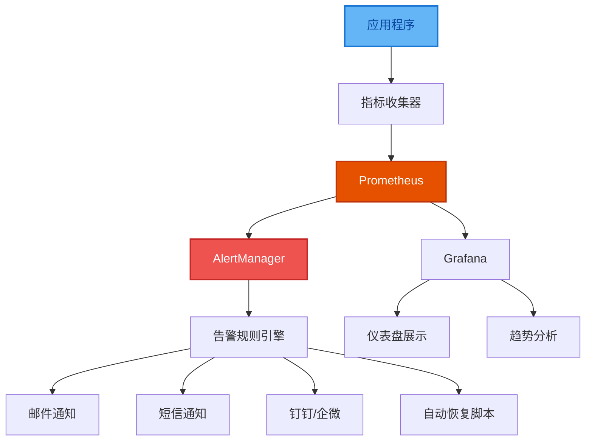
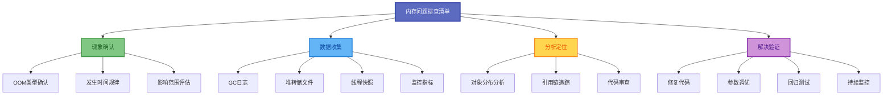

# 内存问题排查与恢复策略

## OOM问题诊断流程

当Java应用发生内存问题时,需要有系统化的诊断流程来快速定位问题根源。



### 内存诊断工具类

```java
// 内存问题诊断工具类
public class MemoryDiagnostics {
    
    private static final MemoryMXBean memoryBean = ManagementFactory.getMemoryMXBean();
    private static final List<GarbageCollectorMXBean> gcBeans = 
        ManagementFactory.getGarbageCollectorMXBeans();
    
    // 内存使用情况监控
    public static void monitorMemoryUsage() {
        Timer timer = new Timer(true);
        timer.scheduleAtFixedRate(new TimerTask() {
            @Override
            public void run() {
                printMemoryStatus();
                checkMemoryPressure();
            }
        }, 0, 5000); // 每5秒检查一次
    }
    
    private static void printMemoryStatus() {
        MemoryUsage heapUsage = memoryBean.getHeapMemoryUsage();
        MemoryUsage nonHeapUsage = memoryBean.getNonHeapMemoryUsage();
        
        System.out.printf("[%s] 堆内存: %d/%d MB (%.1f%%), 非堆内存: %d MB%n",
            LocalDateTime.now(),
            heapUsage.getUsed() / 1024 / 1024,
            heapUsage.getMax() / 1024 / 1024,
            (double) heapUsage.getUsed() / heapUsage.getMax() * 100,
            nonHeapUsage.getUsed() / 1024 / 1024);
    }
    
    private static void checkMemoryPressure() {
        MemoryUsage heapUsage = memoryBean.getHeapMemoryUsage();
        double usageRatio = (double) heapUsage.getUsed() / heapUsage.getMax();
        
        if (usageRatio > 0.9) {
            System.err.println("警告: 内存使用率超过90%,可能存在内存泄漏!");
            
            // 分析GC情况
            analyzeGCBehavior();
            
            // 生成内存快照建议
            suggestHeapDump();
        }
    }
    
    private static void analyzeGCBehavior() {
        for (GarbageCollectorMXBean gcBean : gcBeans) {
            long collections = gcBean.getCollectionCount();
            long time = gcBean.getCollectionTime();
            
            System.out.printf("GC[%s]: %d次, 总耗时: %dms%n", 
                gcBean.getName(), collections, time);
            
            // 判断GC是否频繁
            if (collections > 0 && time / collections > 100) {
                System.err.println("警告: GC平均耗时过长,可能存在性能问题");
            }
        }
    }
    
    private static void suggestHeapDump() {
        String pid = String.valueOf(ProcessHandle.current().pid());
        String timestamp = LocalDateTime.now()
            .format(DateTimeFormatter.ofPattern("yyyyMMdd_HHmmss"));
        String filename = String.format("heapdump_%s_%s.hprof", pid, timestamp);
        
        System.out.println("建议生成堆内存快照用于分析:");
        System.out.println("  jmap -dump:format=b,file=" + filename + " " + pid);
        System.out.println("  或使用JVM参数: -XX:+HeapDumpOnOutOfMemoryError");
    }
}
```

### 内存泄漏检测器

```java
// 内存泄漏检测
public class MemoryLeakDetector {
    private final Map<String, Long> previousMemoryUsage = new HashMap<>();
    private int consecutiveGrowthCount = 0;
    
    public LeakDetectionResult detectMemoryLeak() {
        LeakDetectionResult result = new LeakDetectionResult();
        
        for (MemoryPoolMXBean pool : ManagementFactory.getMemoryPoolMXBeans()) {
            String poolName = pool.getName();
            long currentUsage = pool.getUsage().getUsed();
            
            Long previousUsage = previousMemoryUsage.get(poolName);
            if (previousUsage != null) {
                long delta = currentUsage - previousUsage;
                double growthRate = (double) delta / previousUsage * 100;
                
                // 增长超过10MB且增长率>10%
                if (growthRate > 10 && delta > 10 * 1024 * 1024) {
                    result.addSuspiciousPool(poolName, delta, growthRate);
                    System.err.printf("警告: 内存池[%s]疑似泄漏: 增长 %d MB (%.1f%%)%n", 
                        poolName, delta / 1024 / 1024, growthRate);
                }
            }
            
            previousMemoryUsage.put(poolName, currentUsage);
        }
        
        // 检测连续增长
        if (result.hasSuspiciousPools()) {
            consecutiveGrowthCount++;
            if (consecutiveGrowthCount >= 5) {
                result.setHighConfidenceLeak(true);
            }
        } else {
            consecutiveGrowthCount = 0;
        }
        
        return result;
    }
    
    public static class LeakDetectionResult {
        private final List<SuspiciousPool> suspiciousPools = new ArrayList<>();
        private boolean highConfidenceLeak = false;
        
        public void addSuspiciousPool(String name, long delta, double growthRate) {
            suspiciousPools.add(new SuspiciousPool(name, delta, growthRate));
        }
        
        public boolean hasSuspiciousPools() {
            return !suspiciousPools.isEmpty();
        }
        
        // getter/setter省略
    }
}
```

## 断路器模式防止OOM

### 内存断路器实现

```java
// 断路器模式防止OOM
public class MemoryCircuitBreaker {
    private final double memoryThreshold;
    private volatile boolean isOpen = false;
    private final AtomicLong lastCheckTime = new AtomicLong(0);
    private final AtomicInteger rejectedCount = new AtomicInteger(0);
    
    public MemoryCircuitBreaker(double threshold) {
        this.memoryThreshold = threshold; // 例如 0.85 表示85%
    }
    
    public boolean isMemoryAvailable() {
        long now = System.currentTimeMillis();
        
        // 每秒检查一次
        if (now - lastCheckTime.get() > 1000) {
            checkMemoryStatus();
            lastCheckTime.set(now);
        }
        
        if (isOpen) {
            rejectedCount.incrementAndGet();
        }
        
        return !isOpen;
    }
    
    private void checkMemoryStatus() {
        MemoryUsage heapUsage = ManagementFactory.getMemoryMXBean()
            .getHeapMemoryUsage();
        double usageRatio = (double) heapUsage.getUsed() / heapUsage.getMax();
        
        if (usageRatio > memoryThreshold && !isOpen) {
            isOpen = true;
            System.err.printf("内存断路器开启 [使用率: %.1f%%],拒绝新的内存密集型操作%n", 
                usageRatio * 100);
            
            // 触发内存清理
            triggerEmergencyCleanup();
            
        } else if (usageRatio < memoryThreshold - 0.1 && isOpen) {
            isOpen = false;
            System.out.printf("内存压力缓解 [使用率: %.1f%%],断路器关闭%n", 
                usageRatio * 100);
        }
    }
    
    private void triggerEmergencyCleanup() {
        // 清理缓存
        CacheManager.clearAllCaches();
        
        // 建议垃圾回收
        System.gc();
        
        // 降级非关键功能
        FeatureToggle.disableNonCriticalFeatures();
    }
    
    public int getRejectedCount() {
        return rejectedCount.get();
    }
    
    public boolean isOpen() {
        return isOpen;
    }
}
```

### 断路器工作流程



## 优雅降级服务

### 降级服务实现

```java
// 优雅降级服务
public class GracefulDegradationService {
    private final MemoryCircuitBreaker circuitBreaker;
    private final DegradationConfig config;
    
    public GracefulDegradationService() {
        this.circuitBreaker = new MemoryCircuitBreaker(0.85);
        this.config = loadConfig();
    }
    
    public ProcessingResult processRequest(Request request) {
        if (!circuitBreaker.isMemoryAvailable()) {
            // 内存不足时的降级处理
            return handleDegradedMode(request);
        }
        
        try {
            // 正常处理逻辑
            return processNormally(request);
            
        } catch (OutOfMemoryError oom) {
            // OOM恢复策略
            return handleOOMRecovery(request, oom);
        }
    }
    
    private ProcessingResult handleDegradedMode(Request request) {
        DegradationStrategy strategy = selectStrategy(request);
        
        switch (strategy) {
            case USE_CACHE:
                // 策略1: 返回缓存结果
                return getCachedResult(request);
                
            case LIGHTWEIGHT_ALGORITHM:
                // 策略2: 使用轻量级算法
                return processWithLightweightAlgorithm(request);
                
            case REDUCE_DATA_SIZE:
                // 策略3: 减少数据处理量
                return processWithReducedData(request);
                
            case ASYNC_PROCESSING:
                // 策略4: 异步处理请求
                return scheduleAsyncProcessing(request);
                
            default:
                return new ProcessingResult("服务暂时不可用", 
                    ProcessingStatus.DEGRADED);
        }
    }
    
    private ProcessingResult handleOOMRecovery(Request request, OutOfMemoryError oom) {
        System.err.println("处理请求时发生OOM,启动恢复流程");
        
        // 立即释放资源
        releaseTemporaryResources();
        
        // 强制垃圾回收
        System.gc();
        
        // 等待一段时间让系统恢复
        try {
            Thread.sleep(100);
        } catch (InterruptedException e) {
            Thread.currentThread().interrupt();
        }
        
        // 使用最轻量级方式重试
        return processWithMinimalMemory(request);
    }
    
    private DegradationStrategy selectStrategy(Request request) {
        // 根据请求类型选择降级策略
        if (request.isCacheable()) {
            return DegradationStrategy.USE_CACHE;
        } else if (request.canReduceData()) {
            return DegradationStrategy.REDUCE_DATA_SIZE;
        } else if (request.canAsync()) {
            return DegradationStrategy.ASYNC_PROCESSING;
        } else {
            return DegradationStrategy.LIGHTWEIGHT_ALGORITHM;
        }
    }
}

enum DegradationStrategy {
    USE_CACHE,
    LIGHTWEIGHT_ALGORITHM,
    REDUCE_DATA_SIZE,
    ASYNC_PROCESSING,
    REJECT
}
```

### 降级策略对比

| 策略 | 适用场景 | 用户体验 | 资源消耗 |
|------|----------|----------|----------|
| 返回缓存 | 数据不要求实时 | 较好 | 极低 |
| 轻量算法 | 可接受精度损失 | 一般 | 低 |
| 减少数据 | 分页/限制结果 | 一般 | 中 |
| 异步处理 | 非实时需求 | 延迟 | 延后 |
| 直接拒绝 | 系统保护 | 差 | 最低 |

## 内存恢复策略

### 分级恢复方案

```java
public class MemoryRecoveryService {
    
    private final List<RecoveryAction> recoveryActions;
    
    public MemoryRecoveryService() {
        // 按优先级排序的恢复动作
        this.recoveryActions = Arrays.asList(
            new ClearSoftReferencesAction(),
            new ClearLocalCacheAction(),
            new ClearDistributedCacheAction(),
            new TriggerGCAction(),
            new ReducePoolSizeAction(),
            new DisableNonCriticalServicesAction()
        );
    }
    
    public boolean attemptRecovery() {
        double initialUsage = getMemoryUsageRatio();
        System.out.printf("开始内存恢复,当前使用率: %.1f%%%n", initialUsage * 100);
        
        for (RecoveryAction action : recoveryActions) {
            if (getMemoryUsageRatio() < 0.7) {
                System.out.println("内存恢复成功!");
                return true;
            }
            
            System.out.println("执行恢复动作: " + action.getName());
            action.execute();
            
            // 等待GC生效
            try {
                Thread.sleep(500);
            } catch (InterruptedException e) {
                Thread.currentThread().interrupt();
                break;
            }
        }
        
        double finalUsage = getMemoryUsageRatio();
        System.out.printf("恢复完成,最终使用率: %.1f%%%n", finalUsage * 100);
        
        return finalUsage < 0.8;
    }
    
    private double getMemoryUsageRatio() {
        MemoryUsage usage = ManagementFactory.getMemoryMXBean()
            .getHeapMemoryUsage();
        return (double) usage.getUsed() / usage.getMax();
    }
}

interface RecoveryAction {
    String getName();
    void execute();
}

class ClearLocalCacheAction implements RecoveryAction {
    @Override
    public String getName() {
        return "清理本地缓存";
    }
    
    @Override
    public void execute() {
        LocalCacheManager.clearAll();
    }
}

class TriggerGCAction implements RecoveryAction {
    @Override
    public String getName() {
        return "触发垃圾回收";
    }
    
    @Override
    public void execute() {
        System.gc();
    }
}
```

### 恢复流程图



## 监控告警体系

### 内存监控指标

```java
public class MemoryMetricsCollector {
    
    private final MeterRegistry registry;
    
    public MemoryMetricsCollector(MeterRegistry registry) {
        this.registry = registry;
        registerMetrics();
    }
    
    private void registerMetrics() {
        // 堆内存使用率
        Gauge.builder("jvm.memory.heap.usage", this, collector -> {
            MemoryUsage usage = ManagementFactory.getMemoryMXBean()
                .getHeapMemoryUsage();
            return (double) usage.getUsed() / usage.getMax();
        }).register(registry);
        
        // GC次数
        for (GarbageCollectorMXBean gcBean : 
                ManagementFactory.getGarbageCollectorMXBeans()) {
            Gauge.builder("jvm.gc.count", gcBean, GarbageCollectorMXBean::getCollectionCount)
                .tag("gc", gcBean.getName())
                .register(registry);
        }
        
        // GC耗时
        for (GarbageCollectorMXBean gcBean : 
                ManagementFactory.getGarbageCollectorMXBeans()) {
            Gauge.builder("jvm.gc.time", gcBean, GarbageCollectorMXBean::getCollectionTime)
                .tag("gc", gcBean.getName())
                .register(registry);
        }
    }
    
    // 告警规则检查
    public List<Alert> checkAlertRules() {
        List<Alert> alerts = new ArrayList<>();
        
        MemoryMXBean memoryBean = ManagementFactory.getMemoryMXBean();
        MemoryUsage heapUsage = memoryBean.getHeapMemoryUsage();
        double usageRatio = (double) heapUsage.getUsed() / heapUsage.getMax();
        
        // 规则1: 内存使用率超过85%
        if (usageRatio > 0.85) {
            alerts.add(new Alert(
                AlertLevel.WARNING,
                "内存使用率过高",
                String.format("当前内存使用率: %.1f%%", usageRatio * 100)
            ));
        }
        
        // 规则2: 内存使用率超过95%
        if (usageRatio > 0.95) {
            alerts.add(new Alert(
                AlertLevel.CRITICAL,
                "内存即将耗尽",
                String.format("当前内存使用率: %.1f%%, 请立即处理!", usageRatio * 100)
            ));
        }
        
        // 规则3: Full GC频繁
        for (GarbageCollectorMXBean gcBean : 
                ManagementFactory.getGarbageCollectorMXBeans()) {
            if (gcBean.getName().contains("Old") || gcBean.getName().contains("Full")) {
                long count = gcBean.getCollectionCount();
                long time = gcBean.getCollectionTime();
                
                if (count > 0 && time / count > 500) {
                    alerts.add(new Alert(
                        AlertLevel.WARNING,
                        "Full GC耗时过长",
                        String.format("GC[%s] 平均耗时: %dms", 
                            gcBean.getName(), time / count)
                    ));
                }
            }
        }
        
        return alerts;
    }
}

enum AlertLevel {
    INFO, WARNING, CRITICAL
}

class Alert {
    private final AlertLevel level;
    private final String title;
    private final String message;
    private final LocalDateTime timestamp;
    
    public Alert(AlertLevel level, String title, String message) {
        this.level = level;
        this.title = title;
        this.message = message;
        this.timestamp = LocalDateTime.now();
    }
    // getter省略
}
```

### 监控告警架构



## 最佳实践总结

### 问题排查清单



### 关键建议

| 阶段 | 建议 | 工具 |
|------|------|------|
| 预防 | 代码审查、压力测试 | SonarQube、JMeter |
| 监控 | 实时内存监控、GC监控 | Prometheus、Grafana |
| 告警 | 分级告警、自动通知 | AlertManager |
| 恢复 | 自动降级、断路器 | Hystrix、Resilience4j |
| 分析 | 堆转储分析、GC日志分析 | MAT、GCEasy |

通过建立完善的内存监控、异常处理和恢复机制,我们可以显著提升Java应用的稳定性和可靠性。记住,内存问题往往是渐进性的,及早发现和处理是关键。预防胜于治疗,良好的编码习惯和合理的架构设计是避免内存问题的根本。