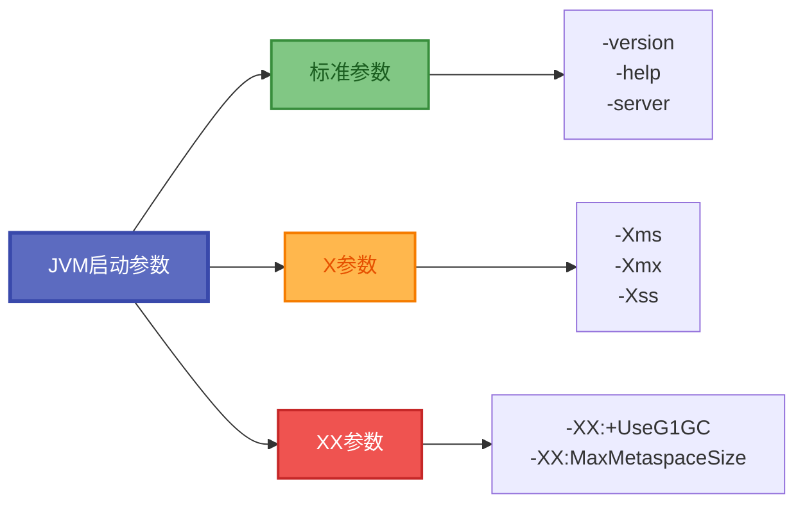
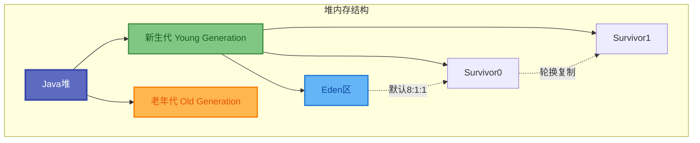
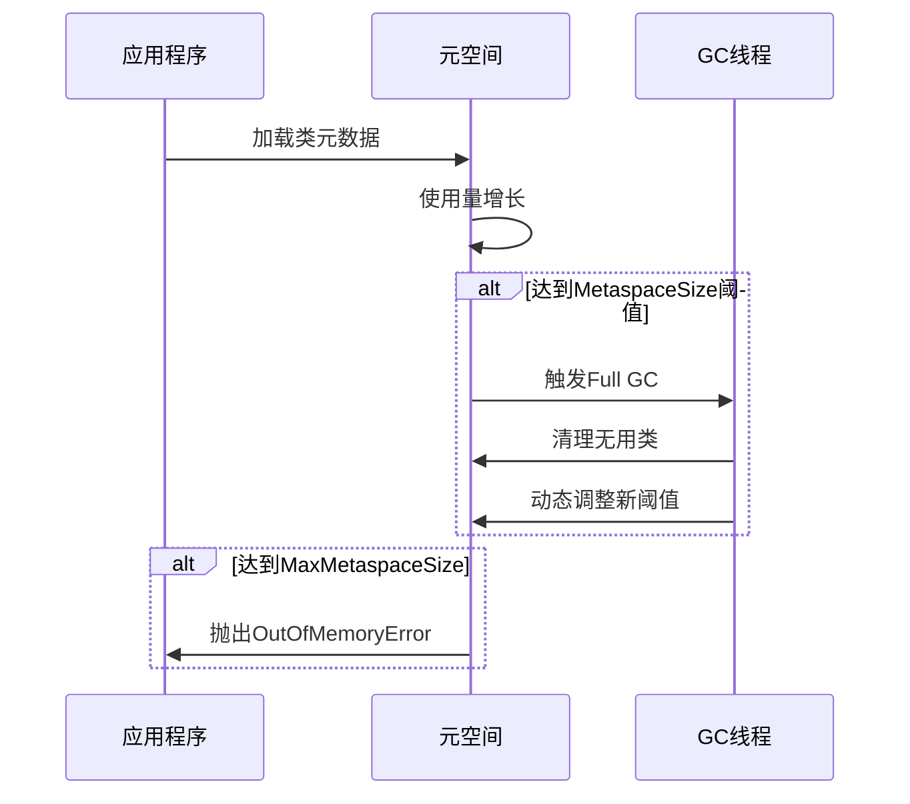
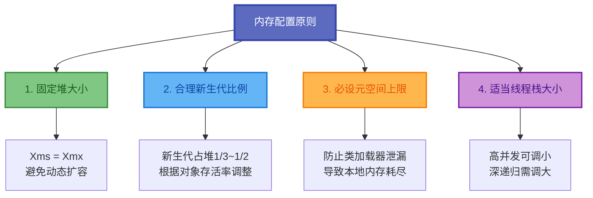

# JVM堆内存与元空间配置

JVM参数配置是Java应用性能调优的核心手段之一。通过合理设置JVM参数,可以有效控制内存使用、优化垃圾回收行为、提升应用响应速度。本文将深入讲解堆内存和元空间的配置原理与最佳实践。

## JVM参数分类

JVM启动参数按照作用范围和特征可分为三大类:



### 参数类型说明

| 参数类型 | 前缀 | 稳定性 | 示例 |
|---------|------|--------|------|
| 标准参数 | - | 所有JVM都支持 | -version, -server, -classpath |
| X参数 | -X | 非标准,主流JVM支持 | -Xms, -Xmx, -Xss, -Xmn |
| XX参数 | -XX | 高级选项,可能变化 | -XX:+UseG1GC, -XX:MaxMetaspaceSize |

### XX参数的两种形式

```bash
# 布尔型参数
-XX:+UseG1GC        # 开启G1垃圾回收器
-XX:-UseG1GC        # 关闭G1垃圾回收器

# 键值型参数
-XX:MaxMetaspaceSize=256m    # 设置元空间最大值
-XX:NewRatio=2               # 设置老年代与新生代比例
```

## 堆内存配置详解

堆内存是Java对象实例的主要存储区域,所有线程共享。合理配置堆内存对应用性能至关重要。

### 堆空间结构模型



### 初始与最大堆内存设置

堆内存大小通过`-Xms`和`-Xmx`参数控制:

```bash
# 设置JVM初始堆大小为2GB
-Xms2G

# 设置JVM最大堆大小为4GB
-Xmx4G
```

**参数说明:**
- `-Xms`: JVM启动时初始化堆内存大小
- `-Xmx`: JVM运行期间堆内存最大可扩展值
- 内存单位: `k`/`K`(KB)、`m`/`M`(MB)、`g`/`G`(GB)

**最佳实践:**

建议将`-Xms`和`-Xmx`设置为相同值,避免运行时堆内存动态扩展带来的性能开销:

```bash
# 推荐配置: 固定堆内存为4GB
-Xms4G -Xmx4G
```

### 新生代内存配置

新生代是大部分对象的初始分配区域,合理配置可显著降低Full GC频率。


**方式一: 通过NewSize和MaxNewSize指定**

```bash
# 设置新生代初始大小为512MB
-XX:NewSize=512m

# 设置新生代最大大小为1GB
-XX:MaxNewSize=1024m
```

**方式二: 通过Xmn统一设置**

```bash
# 固定新生代大小为1GB
-Xmn1g
```

**方式三: 通过NewRatio设置比例**

```bash
# 设置老年代与新生代比例为2:1(新生代占堆的1/3)
-XX:NewRatio=2
```

### Survivor区比例配置

Eden区与单个Survivor区的比例通过`SurvivorRatio`控制:

```bash
# 设置Eden:Survivor = 8:1(默认值)
-XX:SurvivorRatio=8
```

此时新生代内部比例为: `Eden:Survivor0:Survivor1 = 8:1:1`

### 堆内存配置计算示例

```
假设配置:
  -Xms4G -Xmx4G -Xmn1536m -XX:SurvivorRatio=8

计算结果:
  总堆内存 = 4GB = 4096MB
  新生代 = 1536MB
  老年代 = 4096 - 1536 = 2560MB
  
  新生代内部:
    总共 = 1536MB = Eden + S0 + S1 = 8 + 1 + 1 = 10份
    Eden = 1536 × 8/10 = 1228.8MB ≈ 1229MB
    S0 = S1 = 1536 × 1/10 = 153.6MB ≈ 154MB
```

## 元空间配置

### Java 8前后的演变


### 永久代配置(JDK 7及之前)

```bash
# 设置永久代初始大小为128MB
-XX:PermSize=128m

# 设置永久代最大大小为256MB
-XX:MaxPermSize=256m
```

### 元空间配置(JDK 8及之后)

```bash
# 设置触发Full GC的元空间阈值为256MB
-XX:MetaspaceSize=256m

# 设置元空间最大可用大小为512MB
-XX:MaxMetaspaceSize=512m
```

**关键理解点:**

1. **MetaspaceSize的真实作用**: 并非元空间初始容量(实际约20MB),而是首次触发Full GC的阈值
2. **动态扩容机制**: 元空间首次达到MetaspaceSize阈值时触发Full GC,之后JVM动态调整该阈值
3. **MaxMetaspaceSize的必要性**: 若不设置上限,元空间可能耗尽系统本地内存,强烈建议设置合理上限

### 元空间扩容触发流程



### 元空间相关参数

| 参数 | 说明 | 默认值 | 建议值 |
|------|------|--------|--------|
| MetaspaceSize | 触发Full GC的初始阈值 | ~21MB | 256m |
| MaxMetaspaceSize | 元空间最大容量 | 无限制 | 512m-1g |
| MinMetaspaceFreeRatio | GC后最小空闲比例 | 40% | 保持默认 |
| MaxMetaspaceFreeRatio | GC后最大空闲比例 | 70% | 保持默认 |

## 线程栈内存配置

每个Java线程都拥有独立的虚拟机栈,用于存储局部变量、操作数栈等。

```bash
# 设置每个线程栈大小为1MB
-Xss1m

# 设置每个线程栈大小为512KB
-Xss512k
```

**配置建议:**
- 默认值: Linux/macOS为1MB,Windows为320KB
- 调小栈大小可支持更多线程(适用于高并发场景)
- 栈过小会导致`StackOverflowError`(深度递归等场景需调大)

### 线程栈大小与线程数关系

```
可创建线程数 ≈ (系统可用内存 - 堆内存 - 元空间) / 单个线程栈大小

示例:
  系统内存 = 8GB
  堆内存 = 4GB
  元空间 = 512MB
  线程栈 = 1MB
  
  可创建线程数 ≈ (8192 - 4096 - 512) / 1 = 3584个
  
  如果线程栈改为512KB:
  可创建线程数 ≈ (8192 - 4096 - 512) / 0.5 = 7168个
```

## 直接内存配置

直接内存(Direct Memory)不是JVM堆的一部分,而是通过NIO分配的本地内存。

```bash
# 设置直接内存最大值
-XX:MaxDirectMemorySize=1g
```

**使用场景:**
- NIO的ByteBuffer.allocateDirect()
- 内存映射文件(MappedByteBuffer)
- 高性能网络通信框架(Netty)

## 内存配置实战示例

### 小型应用配置(2GB内存)

```bash
java -server \
  -Xms1g -Xmx1g \
  -Xmn384m \
  -Xss256k \
  -XX:MetaspaceSize=128m \
  -XX:MaxMetaspaceSize=256m \
  -jar small-app.jar
```

### 中型应用配置(8GB内存)

```bash
java -server \
  -Xms4g -Xmx4g \
  -Xmn1536m \
  -Xss512k \
  -XX:MetaspaceSize=256m \
  -XX:MaxMetaspaceSize=512m \
  -jar medium-app.jar
```

### 大型应用配置(32GB内存)

```bash
java -server \
  -Xms24g -Xmx24g \
  -Xmn8g \
  -Xss1m \
  -XX:MetaspaceSize=512m \
  -XX:MaxMetaspaceSize=1g \
  -jar large-app.jar
```

## 内存配置最佳实践



### 核心建议

| 建议 | 说明 | 原因 |
|------|------|------|
| 固定堆内存 | -Xms = -Xmx | 避免运行时扩容开销 |
| 新生代适中 | 堆的1/3~1/2 | 太小频繁GC,太大单次GC长 |
| 必设元空间上限 | MaxMetaspaceSize | 防止类加载泄漏耗尽内存 |
| 监控后调优 | 基于实际数据 | 避免凭感觉调整 |

合理的内存配置是JVM调优的基础。本文介绍了堆内存、新生代、元空间和线程栈的配置方法和最佳实践。在实际应用中,应结合业务特征和监控数据,逐步调整参数以达到最优效果。