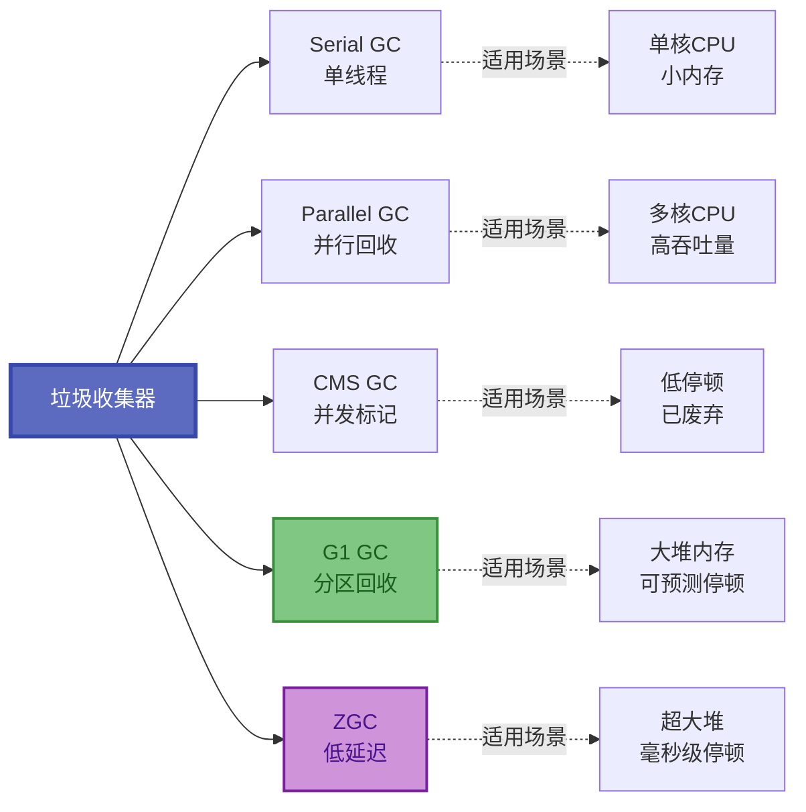
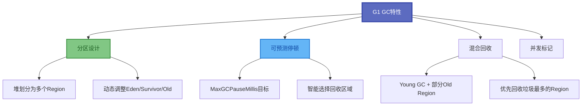
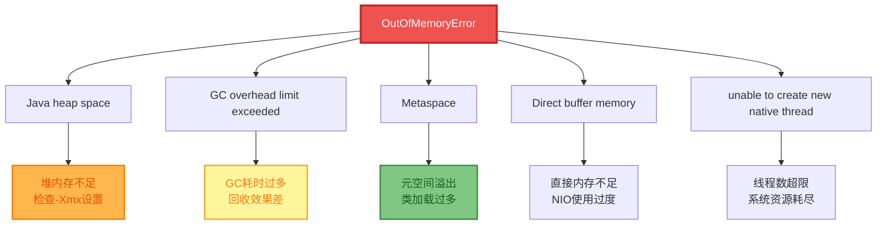
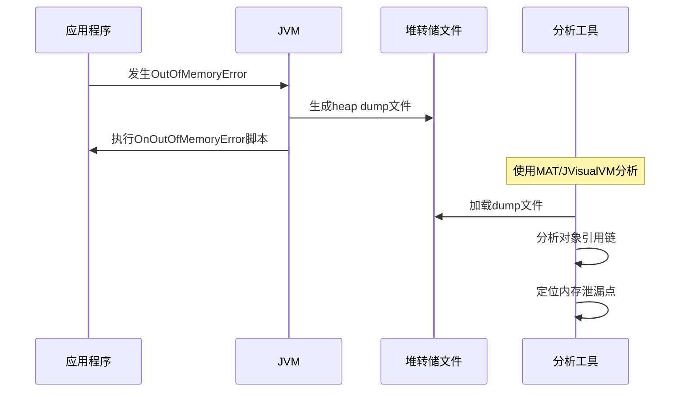
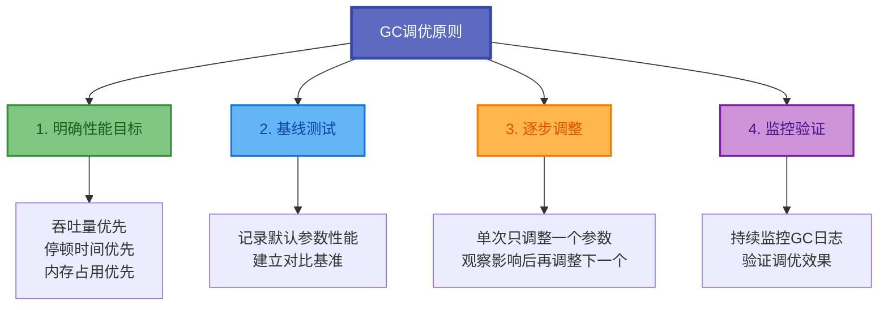

# 垃圾回收器与GC日志配置

垃圾回收器的选择和配置对Java应用的性能至关重要。本文将深入讲解主流垃圾收集器的特点、选型策略以及GC日志的配置与分析方法。

## 主流垃圾收集器对比



### 收集器特性对比

| 收集器 | 算法 | 线程 | STW时长 | 适用堆大小 | JDK版本 |
|--------|------|------|---------|-----------|----------|
| Serial | 复制+标记整理 | 单线程 | 长 | 小于100MB | 全版本 |
| Parallel | 复制+标记整理 | 多线程 | 中等 | 中等 | 全版本,JDK8默认 |
| CMS | 标记清除 | 并发 | 短 | 中等 | JDK14移除 |
| G1 | 分区+混合 | 并发 | 可控 | 大于4GB | JDK9+默认 |
| ZGC | 着色指针 | 并发 | 毫秒级 | TB级以上 | JDK11+ |
| Shenandoah | 转发指针 | 并发 | 毫秒级 | TB级以上 | JDK12+ |

## 垃圾收集器启用参数

```bash
# 启用Serial GC(串行收集器)
-XX:+UseSerialGC

# 启用Parallel GC(JDK 8默认,并行收集器)
-XX:+UseParallelGC

# 启用CMS GC(并发标记清除,JDK 14已移除)
-XX:+UseConcMarkSweepGC

# 启用G1 GC(JDK 9+默认)
-XX:+UseG1GC

# 启用ZGC(低延迟收集器,JDK 11+)
-XX:+UseZGC

# 启用Shenandoah GC(JDK 12+)
-XX:+UseShenandoahGC
```

## G1 GC专属调优参数

G1是目前最推荐的垃圾收集器,提供可预测的停顿时间:



### G1核心参数

```bash
# 设置期望的最大GC停顿时间为200ms
-XX:MaxGCPauseMillis=200

# 设置GC工作线程数为8
-XX:ParallelGCThreads=8

# 设置并发标记线程数
-XX:ConcGCThreads=2

# 设置触发并发GC的堆使用率阈值为45%
-XX:InitiatingHeapOccupancyPercent=45

# 设置Region大小(1MB-32MB之间,2的幂)
-XX:G1HeapRegionSize=4m

# 设置混合回收时老年代Region最大占比
-XX:G1MixedGCLiveThresholdPercent=85
```

### G1参数说明

| 参数 | 说明 | 默认值 | 建议值 |
|------|------|--------|--------|
| MaxGCPauseMillis | 期望最大停顿时间 | 200ms | 根据SLA设置 |
| ParallelGCThreads | 并行GC线程数 | CPU核心数 | CPU核心数 |
| ConcGCThreads | 并发标记线程数 | ParallelGCThreads/4 | 保持默认 |
| InitiatingHeapOccupancyPercent | 触发并发标记的堆占用率 | 45% | 40-50% |
| G1HeapRegionSize | Region大小 | 堆/2048 | 保持默认 |

## GC日志配置

### JDK 8 GC日志配置

```bash
# 打印详细GC信息
-XX:+PrintGCDetails

# 打印GC时间戳(日期+时间格式)
-XX:+PrintGCDateStamps

# 指定GC日志文件路径(%t为时间戳占位符)
-Xloggc:/var/logs/app/gc-%t.log

# 打印对象晋升年龄分布
-XX:+PrintTenuringDistribution

# GC前后打印堆详细信息
-XX:+PrintHeapAtGC

# 打印引用处理信息(强/软/弱/虚引用)
-XX:+PrintReferenceGC

# 打印应用暂停时间
-XX:+PrintGCApplicationStoppedTime

# 启用GC日志滚动
-XX:+UseGCLogFileRotation

# 保留最近10个日志文件
-XX:NumberOfGCLogFiles=10

# 单个日志文件最大100MB
-XX:GCLogFileSize=100M
```

### JDK 9+ 统一日志配置

JDK 9引入了统一的日志框架(Unified Logging):

```bash
# 基础GC日志
-Xlog:gc:gc.log

# 详细GC日志
-Xlog:gc*:gc.log:time,uptime,level,tags

# 带日志轮转
-Xlog:gc*:file=gc.log:time,uptime:filecount=10,filesize=100M

# 分类输出
-Xlog:gc=info,gc+heap=debug,gc+phases=trace:file=gc.log
```

### GC日志输出示例解读

**Young GC示例:**

```bash
2024-11-27T10:15:23.456+0800: [GC (Allocation Failure) 
[PSYoungGen: 512000K->64000K(589824K)] 
1024000K->576000K(2038400K), 0.0123456 secs]
```

解读:
- `GC (Allocation Failure)`: Eden区分配失败触发的Young GC
- `PSYoungGen: 512000K->64000K(589824K)`: 新生代从512MB回收到64MB,容量589MB
- `1024000K->576000K(2038400K)`: 整个堆从1GB变为576MB,总容量2GB
- `0.0123456 secs`: GC耗时约12ms

**Full GC示例:**

```bash
2024-11-27T10:20:45.789+0800: [Full GC (Metadata GC Threshold) 
[PSYoungGen: 64000K->0K(589824K)] 
[ParOldGen: 512000K->256000K(1448576K)] 
576000K->256000K(2038400K), 
[Metaspace: 245000K->245000K(1280000K)], 0.5432100 secs]
```

解读:
- `Full GC (Metadata GC Threshold)`: 元空间达到阈值触发Full GC
- 新生代完全清空,老年代从512MB减少到256MB
- 元空间大小未变(245MB),可能存在类加载器泄漏
- Full GC耗时543ms,需要关注

## OOM异常处理配置

### OOM发生场景分析



### OOM诊断参数配置

```bash
# OOM时自动生成堆转储文件
-XX:+HeapDumpOnOutOfMemoryError

# 指定堆转储文件存放路径(%p为进程ID)
-XX:HeapDumpPath=/data/dumps/java_heap_dump_%p.hprof

# OOM时执行自定义脚本(告警/重启等)
-XX:OnOutOfMemoryError="sh /opt/scripts/oom_alert.sh %p"

# 启用GC开销限制(98%时间用于GC且回收<2%堆时抛OOM)
-XX:+UseGCOverheadLimit
```

### 堆转储文件分析流程



## 其他重要调优参数

### 字符串优化相关

```bash
# 启用字符串去重(JDK 8u20+)
-XX:+UseStringDeduplication

# 设置字符串去重的对象年龄阈值
-XX:StringDeduplicationAgeThreshold=3
```

### 对象晋升控制

```bash
# 设置对象晋升到老年代的年龄阈值(默认15)
-XX:MaxTenuringThreshold=10

# 设置大对象直接进入老年代的阈值(字节)
-XX:PretenureSizeThreshold=1048576
```

### 显式GC控制

```bash
# 禁止应用代码调用System.gc()触发Full GC
-XX:+DisableExplicitGC
```

### 大内存页优化

```bash
# 启用大内存页(需操作系统支持)
-XX:+UseLargePages

# 设置大内存页大小
-XX:LargePageSizeInBytes=2m
```

## 实战配置示例

### 高并发Web应用配置

```bash
java -server \
  -Xms8g -Xmx8g \
  -Xmn3g \
  -Xss512k \
  -XX:MetaspaceSize=256m \
  -XX:MaxMetaspaceSize=512m \
  -XX:+UseG1GC \
  -XX:MaxGCPauseMillis=200 \
  -XX:+PrintGCDetails \
  -XX:+PrintGCDateStamps \
  -Xloggc:/logs/gc-%t.log \
  -XX:+UseGCLogFileRotation \
  -XX:NumberOfGCLogFiles=14 \
  -XX:GCLogFileSize=50M \
  -XX:+HeapDumpOnOutOfMemoryError \
  -XX:HeapDumpPath=/dumps/ \
  -XX:+DisableExplicitGC \
  -jar web-application.jar
```

### 大数据批处理任务配置

```bash
java -server \
  -Xms16g -Xmx16g \
  -XX:MetaspaceSize=512m \
  -XX:MaxMetaspaceSize=1g \
  -XX:+UseParallelGC \
  -XX:ParallelGCThreads=8 \
  -XX:+PrintGCDetails \
  -XX:+PrintGCDateStamps \
  -Xloggc:/logs/batch-gc.log \
  -XX:+HeapDumpOnOutOfMemoryError \
  -XX:HeapDumpPath=/dumps/ \
  -jar batch-processor.jar
```

### 微服务应用配置

```bash
java -server \
  -Xms2g -Xmx2g \
  -Xmn800m \
  -Xss256k \
  -XX:MetaspaceSize=128m \
  -XX:MaxMetaspaceSize=256m \
  -XX:+UseG1GC \
  -XX:MaxGCPauseMillis=100 \
  -XX:+PrintGCDetails \
  -Xloggc:/logs/microservice-gc.log \
  -XX:+HeapDumpOnOutOfMemoryError \
  -XX:HeapDumpPath=/dumps/ \
  -jar microservice-app.jar
```

### 低延迟应用配置(JDK 11+)

```bash
java -server \
  -Xms8g -Xmx8g \
  -XX:+UseZGC \
  -XX:ZCollectionInterval=120 \
  -XX:ZFragmentationLimit=10 \
  -Xlog:gc*:file=gc.log:time,uptime:filecount=10,filesize=100M \
  -XX:+HeapDumpOnOutOfMemoryError \
  -jar low-latency-app.jar
```

## GC调优最佳实践



### 收集器选型建议

| 场景 | 推荐收集器 | 原因 |
|------|-----------|------|
| 通用服务端应用 | G1 | 平衡吞吐和延迟 |
| 大数据批处理 | Parallel | 最大吞吐量 |
| 延迟敏感应用 | ZGC/Shenandoah | 毫秒级停顿 |
| 小内存应用 | Serial | 简单高效 |
| 超大堆应用 | ZGC | 处理TB级堆 |

### 核心调优建议

1. **务必开启GC日志**: 详细日志是定位性能问题的关键依据
2. **配置OOM自动转储**: 发生OOM时自动生成堆转储文件便于事后分析
3. **选择合适的GC**: 根据应用特征选择垃圾收集器
4. **避免过度优化**: 参数调整应基于实际监控数据,避免凭感觉调整
5. **定期review GC日志**: 及时发现潜在问题

垃圾收集器的选择和配置需要根据应用特点和性能目标来决定。没有万能的配置,只有最适合当前应用场景的配置。通过持续监控和调优,可以找到最佳的GC配置方案。