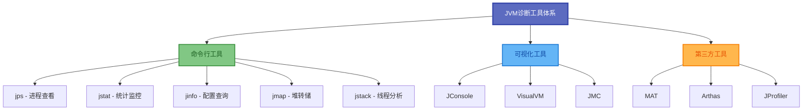
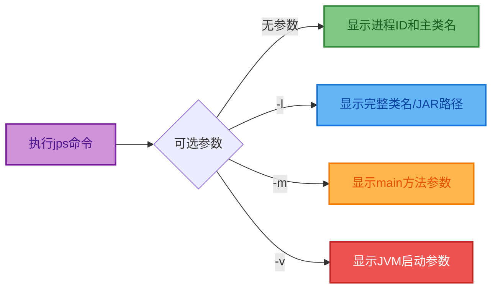
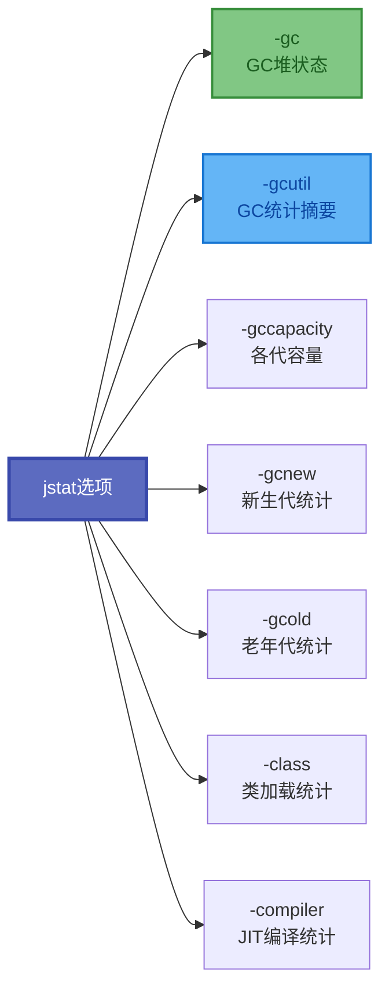
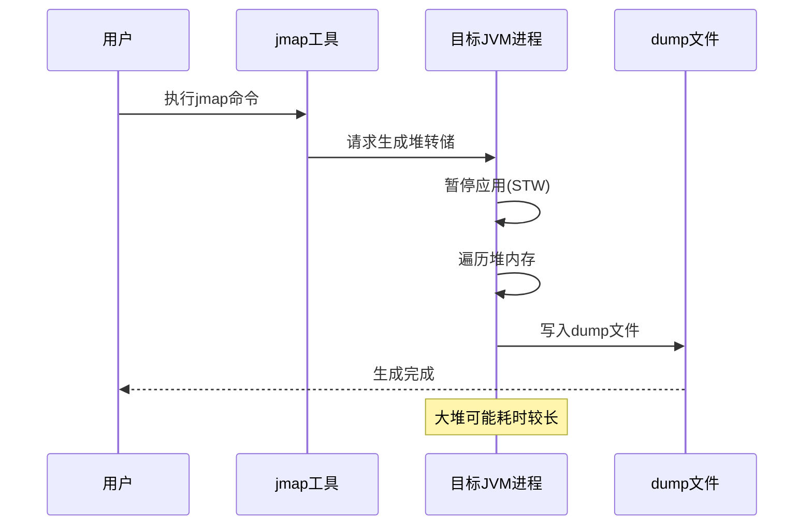
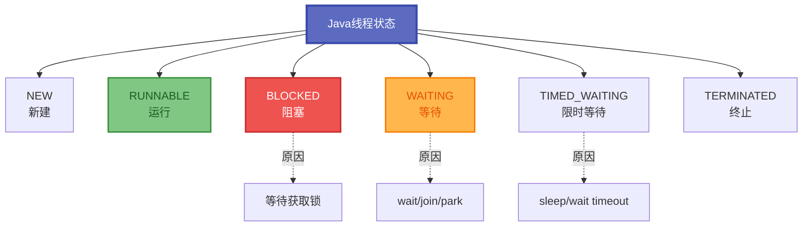
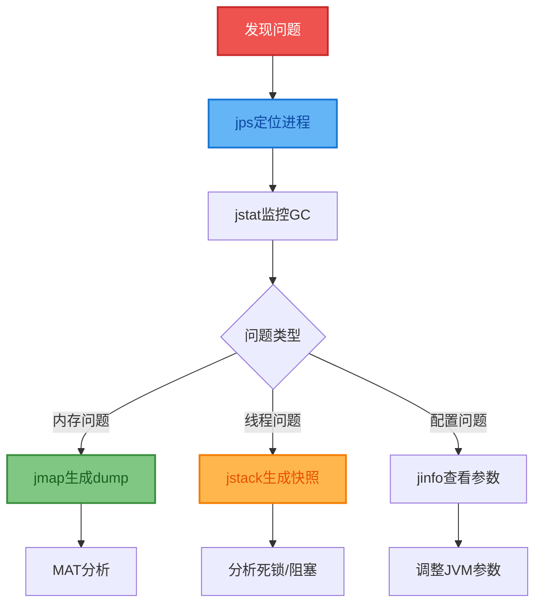

# JDK命令行诊断工具

在Java应用的开发和运维过程中,性能问题、内存泄漏、线程死锁等故障时有发生。掌握JDK自带的命令行诊断工具,能够快速定位问题根源,是每个Java工程师必备的技能。

## JVM诊断工具全景图



所有命令行工具都位于JDK安装目录的`bin`文件夹下,可直接在终端使用。

## jps: Java进程状态查看

`jps`(Java Virtual Machine Process Status Tool)用于列出当前系统中所有运行的Java进程。



### 基础使用示例

```bash
# 查看所有Java进程
$ jps
8234 OrderService
9156 ProductService
9832 Jps
10456 PaymentService

# 显示完整类名
$ jps -l
8234 com.example.order.OrderServiceApplication
9156 com.example.product.ProductServiceApplication
9832 sun.tools.jps.Jps
10456 com.example.payment.PaymentServiceApplication

# 查看JVM启动参数
$ jps -v
8234 OrderService -Xms2g -Xmx2g -XX:+UseG1GC

# 查看传递给main方法的参数
$ jps -m
9156 ProductService --spring.profiles.active=prod --server.port=8081

# 组合使用
$ jps -lmv
```

### jps参数说明

| 参数 | 说明 | 使用场景 |
|------|------|----------|
| 无参 | 显示PID和主类简名 | 快速查看进程 |
| -l | 显示完整类名或JAR路径 | 区分同名应用 |
| -m | 显示main方法参数 | 查看启动配置 |
| -v | 显示JVM参数 | 查看内存配置 |
| -q | 只显示PID | 脚本使用 |

## jstat: 虚拟机统计监控

`jstat`(JVM Statistics Monitoring Tool)实时监控JVM运行状态,包括类加载、内存、GC等信息。

### 命令格式

```bash
jstat -<option> [-t] [-h<lines>] <vmid> [<interval> [<count>]]
```

- `option`: 统计选项(gc、gcutil、class等)
- `-t`: 输出时间戳列
- `-h<lines>`: 每隔多少行输出一次表头
- `vmid`: 虚拟机进程ID
- `interval`: 查询间隔(毫秒)
- `count`: 查询次数

### 常用统计选项



### 实战示例: 监控GC情况

```bash
# 每隔2秒输出一次GC统计,共输出5次,每3行输出表头
$ jstat -gc -t -h3 8234 2000 5

Timestamp   S0C    S1C    S0U    S1U      EC       EU        OC         OU       MC     MU    YGC   YGCT  FGC   FGCT    GCT   
   156.2  25600.0 25600.0  0.0  12800.5 204800.0 156234.3  512000.0   89432.1  51200.0 48932.5   45  0.342    2  0.158  0.500
   158.2  25600.0 25600.0 8234.1   0.0  204800.0  98234.7  512000.0   92341.5  51200.0 49123.8   46  0.351    2  0.158  0.509
   160.2  25600.0 25600.0  0.0  15678.2 204800.0 178945.2  512000.0   95678.3  51200.0 49345.2   47  0.359    2  0.158  0.517

# 输出GC百分比统计
$ jstat -gcutil 8234 1000 3
  S0     S1     E      O      M     CCS    YGC     YGCT    FGC    FGCT     GCT   
  0.00  50.00  76.32  17.46  95.58  92.06     45    0.342     2    0.158    0.500
 32.15   0.00  48.05  18.03  95.71  92.19     46    0.351     2    0.158    0.509
  0.00  61.24  87.36  18.69  96.38  92.63     47    0.359     2    0.158    0.517
```

### 字段说明

| 字段 | 说明 | 单位 |
|------|------|------|
| S0C/S1C | Survivor0/1区容量 | KB |
| S0U/S1U | Survivor0/1区已使用 | KB |
| EC/EU | Eden区容量/已使用 | KB |
| OC/OU | 老年代容量/已使用 | KB |
| MC/MU | 元空间容量/已使用 | KB |
| YGC/YGCT | Young GC次数/总耗时 | 次/秒 |
| FGC/FGCT | Full GC次数/总耗时 | 次/秒 |
| GCT | GC总耗时 | 秒 |

## jinfo: 配置信息查询

`jinfo`(Configuration Info for Java)用于实时查看和动态调整JVM配置参数。

### 查看JVM参数

```bash
# 查看所有JVM参数和系统属性
$ jinfo 8234

# 查看指定参数值
$ jinfo -flag MaxHeapSize 8234
-XX:MaxHeapSize=2147483648

$ jinfo -flag UseG1GC 8234
-XX:+UseG1GC

# 查看所有可管理的参数
$ jinfo -flags 8234
```

### 动态修改参数(无需重启)

```bash
# 开启GC日志打印
$ jinfo -flag +PrintGC 8234

# 关闭GC日志打印
$ jinfo -flag -PrintGC 8234

# 开启显式GC禁用
$ jinfo -flag +DisableExplicitGC 8234

# 修改参数值
$ jinfo -flag HeapDumpPath=/tmp/dumps 8234
```

### 可动态修改的参数

| 参数 | 说明 |
|------|------|
| PrintGC | GC日志打印 |
| PrintGCDetails | GC详细日志 |
| PrintGCTimeStamps | GC时间戳 |
| HeapDumpPath | 堆转储路径 |
| HeapDumpOnOutOfMemoryError | OOM时自动dump |

## jmap: 堆内存转储

`jmap`(Memory Map for Java)生成堆内存快照文件,用于离线分析内存使用情况。



### 生成堆转储文件

```bash
# 生成堆dump文件(二进制格式)
$ jmap -dump:format=b,file=/tmp/heap_dump.hprof 8234
Dumping heap to /tmp/heap_dump.hprof ...
Heap dump file created [1234567890 bytes in 12.345 secs]

# 仅转储存活对象(触发Full GC)
$ jmap -dump:live,format=b,file=/tmp/heap_live.hprof 8234

# 查看堆内存摘要信息
$ jmap -heap 8234
```

### 查看对象统计信息

```bash
# 统计各类对象的数量和占用空间
$ jmap -histo 8234 | head -20

 num     #instances         #bytes  class name
----------------------------------------------
   1:        145678       23456789  [C
   2:         56789       12345678  java.lang.String
   3:         34567        8901234  java.util.HashMap$Node
   4:         23456        7890123  com.example.order.Order
   5:         12345        6789012  java.util.concurrent.ConcurrentHashMap$Node

# 只统计存活对象(会触发Full GC)
$ jmap -histo:live 8234
```

### jmap注意事项

| 注意点 | 说明 |
|--------|------|
| STW影响 | 生成dump时会暂停应用 |
| 大堆耗时 | 堆越大,dump时间越长 |
| 磁盘空间 | dump文件大小约等于堆使用量 |
| 生产谨慎 | 避免频繁执行,避免-histo:live |

## jstack: 线程快照分析

`jstack`(Stack Trace for Java)生成线程堆栈快照,用于诊断死锁、线程阻塞等问题。

### 线程状态分类



### 基础使用

```bash
# 生成线程快照
$ jstack 8234 > thread_dump.txt

# 生成线程快照并显示锁信息
$ jstack -l 8234

# 强制生成快照(进程无响应时)
$ jstack -F 8234
```

### 死锁诊断实战

假设有如下银行转账死锁场景:

```java
public class BankTransfer {
    private static final Object accountA = new Object(); // 账户A锁
    private static final Object accountB = new Object(); // 账户B锁

    public static void main(String[] args) {
        // 线程1: 从A转账到B
        new Thread(() -> {
            synchronized (accountA) {
                System.out.println("Transaction-1 locked Account-A");
                try { Thread.sleep(100); } catch (InterruptedException e) {}
                
                System.out.println("Transaction-1 waiting for Account-B lock...");
                synchronized (accountB) {
                    System.out.println("Transaction-1 completed");
                }
            }
        }, "Transaction-1").start();

        // 线程2: 从B转账到A
        new Thread(() -> {
            synchronized (accountB) {
                System.out.println("Transaction-2 locked Account-B");
                try { Thread.sleep(100); } catch (InterruptedException e) {}
                
                System.out.println("Transaction-2 waiting for Account-A lock...");
                synchronized (accountA) {
                    System.out.println("Transaction-2 completed");
                }
            }
        }, "Transaction-2").start();
    }
}
```

### 使用jstack检测死锁

```bash
$ jstack 8234

Found one Java-level deadlock:
=============================
"Transaction-2":
  waiting to lock monitor 0x00007f8a1c004a00 (object 0x000000076ab12340, a java.lang.Object),
  which is held by "Transaction-1"
  
"Transaction-1":
  waiting to lock monitor 0x00007f8a1c004b50 (object 0x000000076ab12350, a java.lang.Object),
  which is held by "Transaction-2"

Java stack information for the threads listed above:
===================================================
"Transaction-2":
        at BankTransfer.lambda$main$1(BankTransfer.java:24)
        - waiting to lock <0x000000076ab12340> (a java.lang.Object)
        - locked <0x000000076ab12350> (a java.lang.Object)
        at java.lang.Thread.run(Thread.java:750)
        
"Transaction-1":
        at BankTransfer.lambda$main$0(BankTransfer.java:13)
        - waiting to lock <0x000000076ab12350> (a java.lang.Object)
        - locked <0x000000076ab12340> (a java.lang.Object)
        at java.lang.Thread.run(Thread.java:750)

Found 1 deadlock.
```

### 线程状态关键字

| 状态关键字 | 说明 | 可能原因 |
|-----------|------|----------|
| RUNNABLE | 正在运行或等待CPU | 正常执行 |
| BLOCKED | 等待获取锁 | 锁竞争 |
| WAITING | 无限等待 | wait()/join() |
| TIMED_WAITING | 限时等待 | sleep()/wait(timeout) |
| waiting on condition | 条件等待 | park/网络IO |
| waiting for monitor entry | 等待进入同步块 | 锁竞争激烈 |

## 命令行工具使用技巧

### 组合使用流程



### 监控脚本示例

```bash
#!/bin/bash
# gc_monitor.sh - GC监控脚本

PID=$1
INTERVAL=${2:-5000}
COUNT=${3:-100}
LOG_FILE="gc_monitor_$(date +%Y%m%d_%H%M%S).log"

echo "开始监控进程 $PID 的GC情况..."
echo "输出文件: $LOG_FILE"

jstat -gcutil -t $PID $INTERVAL $COUNT | tee $LOG_FILE
```

### 使用建议

1. **组合使用命令**: 先用`jps`定位进程,再用`jstat`监控,最后用`jmap/jstack`诊断
2. **避免频繁dump**: 生成堆转储会暂停应用,生产环境需谨慎操作
3. **保留历史快照**: 定期保存线程快照和GC日志,便于问题回溯
4. **自动化脚本**: 编写监控脚本定时采集jstat数据,绘制趋势图

JDK命令行工具是Java开发者最基础也是最重要的诊断手段。熟练掌握这些工具的使用,能够在问题发生时快速定位和解决,是每个Java工程师的必备技能。