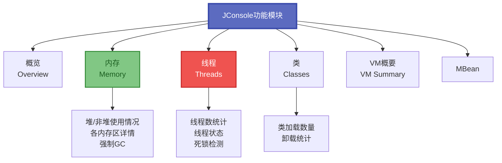
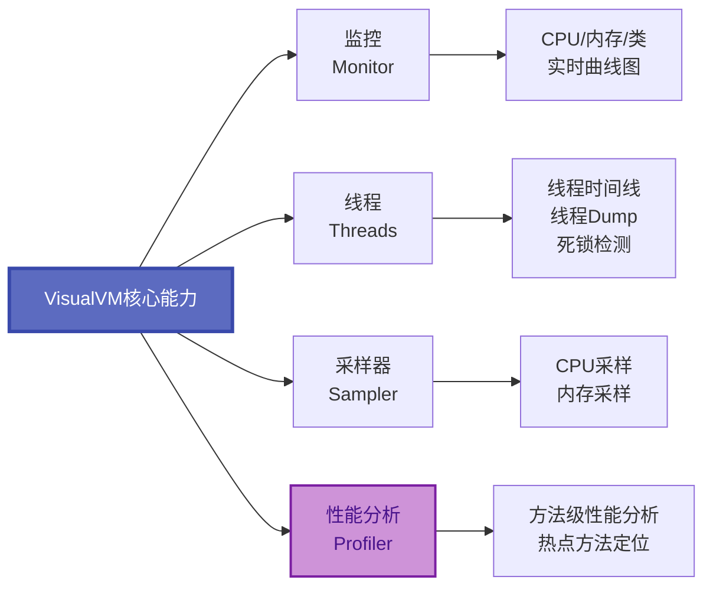
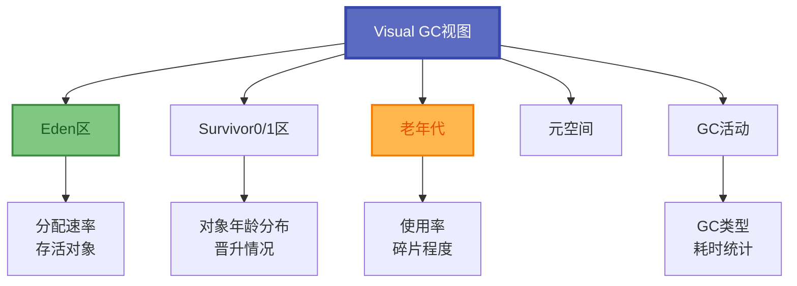
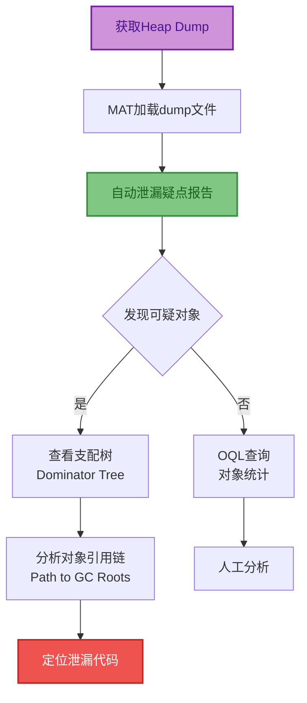
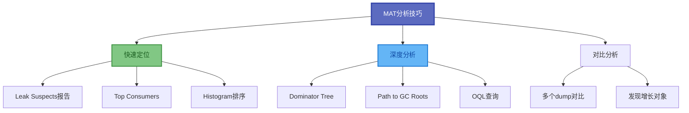
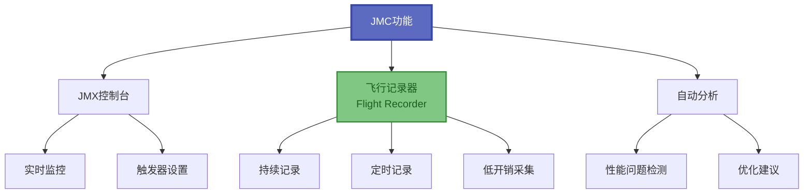
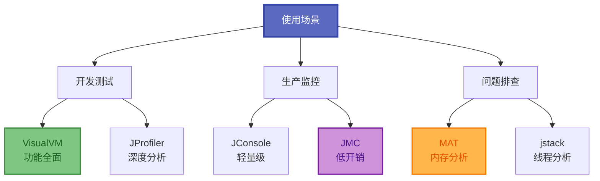

# JVM可视化诊断工具

除了命令行工具,JDK还提供了功能强大的可视化诊断工具。这些工具提供直观的图形界面,能够更便捷地监控和分析Java应用的运行状态。

## JConsole: 监控与管理控制台

JConsole是基于JMX(Java Management Extensions)的图形化监控工具,可直接监控本地和远程Java进程。

### JConsole功能模块



### 启动JConsole

```bash
# 启动JConsole
$ jconsole

# 或在JDK目录下直接运行
$ $JAVA_HOME/bin/jconsole
```

### 远程监控配置

在目标Java应用启动时添加JMX参数:

```bash
java -Dcom.sun.management.jmxremote \
     -Dcom.sun.management.jmxremote.port=9999 \
     -Dcom.sun.management.jmxremote.authenticate=false \
     -Dcom.sun.management.jmxremote.ssl=false \
     -Djava.rmi.server.hostname=192.168.1.100 \
     -jar application.jar
```

然后在JConsole中输入远程地址: `192.168.1.100:9999`

### 生产环境安全配置

```bash
# 启用认证的JMX配置
java -Dcom.sun.management.jmxremote \
     -Dcom.sun.management.jmxremote.port=9999 \
     -Dcom.sun.management.jmxremote.authenticate=true \
     -Dcom.sun.management.jmxremote.ssl=true \
     -Dcom.sun.management.jmxremote.password.file=/path/to/jmxremote.password \
     -Dcom.sun.management.jmxremote.access.file=/path/to/jmxremote.access \
     -jar application.jar
```

### JConsole功能说明

| 标签页 | 功能 | 关注点 |
|--------|------|--------|
| 概览 | CPU、内存、线程、类汇总 | 整体健康状态 |
| 内存 | 各内存区使用曲线 | 内存增长趋势 |
| 线程 | 线程数、线程状态 | 死锁检测 |
| 类 | 类加载/卸载统计 | 类加载器泄漏 |
| VM概要 | JVM配置信息 | 参数确认 |
| MBean | JMX管理Bean | 自定义监控 |

## VisualVM: 多合一诊断工具

VisualVM是功能最强大的JVM可视化工具,整合了多种诊断能力。

### 核心功能矩阵



### 安装与启动

```bash
# JDK 8及之前版本自带VisualVM
$ jvisualvm

# JDK 9+需要单独下载
# 下载地址: https://visualvm.github.io/

# 启动独立版本
$ ./visualvm
```

### VisualVM核心功能

**1. 监控(Monitor)**
- CPU使用率实时曲线
- 堆内存和元空间使用曲线
- 类加载数量变化
- 线程数变化趋势

**2. 线程(Threads)**
- 线程状态时间线
- 线程详细信息
- 死锁检测
- 线程快照生成

**3. 采样器(Sampler)**
- CPU采样: 统计方法执行时间占比
- 内存采样: 统计对象分配情况
- 低开销,适合生产环境

**4. 性能分析(Profiler)**
- 方法级别性能分析
- 调用树和热点方法
- 开销较大,适合开发环境

### VisualVM插件扩展

| 插件 | 功能 | 安装方式 |
|------|------|----------|
| Visual GC | 可视化GC过程 | 工具 → 插件 |
| BTrace | 动态字节码追踪 | 工具 → 插件 |
| Thread Inspector | 增强线程分析 | 工具 → 插件 |
| MBeans | JMX管理 | 工具 → 插件 |

### Visual GC插件

Visual GC插件可以直观地展示各内存区域的变化:



## MAT: 内存分析神器

Eclipse Memory Analyzer Tool(MAT)是专业的堆转储文件分析工具,是分析内存泄漏的首选工具。

### MAT分析流程



### MAT核心视图

**1. Histogram(直方图)**
- 按类统计对象数量和内存占用
- 快速发现占用内存最多的类
- 支持正则表达式过滤

**2. Dominator Tree(支配树)**
- 显示对象的保留堆大小(Retained Heap)
- 对象被回收后能释放的内存量
- 快速定位内存大户

**3. Leak Suspects(泄漏疑点)**
- 自动分析可能的内存泄漏
- 提供问题描述和解决建议
- 适合快速定位问题

**4. Top Consumers(大内存消耗者)**
- 按类、包、类加载器分组统计
- 快速定位占用内存最多的对象

### OQL查询示例

MAT支持使用OQL(Object Query Language)查询堆中的对象:

```sql
-- 查找所有String对象
SELECT * FROM java.lang.String

-- 查找长度超过1000的String
SELECT s, s.value.length 
FROM java.lang.String s 
WHERE s.value.length > 1000

-- 查找特定类的实例
SELECT * FROM com.example.order.Order 
WHERE status = "PENDING"

-- 统计HashMap大小
SELECT h, h.size 
FROM java.util.HashMap h 
WHERE h.size > 100

-- 查找保留堆大于1MB的对象
SELECT * FROM INSTANCEOF java.lang.Object o 
WHERE o.@retainedHeapSize > 1048576
```

### MAT分析技巧



### MAT使用流程

1. **获取堆转储文件**
```bash
# 使用jmap生成
jmap -dump:format=b,file=heap.hprof <pid>

# 或配置OOM自动生成
-XX:+HeapDumpOnOutOfMemoryError
-XX:HeapDumpPath=/path/to/dumps/
```

2. **加载dump文件**
- 打开MAT
- File → Open Heap Dump
- 等待解析完成

3. **查看Leak Suspects报告**
- 自动生成的泄漏分析报告
- 关注"Problem Suspect"部分

4. **分析Dominator Tree**
- 找到保留堆最大的对象
- 展开查看其持有的对象

5. **查看引用链**
- 右键 → Path to GC Roots
- 选择"exclude weak references"
- 找到持有对象的根引用

## JMC: Java Mission Control

JMC(Java Mission Control)是Oracle提供的高级诊断工具,包含飞行记录器功能。

### JMC核心功能



### 启用JFR记录

```bash
# 启动时开启JFR
java -XX:+FlightRecorder \
     -XX:StartFlightRecording=duration=60s,filename=recording.jfr \
     -jar application.jar

# 运行时开启JFR
jcmd <pid> JFR.start duration=60s filename=recording.jfr

# 停止记录
jcmd <pid> JFR.stop name=1
```

### JFR事件类型

| 事件类别 | 包含信息 | 分析用途 |
|---------|----------|----------|
| Java应用 | 方法调用、异常、线程 | 性能分析 |
| JVM内部 | GC、类加载、编译 | JVM调优 |
| 操作系统 | CPU、内存、IO | 资源分析 |
| 自定义 | 业务事件 | 业务监控 |

## 工具选型建议

### 不同场景的工具选择



### 工具对比

| 工具 | 优势 | 适用场景 | 开销 |
|------|------|----------|------|
| JConsole | 简单易用、JDK自带 | 基础监控 | 低 |
| VisualVM | 功能全面、插件丰富 | 开发调试 | 中 |
| MAT | 内存分析专业 | 泄漏排查 | 离线 |
| JMC | 低开销、飞行记录 | 生产环境 | 极低 |

### 使用建议

1. **开发测试环境**: 首选VisualVM,功能全面免费
2. **生产环境监控**: 使用JConsole或JMC,轻量级稳定
3. **内存泄漏排查**: 生成dump后使用MAT离线分析
4. **性能调优**: 使用JMC的飞行记录器,开销最低

可视化工具使JVM监控和分析变得更加直观和高效。根据不同的使用场景选择合适的工具,能够事半功倍地解决问题。