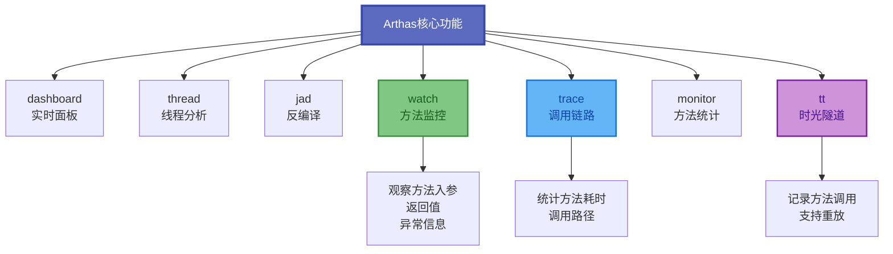
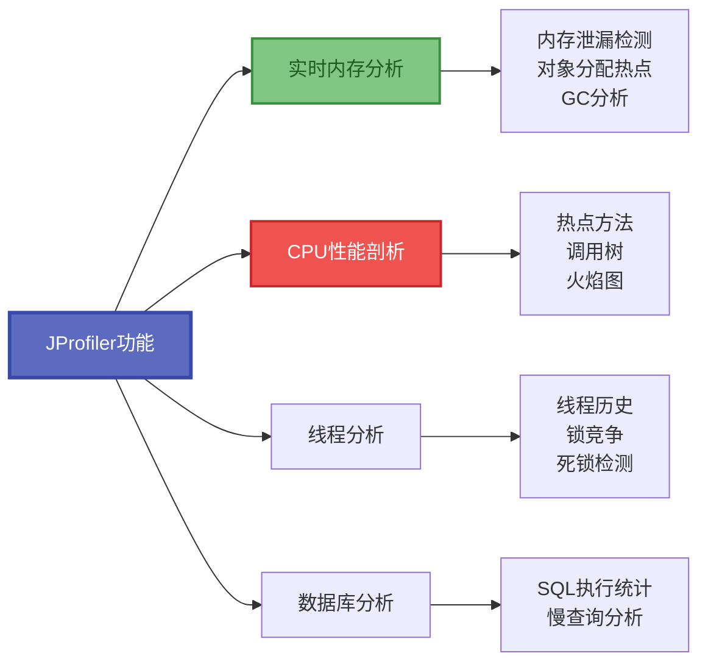

import PaidCTA from '@site/src/components/PaidCTA';

# 第三方诊断工具与实战

除了JDK自带的工具外,还有许多优秀的第三方诊断工具可以帮助我们更高效地排查和解决Java应用问题。本文将介绍Arthas、JProfiler等工具的使用方法,以及完整的故障排查实战流程。

## Arthas: 阿里巴巴开源诊断利器

Arthas是阿里巴巴开源的功能强大的在线诊断工具,无需修改代码即可排查问题。

### Arthas核心功能



### 快速启动

```bash
# 下载arthas启动脚本
$ curl -O https://arthas.aliyun.com/arthas-boot.jar

# 启动并选择进程
$ java -jar arthas-boot.jar
[INFO] arthas-boot version: 3.7.1
[INFO] Found existing java process, please choose one and input the serial number.
* [1]: 8234 com.example.order.OrderServiceApplication
  [2]: 9156 com.example.product.ProductServiceApplication
1

# 连接成功后进入交互界面
[arthas@8234]$
```

### 常用命令详解

**dashboard - 实时监控面板**

```bash
[arthas@8234]$ dashboard

ID   NAME                          GROUP          PRIORITY  STATE     %CPU      DELTA_TIME TIME      INTERRUPT DAEMON
1    main                          main           5         WAITING   0.0       0.000      0:0.031   false     false
2    Reference Handler             system         10        WAITING   0.0       0.000      0:0.000   false     true
3    Finalizer                     system         8         WAITING   0.0       0.000      0:0.000   false     true

Memory                    used      total     max      usage     GC
heap                      128M      256M      1024M    12.50%    
eden_space                64M       128M      256M     25.00%    gc.ps_scavenge.count          45
survivor_space            8M        16M       32M      25.00%    gc.ps_scavenge.time(ms)       342
old_gen                   56M       112M      736M     7.61%     gc.ps_marksweep.count         2
nonheap                   48M       50M       -1       96.00%    gc.ps_marksweep.time(ms)      158
```

**thread - 线程分析**

```bash
# 查看最繁忙的5个线程
[arthas@8234]$ thread -n 5
"http-nio-8080-exec-1" Id=15 RUNNABLE (in native)
    at sun.nio.ch.EPollArrayWrapper.epollWait(Native Method)
    at sun.nio.ch.EPollArrayWrapper.poll(EPollArrayWrapper.java:269)
    ...

# 查看指定线程的堆栈
[arthas@8234]$ thread 15
"http-nio-8080-exec-1" Id=15 RUNNABLE
    at com.example.order.OrderService.processOrder(OrderService.java:45)
    ...

# 查看阻塞其他线程的线程
[arthas@8234]$ thread -b
No most blocking thread found!

# 查看死锁
[arthas@8234]$ thread --state BLOCKED
```

**jad - 反编译**

```bash
# 反编译类
[arthas@8234]$ jad com.example.order.OrderService

ClassLoader:
+-sun.misc.Launcher$AppClassLoader@18b4aac2
  +-sun.misc.Launcher$ExtClassLoader@1dde4cb2

Location:
/app/order-service.jar

/*
 * Decompiled with Arthas
 */
package com.example.order;

public class OrderService {
    public Order processOrder(OrderRequest request) {
        // 反编译后的代码...
    }
}
```

**watch - 方法监控**

```bash
# 观察方法的入参和返回值
[arthas@8234]$ watch com.example.order.OrderService createOrder "{params, returnObj}" -x 3
Press Q or Ctrl+C to abort.
Affect(class count: 1 , method count: 1) cost in 28 ms
ts=2024-11-27 10:15:23; result=@ArrayList[
    @Object[][
        @OrderRequest[id=12345, amount=199.00],
    ],
    @Order[id=67890, status=CREATED],
]

# 只观察抛出异常的调用
[arthas@8234]$ watch com.example.order.OrderService createOrder "{params, throwExp}" -e

# 观察方法执行前后对象变化
[arthas@8234]$ watch com.example.order.OrderService createOrder "{params[0], target.cache.size()}" -b -s
```

**trace - 调用链路追踪**

```bash
# 追踪方法调用路径和耗时
[arthas@8234]$ trace com.example.order.OrderService createOrder
Press Q or Ctrl+C to abort.
Affect(class count: 1 , method count: 1) cost in 45 ms
`---ts=2024-11-27 10:20:15;thread_name=http-nio-8080-exec-1;id=15;is_daemon=true;priority=5;
    `---[156.789ms] com.example.order.OrderService:createOrder()
        +---[0.123ms] com.example.order.OrderValidator:validate()
        +---[45.678ms] com.example.order.OrderRepository:save() #slow
        +---[100.234ms] com.example.payment.PaymentClient:charge() #slow
        `---[10.456ms] com.example.notification.NotificationService:notify()

# 只显示耗时超过100ms的调用
[arthas@8234]$ trace com.example.order.OrderService createOrder '#cost > 100'
```

**monitor - 方法统计**

```bash
# 统计方法调用次数和耗时(每5秒统计一次)
[arthas@8234]$ monitor -c 5 com.example.order.OrderService createOrder
Press Q or Ctrl+C to abort.
Affect(class count: 1 , method count: 1) cost in 28 ms
 timestamp            class                                  method       total  success  fail  avg-rt(ms)  fail-rate
-----------------------------------------------------------------------------------------------------------------------------
 2024-11-27 10:25:00  com.example.order.OrderService         createOrder  150    148      2     45.23       1.33%
 2024-11-27 10:25:05  com.example.order.OrderService         createOrder  163    160      3     52.18       1.84%
```

**tt - 时光隧道**

```bash
# 记录方法调用
[arthas@8234]$ tt -t com.example.order.OrderService createOrder
Press Q or Ctrl+C to abort.
 INDEX   TIMESTAMP            COST(ms)  IS-RET  IS-EXP   OBJECT         CLASS                          METHOD
-----------------------------------------------------------------------------------------------------------------------------
 1000    2024-11-27 10:30:01  45.123    true    false    0x1a2b3c4d     OrderService                   createOrder
 1001    2024-11-27 10:30:02  52.456    true    false    0x1a2b3c4d     OrderService                   createOrder
 1002    2024-11-27 10:30:03  0.000     false   true     0x1a2b3c4d     OrderService                   createOrder

# 查看某次调用的详细信息
[arthas@8234]$ tt -i 1002
 INDEX          1002
 GMT-CREATE     2024-11-27 10:30:03
 COST(ms)       0.000
 IS-RETURN      false
 IS-EXCEPTION   true
 THROW-EXCEPTION   java.lang.NullPointerException
 OBJECT         0x1a2b3c4d
 CLASS          com.example.order.OrderService
 METHOD         createOrder

# 重放某次调用
[arthas@8234]$ tt -i 1000 -p
```

### Arthas命令速查表

| 命令 | 功能 | 常用参数 |
|------|------|----------|
| dashboard | 实时面板 | -i 刷新间隔 |
| thread | 线程分析 | -n 显示前n个, -b 阻塞分析 |
| jad | 反编译 | --source-only 只显示源码 |
| watch | 方法监控 | -x 展开层级, -e 只看异常 |
| trace | 调用追踪 | --skipJDKMethod 跳过JDK方法 |
| monitor | 方法统计 | -c 统计周期 |
| tt | 时光隧道 | -t 记录, -i 查看, -p 重放 |
| sc | 搜索类 | -d 显示详情 |
| sm | 搜索方法 | -d 显示详情 |
| heapdump | 生成dump | --live 只导出存活对象 |
| profiler | 火焰图 | start/stop/getSamples |

## JProfiler: 商业级性能分析工具

JProfiler是功能强大的商业JVM分析工具,提供直观的可视化界面和丰富的分析功能。

### 核心特性



### JProfiler主要功能

**1. CPU分析**
- 采样分析: 低开销定位热点方法
- 调用树: 展示方法调用关系
- 热点方法: 按CPU时间排序的方法列表
- 火焰图: 直观展示CPU时间分布

**2. 内存分析**
- 对象分配热点: 哪些代码创建了最多对象
- 内存增长趋势: 实时监控各类对象增长
- 泄漏检测: 自动识别潜在内存泄漏

**3. 线程分析**
- 线程状态历史: 可视化线程状态变化
- 锁竞争分析: 找出锁等待热点
- 死锁检测: 自动检测死锁

**4. 数据库分析**
- JDBC调用统计
- 慢SQL分析
- 连接池监控

## 故障排查实战流程

<PaidCTA />