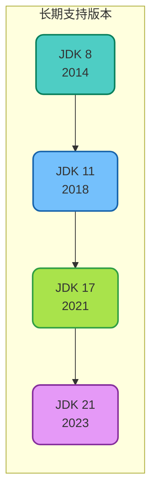
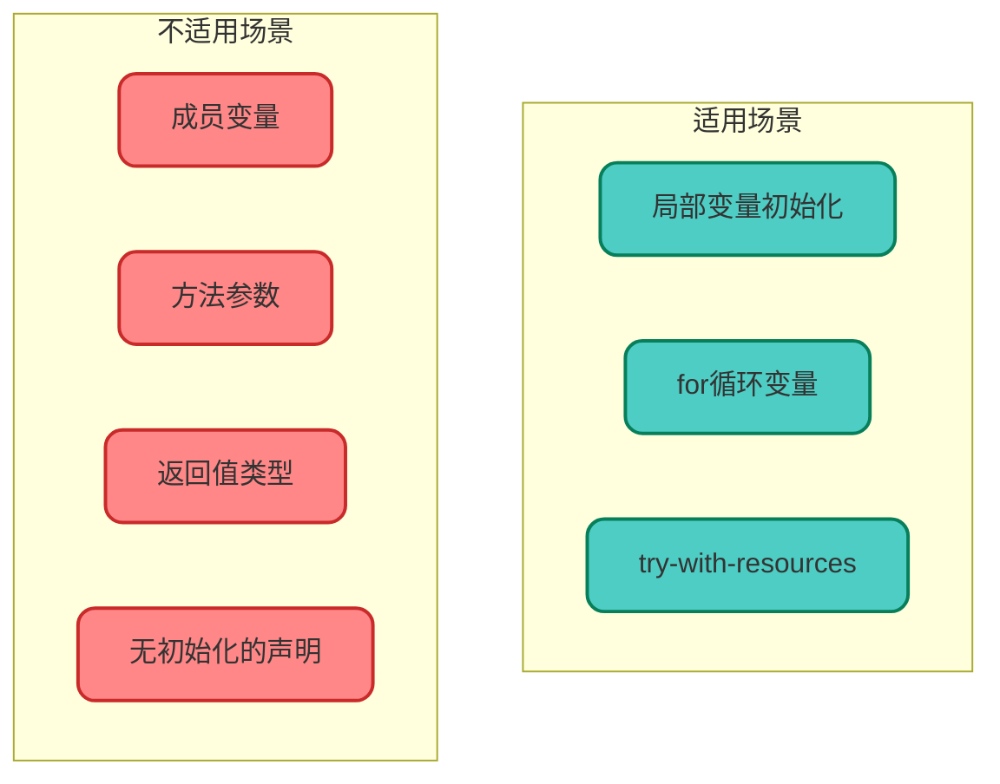
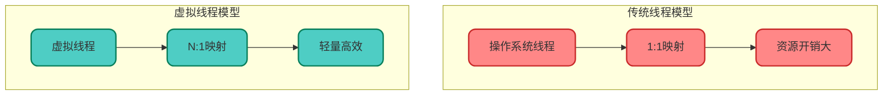
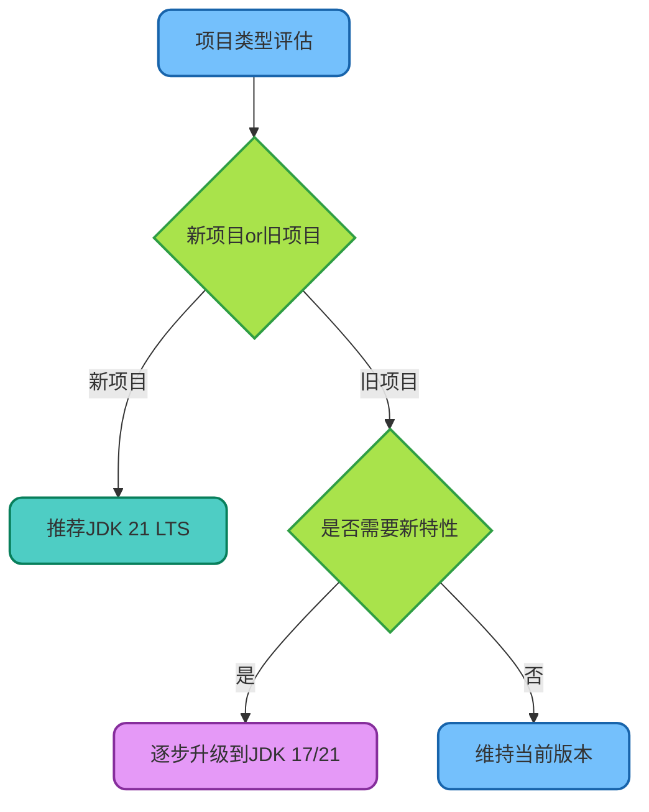

# JDK新版本特性详解

## 版本演进概览

自JDK 8以来，Java语言经历了快速的迭代更新，引入了众多新特性。本文将系统梳理各个重要版本的核心特性，帮助开发者了解Java语言的发展脉络。



## JDK 10：本地变量类型推断

### var关键字的引入

JDK 10引入了本地变量类型推断功能，允许使用`var`关键字声明局部变量，编译器会自动推断变量类型。

**传统写法：**

```java
// 传统方式需要显式指定类型
Map<String, List<OrderItem>> orderItemMap = new HashMap<>();
BufferedReader reader = new BufferedReader(new FileReader("config.txt"));
```

**使用var的新写法：**

```java
// 使用var简化声明
var orderItemMap = new HashMap<String, List<OrderItem>>();
var reader = new BufferedReader(new FileReader("config.txt"));
```

### 使用限制与最佳实践

var并非万能，它有明确的使用边界：



**示例代码：**

```java
public class VarUsageDemo {
    
    // 错误：不能用于成员变量
    // private var name = "test";
    
    public void demonstrateVar() {
        // 正确：局部变量
        var productList = List.of("笔记本", "手机", "平板");
        
        // 正确：for循环
        for (var product : productList) {
            System.out.println(product);
        }
        
        // 正确：try-with-resources
        try (var inputStream = new FileInputStream("data.txt")) {
            // 处理文件
        } catch (IOException e) {
            e.printStackTrace();
        }
        
        // 错误：无初始化值无法推断类型
        // var result;
    }
}
```

**本质说明：** var只是语法糖，编译时会被替换为实际类型，不影响运行时性能。

## JDK 12-14：Switch表达式增强

### 箭头语法与yield关键字

传统的switch语句冗长且容易忘记break，新版本进行了全面改进。

**传统写法的问题：**

```java
// 旧版switch语句
public String getQuarterName(int month) {
    String quarter;
    switch (month) {
        case 1: case 2: case 3:
            quarter = "第一季度";
            break;
        case 4: case 5: case 6:
            quarter = "第二季度";
            break;
        case 7: case 8: case 9:
            quarter = "第三季度";
            break;
        case 10: case 11: case 12:
            quarter = "第四季度";
            break;
        default:
            quarter = "无效月份";
            break;
    }
    return quarter;
}
```

**新版switch表达式：**

```java
// 新版switch表达式
public String getQuarterName(int month) {
    return switch (month) {
        case 1, 2, 3 -> "第一季度";
        case 4, 5, 6 -> "第二季度";
        case 7, 8, 9 -> "第三季度";
        case 10, 11, 12 -> "第四季度";
        default -> "无效月份";
    };
}
```

### yield关键字处理复杂逻辑

当case分支需要执行多条语句时，使用yield返回值：

```java
public double calculateBonus(String level) {
    return switch (level) {
        case "A" -> 10000.0;
        case "B" -> 8000.0;
        case "C" -> {
            // 复杂计算逻辑
            double base = 5000.0;
            double extra = Math.random() * 1000;
            yield base + extra;
        }
        default -> 3000.0;
    };
}
```

**yield与return的区别：**
- `return`：跳出整个方法
- `yield`：仅跳出当前switch块，返回表达式的值

## JDK 13-15：文本块

### 多行字符串的优雅写法

处理SQL、JSON、HTML等多行文本时，文本块大大提升了可读性。

**传统写法：**

```java
// 传统方式处理SQL
String sql = "SELECT p.product_id, p.product_name, p.price\n" +
             "FROM t_product p\n" +
             "INNER JOIN t_category c ON p.category_id = c.id\n" +
             "WHERE p.status = 'ACTIVE'\n" +
             "ORDER BY p.create_time DESC";
```

**文本块写法：**

```java
// 使用文本块
String sql = """
    SELECT p.product_id, p.product_name, p.price
    FROM t_product p
    INNER JOIN t_category c ON p.category_id = c.id
    WHERE p.status = 'ACTIVE'
    ORDER BY p.create_time DESC
    """;
```

### JSON和HTML处理示例

```java
// JSON配置
String jsonConfig = """
    {
        "database": {
            "host": "localhost",
            "port": 3306,
            "name": "product_db"
        },
        "cache": {
            "enabled": true,
            "ttl": 3600
        }
    }
    """;

// HTML模板
String htmlTemplate = """
    <div class="product-card">
        <h3>%s</h3>
        <p class="price">¥%.2f</p>
        <button>立即购买</button>
    </div>
    """.formatted(productName, price);
```

## JDK 14-16：Records记录类

### 简化数据载体类

Record是专门用于承载数据的不可变类，自动生成构造器、getter、equals、hashCode和toString方法。

**传统POJO类：**

```java
// 传统方式需要大量样板代码
public final class ProductInfo {
    private final Long id;
    private final String name;
    private final BigDecimal price;
    
    public ProductInfo(Long id, String name, BigDecimal price) {
        this.id = id;
        this.name = name;
        this.price = price;
    }
    
    public Long getId() { return id; }
    public String getName() { return name; }
    public BigDecimal getPrice() { return price; }
    
    @Override
    public boolean equals(Object o) { /* ... */ }
    
    @Override
    public int hashCode() { /* ... */ }
    
    @Override
    public String toString() { /* ... */ }
}
```

**使用Record：**

```java
// 一行代码搞定
public record ProductInfo(Long id, String name, BigDecimal price) {}
```

### Record的高级用法

```java
// 自定义构造器进行参数校验
public record OrderItem(
    Long productId, 
    String productName, 
    int quantity, 
    BigDecimal unitPrice
) {
    // 紧凑构造器
    public OrderItem {
        if (quantity <= 0) {
            throw new IllegalArgumentException("数量必须大于0");
        }
        if (unitPrice.compareTo(BigDecimal.ZERO) < 0) {
            throw new IllegalArgumentException("单价不能为负数");
        }
    }
    
    // 自定义方法
    public BigDecimal totalAmount() {
        return unitPrice.multiply(BigDecimal.valueOf(quantity));
    }
}
```

## JDK 14-16：instanceof模式匹配

### 简化类型检查与转换

传统的类型检查需要先判断再强转，模式匹配一步到位。

**传统写法：**

```java
public void processMessage(Object message) {
    if (message instanceof TextMessage) {
        TextMessage textMsg = (TextMessage) message;
        System.out.println("文本消息: " + textMsg.getContent());
    } else if (message instanceof ImageMessage) {
        ImageMessage imgMsg = (ImageMessage) message;
        System.out.println("图片消息: " + imgMsg.getImageUrl());
    }
}
```

**模式匹配写法：**

```java
public void processMessage(Object message) {
    if (message instanceof TextMessage textMsg) {
        System.out.println("文本消息: " + textMsg.getContent());
    } else if (message instanceof ImageMessage imgMsg) {
        System.out.println("图片消息: " + imgMsg.getImageUrl());
    }
}
```

## JDK 15-17：封闭类

### 控制类的继承层次

封闭类（Sealed Classes）允许精确控制哪些类可以继承或实现。

```java
// 定义封闭类，仅允许特定类继承
public sealed abstract class PaymentMethod 
    permits CreditCard, DebitCard, DigitalWallet {
    
    public abstract void processPayment(BigDecimal amount);
}

// 允许的子类
public final class CreditCard extends PaymentMethod {
    @Override
    public void processPayment(BigDecimal amount) {
        System.out.println("信用卡支付: " + amount);
    }
}

public final class DebitCard extends PaymentMethod {
    @Override
    public void processPayment(BigDecimal amount) {
        System.out.println("储蓄卡支付: " + amount);
    }
}

public non-sealed class DigitalWallet extends PaymentMethod {
    @Override
    public void processPayment(BigDecimal amount) {
        System.out.println("数字钱包支付: " + amount);
    }
}
```

**子类修饰符说明：**

| 修饰符 | 含义 |
|--------|------|
| `final` | 不可再被继承 |
| `sealed` | 可被继承，但需继续指定允许的子类 |
| `non-sealed` | 开放继承，任何类都可继承 |

## JDK 17：Switch模式匹配

### 更强大的类型匹配

JDK 17将模式匹配引入switch表达式，支持对任意类型进行匹配。

```java
public String formatValue(Object value) {
    return switch (value) {
        case Integer i -> "整数: " + i;
        case Long l -> "长整数: " + l;
        case Double d -> "浮点数: %.2f".formatted(d);
        case String s -> "字符串: " + s;
        case List<?> list -> "列表，包含 " + list.size() + " 个元素";
        case null -> "空值";
        default -> "未知类型: " + value.getClass().getSimpleName();
    };
}
```

### 带条件的模式匹配

```java
public String evaluateScore(Object score) {
    return switch (score) {
        case Integer i when i >= 90 -> "优秀";
        case Integer i when i >= 80 -> "良好";
        case Integer i when i >= 60 -> "及格";
        case Integer i -> "不及格";
        case String s when s.equals("免试") -> "免试通过";
        case null -> "未参加考试";
        default -> "无效成绩";
    };
}
```

## JDK 21：虚拟线程

### 轻量级并发的革命

虚拟线程（Virtual Threads）是JDK 21引入的重大特性，提供了轻量级的线程实现。



**创建虚拟线程的方式：**

```java
public class VirtualThreadDemo {
    
    public void runWithVirtualThread() throws Exception {
        // 方式一：直接启动
        Thread.startVirtualThread(() -> {
            System.out.println("虚拟线程执行中: " + Thread.currentThread());
        });
        
        // 方式二：使用Builder
        Thread vThread = Thread.ofVirtual()
            .name("order-processor")
            .start(() -> processOrder());
        
        // 方式三：使用ExecutorService
        try (var executor = Executors.newVirtualThreadPerTaskExecutor()) {
            IntStream.range(0, 10000).forEach(i -> {
                executor.submit(() -> {
                    // 每个任务一个虚拟线程
                    handleRequest(i);
                    return i;
                });
            });
        }
    }
    
    private void processOrder() {
        // 订单处理逻辑
    }
    
    private void handleRequest(int requestId) {
        // 请求处理逻辑
    }
}
```

### 虚拟线程的优势

| 特性 | 传统线程 | 虚拟线程 |
|------|---------|---------|
| 内存占用 | 约1MB栈空间 | 约几KB |
| 创建数量 | 通常几百到几千 | 可达数百万 |
| 上下文切换 | 操作系统调度，开销大 | JVM调度，开销小 |
| 适用场景 | CPU密集型任务 | IO密集型任务 |

## 版本选型建议



**LTS版本推荐：**
- **JDK 8**：仍是最广泛使用的版本，生态成熟
- **JDK 11**：第一个现代LTS版本，模块化基础
- **JDK 17**：主流新项目的首选
- **JDK 21**：最新LTS版本，虚拟线程生产可用

掌握这些新特性，不仅能编写更简洁的代码，也能在技术面试中展现对Java语言发展的深入理解。
