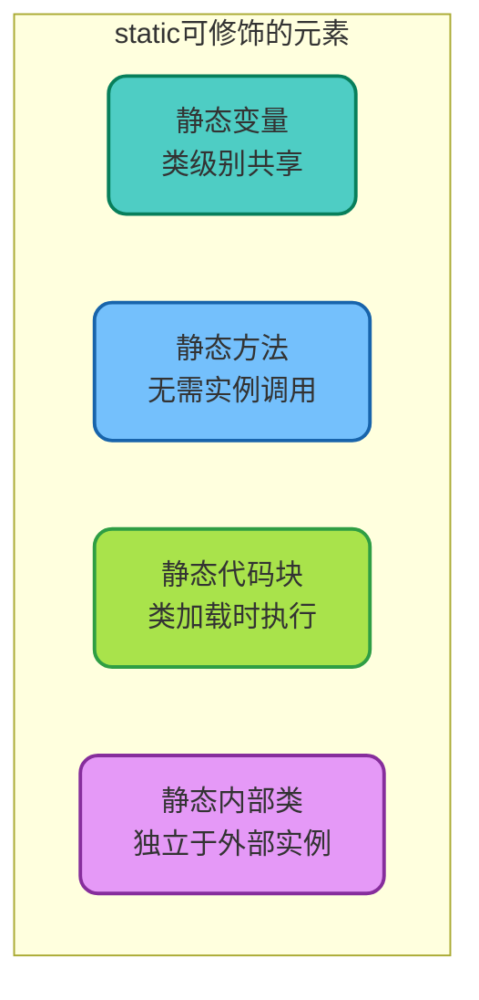
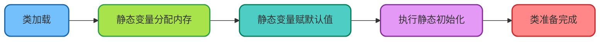
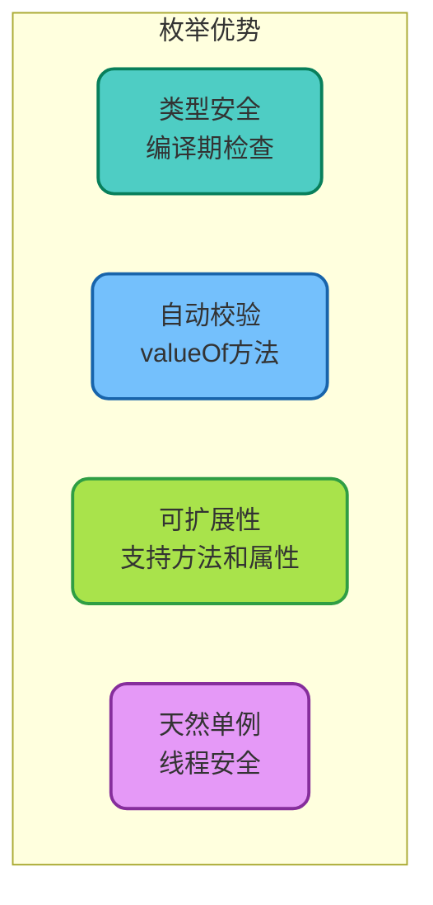

# static关键字与枚举详解

## static关键字概述

在Java中，`static`关键字是一个非常重要的修饰符，它改变了成员的所属关系——从属于对象变为从属于类本身。理解static的使用场景和限制，对于编写高质量的Java代码至关重要。



## 静态变量

### 定义与特点

静态变量属于类本身，而非类的任何特定实例。所有实例共享同一个静态变量。

```java
/**
 * 在线用户计数器示例
 * 演示静态变量的共享特性
 */
public class OnlineUserCounter {
    // 静态变量：所有实例共享
    private static int onlineCount = 0;
    
    // 静态常量：通常使用public static final
    public static final int MAX_ONLINE_USERS = 10000;
    public static final String SERVER_VERSION = "v2.1.0";
    
    private String userId;
    
    public OnlineUserCounter(String userId) {
        this.userId = userId;
        onlineCount++;
        System.out.println("用户 " + userId + " 上线，当前在线人数：" + onlineCount);
    }
    
    public void logout() {
        onlineCount--;
        System.out.println("用户 " + userId + " 下线，当前在线人数：" + onlineCount);
    }
    
    public static int getOnlineCount() {
        return onlineCount;
    }
}

// 使用示例
public class Main {
    public static void main(String[] args) {
        OnlineUserCounter user1 = new OnlineUserCounter("U001");  // 输出：在线人数：1
        OnlineUserCounter user2 = new OnlineUserCounter("U002");  // 输出：在线人数：2
        OnlineUserCounter user3 = new OnlineUserCounter("U003");  // 输出：在线人数：3
        
        user1.logout();  // 输出：在线人数：2
        
        // 直接通过类名访问
        System.out.println("服务器版本：" + OnlineUserCounter.SERVER_VERSION);
    }
}
```

### 静态变量的初始化时机



## 静态方法

### 定义与使用场景

静态方法属于类而非实例，常用于工具类方法和工厂方法。

```java
/**
 * 金额计算工具类
 * 演示静态方法的典型应用
 */
public class AmountCalculator {
    
    // 私有构造器防止实例化
    private AmountCalculator() {}
    
    /**
     * 计算折扣后价格
     */
    public static BigDecimal calculateDiscount(BigDecimal originalPrice, double discountRate) {
        if (originalPrice == null || originalPrice.compareTo(BigDecimal.ZERO) < 0) {
            throw new IllegalArgumentException("原价不能为空或负数");
        }
        if (discountRate < 0 || discountRate > 1) {
            throw new IllegalArgumentException("折扣率必须在0-1之间");
        }
        return originalPrice.multiply(BigDecimal.valueOf(1 - discountRate))
                           .setScale(2, RoundingMode.HALF_UP);
    }
    
    /**
     * 计算含税价格
     */
    public static BigDecimal calculateWithTax(BigDecimal price, double taxRate) {
        return price.multiply(BigDecimal.valueOf(1 + taxRate))
                   .setScale(2, RoundingMode.HALF_UP);
    }
    
    /**
     * 格式化金额显示
     */
    public static String formatAmount(BigDecimal amount) {
        return "¥" + amount.setScale(2, RoundingMode.HALF_UP).toString();
    }
}

// 使用示例
BigDecimal original = new BigDecimal("199.00");
BigDecimal discounted = AmountCalculator.calculateDiscount(original, 0.2);
System.out.println(AmountCalculator.formatAmount(discounted));  // 输出：¥159.20
```

### 静态方法的限制

```java
public class StaticMethodLimitation {
    private int instanceVar = 10;
    private static int staticVar = 20;
    
    public static void staticMethod() {
        // 正确：可以访问静态成员
        System.out.println(staticVar);
        
        // 错误：不能直接访问实例成员
        // System.out.println(instanceVar);
        
        // 错误：不能使用this关键字
        // System.out.println(this.instanceVar);
        
        // 正确：通过对象实例访问
        StaticMethodLimitation obj = new StaticMethodLimitation();
        System.out.println(obj.instanceVar);
    }
}
```

## 静态代码块

### 执行时机与用途

静态代码块在类加载时执行，常用于复杂的静态变量初始化。

```java
/**
 * 数据库连接池配置示例
 * 演示静态代码块的使用
 */
public class DatabaseConfig {
    
    public static final String JDBC_URL;
    public static final String USERNAME;
    public static final int CONNECTION_POOL_SIZE;
    public static final Map<String, String> PROPERTIES;
    
    // 静态代码块：加载配置文件
    static {
        System.out.println("正在初始化数据库配置...");
        
        Properties props = new Properties();
        try (InputStream input = DatabaseConfig.class
                .getClassLoader()
                .getResourceAsStream("database.properties")) {
            
            if (input != null) {
                props.load(input);
            }
        } catch (IOException e) {
            System.err.println("加载配置文件失败，使用默认配置");
        }
        
        // 从配置文件读取或使用默认值
        JDBC_URL = props.getProperty("jdbc.url", "jdbc:mysql://localhost:3306/mydb");
        USERNAME = props.getProperty("jdbc.username", "root");
        CONNECTION_POOL_SIZE = Integer.parseInt(
            props.getProperty("pool.size", "10")
        );
        
        // 初始化不可变Map
        Map<String, String> tempMap = new HashMap<>();
        tempMap.put("driver", "com.mysql.cj.jdbc.Driver");
        tempMap.put("encoding", "UTF-8");
        PROPERTIES = Collections.unmodifiableMap(tempMap);
        
        System.out.println("数据库配置初始化完成");
    }
}
```

### 多个静态代码块的执行顺序

```java
public class StaticBlockOrder {
    
    static {
        System.out.println("第一个静态代码块");
    }
    
    private static String message = initMessage();
    
    private static String initMessage() {
        System.out.println("静态变量初始化");
        return "Hello";
    }
    
    static {
        System.out.println("第二个静态代码块");
    }
    
    // 输出顺序：
    // 第一个静态代码块
    // 静态变量初始化
    // 第二个静态代码块
}
```

## 静态内部类

### 特点与应用场景

静态内部类可以独立于外部类实例存在，常用于构建器模式。

```java
/**
 * 订单构建器示例
 * 演示静态内部类的典型应用
 */
public class Order {
    private final Long orderId;
    private final String customerName;
    private final List<String> items;
    private final BigDecimal totalAmount;
    private final LocalDateTime createTime;
    
    private Order(Builder builder) {
        this.orderId = builder.orderId;
        this.customerName = builder.customerName;
        this.items = builder.items;
        this.totalAmount = builder.totalAmount;
        this.createTime = builder.createTime;
    }
    
    // 静态内部类：Builder
    public static class Builder {
        private Long orderId;
        private String customerName;
        private List<String> items = new ArrayList<>();
        private BigDecimal totalAmount = BigDecimal.ZERO;
        private LocalDateTime createTime = LocalDateTime.now();
        
        public Builder orderId(Long orderId) {
            this.orderId = orderId;
            return this;
        }
        
        public Builder customerName(String customerName) {
            this.customerName = customerName;
            return this;
        }
        
        public Builder addItem(String item) {
            this.items.add(item);
            return this;
        }
        
        public Builder totalAmount(BigDecimal amount) {
            this.totalAmount = amount;
            return this;
        }
        
        public Order build() {
            if (orderId == null || customerName == null) {
                throw new IllegalStateException("订单ID和客户名称不能为空");
            }
            return new Order(this);
        }
    }
    
    // Getters...
}

// 使用示例
Order order = new Order.Builder()
    .orderId(1001L)
    .customerName("张三")
    .addItem("笔记本电脑")
    .addItem("无线鼠标")
    .totalAmount(new BigDecimal("5999.00"))
    .build();
```

## 枚举类型详解

### 枚举的基本使用

枚举是一种特殊的类，用于定义一组固定的常量集合。

```java
/**
 * 订单状态枚举
 */
public enum OrderStatus {
    PENDING("待支付"),
    PAID("已支付"),
    SHIPPED("已发货"),
    DELIVERED("已送达"),
    CANCELLED("已取消");
    
    private final String displayName;
    
    OrderStatus(String displayName) {
        this.displayName = displayName;
    }
    
    public String getDisplayName() {
        return displayName;
    }
}

// 使用示例
OrderStatus status = OrderStatus.PAID;
System.out.println(status.getDisplayName());  // 输出：已支付
```

### 枚举的核心优势



### 枚举实现策略模式

枚举可以定义抽象方法，每个枚举常量提供不同实现：

```java
/**
 * 价格计算策略枚举
 * 演示枚举实现策略模式
 */
public enum PricingStrategy {
    
    NORMAL("普通定价") {
        @Override
        public BigDecimal calculate(BigDecimal basePrice, int quantity) {
            return basePrice.multiply(BigDecimal.valueOf(quantity));
        }
    },
    
    BULK_DISCOUNT("批量折扣") {
        @Override
        public BigDecimal calculate(BigDecimal basePrice, int quantity) {
            BigDecimal total = basePrice.multiply(BigDecimal.valueOf(quantity));
            if (quantity >= 100) {
                return total.multiply(BigDecimal.valueOf(0.7));  // 7折
            } else if (quantity >= 50) {
                return total.multiply(BigDecimal.valueOf(0.8));  // 8折
            } else if (quantity >= 10) {
                return total.multiply(BigDecimal.valueOf(0.9));  // 9折
            }
            return total;
        }
    },
    
    VIP_PRICING("VIP定价") {
        @Override
        public BigDecimal calculate(BigDecimal basePrice, int quantity) {
            return basePrice.multiply(BigDecimal.valueOf(quantity))
                           .multiply(BigDecimal.valueOf(0.85));  // VIP享85折
        }
    };
    
    private final String description;
    
    PricingStrategy(String description) {
        this.description = description;
    }
    
    public abstract BigDecimal calculate(BigDecimal basePrice, int quantity);
    
    public String getDescription() {
        return description;
    }
}

// 使用示例
BigDecimal basePrice = new BigDecimal("100.00");
int quantity = 50;

for (PricingStrategy strategy : PricingStrategy.values()) {
    BigDecimal result = strategy.calculate(basePrice, quantity);
    System.out.printf("%s: ¥%.2f%n", strategy.getDescription(), result);
}
// 输出：
// 普通定价: ¥5000.00
// 批量折扣: ¥4000.00
// VIP定价: ¥4250.00
```

### 枚举的valueOf与参数校验

```java
public class EnumValidationDemo {
    
    /**
     * 安全的枚举转换方法
     */
    public static <T extends Enum<T>> T safeValueOf(Class<T> enumClass, String value) {
        try {
            return Enum.valueOf(enumClass, value.toUpperCase());
        } catch (IllegalArgumentException | NullPointerException e) {
            return null;
        }
    }
    
    /**
     * 带默认值的枚举转换
     */
    public static <T extends Enum<T>> T valueOfOrDefault(
            Class<T> enumClass, String value, T defaultValue) {
        T result = safeValueOf(enumClass, value);
        return result != null ? result : defaultValue;
    }
    
    public static void main(String[] args) {
        // 正常转换
        OrderStatus status1 = OrderStatus.valueOf("PAID");
        System.out.println(status1);  // PAID
        
        // 非法参数会抛出异常
        try {
            OrderStatus status2 = OrderStatus.valueOf("UNKNOWN");
        } catch (IllegalArgumentException e) {
            System.out.println("无效的状态值");
        }
        
        // 使用安全转换
        OrderStatus status3 = safeValueOf(OrderStatus.class, "invalid");
        System.out.println(status3);  // null
        
        // 使用带默认值的转换
        OrderStatus status4 = valueOfOrDefault(
            OrderStatus.class, "invalid", OrderStatus.PENDING);
        System.out.println(status4);  // PENDING
    }
}
```

### 枚举实现单例模式

枚举是实现单例模式的最佳方式，天然防止反射和序列化攻击：

```java
/**
 * 应用配置单例
 * 使用枚举实现线程安全的单例
 */
public enum AppConfig {
    
    INSTANCE;
    
    private String appName;
    private String version;
    private Map<String, String> settings;
    
    AppConfig() {
        // 初始化配置
        this.appName = "MyApplication";
        this.version = "1.0.0";
        this.settings = new ConcurrentHashMap<>();
        loadDefaultSettings();
    }
    
    private void loadDefaultSettings() {
        settings.put("maxConnections", "100");
        settings.put("timeout", "30000");
        settings.put("debugMode", "false");
    }
    
    public String getAppName() {
        return appName;
    }
    
    public String getSetting(String key) {
        return settings.get(key);
    }
    
    public void setSetting(String key, String value) {
        settings.put(key, value);
    }
}

// 使用示例
AppConfig config = AppConfig.INSTANCE;
System.out.println(config.getAppName());
System.out.println(config.getSetting("timeout"));
```

### 枚举的底层实现原理

枚举在编译后实际上是一个继承自`java.lang.Enum`的`final`类：

```java
// 编译前
public enum Season {
    SPRING, SUMMER, AUTUMN, WINTER
}

// 反编译后的等效代码
public final class Season extends Enum<Season> {
    public static final Season SPRING;
    public static final Season SUMMER;
    public static final Season AUTUMN;
    public static final Season WINTER;
    
    private static final Season[] VALUES;
    
    static {
        SPRING = new Season("SPRING", 0);
        SUMMER = new Season("SUMMER", 1);
        AUTUMN = new Season("AUTUMN", 2);
        WINTER = new Season("WINTER", 3);
        VALUES = new Season[]{SPRING, SUMMER, AUTUMN, WINTER};
    }
    
    private Season(String name, int ordinal) {
        super(name, ordinal);
    }
    
    public static Season[] values() {
        return VALUES.clone();
    }
    
    public static Season valueOf(String name) {
        return Enum.valueOf(Season.class, name);
    }
}
```

**关键特性：**
- `final`类：不可被继承
- 私有构造器：只能在内部创建实例
- 静态初始化：类加载时创建所有枚举实例
- 天然线程安全：静态初始化由JVM保证

## static与枚举的最佳实践

| 场景 | 推荐方案 | 说明 |
|------|---------|------|
| 常量定义 | 枚举或static final | 有关联性的常量用枚举 |
| 工具方法 | 静态方法 | 无状态的工具类 |
| 单例模式 | 枚举 | 最安全的单例实现 |
| 策略模式 | 枚举+抽象方法 | 固定策略集合 |
| 全局计数器 | 静态变量 | 注意线程安全 |
| 复杂初始化 | 静态代码块 | 加载配置文件等 |

理解static和枚举的使用方式，能够帮助编写更加优雅和健壮的Java代码。
