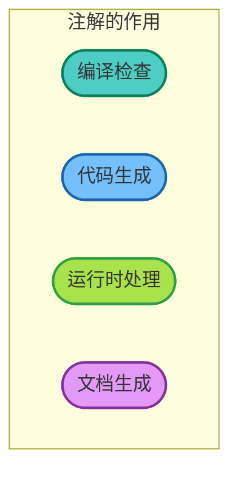
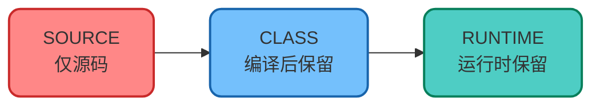
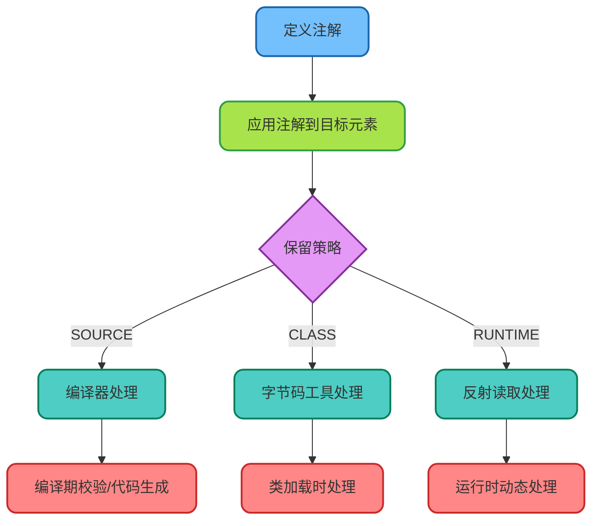

# 注解机制详解

## 注解概述

Java注解（Annotation）是一种元数据机制，用于为代码添加额外的信息。这些信息可以在编译时、类加载时或运行时被读取和处理。注解从Java 5开始引入，已成为现代Java开发中不可或缺的特性。



## 内置注解

### 常用标准注解

Java提供了几个内置注解，用于常见的编译期检查：

```java
public class BuiltInAnnotationDemo {
    
    /**
     * @Override：确保方法正确重写父类方法
     * 如果方法签名不匹配，编译器会报错
     */
    @Override
    public String toString() {
        return "BuiltInAnnotationDemo";
    }
    
    /**
     * @Deprecated：标记已过时的方法
     * 使用此方法时编译器会发出警告
     */
    @Deprecated(since = "2.0", forRemoval = true)
    public void oldMethod() {
        // 旧的实现
    }
    
    /**
     * @SuppressWarnings：抑制编译器警告
     */
    @SuppressWarnings("unchecked")
    public List<String> getRawList() {
        List list = new ArrayList();
        list.add("item");
        return list;
    }
    
    /**
     * @FunctionalInterface：标记函数式接口
     * 确保接口只有一个抽象方法
     */
    @FunctionalInterface
    interface Calculator {
        int calculate(int a, int b);
    }
}
```

## 元注解详解

元注解是用于定义其他注解的注解，共有五个核心元注解。

### @Target：指定使用范围

```java
import java.lang.annotation.Target;
import java.lang.annotation.ElementType;

/**
 * 定义可用于类和方法的注解
 */
@Target({ElementType.TYPE, ElementType.METHOD})
public @interface ServiceEndpoint {
    String value() default "";
}
```

**ElementType可选值：**

| 值 | 适用范围 |
|------|---------|
| `TYPE` | 类、接口、枚举 |
| `METHOD` | 方法 |
| `FIELD` | 字段 |
| `PARAMETER` | 方法参数 |
| `CONSTRUCTOR` | 构造器 |
| `LOCAL_VARIABLE` | 局部变量 |
| `ANNOTATION_TYPE` | 注解类型 |
| `PACKAGE` | 包 |
| `TYPE_PARAMETER` | 类型参数（泛型） |
| `TYPE_USE` | 类型使用处 |

### @Retention：指定保留策略

```java
import java.lang.annotation.Retention;
import java.lang.annotation.RetentionPolicy;

/**
 * 运行时保留，可通过反射读取
 */
@Retention(RetentionPolicy.RUNTIME)
public @interface Loggable {
    String module() default "default";
}
```

**RetentionPolicy选项：**



| 策略 | 描述 | 使用场景 |
|------|------|---------|
| `SOURCE` | 仅在源码中存在，编译后丢弃 | @Override, @SuppressWarnings |
| `CLASS` | 编译后保留在class文件中，运行时不可见 | 默认值，用于字节码工具 |
| `RUNTIME` | 运行时可通过反射读取 | Spring、自定义运行时注解 |

### @Documented：包含在Javadoc中

```java
import java.lang.annotation.Documented;

/**
 * 此注解会出现在生成的API文档中
 */
@Documented
@Retention(RetentionPolicy.RUNTIME)
public @interface ApiVersion {
    String value();
}
```

### @Inherited：允许继承

```java
import java.lang.annotation.Inherited;

/**
 * 子类可以继承父类上的此注解
 */
@Inherited
@Retention(RetentionPolicy.RUNTIME)
@Target(ElementType.TYPE)
public @interface Auditable {
    String author() default "";
}

// 使用示例
@Auditable(author = "张三")
public class BaseService {}

// 子类自动继承@Auditable注解
public class UserService extends BaseService {}
```

### @Repeatable：可重复注解

```java
import java.lang.annotation.Repeatable;

/**
 * 定义可重复使用的注解
 */
@Repeatable(Schedules.class)
@Retention(RetentionPolicy.RUNTIME)
@Target(ElementType.METHOD)
public @interface Schedule {
    String cron();
    String description() default "";
}

/**
 * 容器注解
 */
@Retention(RetentionPolicy.RUNTIME)
@Target(ElementType.METHOD)
public @interface Schedules {
    Schedule[] value();
}

// 使用示例：同一方法上使用多个@Schedule
public class TaskScheduler {
    
    @Schedule(cron = "0 0 8 * * ?", description = "每天早上8点执行")
    @Schedule(cron = "0 0 20 * * ?", description = "每天晚上8点执行")
    public void dailyReport() {
        // 生成日报
    }
}
```

## 自定义注解实践

### 定义参数校验注解

```java
/**
 * 手机号校验注解
 */
@Target({ElementType.FIELD, ElementType.PARAMETER})
@Retention(RetentionPolicy.RUNTIME)
@Documented
public @interface PhoneNumber {
    String message() default "手机号格式不正确";
    boolean required() default true;
}

/**
 * 长度限制注解
 */
@Target({ElementType.FIELD, ElementType.PARAMETER})
@Retention(RetentionPolicy.RUNTIME)
@Documented
public @interface Length {
    int min() default 0;
    int max() default Integer.MAX_VALUE;
    String message() default "长度不符合要求";
}
```

### 使用注解的实体类

```java
public class UserRegistration {
    
    @Length(min = 2, max = 20, message = "用户名长度必须在2-20之间")
    private String username;
    
    @PhoneNumber(message = "请输入正确的手机号")
    private String phone;
    
    @Length(min = 6, max = 20, message = "密码长度必须在6-20之间")
    private String password;
    
    // Getters and Setters
    public String getUsername() { return username; }
    public void setUsername(String username) { this.username = username; }
    public String getPhone() { return phone; }
    public void setPhone(String phone) { this.phone = phone; }
    public String getPassword() { return password; }
    public void setPassword(String password) { this.password = password; }
}
```

### 注解处理器实现

```java
/**
 * 注解校验器
 * 通过反射读取注解并进行校验
 */
public class AnnotationValidator {
    
    private static final Pattern PHONE_PATTERN = 
        Pattern.compile("^1[3-9]\\d{9}$");
    
    /**
     * 校验对象中的所有注解
     */
    public static List<String> validate(Object obj) {
        List<String> errors = new ArrayList<>();
        Class<?> clazz = obj.getClass();
        
        for (Field field : clazz.getDeclaredFields()) {
            field.setAccessible(true);
            
            try {
                Object value = field.get(obj);
                
                // 校验@Length注解
                if (field.isAnnotationPresent(Length.class)) {
                    Length length = field.getAnnotation(Length.class);
                    String strValue = value != null ? value.toString() : "";
                    
                    if (strValue.length() < length.min() || 
                        strValue.length() > length.max()) {
                        errors.add(field.getName() + ": " + length.message());
                    }
                }
                
                // 校验@PhoneNumber注解
                if (field.isAnnotationPresent(PhoneNumber.class)) {
                    PhoneNumber phone = field.getAnnotation(PhoneNumber.class);
                    String strValue = value != null ? value.toString() : "";
                    
                    if (phone.required() && strValue.isEmpty()) {
                        errors.add(field.getName() + ": 手机号不能为空");
                    } else if (!strValue.isEmpty() && 
                               !PHONE_PATTERN.matcher(strValue).matches()) {
                        errors.add(field.getName() + ": " + phone.message());
                    }
                }
                
            } catch (IllegalAccessException e) {
                errors.add("无法访问字段: " + field.getName());
            }
        }
        
        return errors;
    }
}

// 使用示例
public class ValidationDemo {
    public static void main(String[] args) {
        UserRegistration user = new UserRegistration();
        user.setUsername("A");  // 太短
        user.setPhone("123456");  // 格式错误
        user.setPassword("12345");  // 太短
        
        List<String> errors = AnnotationValidator.validate(user);
        errors.forEach(System.out::println);
        // 输出：
        // username: 用户名长度必须在2-20之间
        // phone: 请输入正确的手机号
        // password: 密码长度必须在6-20之间
    }
}
```

## 注解与AOP结合

### 日志切面注解

```java
/**
 * 方法执行日志注解
 */
@Target(ElementType.METHOD)
@Retention(RetentionPolicy.RUNTIME)
@Documented
public @interface LogExecution {
    String description() default "";
    boolean logParams() default true;
    boolean logResult() default true;
}
```

### 切面处理器

```java
/**
 * 日志切面处理器
 * 配合Spring AOP使用
 */
@Aspect
@Component
public class LogExecutionAspect {
    
    private static final Logger log = LoggerFactory.getLogger(LogExecutionAspect.class);
    
    @Around("@annotation(logExecution)")
    public Object logMethodExecution(ProceedingJoinPoint joinPoint, 
                                     LogExecution logExecution) throws Throwable {
        String methodName = joinPoint.getSignature().getName();
        String description = logExecution.description();
        
        // 记录方法入参
        if (logExecution.logParams()) {
            log.info("[{}] 方法开始执行，描述：{}，参数：{}", 
                methodName, description, Arrays.toString(joinPoint.getArgs()));
        }
        
        long startTime = System.currentTimeMillis();
        Object result = null;
        
        try {
            result = joinPoint.proceed();
            return result;
        } finally {
            long duration = System.currentTimeMillis() - startTime;
            
            // 记录执行结果
            if (logExecution.logResult()) {
                log.info("[{}] 方法执行完成，耗时：{}ms，结果：{}", 
                    methodName, duration, result);
            } else {
                log.info("[{}] 方法执行完成，耗时：{}ms", methodName, duration);
            }
        }
    }
}
```

### 业务代码中使用

```java
@Service
public class ProductService {
    
    @LogExecution(description = "根据ID查询商品", logResult = true)
    public Product getProductById(Long productId) {
        // 查询商品逻辑
        return productRepository.findById(productId).orElse(null);
    }
    
    @LogExecution(description = "创建新商品", logParams = true)
    public Product createProduct(ProductRequest request) {
        // 创建商品逻辑
        Product product = new Product();
        product.setName(request.getName());
        product.setPrice(request.getPrice());
        return productRepository.save(product);
    }
}
```

## 注解处理流程



## 最佳实践总结

| 场景 | 建议 |
|------|------|
| 参数校验 | 结合Bean Validation使用 |
| 日志记录 | 配合AOP切面使用 |
| 权限控制 | 自定义注解+拦截器 |
| API文档 | 使用Swagger注解 |
| 配置注入 | Spring的@Value、@ConfigurationProperties |

注解机制让代码更加简洁和声明式，但要注意不要过度使用，保持代码的可读性和可维护性。
