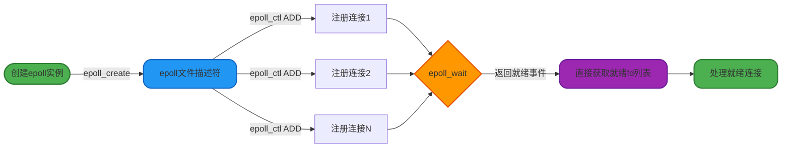
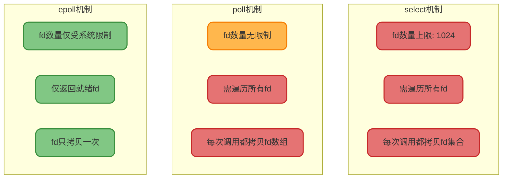
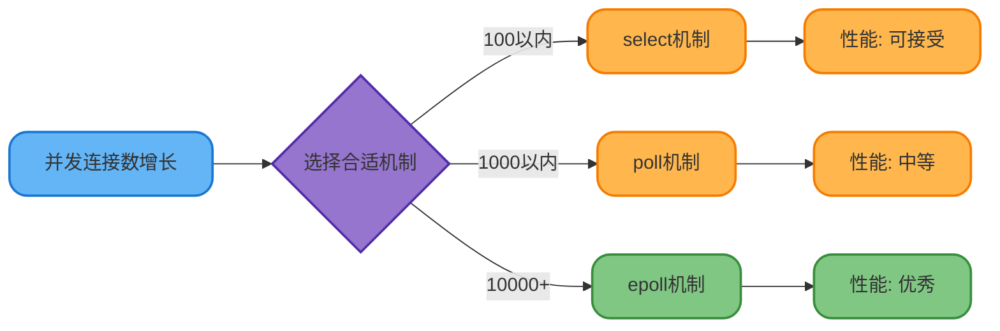
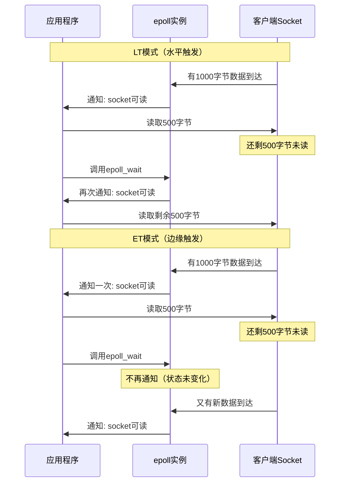
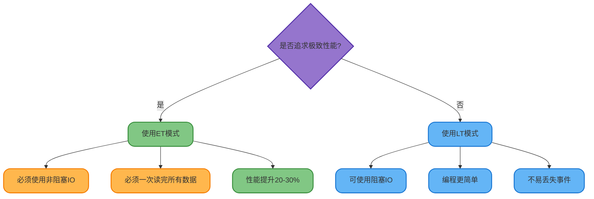

## 什么是IO多路复用

在高并发的服务端开发场景中，我们经常需要同时处理成百上千个客户端连接。如果为每个连接创建一个线程，会导致系统资源消耗巨大，线程上下文切换开销严重。这时候就需要用到IO多路复用技术。

IO多路复用是一种让单个线程能够监控多个文件描述符（file descriptor，简称fd）的机制。当某个文件描述符处于就绪状态时（比如有数据可读或可写），系统会通知程序进行相应的IO操作。这样一个线程就能够高效地管理多个网络连接，大大提升了系统的并发处理能力。

在Linux系统中，主流的IO多路复用技术有三种：select、poll和epoll。它们的核心思想相同，但在实现细节和性能表现上存在显著差异。

## select机制详解

### select的工作原理

select是最早出现的IO多路复用方案,它允许程序同时监控多个文件描述符的状态变化。其函数原型如下：

```c
int select(int maxfd, fd_set *readfds, fd_set *writefds, fd_set *exceptfds, struct timeval *timeout);
```

参数说明：
- `maxfd`：监控的文件描述符的最大值加1
- `readfds`：需要监控读事件的文件描述符集合
- `writefds`：需要监控写事件的文件描述符集合  
- `exceptfds`：需要监控异常事件的文件描述符集合
- `timeout`：超时时间，可设置为阻塞、非阻塞或指定时长

### select使用示例

下面是一个使用select监控多个客户端连接的服务器示例：

```c
#include <sys/select.h>
#include <stdio.h>
#include <stdlib.h>
#include <unistd.h>

int main() {
    fd_set read_fds;
    struct timeval timeout;
    int server_socket = create_server_socket(8080);  // 创建服务器套接字
    int client_sockets[100] = {0};  // 存储客户端连接
    int max_clients = 100;
    int max_sd, activity;
    
    while(1) {
        // 清空fd集合
        FD_ZERO(&read_fds);
        
        // 将服务器socket加入集合
        FD_SET(server_socket, &read_fds);
        max_sd = server_socket;
        
        // 将所有客户端socket加入集合
        for(int i = 0; i < max_clients; i++) {
            int sd = client_sockets[i];
            if(sd > 0) {
                FD_SET(sd, &read_fds);
            }
            if(sd > max_sd) {
                max_sd = sd;
            }
        }
        
        // 设置超时时间为5秒
        timeout.tv_sec = 5;
        timeout.tv_usec = 0;
        
        // 调用select等待事件
        activity = select(max_sd + 1, &read_fds, NULL, NULL, &timeout);
        
        if(activity < 0) {
            printf("select错误\n");
            continue;
        }
        
        // 检查服务器socket是否有新连接
        if(FD_ISSET(server_socket, &read_fds)) {
            int new_socket = accept_new_connection(server_socket);
            add_to_client_list(client_sockets, new_socket, max_clients);
        }
        
        // 检查客户端socket是否有数据可读
        for(int i = 0; i < max_clients; i++) {
            int sd = client_sockets[i];
            if(FD_ISSET(sd, &read_fds)) {
                handle_client_data(sd);  // 处理客户端数据
            }
        }
    }
    
    return 0;
}
```

### select的核心限制

select存在几个明显的性能瓶颈：

**1. 文件描述符数量限制**

在Linux系统中，select默认最多只能监控1024个文件描述符。这个限制由FD_SETSIZE宏定义决定。虽然可以通过修改宏定义并重新编译内核来突破这个限制，但会带来额外的性能损耗。

**2. 频繁的数据拷贝开销**

每次调用select时，都需要将整个文件描述符集合从用户态拷贝到内核态。当select返回时，又需要将结果从内核态拷贝回用户态。这种双向的数据拷贝随着监控的fd数量增加而线性增长，开销巨大。

**3. 轮询查找就绪fd的开销**

select返回后只是告诉你有fd就绪了，但不会告诉你具体是哪个fd。程序必须遍历整个fd集合来查找就绪的描述符，时间复杂度为O(n)。

## poll机制详解

### poll的改进之处

poll是select的改进版本，它解决了文件描述符数量限制的问题。poll的函数原型如下：

```c
int poll(struct pollfd *fds, unsigned int nfds, int timeout);

struct pollfd {
    int fd;           // 要监控的文件描述符
    short events;     // 关注的事件类型（输入参数）
    short revents;    // 实际发生的事件（输出参数）
};
```

poll使用pollfd结构体数组来管理文件描述符，而不是select中的位图方式。这样做的好处是pollfd数组基于链表结构，理论上可以监控任意数量的文件描述符，突破了1024的限制。

### poll使用示例

下面是使用poll实现的聊天室服务器示例：

```c
#include <poll.h>
#include <stdio.h>
#include <stdlib.h>
#include <unistd.h>

#define MAX_USERS 1000

int main() {
    struct pollfd poll_fds[MAX_USERS];
    int user_count = 0;
    int server_socket = create_chat_server(9090);
    
    // 初始化pollfd数组
    for(int i = 0; i < MAX_USERS; i++) {
        poll_fds[i].fd = -1;
    }
    
    // 添加服务器socket
    poll_fds[0].fd = server_socket;
    poll_fds[0].events = POLLIN;  // 监控读事件
    user_count = 1;
    
    while(1) {
        // 调用poll，超时时间3秒
        int ready_count = poll(poll_fds, user_count, 3000);
        
        if(ready_count < 0) {
            printf("poll调用失败\n");
            continue;
        }
        
        // 遍历所有fd检查就绪状态
        for(int i = 0; i < user_count; i++) {
            if(poll_fds[i].revents & POLLIN) {
                if(i == 0) {
                    // 服务器socket有新连接
                    int new_user = accept_new_user(server_socket);
                    add_user_to_chatroom(poll_fds, new_user, &user_count);
                } else {
                    // 用户发送了消息
                    char message[256];
                    int bytes = read_user_message(poll_fds[i].fd, message);
                    if(bytes > 0) {
                        broadcast_message(poll_fds, user_count, message);
                    } else {
                        // 用户断开连接
                        remove_user(poll_fds, i, &user_count);
                    }
                }
            }
        }
    }
    
    return 0;
}
```

### poll的性能问题

虽然poll解决了fd数量限制问题，但仍然存在以下性能瓶颈：

**1. 仍需频繁拷贝fd数组**

每次调用poll时，整个pollfd数组都需要从用户态拷贝到内核态，返回时再拷贝回来。监控的fd越多，拷贝开销越大。

**2. 仍需轮询查找就绪fd**

poll返回后，程序需要遍历整个pollfd数组，通过检查revents字段来找出哪些fd已就绪，时间复杂度仍是O(n)。

**3. 性能随fd数量线性下降**

随着监控的文件描述符数量增加，poll的性能会线性下降，不适合超大规模并发场景。

## epoll机制详解

### epoll的革命性改进

epoll是Linux 2.6内核引入的高性能IO多路复用方案，它从根本上解决了select和poll的性能问题。epoll提供了三个核心函数：

```c
// 创建epoll实例，返回epoll文件描述符
int epoll_create(int size);

// 向epoll实例中注册、修改或删除监控的fd
int epoll_ctl(int epfd, int op, int fd, struct epoll_event *event);

// 等待就绪事件发生
int epoll_wait(int epfd, struct epoll_event *events, int maxevents, int timeout);
```

其中epoll_ctl的操作类型包括：
- `EPOLL_CTL_ADD`：注册新的fd到epoll实例
- `EPOLL_CTL_MOD`：修改已注册fd的监控事件
- `EPOLL_CTL_DEL`：从epoll实例中删除fd

### epoll工作流程可视化



### epoll使用示例

下面是使用epoll实现的高性能Web服务器示例：

```c
#include <sys/epoll.h>
#include <stdio.h>
#include <stdlib.h>
#include <unistd.h>

#define MAX_EVENTS 10000
#define MAX_CONNECTIONS 100000

int main() {
    int epoll_fd, server_socket, conn_count = 0;
    struct epoll_event ev, events[MAX_EVENTS];
    
    // 创建Web服务器socket
    server_socket = create_web_server(80);
    set_nonblocking(server_socket);
    
    // 创建epoll实例
    epoll_fd = epoll_create1(0);
    if(epoll_fd == -1) {
        perror("epoll_create1失败");
        exit(EXIT_FAILURE);
    }
    
    // 将服务器socket注册到epoll
    ev.events = EPOLLIN;
    ev.data.fd = server_socket;
    if(epoll_ctl(epoll_fd, EPOLL_CTL_ADD, server_socket, &ev) == -1) {
        perror("epoll_ctl注册失败");
        exit(EXIT_FAILURE);
    }
    
    printf("Web服务器启动在80端口...\n");
    
    while(1) {
        // 等待就绪事件，超时时间-1表示永久阻塞
        int ready_count = epoll_wait(epoll_fd, events, MAX_EVENTS, -1);
        
        if(ready_count == -1) {
            perror("epoll_wait错误");
            continue;
        }
        
        // 处理所有就绪的事件
        for(int i = 0; i < ready_count; i++) {
            if(events[i].data.fd == server_socket) {
                // 有新的HTTP请求连接
                while(1) {
                    int client_fd = accept(server_socket, NULL, NULL);
                    if(client_fd == -1) {
                        break;  // 所有等待连接已处理完
                    }
                    
                    set_nonblocking(client_fd);
                    
                    // 注册新连接到epoll（使用ET模式）
                    ev.events = EPOLLIN | EPOLLET;
                    ev.data.fd = client_fd;
                    epoll_ctl(epoll_fd, EPOLL_CTL_ADD, client_fd, &ev);
                    
                    conn_count++;
                    printf("新HTTP连接，当前连接数：%d\n", conn_count);
                }
            } else {
                // 已连接的客户端有数据可读
                int client_fd = events[i].data.fd;
                char request_buffer[4096];
                int bytes_read;
                
                while((bytes_read = read(client_fd, request_buffer, sizeof(request_buffer))) > 0) {
                    // 处理HTTP请求
                    process_http_request(client_fd, request_buffer, bytes_read);
                }
                
                if(bytes_read == 0 || (bytes_read == -1 && errno != EAGAIN)) {
                    // 连接关闭或出错
                    epoll_ctl(epoll_fd, EPOLL_CTL_DEL, client_fd, NULL);
                    close(client_fd);
                    conn_count--;
                    printf("连接关闭，当前连接数：%d\n", conn_count);
                }
            }
        }
    }
    
    close(epoll_fd);
    close(server_socket);
    return 0;
}
```

### epoll的核心优势

**1. 只需一次拷贝fd**

使用epoll_ctl注册fd时，会将fd从用户态拷贝到内核态的红黑树结构中。之后调用epoll_wait时，不需要再次拷贝整个fd集合，只需返回就绪的fd列表。整个生命周期中，每个fd只拷贝一次。

**2. O(1)时间复杂度获取就绪fd**

epoll在内核中维护了一个就绪队列。当某个fd就绪时，内核会将其加入到就绪队列。epoll_wait直接返回这个就绪队列，无需遍历所有fd，时间复杂度为O(1)。

**3. 支持海量并发连接**

epoll支持的fd上限取决于系统可以打开的最大文件数，这个数字通常很大（可以通过`cat /proc/sys/fs/file-max`查看）。在1GB内存的机器上，这个值通常在10万左右，远超select的1024限制。

## 三种机制的对比分析

### 核心差异对比

下面从三个关键维度对比这三种IO多路复用技术：



### 详细对比表

| 对比维度 | select | poll | epoll |
|---------|--------|------|-------|
| **最大监控fd数** | 1024（受FD_SETSIZE限制） | 无硬性限制 | 仅受系统文件数限制 |
| **查找就绪fd方式** | 遍历整个fd_set，O(n)复杂度 | 遍历整个pollfd数组，O(n)复杂度 | 直接返回就绪队列，O(1)复杂度 |
| **fd拷贝开销** | 每次调用都需双向拷贝 | 每次调用都需双向拷贝 | 只在注册时拷贝一次 |
| **跨平台支持** | 几乎所有Unix/Linux系统 | 大部分Unix/Linux系统 | 仅Linux 2.6+内核 |
| **性能表现** | fd较少时可接受 | fd较少时可接受 | 大规模并发场景下性能最优 |
| **适用场景** | 小规模连接（百级以内） | 中等规模连接（千级以内） | 大规模高并发场景（万级以上） |

### 性能差异可视化



## epoll的两种触发模式

### 什么是LT和ET模式

epoll支持两种事件触发模式，它们决定了就绪事件的通知机制：

**LT模式（Level Trigger，水平触发）**

LT是epoll的默认工作模式。在这种模式下，只要文件描述符处于就绪状态，epoll_wait就会持续通知应用程序。即使应用程序没有立即处理该事件，下次调用epoll_wait时仍然会收到通知。

**ET模式（Edge Trigger，边缘触发）**

ET模式下，epoll_wait只在文件描述符状态发生变化时通知一次。如果应用程序没有一次性处理完所有数据，后续调用epoll_wait将不会再次通知该事件，直到该fd再次产生新的事件。

### 两种模式的对比



### LT模式示例代码

```c
// LT模式（默认模式）示例
int epoll_fd = epoll_create1(0);
struct epoll_event ev;

// 使用LT模式注册事件（EPOLLIN默认就是LT）
ev.events = EPOLLIN;  // 监控可读事件
ev.data.fd = client_socket;
epoll_ctl(epoll_fd, EPOLL_CTL_ADD, client_socket, &ev);

struct epoll_event events[10];
while(1) {
    int n = epoll_wait(epoll_fd, events, 10, -1);
    
    for(int i = 0; i < n; i++) {
        if(events[i].events & EPOLLIN) {
            int fd = events[i].data.fd;
            char buffer[256];
            
            // LT模式：可以只读取部分数据
            // 未读完的数据下次epoll_wait还会通知
            int bytes = read(fd, buffer, 256);
            process_partial_data(buffer, bytes);
        }
    }
}
```

### ET模式示例代码

```c
// ET模式示例
int epoll_fd = epoll_create1(0);
struct epoll_event ev;

// 必须将socket设置为非阻塞模式
set_nonblocking(client_socket);

// 使用ET模式注册事件
ev.events = EPOLLIN | EPOLLET;  // EPOLLET表示边缘触发
ev.data.fd = client_socket;
epoll_ctl(epoll_fd, EPOLL_CTL_ADD, client_socket, &ev);

struct epoll_event events[10];
while(1) {
    int n = epoll_wait(epoll_fd, events, 10, -1);
    
    for(int i = 0; i < n; i++) {
        if(events[i].events & EPOLLIN) {
            int fd = events[i].data.fd;
            char buffer[4096];
            
            // ET模式：必须一次性读完所有数据
            // 否则剩余数据不会再触发通知
            while(1) {
                int bytes = read(fd, buffer, sizeof(buffer));
                if(bytes > 0) {
                    process_data(buffer, bytes);
                } else if(bytes == -1 && errno == EAGAIN) {
                    // 数据已全部读完
                    break;
                } else {
                    // 读取错误或连接关闭
                    handle_error(fd);
                    break;
                }
            }
        }
    }
}
```

### 模式选择建议

**使用LT模式的场景：**
- 编程简单，不容易遗漏事件
- 可以使用阻塞IO，代码更直观
- 适合对性能要求不是特别高的场景
- 适合初学者或快速原型开发

**使用ET模式的场景：**
- 追求极致性能的高并发系统
- 减少epoll_wait的重复触发次数
- 必须配合非阻塞IO使用
- 需要更精细的控制事件处理流程



## 实战应用场景

### 高并发Web服务器

在构建高性能Web服务器时，epoll是首选方案。Nginx就是典型代表，它使用epoll处理数以万计的并发连接，单机可以轻松支持10万+的并发连接数。

### 实时消息推送系统

对于需要维持大量长连接的消息推送系统（如即时通讯、直播弹幕等），epoll可以高效地管理这些持久连接，及时推送消息给在线用户。

### 游戏服务器

多人在线游戏服务器需要同时处理大量玩家的网络请求，epoll的低延迟和高吞吐特性使其成为理想选择。

### 数据库连接池

数据库中间件使用epoll管理与客户端和后端数据库的大量连接，实现高效的连接复用和负载均衡。

## 总结与最佳实践

### 核心要点回顾

1. **select适用于小规模场景**：虽然有1024的限制，但跨平台兼容性好，适合连接数较少的场景

2. **poll是select的改进版**：解决了fd数量限制，但性能问题依然存在，适合中等规模应用

3. **epoll是Linux下的最佳选择**：通过红黑树和就绪队列实现了O(1)性能，适合大规模高并发场景

4. **选择合适的触发模式**：LT模式简单易用，ET模式性能更高但需小心处理

### 开发建议

**性能优化方向：**
- 优先选择epoll（Linux环境）
- 使用ET模式配合非阻塞IO获得最佳性能
- 合理设置epoll_wait的超时时间
- 使用连接池和对象池减少资源创建开销

**可靠性保障：**
- 做好错误处理和异常恢复
- 处理EAGAIN、EINTR等特殊错误码
- 及时清理关闭的连接，避免fd泄漏
- 监控连接数和资源使用情况

**跨平台兼容：**
- Linux使用epoll
- BSD/macOS使用kqueue
- Windows使用IOCP
- 考虑使用libevent、libev等跨平台库

通过合理选择和使用IO多路复用技术，可以构建出高性能、高并发的网络应用系统，这也是现代服务端开发的核心技能之一。

