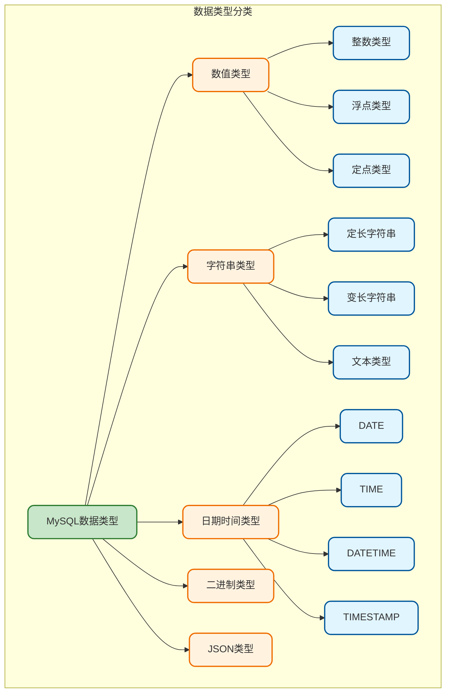
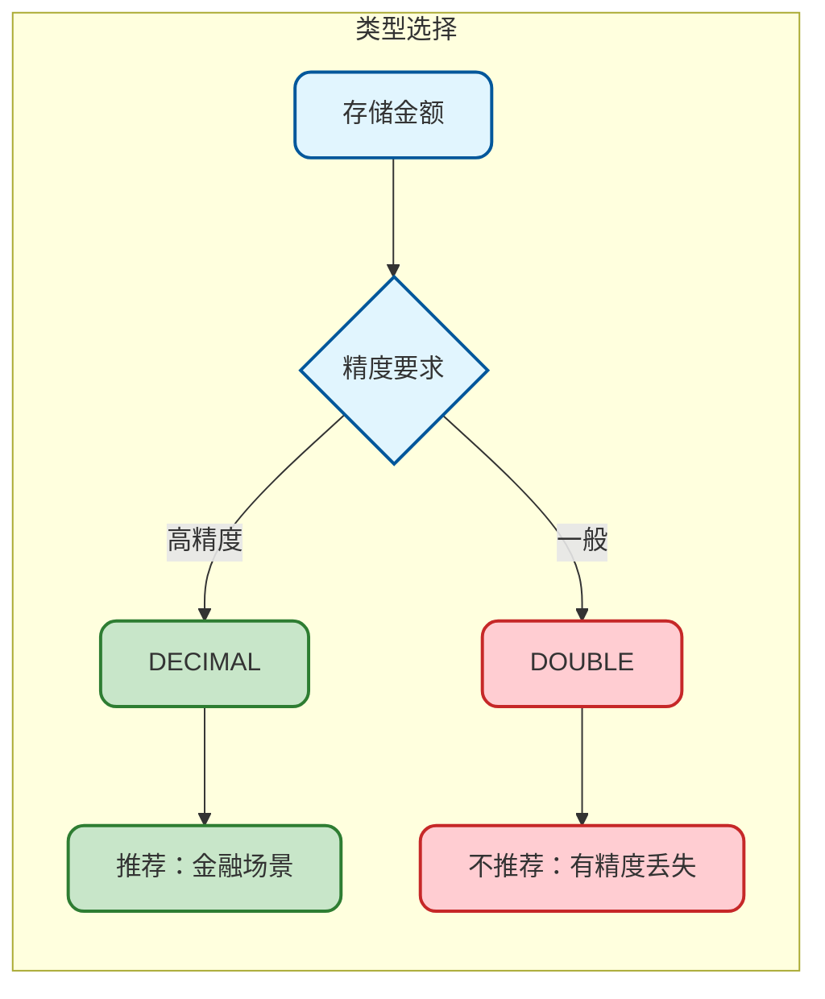
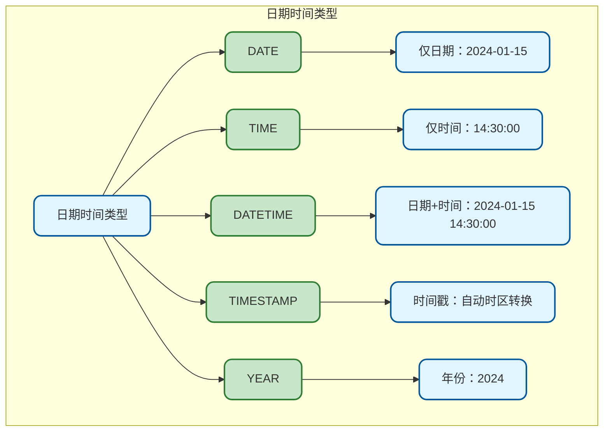
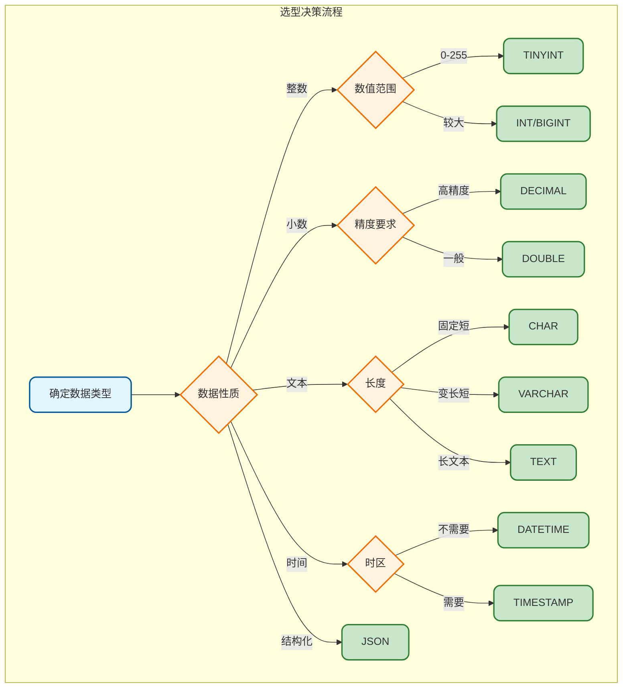

# MySQL数据类型详解

## 数据类型概述

MySQL提供了丰富的数据类型来满足不同场景的数据存储需求。选择合适的数据类型对于数据库性能、存储空间和数据完整性都至关重要。



## 数值类型详解

### 整数类型

MySQL提供了多种整数类型，它们的存储空间和取值范围各不相同：

| 类型 | 存储空间 | 有符号范围 | 无符号范围 | 适用场景 |
|------|----------|------------|------------|----------|
| TINYINT | 1字节 | -128 ~ 127 | 0 ~ 255 | 状态码、布尔值 |
| SMALLINT | 2字节 | -32768 ~ 32767 | 0 ~ 65535 | 小范围计数 |
| MEDIUMINT | 3字节 | -8388608 ~ 8388607 | 0 ~ 16777215 | 中等范围数据 |
| INT | 4字节 | -21亿 ~ 21亿 | 0 ~ 42亿 | 常规整数、主键 |
| BIGINT | 8字节 | -922亿亿 ~ 922亿亿 | 0 ~ 1844亿亿 | 大数值、分布式ID |

**使用示例：**

```sql
-- 创建用户表，使用不同整数类型
CREATE TABLE user_info (
    id BIGINT UNSIGNED AUTO_INCREMENT PRIMARY KEY,  -- 主键使用BIGINT
    age TINYINT UNSIGNED,                            -- 年龄用TINYINT足够
    status TINYINT DEFAULT 1,                        -- 状态码
    login_count INT UNSIGNED DEFAULT 0,              -- 登录次数
    score MEDIUMINT UNSIGNED                         -- 积分
);

-- 插入数据
INSERT INTO user_info (age, status, login_count, score) 
VALUES (25, 1, 100, 5000);
```

**注意事项：**

> 1. **优先选择最小满足需求的类型**：能用TINYINT就不用INT，节省存储空间
> 2. **主键推荐使用BIGINT**：避免数据增长后超出范围
> 3. **UNSIGNED慎用**：虽然能扩大正数范围，但可能导致计算时出现溢出问题

### 浮点类型

浮点类型用于存储小数，但存在精度问题：

| 类型 | 存储空间 | 精度 | 适用场景 |
|------|----------|------|----------|
| FLOAT | 4字节 | 约7位有效数字 | 对精度要求不高的科学计算 |
| DOUBLE | 8字节 | 约15位有效数字 | 精度要求较高的科学计算 |

**精度丢失演示：**

```sql
-- 创建测试表
CREATE TABLE float_test (
    f FLOAT,
    d DOUBLE
);

-- 插入数据
INSERT INTO float_test VALUES (123456.789, 123456.789);

-- 查询结果可能会发现精度丢失
SELECT * FROM float_test;
-- FLOAT: 123456.79 (精度丢失)
-- DOUBLE: 123456.789
```

### 定点类型 DECIMAL

DECIMAL是精确数值类型，适用于金融计算：

```sql
-- 语法：DECIMAL(M, D)
-- M: 总位数（精度），最大65
-- D: 小数位数（标度），最大30

-- 金额字段示例
CREATE TABLE order_info (
    id BIGINT PRIMARY KEY,
    amount DECIMAL(10, 2),      -- 最大99999999.99
    tax_rate DECIMAL(5, 4),     -- 税率，如0.0625
    total_price DECIMAL(12, 2)  -- 总价
);

-- 插入数据
INSERT INTO order_info VALUES (1, 9999.99, 0.0625, 10624.99);
```

**金额计算对比：**



## 字符串类型详解

### CHAR vs VARCHAR

这是最常用的两种字符串类型：

| 特性 | CHAR(n) | VARCHAR(n) |
|------|---------|------------|
| 存储方式 | 定长，不足补空格 | 变长，按实际长度存储 |
| 最大长度 | 255字符 | 65535字节 |
| 存储空间 | 固定n字符 | 实际长度+1或2字节 |
| 检索速度 | 较快 | 稍慢 |
| 尾部空格 | 检索时去除 | 保留 |

**使用建议：**

```sql
-- CHAR适用场景：固定长度的数据
CREATE TABLE system_config (
    code CHAR(10) PRIMARY KEY,          -- 固定长度编码
    country_code CHAR(2),               -- 国家代码如CN、US
    gender CHAR(1),                     -- 性别M/F
    md5_hash CHAR(32)                   -- MD5定长32位
);

-- VARCHAR适用场景：长度不确定的数据
CREATE TABLE article (
    id BIGINT PRIMARY KEY,
    title VARCHAR(200),                  -- 标题长度不定
    author VARCHAR(50),                  -- 作者名长度不定
    summary VARCHAR(500)                 -- 摘要
);
```

### 文本类型 TEXT

当内容超过VARCHAR限制时，使用TEXT类型：

| 类型 | 最大长度 | 适用场景 |
|------|----------|----------|
| TINYTEXT | 255字节 | 短文本 |
| TEXT | 65KB | 普通文章、评论 |
| MEDIUMTEXT | 16MB | 长文章、日志 |
| LONGTEXT | 4GB | 超长内容、文档 |

```sql
CREATE TABLE blog_post (
    id BIGINT PRIMARY KEY,
    title VARCHAR(200),
    content TEXT,                        -- 文章内容
    raw_html MEDIUMTEXT                  -- 原始HTML
);
```

**注意事项：**

> 1. TEXT类型不能有默认值
> 2. 检索TEXT字段效率较低，建议配合全文索引
> 3. 尽量避免SELECT *，按需查询TEXT字段

### ENUM和SET类型

这两种类型用于存储预定义的选项：

```sql
-- ENUM：单选，只能选择一个值
CREATE TABLE user_profile (
    id BIGINT PRIMARY KEY,
    gender ENUM('male', 'female', 'unknown') DEFAULT 'unknown',
    education ENUM('high_school', 'bachelor', 'master', 'doctor')
);

-- SET：多选，可以选择多个值
CREATE TABLE user_hobby (
    id BIGINT PRIMARY KEY,
    hobbies SET('reading', 'sports', 'music', 'travel', 'gaming')
);

-- 插入示例
INSERT INTO user_hobby VALUES (1, 'reading,sports,music');
```

## 日期时间类型详解

### 类型对比



| 类型 | 存储空间 | 格式 | 范围 |
|------|----------|------|------|
| DATE | 3字节 | YYYY-MM-DD | 1000-01-01 ~ 9999-12-31 |
| TIME | 3字节 | HH:MM:SS | -838:59:59 ~ 838:59:59 |
| DATETIME | 8字节 | YYYY-MM-DD HH:MM:SS | 1000年 ~ 9999年 |
| TIMESTAMP | 4字节 | YYYY-MM-DD HH:MM:SS | 1970年 ~ 2038年 |
| YEAR | 1字节 | YYYY | 1901 ~ 2155 |

### DATETIME vs TIMESTAMP

这是最容易混淆的两种类型：

| 特性 | DATETIME | TIMESTAMP |
|------|----------|-----------|
| 存储方式 | 原始值存储 | UTC时间戳存储 |
| 时区 | 不受时区影响 | 自动时区转换 |
| 范围 | 1000~9999年 | 1970~2038年 |
| 存储空间 | 8字节 | 4字节 |
| 自动更新 | 需手动设置 | 可自动更新 |

**实际应用示例：**

```sql
CREATE TABLE user_action (
    id BIGINT PRIMARY KEY,
    action_name VARCHAR(50),
    
    -- DATETIME：适用于业务时间，如订单时间、预约时间
    order_time DATETIME,
    
    -- TIMESTAMP：适用于记录操作时间，自动处理时区
    created_at TIMESTAMP DEFAULT CURRENT_TIMESTAMP,
    updated_at TIMESTAMP DEFAULT CURRENT_TIMESTAMP ON UPDATE CURRENT_TIMESTAMP
);

-- 插入数据
INSERT INTO user_action (id, action_name, order_time) 
VALUES (1, '下单', '2024-01-15 14:30:00');

-- 时区测试
SET time_zone = '+08:00';  -- 设置为东八区
SELECT * FROM user_action;

SET time_zone = '+00:00';  -- 设置为UTC
SELECT * FROM user_action;  -- TIMESTAMP的值会变化，DATETIME不变
```

**选择建议：**

> 1. **业务时间用DATETIME**：如订单时间、活动开始时间，不希望受时区影响
> 2. **操作时间用TIMESTAMP**：如创建时间、更新时间，方便自动更新
> 3. **注意2038年问题**：TIMESTAMP在2038年后会溢出，长期数据用DATETIME

## 二进制类型

### BLOB类型家族

用于存储二进制数据：

| 类型 | 最大长度 | 适用场景 |
|------|----------|----------|
| TINYBLOB | 255字节 | 小图标 |
| BLOB | 65KB | 小图片 |
| MEDIUMBLOB | 16MB | 普通图片、文档 |
| LONGBLOB | 4GB | 大文件 |

```sql
CREATE TABLE file_storage (
    id BIGINT PRIMARY KEY,
    file_name VARCHAR(200),
    file_type VARCHAR(50),
    file_data MEDIUMBLOB,
    file_size INT UNSIGNED
);
```

**实际建议：**

> 实际生产环境中，不建议在MySQL中存储大文件，应该：
> - 使用对象存储（如OSS、S3）存储文件
> - 数据库只存储文件路径或URL

### BIT类型

用于存储位字段值：

```sql
-- BIT(n)可以存储n位二进制数据，n最大64
CREATE TABLE permission (
    id BIGINT PRIMARY KEY,
    user_id BIGINT,
    flags BIT(8)  -- 8个权限位
);

-- 插入数据
INSERT INTO permission VALUES (1, 1001, b'10110001');

-- 查询并显示为二进制
SELECT id, user_id, BIN(flags) as flags_binary FROM permission;
```

## JSON类型

MySQL 5.7+ 支持JSON类型，用于存储JSON文档：

```sql
CREATE TABLE user_settings (
    id BIGINT PRIMARY KEY,
    username VARCHAR(50),
    settings JSON
);

-- 插入JSON数据
INSERT INTO user_settings VALUES (
    1, 
    'zhangsan',
    '{"theme": "dark", "language": "zh-CN", "notifications": {"email": true, "sms": false}}'
);

-- 查询JSON字段
SELECT 
    username,
    JSON_EXTRACT(settings, '$.theme') as theme,
    settings->>'$.language' as language,
    settings->'$.notifications.email' as email_notify
FROM user_settings;

-- 更新JSON字段
UPDATE user_settings 
SET settings = JSON_SET(settings, '$.theme', 'light')
WHERE id = 1;
```

**JSON操作函数：**

| 函数 | 说明 | 示例 |
|------|------|------|
| JSON_EXTRACT | 提取值 | `JSON_EXTRACT(col, '$.key')` |
| JSON_SET | 设置值 | `JSON_SET(col, '$.key', 'value')` |
| JSON_INSERT | 插入值（不覆盖） | `JSON_INSERT(col, '$.key', 'value')` |
| JSON_REPLACE | 替换值（必须存在） | `JSON_REPLACE(col, '$.key', 'value')` |
| JSON_REMOVE | 删除键 | `JSON_REMOVE(col, '$.key')` |
| JSON_CONTAINS | 判断包含 | `JSON_CONTAINS(col, '"value"', '$.key')` |

## 数据类型选择总结



**核心原则：**

1. **最小够用**：选择满足需求的最小类型，节省存储空间
2. **简单优先**：能用简单类型就不用复杂类型
3. **避免NULL**：尽量设置默认值，避免NULL带来的问题
4. **考虑扩展**：为未来数据增长留有余地