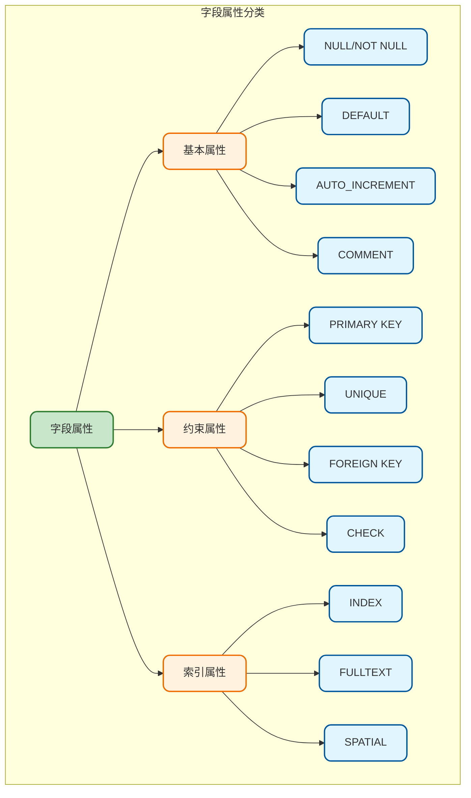
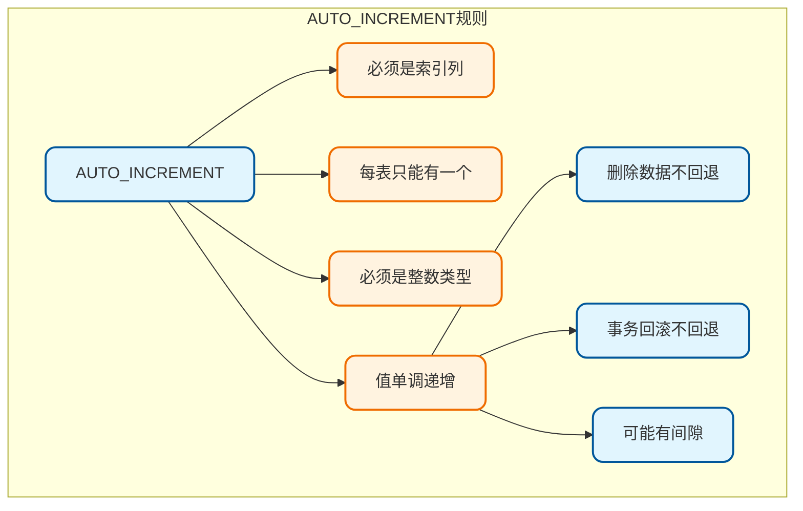
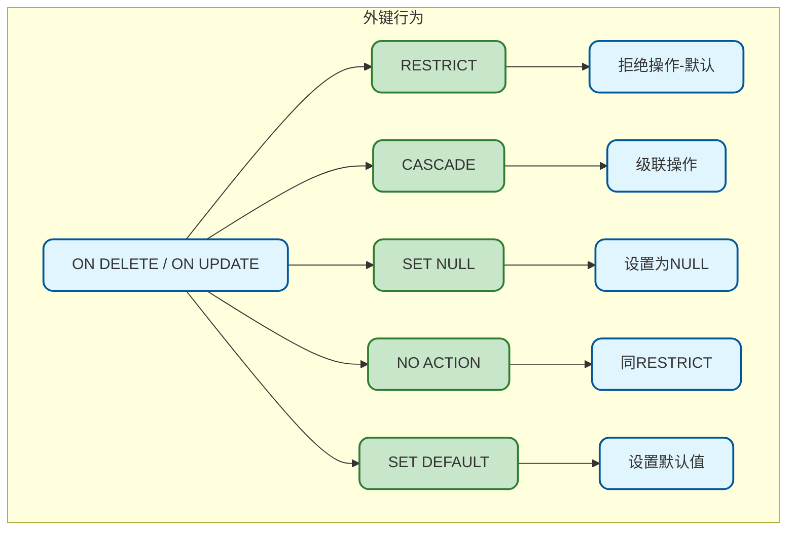
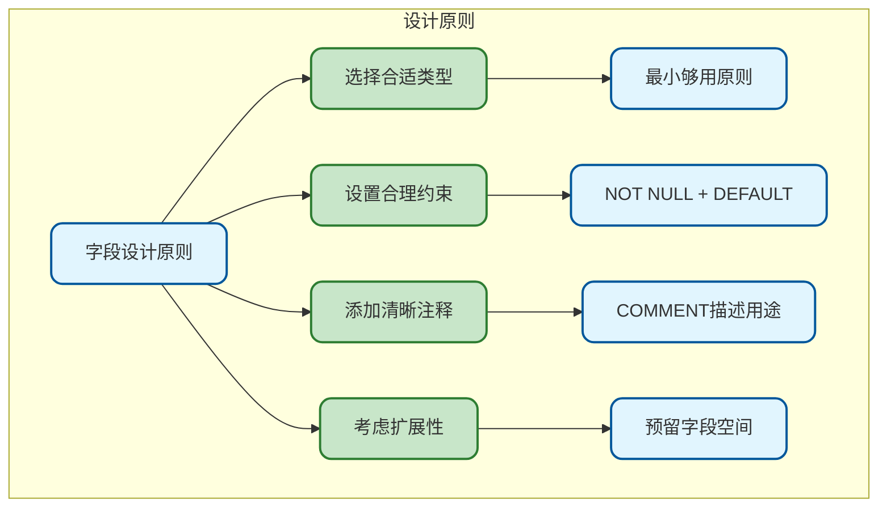

# MySQL字段属性与约束

## 字段属性概述

在MySQL中，定义表字段时除了指定数据类型外，还可以设置各种属性来控制字段的行为。这些属性对数据完整性、查询性能和业务逻辑都有重要影响。



## 基本属性详解

### NULL与NOT NULL

控制字段是否允许为空值：

```sql
-- NOT NULL：字段不允许为空
CREATE TABLE user (
    id BIGINT NOT NULL,
    username VARCHAR(50) NOT NULL,  -- 用户名必填
    email VARCHAR(100) NOT NULL,    -- 邮箱必填
    phone VARCHAR(20),              -- 手机号可为空（默认允许NULL）
    nickname VARCHAR(50) NULL       -- 显式声明允许NULL
);

-- 插入数据测试
INSERT INTO user (id, username, email) VALUES (1, 'zhangsan', 'zs@example.com');
-- 成功，phone和nickname为NULL

INSERT INTO user (id, username) VALUES (2, 'lisi');
-- 失败！email是NOT NULL，必须提供值
```

**NULL值的特殊性：**

```sql
-- NULL不等于任何值，包括它自己
SELECT * FROM user WHERE phone = NULL;    -- 永远返回空！
SELECT * FROM user WHERE phone IS NULL;   -- 正确写法

-- NULL参与运算结果为NULL
SELECT 1 + NULL;  -- 结果为NULL
SELECT CONCAT('Hello', NULL);  -- 结果为NULL

-- 使用COALESCE或IFNULL处理NULL
SELECT COALESCE(phone, '未填写') as phone FROM user;
SELECT IFNULL(phone, '未填写') as phone FROM user;
```

**设计建议：**

> 1. 核心业务字段设置NOT NULL
> 2. 配合DEFAULT提供默认值
> 3. NULL会影响索引效率，谨慎使用

### DEFAULT默认值

当插入数据时未指定值，使用默认值：

```sql
CREATE TABLE article (
    id BIGINT PRIMARY KEY AUTO_INCREMENT,
    title VARCHAR(200) NOT NULL,
    status TINYINT NOT NULL DEFAULT 0,           -- 默认草稿状态
    view_count INT UNSIGNED DEFAULT 0,            -- 默认阅读量0
    is_deleted TINYINT DEFAULT 0,                 -- 默认未删除
    created_at DATETIME DEFAULT CURRENT_TIMESTAMP, -- 默认当前时间
    updated_at DATETIME DEFAULT CURRENT_TIMESTAMP ON UPDATE CURRENT_TIMESTAMP
);

-- 只插入必填字段，其他使用默认值
INSERT INTO article (title) VALUES ('MySQL入门教程');

-- 查看结果
SELECT * FROM article;
-- status=0, view_count=0, is_deleted=0, created_at=当前时间
```

**默认值类型：**

| 默认值类型 | 示例 | 说明 |
|------------|------|------|
| 常量值 | `DEFAULT 0` | 固定值 |
| 当前时间 | `DEFAULT CURRENT_TIMESTAMP` | 插入时的时间 |
| 表达式 | `DEFAULT (YEAR(NOW()))` | MySQL 8.0+ 支持 |
| NULL | `DEFAULT NULL` | 默认为空 |

### AUTO_INCREMENT自增

自动生成唯一递增的数值，常用于主键：

```sql
CREATE TABLE order_info (
    id BIGINT PRIMARY KEY AUTO_INCREMENT,  -- 自增主键
    order_no VARCHAR(50) NOT NULL,
    amount DECIMAL(10, 2)
);

-- 插入时不指定id
INSERT INTO order_info (order_no, amount) VALUES ('ORD001', 99.00);
INSERT INTO order_info (order_no, amount) VALUES ('ORD002', 199.00);

-- 查看自增值
SELECT * FROM order_info;
-- id自动为1, 2

-- 查看当前自增值
SHOW TABLE STATUS LIKE 'order_info';

-- 手动设置自增起始值
ALTER TABLE order_info AUTO_INCREMENT = 1000;

-- 获取最后插入的自增ID
SELECT LAST_INSERT_ID();
```

**自增属性规则：**



### COMMENT注释

为字段添加说明，增强可读性：

```sql
CREATE TABLE product (
    id BIGINT PRIMARY KEY AUTO_INCREMENT COMMENT '商品ID',
    name VARCHAR(200) NOT NULL COMMENT '商品名称',
    price DECIMAL(10, 2) NOT NULL COMMENT '商品价格，单位：元',
    stock INT UNSIGNED DEFAULT 0 COMMENT '库存数量',
    status TINYINT DEFAULT 1 COMMENT '状态：0-下架 1-上架 2-预售',
    category_id INT COMMENT '分类ID，关联category表',
    created_at DATETIME DEFAULT CURRENT_TIMESTAMP COMMENT '创建时间'
) COMMENT '商品信息表';

-- 查看表结构（包含注释）
SHOW FULL COLUMNS FROM product;

-- 查看建表语句
SHOW CREATE TABLE product;
```

## 约束属性详解

### PRIMARY KEY主键约束

主键是表中唯一标识每行数据的字段：

```sql
-- 单列主键
CREATE TABLE user (
    id BIGINT PRIMARY KEY AUTO_INCREMENT,
    username VARCHAR(50) NOT NULL
);

-- 另一种写法
CREATE TABLE user (
    id BIGINT AUTO_INCREMENT,
    username VARCHAR(50) NOT NULL,
    PRIMARY KEY (id)
);

-- 复合主键（多列组成主键）
CREATE TABLE order_item (
    order_id BIGINT NOT NULL,
    product_id BIGINT NOT NULL,
    quantity INT NOT NULL,
    price DECIMAL(10, 2) NOT NULL,
    PRIMARY KEY (order_id, product_id)  -- 复合主键
);
```

**主键特性：**

| 特性 | 说明 |
|------|------|
| 唯一性 | 主键值不能重复 |
| 非空性 | 主键值不能为NULL |
| 单一性 | 每张表只能有一个主键 |
| 索引 | 自动创建主键索引（聚簇索引） |

### UNIQUE唯一约束

保证字段值在表中唯一：

```sql
CREATE TABLE user (
    id BIGINT PRIMARY KEY AUTO_INCREMENT,
    username VARCHAR(50) NOT NULL UNIQUE,      -- 用户名唯一
    email VARCHAR(100) UNIQUE,                  -- 邮箱唯一，允许NULL
    phone VARCHAR(20),
    UNIQUE KEY uk_phone (phone)                 -- 命名唯一约束
);

-- 插入重复值测试
INSERT INTO user (username, email) VALUES ('zhangsan', 'zs@example.com');
INSERT INTO user (username, email) VALUES ('zhangsan', 'ls@example.com');
-- 失败！Duplicate entry 'zhangsan' for key 'username'

-- 联合唯一约束
CREATE TABLE user_role (
    id BIGINT PRIMARY KEY AUTO_INCREMENT,
    user_id BIGINT NOT NULL,
    role_id BIGINT NOT NULL,
    UNIQUE KEY uk_user_role (user_id, role_id)  -- 用户-角色组合唯一
);
```

**UNIQUE vs PRIMARY KEY：**

| 特性 | PRIMARY KEY | UNIQUE |
|------|-------------|--------|
| 数量 | 每表只能有1个 | 可以有多个 |
| NULL | 不允许 | 允许（只能有一个NULL） |
| 索引类型 | 聚簇索引 | 普通索引 |
| 用途 | 行标识 | 业务唯一性 |

### FOREIGN KEY外键约束

建立表之间的关联关系：

```sql
-- 父表（被引用的表）
CREATE TABLE category (
    id INT PRIMARY KEY AUTO_INCREMENT,
    name VARCHAR(50) NOT NULL
);

-- 子表（引用父表的表）
CREATE TABLE product (
    id BIGINT PRIMARY KEY AUTO_INCREMENT,
    name VARCHAR(200) NOT NULL,
    category_id INT,
    FOREIGN KEY (category_id) REFERENCES category(id)
        ON DELETE SET NULL      -- 父表删除时，子表设为NULL
        ON UPDATE CASCADE       -- 父表更新时，子表同步更新
);

-- 外键约束行为选项
```

**外键行为选项：**



**实际应用示例：**

```sql
-- 插入数据测试
INSERT INTO category (name) VALUES ('电子产品'), ('服装');
INSERT INTO product (name, category_id) VALUES ('iPhone', 1);
INSERT INTO product (name, category_id) VALUES ('T恤', 2);

-- 尝试插入不存在的分类
INSERT INTO product (name, category_id) VALUES ('测试', 999);
-- 失败！外键约束阻止

-- 删除分类测试
DELETE FROM category WHERE id = 1;
-- 根据ON DELETE SET NULL，product.category_id会变为NULL
```

**外键使用建议：**

> 1. **互联网项目慎用外键**：影响性能，分布式环境难以维护
> 2. **推荐应用层保证**：通过代码逻辑保证数据一致性
> 3. **适用场景**：数据一致性要求极高、单体应用

### CHECK约束

MySQL 8.0.16+ 正式支持CHECK约束：

```sql
CREATE TABLE employee (
    id BIGINT PRIMARY KEY AUTO_INCREMENT,
    name VARCHAR(50) NOT NULL,
    age INT CHECK (age >= 18 AND age <= 65),           -- 年龄范围
    salary DECIMAL(10, 2) CHECK (salary > 0),          -- 工资大于0
    gender CHAR(1) CHECK (gender IN ('M', 'F')),       -- 性别限制
    hire_date DATE,
    leave_date DATE,
    CONSTRAINT chk_date CHECK (leave_date IS NULL OR leave_date > hire_date)
);

-- 插入测试
INSERT INTO employee (name, age, salary, gender, hire_date) 
VALUES ('张三', 25, 8000.00, 'M', '2024-01-01');
-- 成功

INSERT INTO employee (name, age, salary, gender, hire_date) 
VALUES ('李四', 15, 5000.00, 'M', '2024-01-01');
-- 失败！age不满足CHECK约束
```

## UNSIGNED和ZEROFILL

### UNSIGNED无符号

只存储正数，扩大正数范围：

```sql
CREATE TABLE counter (
    id INT UNSIGNED PRIMARY KEY,     -- 0 ~ 4294967295
    count BIGINT UNSIGNED             -- 只存正数
);

-- 注意：无符号类型的减法可能产生问题
SET sql_mode = '';  -- 非严格模式
SELECT 1 - 2;       -- 结果：-1
SELECT CAST(1 AS UNSIGNED) - CAST(2 AS UNSIGNED);  
-- 结果：18446744073709551615（溢出！）
```

### ZEROFILL零填充

显示时自动补零（已在MySQL 8.0中废弃）：

```sql
-- MySQL 5.7及之前版本
CREATE TABLE product_code (
    id INT(5) ZEROFILL PRIMARY KEY  -- 显示为00001, 00002...
);

-- MySQL 8.0+ 使用LPAD替代
SELECT LPAD(id, 5, '0') as formatted_id FROM product;
```

## 字段属性综合示例

一个完整的表设计示例：

```sql
CREATE TABLE `order` (
    `id` BIGINT UNSIGNED NOT NULL AUTO_INCREMENT 
        COMMENT '订单ID',
    
    `order_no` VARCHAR(32) NOT NULL 
        COMMENT '订单编号',
    
    `user_id` BIGINT UNSIGNED NOT NULL 
        COMMENT '用户ID',
    
    `total_amount` DECIMAL(12, 2) NOT NULL DEFAULT 0.00 
        COMMENT '订单总金额',
    
    `status` TINYINT NOT NULL DEFAULT 0 
        COMMENT '订单状态：0-待支付 1-已支付 2-已发货 3-已完成 4-已取消',
    
    `payment_time` DATETIME DEFAULT NULL 
        COMMENT '支付时间',
    
    `remark` VARCHAR(500) DEFAULT '' 
        COMMENT '备注',
    
    `is_deleted` TINYINT UNSIGNED NOT NULL DEFAULT 0 
        COMMENT '是否删除：0-否 1-是',
    
    `created_at` DATETIME NOT NULL DEFAULT CURRENT_TIMESTAMP 
        COMMENT '创建时间',
    
    `updated_at` DATETIME NOT NULL DEFAULT CURRENT_TIMESTAMP 
        ON UPDATE CURRENT_TIMESTAMP 
        COMMENT '更新时间',
    
    PRIMARY KEY (`id`),
    UNIQUE KEY `uk_order_no` (`order_no`),
    INDEX `idx_user_id` (`user_id`),
    INDEX `idx_status` (`status`),
    INDEX `idx_created_at` (`created_at`)
    
) ENGINE=InnoDB DEFAULT CHARSET=utf8mb4 
  COLLATE=utf8mb4_unicode_ci 
  COMMENT='订单表';
```

## 字段设计最佳实践



**核心要点：**

1. **必填字段加NOT NULL**：避免NULL带来的问题
2. **提供合理默认值**：减少插入时的复杂性
3. **主键使用BIGINT**：应对数据增长
4. **业务唯一字段加UNIQUE**：如订单号、用户名
5. **时间字段规范化**：created_at, updated_at是标配
6. **添加COMMENT**：方便后续维护
7. **逻辑删除优于物理删除**：is_deleted字段
