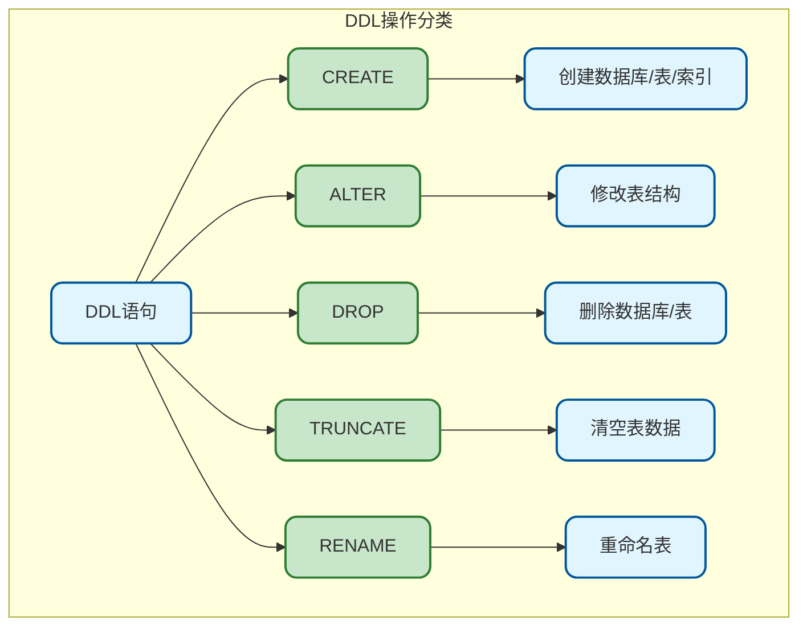
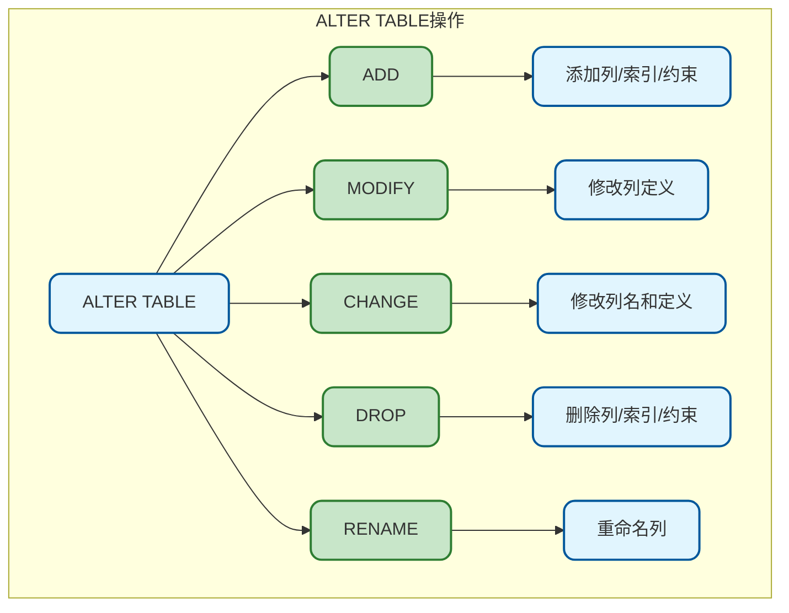
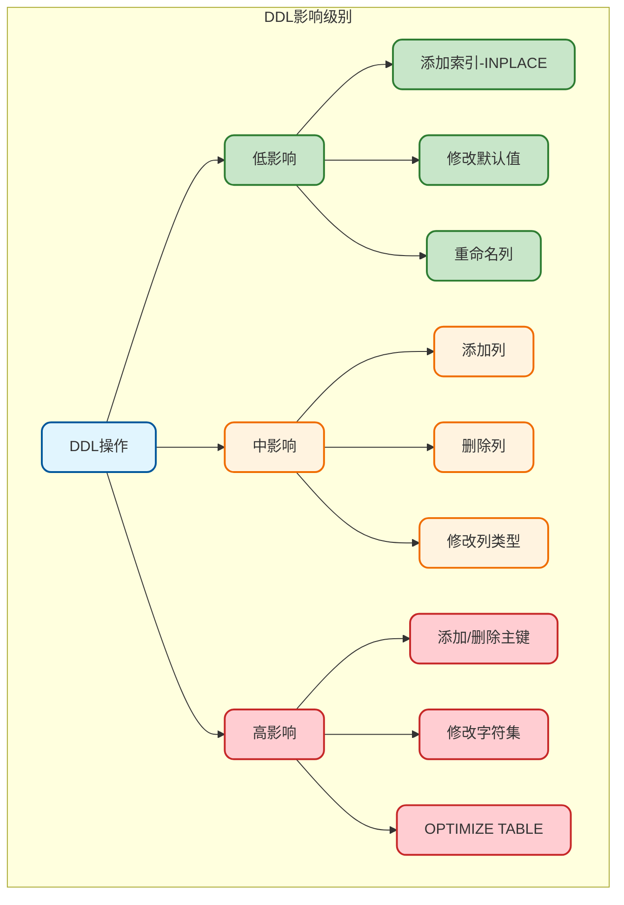

# MySQL表操作基础

## DDL语句概述

DDL（Data Definition Language）数据定义语言，用于定义和管理数据库对象（数据库、表、索引等）的结构。



## 数据库操作

### 创建数据库

```sql
-- 基本语法
CREATE DATABASE database_name;

-- 指定字符集和排序规则（推荐）
CREATE DATABASE myapp 
    CHARACTER SET utf8mb4 
    COLLATE utf8mb4_unicode_ci;

-- 如果不存在则创建
CREATE DATABASE IF NOT EXISTS myapp 
    CHARACTER SET utf8mb4 
    COLLATE utf8mb4_unicode_ci;
```

**字符集说明：**

| 字符集 | 说明 | 适用场景 |
|--------|------|----------|
| utf8 | 最多3字节，不支持emoji | 旧项目兼容 |
| utf8mb4 | 最多4字节，支持emoji | 推荐使用 |
| latin1 | 单字节，不支持中文 | 纯英文场景 |

### 查看和选择数据库

```sql
-- 查看所有数据库
SHOW DATABASES;

-- 查看数据库创建语句
SHOW CREATE DATABASE myapp;

-- 选择使用数据库
USE myapp;

-- 查看当前数据库
SELECT DATABASE();
```

### 修改和删除数据库

```sql
-- 修改数据库字符集
ALTER DATABASE myapp 
    CHARACTER SET utf8mb4 
    COLLATE utf8mb4_unicode_ci;

-- 删除数据库（危险操作！）
DROP DATABASE myapp;

-- 如果存在则删除
DROP DATABASE IF EXISTS myapp;
```

## 创建表

### 基本语法

```sql
CREATE TABLE table_name (
    column1 datatype [constraints],
    column2 datatype [constraints],
    ...
    [table_constraints]
) [table_options];
```

### 创建表示例

```sql
-- 完整的建表示例
CREATE TABLE `user` (
    `id` BIGINT UNSIGNED NOT NULL AUTO_INCREMENT COMMENT '用户ID',
    `username` VARCHAR(50) NOT NULL COMMENT '用户名',
    `password` VARCHAR(100) NOT NULL COMMENT '密码（加密后）',
    `email` VARCHAR(100) DEFAULT NULL COMMENT '邮箱',
    `phone` VARCHAR(20) DEFAULT NULL COMMENT '手机号',
    `avatar` VARCHAR(255) DEFAULT '' COMMENT '头像URL',
    `status` TINYINT NOT NULL DEFAULT 1 COMMENT '状态：0-禁用 1-启用',
    `created_at` DATETIME NOT NULL DEFAULT CURRENT_TIMESTAMP COMMENT '创建时间',
    `updated_at` DATETIME NOT NULL DEFAULT CURRENT_TIMESTAMP 
        ON UPDATE CURRENT_TIMESTAMP COMMENT '更新时间',
    
    PRIMARY KEY (`id`),
    UNIQUE KEY `uk_username` (`username`),
    UNIQUE KEY `uk_email` (`email`),
    INDEX `idx_phone` (`phone`),
    INDEX `idx_status` (`status`)
    
) ENGINE=InnoDB 
  DEFAULT CHARSET=utf8mb4 
  COLLATE=utf8mb4_unicode_ci 
  COMMENT='用户表';
```

### 表选项说明

| 选项 | 说明 | 示例 |
|------|------|------|
| ENGINE | 存储引擎 | InnoDB（推荐）、MyISAM |
| CHARSET | 默认字符集 | utf8mb4 |
| COLLATE | 排序规则 | utf8mb4_unicode_ci |
| COMMENT | 表注释 | '用户表' |
| AUTO_INCREMENT | 自增起始值 | 1000 |

### 复制表结构

```sql
-- 复制表结构（不含数据）
CREATE TABLE user_backup LIKE user;

-- 复制表结构和数据
CREATE TABLE user_backup AS SELECT * FROM user;

-- 复制表结构和部分数据
CREATE TABLE user_active AS 
SELECT * FROM user WHERE status = 1;
```

## 查看表结构

```sql
-- 查看所有表
SHOW TABLES;

-- 查看表结构
DESC user;
-- 或者
DESCRIBE user;
-- 或者
SHOW COLUMNS FROM user;

-- 查看完整表结构（包含注释）
SHOW FULL COLUMNS FROM user;

-- 查看建表语句
SHOW CREATE TABLE user;

-- 查看表状态信息
SHOW TABLE STATUS LIKE 'user';
```

**DESC输出示例：**

```
+------------+-----------------+------+-----+-------------------+
| Field      | Type            | Null | Key | Default           |
+------------+-----------------+------+-----+-------------------+
| id         | bigint unsigned | NO   | PRI | NULL              |
| username   | varchar(50)     | NO   | UNI | NULL              |
| email      | varchar(100)    | YES  | UNI | NULL              |
| status     | tinyint         | NO   | MUL | 1                 |
| created_at | datetime        | NO   |     | CURRENT_TIMESTAMP |
+------------+-----------------+------+-----+-------------------+
```

## 修改表结构

### ALTER TABLE语法



### 添加列

```sql
-- 添加单列（默认添加到最后）
ALTER TABLE user ADD COLUMN age INT COMMENT '年龄';

-- 添加到指定位置
ALTER TABLE user ADD COLUMN gender CHAR(1) AFTER username;

-- 添加到第一个位置
ALTER TABLE user ADD COLUMN uuid VARCHAR(36) FIRST;

-- 添加多列
ALTER TABLE user 
    ADD COLUMN birthday DATE COMMENT '生日',
    ADD COLUMN address VARCHAR(200) COMMENT '地址';
```

### 修改列

```sql
-- MODIFY：修改列定义（不改名）
ALTER TABLE user MODIFY COLUMN email VARCHAR(150) NOT NULL;

-- CHANGE：同时修改列名和定义
ALTER TABLE user CHANGE COLUMN phone mobile VARCHAR(20) COMMENT '手机号';

-- MySQL 8.0+ RENAME COLUMN：只改名
ALTER TABLE user RENAME COLUMN mobile TO phone;

-- 修改列默认值
ALTER TABLE user ALTER COLUMN status SET DEFAULT 0;

-- 删除列默认值
ALTER TABLE user ALTER COLUMN status DROP DEFAULT;
```

### 删除列

```sql
-- 删除单列
ALTER TABLE user DROP COLUMN age;

-- 删除多列
ALTER TABLE user 
    DROP COLUMN birthday,
    DROP COLUMN address;
```

### 索引操作

```sql
-- 添加普通索引
ALTER TABLE user ADD INDEX idx_email (email);

-- 添加唯一索引
ALTER TABLE user ADD UNIQUE INDEX uk_phone (phone);

-- 添加联合索引
ALTER TABLE user ADD INDEX idx_status_created (status, created_at);

-- 添加全文索引
ALTER TABLE article ADD FULLTEXT INDEX ft_content (content);

-- 删除索引
ALTER TABLE user DROP INDEX idx_email;
-- 或者
DROP INDEX idx_email ON user;

-- 查看索引
SHOW INDEX FROM user;
```

### 主键操作

```sql
-- 添加主键
ALTER TABLE user ADD PRIMARY KEY (id);

-- 删除主键（需先删除AUTO_INCREMENT）
ALTER TABLE user MODIFY COLUMN id BIGINT;
ALTER TABLE user DROP PRIMARY KEY;
```

### 外键操作

```sql
-- 添加外键
ALTER TABLE order_item 
    ADD CONSTRAINT fk_order_id 
    FOREIGN KEY (order_id) REFERENCES `order`(id);

-- 删除外键
ALTER TABLE order_item DROP FOREIGN KEY fk_order_id;
```

## 删除和清空表

### DROP TABLE

```sql
-- 删除表（删除结构和数据）
DROP TABLE user;

-- 如果存在则删除
DROP TABLE IF EXISTS user;

-- 删除多个表
DROP TABLE IF EXISTS user, order, product;
```

### TRUNCATE TABLE

```sql
-- 清空表数据（保留结构）
TRUNCATE TABLE user;
```

**TRUNCATE vs DELETE：**

| 特性 | TRUNCATE | DELETE |
|------|----------|--------|
| 操作类型 | DDL | DML |
| 删除范围 | 全部数据 | 可带WHERE条件 |
| 事务支持 | 不可回滚 | 可回滚 |
| 执行速度 | 快 | 慢 |
| 自增重置 | 重置为1 | 不重置 |
| 触发器 | 不触发 | 触发 |
| 外键约束 | 受约束影响 | 逐行检查 |

```sql
-- 使用场景对比
-- 清空日志表（不需要回滚）
TRUNCATE TABLE operation_log;

-- 按条件删除数据（需要回滚保护）
DELETE FROM user WHERE status = 0;
```

## 重命名表

```sql
-- 重命名单个表
RENAME TABLE user TO user_info;
-- 或者
ALTER TABLE user RENAME TO user_info;

-- 重命名多个表（原子操作）
RENAME TABLE 
    user TO user_bak,
    user_new TO user;

-- 移动表到其他数据库
RENAME TABLE mydb.user TO otherdb.user;
```

## 临时表

临时表只在当前会话可见，会话结束自动销毁：

```sql
-- 创建临时表
CREATE TEMPORARY TABLE temp_result (
    id BIGINT,
    total DECIMAL(10, 2)
);

-- 使用临时表
INSERT INTO temp_result 
SELECT user_id, SUM(amount) FROM order GROUP BY user_id;

SELECT * FROM temp_result;

-- 手动删除临时表
DROP TEMPORARY TABLE IF EXISTS temp_result;
```

## 在线DDL操作

### MySQL 5.6+ Online DDL

对于大表操作，需要注意DDL对线上服务的影响：

```sql
-- 添加索引（Online DDL）
ALTER TABLE user 
    ADD INDEX idx_email (email), 
    ALGORITHM=INPLACE, 
    LOCK=NONE;

-- ALGORITHM选项：
-- INPLACE: 原地修改，不复制表
-- COPY: 复制表数据（旧方式）
-- DEFAULT: 自动选择

-- LOCK选项：
-- NONE: 不加锁，允许并发DML
-- SHARED: 共享锁，允许读不允许写
-- EXCLUSIVE: 排他锁，不允许读写
-- DEFAULT: 最小级别锁
```

**DDL操作影响对照表：**



## 表设计最佳实践

### 命名规范

```sql
-- 表名：小写，下划线分隔，避免复数
CREATE TABLE user_order ...;      -- 推荐
CREATE TABLE UserOrder ...;       -- 不推荐
CREATE TABLE user_orders ...;     -- 不推荐

-- 字段名：小写，下划线分隔
created_at, updated_at, user_id   -- 推荐
createdAt, UpdatedAt, userId      -- 不推荐

-- 索引名：前缀标识类型
PRIMARY KEY                       -- pk_
UNIQUE KEY uk_username            -- uk_
INDEX idx_email                   -- idx_
FOREIGN KEY fk_user_id            -- fk_
```

### 必备字段

```sql
-- 推荐每张业务表包含以下字段
CREATE TABLE example (
    id BIGINT UNSIGNED AUTO_INCREMENT PRIMARY KEY COMMENT '主键ID',
    -- 业务字段...
    is_deleted TINYINT UNSIGNED DEFAULT 0 COMMENT '逻辑删除：0-正常 1-删除',
    created_at DATETIME DEFAULT CURRENT_TIMESTAMP COMMENT '创建时间',
    updated_at DATETIME DEFAULT CURRENT_TIMESTAMP 
        ON UPDATE CURRENT_TIMESTAMP COMMENT '更新时间',
    created_by BIGINT UNSIGNED COMMENT '创建人ID',
    updated_by BIGINT UNSIGNED COMMENT '更新人ID'
);
```

### 设计检查清单

> 1. 表名是否清晰描述业务含义
> 2. 主键是否使用BIGINT
> 3. 字段类型是否合适（最小够用）
> 4. NOT NULL和DEFAULT是否合理设置
> 5. 是否添加了必要的索引
> 6. 是否添加了清晰的COMMENT
> 7. 是否考虑了后续扩展