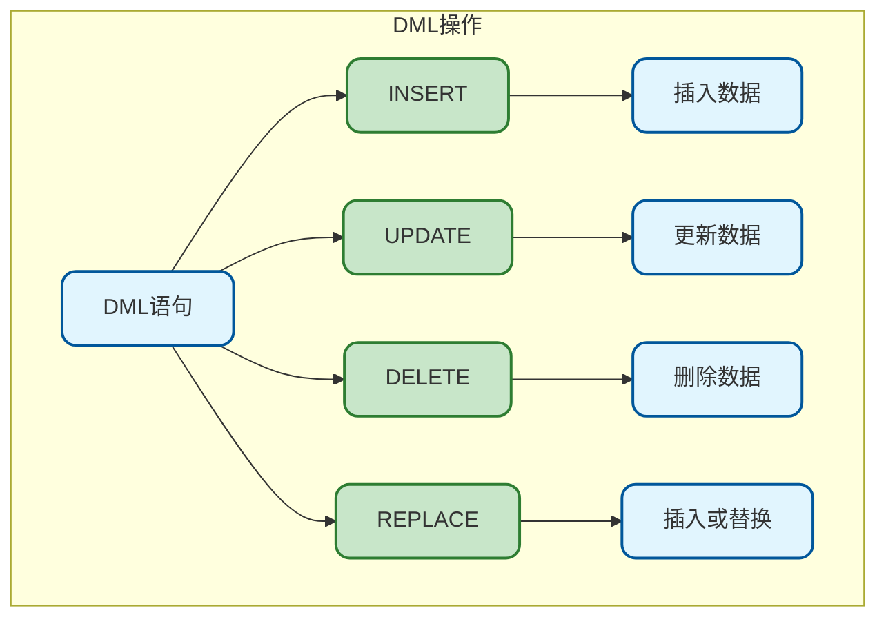
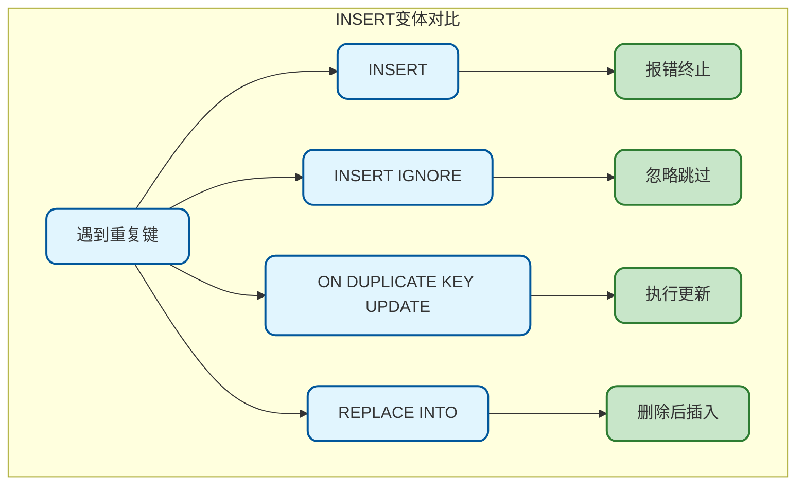
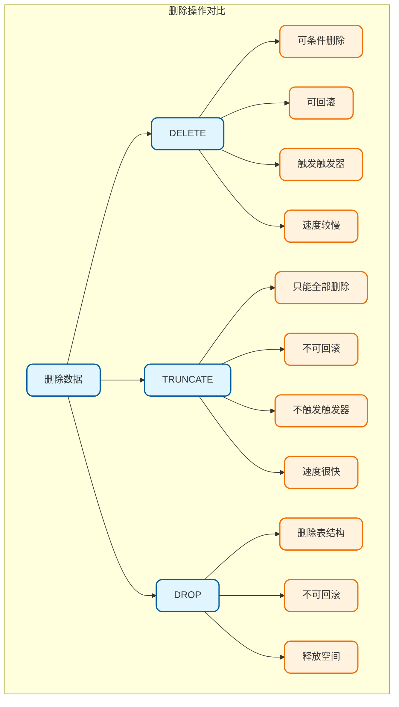
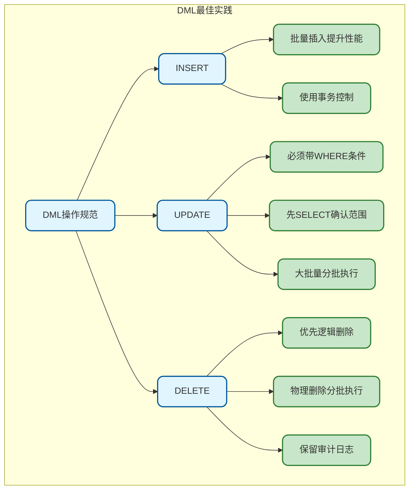

# MySQL数据操作基础

## DML语句概述

DML（Data Manipulation Language）数据操作语言，用于对表中的数据进行增删改操作。



## INSERT插入数据

### 基本语法

```sql
-- 语法1：指定列名插入
INSERT INTO table_name (column1, column2, ...) 
VALUES (value1, value2, ...);

-- 语法2：按表结构顺序插入所有列（不推荐）
INSERT INTO table_name 
VALUES (value1, value2, ...);
```

### 单行插入

```sql
-- 准备示例表
CREATE TABLE user (
    id BIGINT PRIMARY KEY AUTO_INCREMENT,
    username VARCHAR(50) NOT NULL,
    email VARCHAR(100),
    age INT,
    status TINYINT DEFAULT 1,
    created_at DATETIME DEFAULT CURRENT_TIMESTAMP
);

-- 指定列名插入（推荐）
INSERT INTO user (username, email, age) 
VALUES ('zhangsan', 'zs@example.com', 25);

-- 插入所有列（需按顺序，不推荐）
INSERT INTO user 
VALUES (NULL, 'lisi', 'ls@example.com', 30, 1, NOW());

-- 只插入必填字段，其他使用默认值
INSERT INTO user (username) VALUES ('wangwu');
```

### 多行插入

```sql
-- 一次插入多行（效率更高）
INSERT INTO user (username, email, age) VALUES 
    ('user1', 'user1@example.com', 20),
    ('user2', 'user2@example.com', 22),
    ('user3', 'user3@example.com', 25),
    ('user4', 'user4@example.com', 28);

-- 批量插入性能对比
-- 单条插入100条数据：约1秒
-- 批量插入100条数据：约0.01秒
```

**批量插入建议：**

> 1. 每次批量不超过1000条，避免事务过大
> 2. 使用事务包裹批量插入
> 3. 关闭自动提交可提升性能

### INSERT...SELECT

从查询结果插入数据：

```sql
-- 创建备份表
CREATE TABLE user_backup LIKE user;

-- 从查询结果插入
INSERT INTO user_backup (username, email, age, status)
SELECT username, email, age, status 
FROM user 
WHERE status = 1;

-- 跨表插入
INSERT INTO order_archive (id, order_no, amount, created_at)
SELECT id, order_no, amount, created_at
FROM `order`
WHERE created_at < '2024-01-01';
```

### INSERT IGNORE

忽略重复键错误，继续执行：

```sql
-- 表中已存在id=1的记录
INSERT INTO user (id, username) VALUES (1, 'new_user');
-- 报错：Duplicate entry '1' for key 'PRIMARY'

-- 使用IGNORE忽略错误
INSERT IGNORE INTO user (id, username) VALUES (1, 'new_user');
-- 不报错，但也不插入

-- 批量插入时跳过重复记录
INSERT IGNORE INTO user (username, email) VALUES 
    ('zhangsan', 'new@example.com'),  -- 跳过（username重复）
    ('newuser', 'new@example.com');    -- 成功插入
```

### ON DUPLICATE KEY UPDATE

遇到重复键时执行更新：

```sql
-- 插入或更新（常用于计数器、统计表）
INSERT INTO user_stats (user_id, login_count, last_login)
VALUES (1001, 1, NOW())
ON DUPLICATE KEY UPDATE 
    login_count = login_count + 1,
    last_login = NOW();

-- 实际场景：商品库存更新
INSERT INTO product_stock (product_id, quantity, updated_at)
VALUES (100, 50, NOW())
ON DUPLICATE KEY UPDATE 
    quantity = quantity + VALUES(quantity),
    updated_at = NOW();
```

### REPLACE INTO

存在则删除后插入，不存在则直接插入：

```sql
-- REPLACE会先删除再插入（触发DELETE和INSERT触发器）
REPLACE INTO user (id, username, email) 
VALUES (1, 'zhangsan', 'new@example.com');

-- 注意：REPLACE会重置未指定列的值为默认值
```

**INSERT对比：**



## UPDATE更新数据

### 基本语法

```sql
UPDATE table_name 
SET column1 = value1, column2 = value2, ...
WHERE condition;
```

### 单表更新

```sql
-- 更新单条记录
UPDATE user 
SET email = 'newemail@example.com', age = 26
WHERE id = 1;

-- 更新多条记录
UPDATE user 
SET status = 0 
WHERE created_at < '2023-01-01';

-- 使用表达式更新
UPDATE product 
SET price = price * 0.9  -- 打九折
WHERE category_id = 5;

-- 使用函数更新
UPDATE user 
SET username = UPPER(username),
    updated_at = NOW()
WHERE status = 1;
```

### 条件更新

```sql
-- CASE WHEN条件更新
UPDATE product SET price = 
    CASE 
        WHEN category_id = 1 THEN price * 0.8
        WHEN category_id = 2 THEN price * 0.9
        ELSE price * 0.95
    END
WHERE status = 1;

-- IF函数
UPDATE user 
SET level = IF(score >= 100, 'VIP', 'Normal')
WHERE status = 1;
```

### 多表更新

```sql
-- 关联更新
UPDATE `order` o
INNER JOIN user u ON o.user_id = u.id
SET o.user_name = u.username
WHERE o.user_name IS NULL;

-- 子查询更新
UPDATE product 
SET category_name = (
    SELECT name FROM category WHERE id = product.category_id
)
WHERE category_name IS NULL;

-- LEFT JOIN更新
UPDATE product p
LEFT JOIN category c ON p.category_id = c.id
SET p.status = 0
WHERE c.id IS NULL;  -- 分类不存在的商品下架
```

### UPDATE限制和排序

```sql
-- 限制更新数量
UPDATE user 
SET status = 0 
WHERE created_at < '2023-01-01'
LIMIT 100;  -- 只更新前100条

-- 按顺序更新
UPDATE product 
SET rank = rank + 1
WHERE category_id = 1
ORDER BY rank DESC  -- 从大到小更新，避免rank重复
LIMIT 10;
```

### UPDATE注意事项

> 1. **必须带WHERE条件**：不带条件会更新全表！
> 2. **测试用SELECT**：先用相同条件的SELECT确认影响范围
> 3. **控制更新量**：大批量更新分批进行，避免锁表时间过长
> 4. **索引优化**：WHERE条件字段应有索引

```sql
-- 安全的UPDATE流程
-- 1. 先用SELECT确认
SELECT id, status FROM user WHERE created_at < '2023-01-01';

-- 2. 确认数量和数据后执行UPDATE
UPDATE user SET status = 0 WHERE created_at < '2023-01-01';
```

## DELETE删除数据

### 基本语法

```sql
DELETE FROM table_name WHERE condition;
```

### 单表删除

```sql
-- 删除单条记录
DELETE FROM user WHERE id = 1;

-- 条件删除
DELETE FROM user 
WHERE status = 0 
AND created_at < '2023-01-01';

-- 限制删除数量
DELETE FROM operation_log 
WHERE created_at < '2023-01-01'
ORDER BY created_at
LIMIT 1000;  -- 分批删除，每次1000条
```

### 多表删除

```sql
-- 删除多表数据（谨慎使用）
DELETE o, oi 
FROM `order` o
INNER JOIN order_item oi ON o.id = oi.order_id
WHERE o.status = 0 
AND o.created_at < '2023-01-01';

-- 根据关联条件删除
DELETE u 
FROM user u
LEFT JOIN `order` o ON u.id = o.user_id
WHERE o.id IS NULL  -- 没有订单的用户
AND u.created_at < '2023-01-01';
```

### 删除全部数据

```sql
-- 删除所有数据（保留表结构）
DELETE FROM user;  -- 慢，可回滚，不重置AUTO_INCREMENT

-- 推荐使用TRUNCATE
TRUNCATE TABLE user;  -- 快，不可回滚，重置AUTO_INCREMENT
```

### DELETE vs TRUNCATE vs DROP



## 逻辑删除

实际开发中推荐使用逻辑删除而非物理删除：

```sql
-- 表设计：添加is_deleted字段
CREATE TABLE user (
    id BIGINT PRIMARY KEY AUTO_INCREMENT,
    username VARCHAR(50) NOT NULL,
    -- 其他字段...
    is_deleted TINYINT DEFAULT 0 COMMENT '0-正常 1-已删除',
    deleted_at DATETIME DEFAULT NULL COMMENT '删除时间'
);

-- 逻辑删除：更新而非删除
UPDATE user 
SET is_deleted = 1, deleted_at = NOW()
WHERE id = 1;

-- 查询时排除已删除数据
SELECT * FROM user WHERE is_deleted = 0;

-- 创建视图简化查询
CREATE VIEW user_active AS
SELECT * FROM user WHERE is_deleted = 0;
```

**逻辑删除优点：**

> 1. 数据可恢复
> 2. 保留历史记录
> 3. 维护外键完整性
> 4. 方便数据审计

## 事务控制

DML操作通常需要事务保护：

```sql
-- 开启事务
START TRANSACTION;
-- 或者
BEGIN;

-- 执行DML操作
INSERT INTO `order` (user_id, amount) VALUES (1001, 99.00);
SET @order_id = LAST_INSERT_ID();

INSERT INTO order_item (order_id, product_id, quantity) 
VALUES (@order_id, 100, 2);

UPDATE product SET stock = stock - 2 WHERE id = 100;

-- 提交事务
COMMIT;

-- 或者回滚事务
-- ROLLBACK;
```

**事务使用示例：**

```sql
-- 转账操作示例
START TRANSACTION;

-- 检查余额
SELECT balance INTO @balance FROM account WHERE id = 1 FOR UPDATE;

IF @balance >= 100 THEN
    -- 扣款
    UPDATE account SET balance = balance - 100 WHERE id = 1;
    -- 收款
    UPDATE account SET balance = balance + 100 WHERE id = 2;
    COMMIT;
ELSE
    ROLLBACK;
END IF;
```

## 批量操作优化

### 批量插入优化

```sql
-- 关闭自动提交
SET autocommit = 0;

-- 批量插入
INSERT INTO user (username, email) VALUES 
    ('user1', 'user1@example.com'),
    ('user2', 'user2@example.com'),
    -- ... 更多数据
    ('user1000', 'user1000@example.com');

-- 提交
COMMIT;

-- 恢复自动提交
SET autocommit = 1;
```

### 批量更新优化

```sql
-- 方式1：CASE WHEN批量更新
UPDATE product SET price = 
    CASE id 
        WHEN 1 THEN 99.00
        WHEN 2 THEN 199.00
        WHEN 3 THEN 299.00
    END
WHERE id IN (1, 2, 3);

-- 方式2：临时表关联更新
CREATE TEMPORARY TABLE temp_update (
    id BIGINT,
    new_price DECIMAL(10, 2)
);

INSERT INTO temp_update VALUES (1, 99.00), (2, 199.00), (3, 299.00);

UPDATE product p
INNER JOIN temp_update t ON p.id = t.id
SET p.price = t.new_price;

DROP TEMPORARY TABLE temp_update;
```

### 批量删除优化

```sql
-- 大表分批删除，避免长时间锁表
-- 每次删除1000条，循环执行
DELIMITER //
CREATE PROCEDURE batch_delete()
BEGIN
    DECLARE done INT DEFAULT FALSE;
    
    REPEAT
        DELETE FROM operation_log 
        WHERE created_at < '2023-01-01'
        LIMIT 1000;
        
        -- 暂停一下，避免压力过大
        DO SLEEP(0.1);
        
        SET done = ROW_COUNT() = 0;
    UNTIL done END REPEAT;
END //
DELIMITER ;

CALL batch_delete();
```

## DML最佳实践



**核心要点：**

1. **INSERT**：批量插入提升效率，注意唯一键冲突处理
2. **UPDATE**：必须带WHERE，先SELECT确认，大批量分批执行
3. **DELETE**：优先逻辑删除，物理删除要分批，保留审计日志
4. **事务**：关键操作使用事务，合理控制事务大小
5. **安全**：开发环境先测试，生产环境要备份
