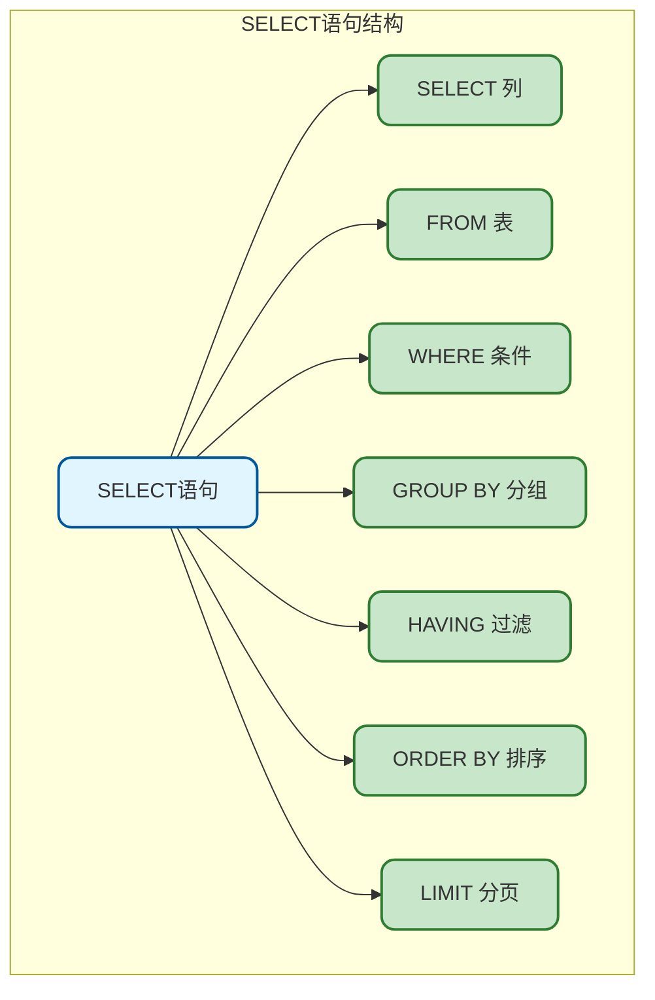
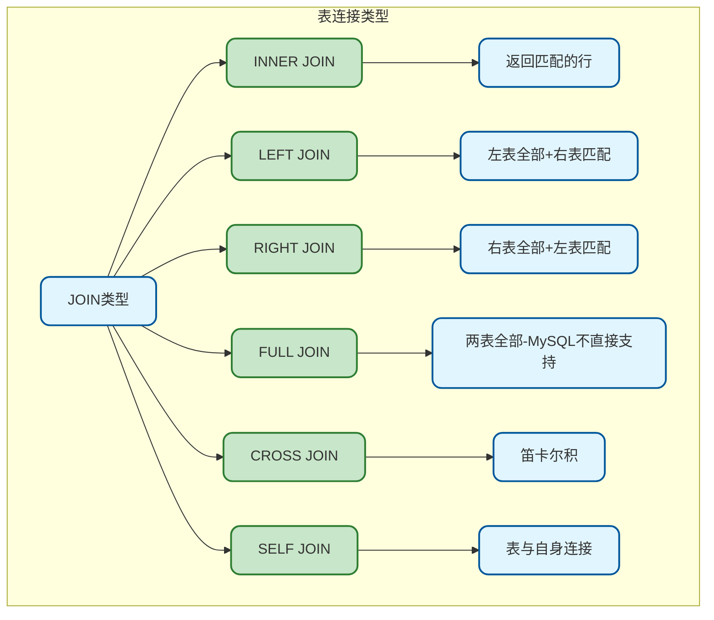
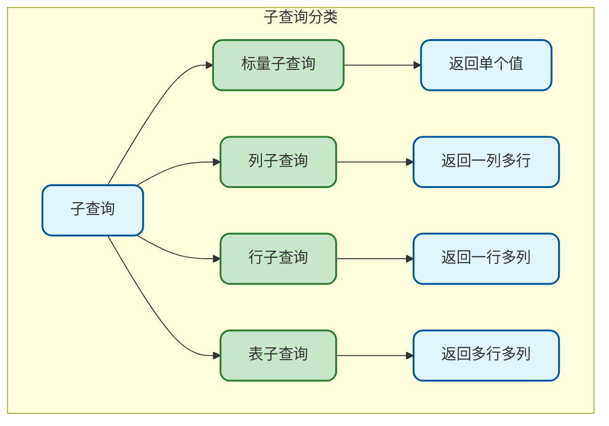
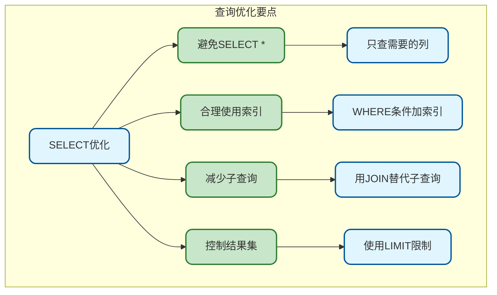

# MySQL查询基础与SELECT语法

## SELECT语句概述

SELECT是SQL中最常用的语句，用于从表中检索数据。理解SELECT的完整语法和执行顺序对于编写高效查询至关重要。



## 基本查询语法

### 完整语法结构

```sql
SELECT [DISTINCT] column1, column2, ...
FROM table_name
[WHERE condition]
[GROUP BY column_list]
[HAVING condition]
[ORDER BY column_list [ASC|DESC]]
[LIMIT offset, count];
```

### 执行顺序

SELECT语句的执行顺序与书写顺序不同：


| 执行顺序 | 子句 | 说明 |
|----------|------|------|
| 1 | FROM | 确定数据来源 |
| 2 | WHERE | 过滤行 |
| 3 | GROUP BY | 分组 |
| 4 | HAVING | 过滤分组 |
| 5 | SELECT | 选择列 |
| 6 | DISTINCT | 去重 |
| 7 | ORDER BY | 排序 |
| 8 | LIMIT | 限制返回行数 |

## 查询列

### 查询所有列

```sql
-- 查询所有列（不推荐在生产环境使用）
SELECT * FROM user;

-- 推荐：明确指定需要的列
SELECT id, username, email, created_at FROM user;
```

**不推荐SELECT *的原因：**

> 1. 网络传输更多数据
> 2. 无法使用覆盖索引
> 3. 表结构变化可能导致问题
> 4. 可读性差

### 查询指定列

```sql
-- 基本列查询
SELECT id, username, email FROM user;

-- 使用表别名
SELECT u.id, u.username, u.email FROM user u;

-- 使用数据库名.表名.列名（跨库查询时）
SELECT mydb.user.id, mydb.user.username FROM mydb.user;
```

### 列别名

```sql
-- 使用AS关键字
SELECT 
    id AS user_id,
    username AS name,
    created_at AS register_time
FROM user;

-- 省略AS（不推荐）
SELECT 
    id user_id,
    username name
FROM user;

-- 别名包含空格或特殊字符时需要引号
SELECT 
    id AS "用户ID",
    username AS "用户名"
FROM user;
```

### 计算列

```sql
-- 数学运算
SELECT 
    product_name,
    price,
    quantity,
    price * quantity AS total_amount
FROM order_item;

-- 字符串拼接
SELECT 
    CONCAT(first_name, ' ', last_name) AS full_name
FROM employee;

-- 使用函数
SELECT 
    username,
    UPPER(email) AS email_upper,
    LENGTH(username) AS name_length,
    DATE_FORMAT(created_at, '%Y-%m-%d') AS register_date
FROM user;
```

### 常量和表达式

```sql
-- 常量列
SELECT 
    id, 
    username, 
    '活跃用户' AS user_type,
    1 AS status_code
FROM user 
WHERE status = 1;

-- 条件表达式
SELECT 
    id,
    username,
    CASE status
        WHEN 0 THEN '禁用'
        WHEN 1 THEN '正常'
        WHEN 2 THEN 'VIP'
        ELSE '未知'
    END AS status_text
FROM user;

-- IF表达式
SELECT 
    id,
    username,
    IF(age >= 18, '成年', '未成年') AS age_group
FROM user;
```

## DISTINCT去重

### 基本用法

```sql
-- 单列去重
SELECT DISTINCT status FROM user;

-- 多列组合去重
SELECT DISTINCT status, gender FROM user;

-- 注意：DISTINCT作用于所有选择的列
SELECT DISTINCT status, username FROM user;
-- 等价于按(status, username)组合去重
```

### DISTINCT vs GROUP BY

```sql
-- 使用DISTINCT
SELECT DISTINCT department_id FROM employee;

-- 使用GROUP BY（功能相同）
SELECT department_id FROM employee GROUP BY department_id;

-- GROUP BY更强大，可以配合聚合函数
SELECT department_id, COUNT(*) as emp_count 
FROM employee 
GROUP BY department_id;
```

## FROM子句

### 单表查询

```sql
SELECT * FROM user;

-- 使用别名
SELECT * FROM user AS u;
SELECT * FROM user u;  -- 省略AS
```

### 多表查询

```sql
-- 隐式连接（逗号分隔，不推荐）
SELECT u.username, o.order_no
FROM user u, `order` o
WHERE u.id = o.user_id;

-- 显式连接（推荐）
SELECT u.username, o.order_no
FROM user u
INNER JOIN `order` o ON u.id = o.user_id;
```

### 子查询作为表

```sql
-- 子查询必须有别名
SELECT * 
FROM (
    SELECT user_id, SUM(amount) as total
    FROM `order`
    GROUP BY user_id
) AS user_orders
WHERE total > 1000;
```

## 表连接详解

### 连接类型



### INNER JOIN内连接

只返回两表中匹配的行：

```sql
-- 查询有订单的用户
SELECT 
    u.id, u.username, o.order_no, o.amount
FROM user u
INNER JOIN `order` o ON u.id = o.user_id;

-- 多表连接
SELECT 
    u.username,
    o.order_no,
    p.product_name,
    oi.quantity
FROM user u
INNER JOIN `order` o ON u.id = o.user_id
INNER JOIN order_item oi ON o.id = oi.order_id
INNER JOIN product p ON oi.product_id = p.id;
```

### LEFT JOIN左连接

返回左表所有行，右表无匹配时显示NULL：

```sql
-- 查询所有用户及其订单（包括没有订单的用户）
SELECT 
    u.id, u.username, o.order_no, o.amount
FROM user u
LEFT JOIN `order` o ON u.id = o.user_id;

-- 查找没有订单的用户
SELECT u.id, u.username
FROM user u
LEFT JOIN `order` o ON u.id = o.user_id
WHERE o.id IS NULL;
```

### RIGHT JOIN右连接

返回右表所有行，左表无匹配时显示NULL：

```sql
-- 查询所有订单及用户信息（包括用户已删除的订单）
SELECT 
    u.username, o.order_no, o.amount
FROM user u
RIGHT JOIN `order` o ON u.id = o.user_id;
```

### CROSS JOIN交叉连接

返回笛卡尔积，每行与每行组合：

```sql
-- 生成所有颜色和尺码的组合
SELECT c.color_name, s.size_name
FROM color c
CROSS JOIN size s;

-- 等价写法
SELECT c.color_name, s.size_name
FROM color c, size s;
```

### SELF JOIN自连接

表与自身连接，用于处理层级关系：

```sql
-- 员工及其直属领导
CREATE TABLE employee (
    id BIGINT PRIMARY KEY,
    name VARCHAR(50),
    manager_id BIGINT  -- 上级ID
);

-- 自连接查询
SELECT 
    e.name AS employee_name,
    m.name AS manager_name
FROM employee e
LEFT JOIN employee m ON e.manager_id = m.id;
```

### 连接条件

```sql
-- ON子句：标准连接条件
SELECT * FROM user u
INNER JOIN `order` o ON u.id = o.user_id;

-- 多个连接条件
SELECT * FROM user u
INNER JOIN `order` o ON u.id = o.user_id 
                     AND o.status = 1;

-- USING：当连接列名相同时的简写
SELECT * FROM `order` o
INNER JOIN order_item oi USING (order_id);
-- 等价于 ON o.order_id = oi.order_id

-- NATURAL JOIN：自动按同名列连接（不推荐）
SELECT * FROM `order` NATURAL JOIN order_item;
```

## UNION合并查询

### 基本用法

```sql
-- UNION：合并结果并去重
SELECT username, email FROM user WHERE status = 1
UNION
SELECT username, email FROM user_archive WHERE status = 1;

-- UNION ALL：合并结果不去重（性能更好）
SELECT username, email FROM user WHERE status = 1
UNION ALL
SELECT username, email FROM user_archive WHERE status = 1;
```

### 使用规则

```sql
-- 列数必须相同
SELECT id, username FROM user
UNION
SELECT id, name FROM admin;  -- 正确

-- 列数据类型应兼容
SELECT id, username, email FROM user
UNION
SELECT id, name, email FROM admin;  -- 正确

-- 排序和限制
(SELECT username, created_at FROM user WHERE status = 1 LIMIT 5)
UNION ALL
(SELECT username, created_at FROM admin WHERE status = 1 LIMIT 5)
ORDER BY created_at DESC
LIMIT 8;
```

## 子查询

### 子查询类型



### 标量子查询

返回单个值：

```sql
-- SELECT中使用
SELECT 
    username,
    (SELECT COUNT(*) FROM `order` WHERE user_id = u.id) AS order_count
FROM user u;

-- WHERE中使用
SELECT * FROM user 
WHERE created_at > (SELECT MAX(created_at) FROM user WHERE status = 0);
```

### 列子查询

返回一列多行，配合IN、ANY、ALL使用：

```sql
-- IN子查询
SELECT * FROM user 
WHERE id IN (SELECT DISTINCT user_id FROM `order`);

-- NOT IN子查询
SELECT * FROM user 
WHERE id NOT IN (SELECT DISTINCT user_id FROM `order`);

-- ANY/SOME：满足任意一个
SELECT * FROM product 
WHERE price > ANY (SELECT price FROM product WHERE category_id = 1);

-- ALL：满足所有
SELECT * FROM product 
WHERE price > ALL (SELECT price FROM product WHERE category_id = 1);
```

### EXISTS子查询

判断子查询是否返回结果：

```sql
-- EXISTS：存在匹配则返回
SELECT * FROM user u
WHERE EXISTS (
    SELECT 1 FROM `order` o 
    WHERE o.user_id = u.id AND o.amount > 1000
);

-- NOT EXISTS：不存在匹配则返回
SELECT * FROM user u
WHERE NOT EXISTS (
    SELECT 1 FROM `order` o WHERE o.user_id = u.id
);
```

**IN vs EXISTS：**

| 场景 | 推荐 | 原因 |
|------|------|------|
| 子查询结果集小 | IN | 子查询只执行一次 |
| 子查询结果集大 | EXISTS | 可利用外表索引 |
| 外表小，内表大 | IN | - |
| 外表大，内表小 | EXISTS | - |

### 表子查询

```sql
-- FROM中的子查询
SELECT user_type, AVG(order_total) as avg_total
FROM (
    SELECT 
        u.id,
        CASE WHEN u.vip_level > 0 THEN 'VIP' ELSE '普通' END as user_type,
        SUM(o.amount) as order_total
    FROM user u
    LEFT JOIN `order` o ON u.id = o.user_id
    GROUP BY u.id
) AS user_stats
GROUP BY user_type;
```

## 常用查询模式

### 分页查询

```sql
-- 基本分页
SELECT * FROM user 
ORDER BY id
LIMIT 10 OFFSET 0;  -- 第1页，每页10条

SELECT * FROM user 
ORDER BY id
LIMIT 10 OFFSET 10;  -- 第2页

-- 简写形式
SELECT * FROM user ORDER BY id LIMIT 0, 10;  -- LIMIT offset, count
SELECT * FROM user ORDER BY id LIMIT 10, 10;
```

### 随机查询

```sql
-- 随机获取N条记录（小表）
SELECT * FROM user ORDER BY RAND() LIMIT 5;

-- 大表优化：先随机ID再查询
SELECT * FROM user
WHERE id >= (SELECT FLOOR(RAND() * (SELECT MAX(id) FROM user)))
ORDER BY id
LIMIT 5;
```

### 排名查询

```sql
-- MySQL 8.0+ 窗口函数
SELECT 
    username,
    score,
    ROW_NUMBER() OVER (ORDER BY score DESC) as rank_no,
    RANK() OVER (ORDER BY score DESC) as rank_with_gap,
    DENSE_RANK() OVER (ORDER BY score DESC) as rank_dense
FROM user_score;

-- MySQL 5.7 使用变量模拟
SELECT 
    username,
    score,
    @rank := @rank + 1 as rank_no
FROM user_score, (SELECT @rank := 0) r
ORDER BY score DESC;
```

## 查询优化建议



**核心要点：**

1. **明确查询列**：避免SELECT *，只查询需要的字段
2. **使用表别名**：多表查询时提高可读性
3. **优先JOIN**：大多数情况下比子查询性能更好
4. **合理分页**：深度分页需要优化
5. **理解执行顺序**：有助于编写正确的查询
