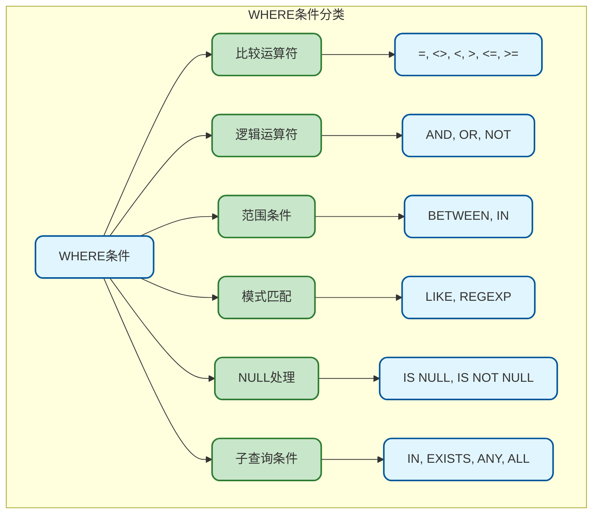
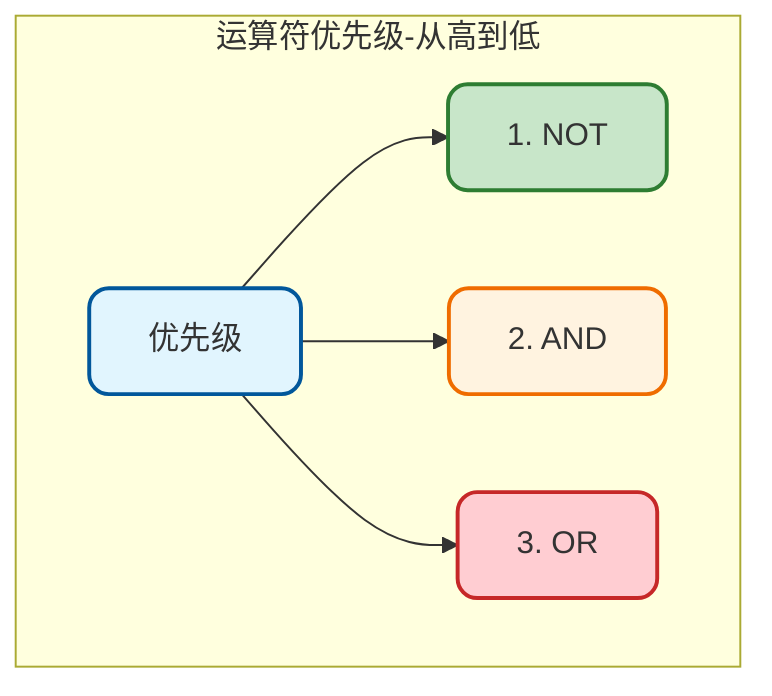
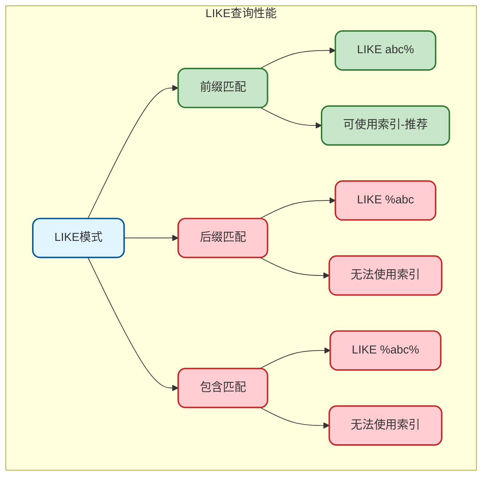
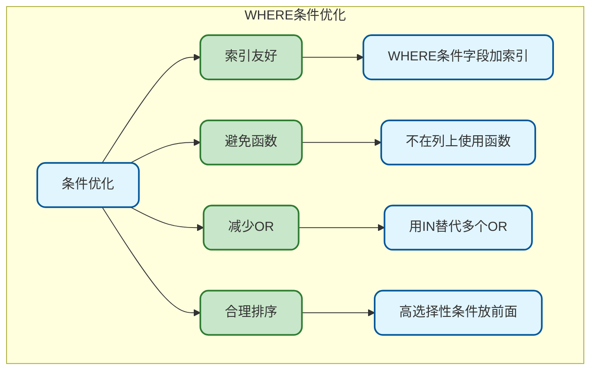

# MySQL查询条件详解

## WHERE子句概述

WHERE子句用于过滤查询结果，是SQL查询中最重要的部分之一。掌握各种条件表达式对于编写高效、正确的查询至关重要。



## 比较运算符

### 基本比较运算符

| 运算符 | 说明 | 示例 |
|--------|------|------|
| `=` | 等于 | `status = 1` |
| `<>` 或 `!=` | 不等于 | `status <> 0` |
| `<` | 小于 | `age < 18` |
| `>` | 大于 | `age > 65` |
| `<=` | 小于等于 | `price <= 100` |
| `>=` | 大于等于 | `score >= 60` |

```sql
-- 等于
SELECT * FROM user WHERE status = 1;

-- 不等于
SELECT * FROM user WHERE status <> 0;
SELECT * FROM user WHERE status != 0;  -- 效果相同

-- 大小比较
SELECT * FROM product WHERE price < 100;
SELECT * FROM product WHERE price >= 50 AND price <= 100;

-- 日期比较
SELECT * FROM `order` WHERE created_at >= '2024-01-01';
SELECT * FROM `order` WHERE created_at < '2024-02-01';
```

### 安全等于运算符

```sql
-- <=> 安全等于运算符，可以比较NULL
SELECT * FROM user WHERE email <=> NULL;  -- 等价于 IS NULL
SELECT * FROM user WHERE email <=> 'test@example.com';

-- 普通 = 比较NULL会返回NULL，不是TRUE或FALSE
SELECT * FROM user WHERE email = NULL;  -- 永远返回空！
```

### 字符串比较

```sql
-- 字符串比较（默认不区分大小写）
SELECT * FROM user WHERE username = 'ZhangSan';  -- 能匹配'zhangsan'

-- 区分大小写比较
SELECT * FROM user WHERE BINARY username = 'ZhangSan';
SELECT * FROM user WHERE username COLLATE utf8mb4_bin = 'ZhangSan';

-- 字符串排序比较
SELECT * FROM product WHERE name > 'A' AND name < 'C';
```

## 逻辑运算符

### AND与运算

所有条件都必须满足：

```sql
-- 多个AND条件
SELECT * FROM user 
WHERE status = 1 
  AND age >= 18 
  AND created_at >= '2024-01-01';

-- AND优先级高于OR
SELECT * FROM product 
WHERE category_id = 1 AND price < 100 
   OR category_id = 2 AND price < 50;
-- 等价于
SELECT * FROM product 
WHERE (category_id = 1 AND price < 100) 
   OR (category_id = 2 AND price < 50);
```

### OR或运算

满足任意一个条件即可：

```sql
-- 多个OR条件
SELECT * FROM user 
WHERE status = 0 OR status = 2 OR status = 3;

-- 等价于使用IN
SELECT * FROM user WHERE status IN (0, 2, 3);

-- OR与AND混用时使用括号明确优先级
SELECT * FROM `order` 
WHERE (status = 1 OR status = 2) 
  AND amount > 100;
```

### NOT非运算

取反条件：

```sql
-- NOT运算
SELECT * FROM user WHERE NOT status = 0;  -- 等价于 status <> 0

-- NOT IN
SELECT * FROM user WHERE id NOT IN (1, 2, 3);

-- NOT LIKE
SELECT * FROM user WHERE username NOT LIKE 'test%';

-- NOT BETWEEN
SELECT * FROM product WHERE price NOT BETWEEN 100 AND 200;

-- NOT EXISTS
SELECT * FROM user u
WHERE NOT EXISTS (SELECT 1 FROM `order` o WHERE o.user_id = u.id);
```

### 运算符优先级



```sql
-- 建议：使用括号明确优先级，避免歧义
SELECT * FROM user 
WHERE (status = 1 AND age > 18) OR (status = 2 AND vip = 1);
```

## 范围条件

### BETWEEN...AND

闭区间范围查询：

```sql
-- 数值范围
SELECT * FROM product WHERE price BETWEEN 100 AND 500;
-- 等价于
SELECT * FROM product WHERE price >= 100 AND price <= 500;

-- 日期范围
SELECT * FROM `order` 
WHERE created_at BETWEEN '2024-01-01' AND '2024-01-31 23:59:59';

-- 字符范围
SELECT * FROM user WHERE username BETWEEN 'A' AND 'M';

-- NOT BETWEEN
SELECT * FROM product WHERE price NOT BETWEEN 100 AND 500;
```

**BETWEEN注意事项：**

> 1. BETWEEN是闭区间，包含边界值
> 2. 日期范围注意时间部分，BETWEEN '2024-01-01' AND '2024-01-31' 不包含31号全天

### IN列表

匹配列表中的任意值：

```sql
-- 数值列表
SELECT * FROM user WHERE id IN (1, 2, 3, 4, 5);

-- 字符串列表
SELECT * FROM product WHERE category IN ('电子', '服装', '食品');

-- NOT IN
SELECT * FROM user WHERE status NOT IN (0, -1);

-- IN子查询
SELECT * FROM user WHERE id IN (SELECT DISTINCT user_id FROM `order`);
```

**IN vs OR：**

```sql
-- IN更简洁，性能相近
SELECT * FROM user WHERE status IN (1, 2, 3);
-- 等价于
SELECT * FROM user WHERE status = 1 OR status = 2 OR status = 3;
```

**IN注意事项：**

> 1. IN列表不宜过长，一般不超过1000个值
> 2. NOT IN遇到NULL会有问题，结果可能不符合预期
> 3. 大量值考虑使用临时表JOIN

```sql
-- NOT IN的NULL陷阱
SELECT * FROM user WHERE id NOT IN (1, 2, NULL);
-- 结果为空！因为 id <> NULL 永远为NULL

-- 解决方案：排除NULL
SELECT * FROM user WHERE id NOT IN (1, 2) AND id IS NOT NULL;
```

## 模式匹配

### LIKE模糊匹配

```sql
-- % 匹配任意字符（包括空）
SELECT * FROM user WHERE username LIKE 'zhang%';  -- 以zhang开头
SELECT * FROM user WHERE email LIKE '%@gmail.com';  -- 以@gmail.com结尾
SELECT * FROM user WHERE username LIKE '%san%';  -- 包含san

-- _ 匹配单个字符
SELECT * FROM user WHERE phone LIKE '138________';  -- 138开头的11位手机号
SELECT * FROM user WHERE code LIKE 'A_C';  -- A和C之间有一个字符

-- 组合使用
SELECT * FROM product WHERE name LIKE '%手机%' AND name LIKE '%Pro%';

-- 转义特殊字符
SELECT * FROM product WHERE name LIKE '%10\%%' ESCAPE '\\';  -- 包含10%
SELECT * FROM product WHERE name LIKE '%10#%%' ESCAPE '#';  -- 自定义转义符
```

**LIKE通配符：**

| 通配符 | 说明 | 示例 |
|--------|------|------|
| % | 任意长度字符 | `'%test%'` |
| _ | 单个字符 | `'test_'` |

**LIKE性能注意：**



### REGEXP正则匹配

更强大的模式匹配：

```sql
-- 基本正则
SELECT * FROM user WHERE email REGEXP '@gmail\\.com$';

-- 常用正则模式
SELECT * FROM user WHERE phone REGEXP '^1[3-9][0-9]{9}$';  -- 手机号验证

-- 匹配多个模式
SELECT * FROM product WHERE name REGEXP '手机|平板|电脑';

-- 正则元字符
-- ^  开头
-- $  结尾
-- .  任意单个字符
-- *  重复0次或多次
-- +  重复1次或多次
-- ?  重复0次或1次
-- [] 字符集
-- |  或

-- 示例
SELECT * FROM user WHERE username REGEXP '^[a-zA-Z][a-zA-Z0-9_]{3,15}$';
-- 用户名：字母开头，4-16位，只能包含字母数字下划线
```

**REGEXP vs LIKE：**

| 特性 | LIKE | REGEXP |
|------|------|--------|
| 通配符 | % 和 _ | 正则表达式 |
| 性能 | 前缀匹配可用索引 | 无法使用索引 |
| 功能 | 简单匹配 | 复杂模式 |
| 使用场景 | 一般模糊查询 | 格式验证 |

## NULL值处理

### IS NULL和IS NOT NULL

```sql
-- 检查NULL值
SELECT * FROM user WHERE email IS NULL;
SELECT * FROM user WHERE email IS NOT NULL;

-- 错误用法（永远返回空）
SELECT * FROM user WHERE email = NULL;   -- 错误！
SELECT * FROM user WHERE email <> NULL;  -- 错误！

-- NULL在条件中的行为
SELECT * FROM user WHERE age > 18;  -- 不包含age为NULL的记录
SELECT * FROM user WHERE age <= 18; -- 不包含age为NULL的记录
SELECT * FROM user WHERE age > 18 OR age <= 18; -- 不包含age为NULL的记录！
```

### COALESCE和IFNULL

处理NULL值的函数：

```sql
-- IFNULL：两个参数
SELECT username, IFNULL(email, '未填写') as email FROM user;

-- COALESCE：多个参数，返回第一个非NULL值
SELECT username, COALESCE(phone, email, '无联系方式') as contact FROM user;

-- 在条件中使用
SELECT * FROM user WHERE COALESCE(score, 0) >= 60;

-- NULL安全比较
SELECT * FROM user WHERE IFNULL(status, 0) = 0;
```

### NULLIF函数

两个值相等时返回NULL：

```sql
-- NULLIF(expr1, expr2)：如果expr1=expr2返回NULL，否则返回expr1
SELECT NULLIF(10, 10);  -- 返回NULL
SELECT NULLIF(10, 20);  -- 返回10

-- 应用场景：避免除零错误
SELECT total / NULLIF(count, 0) as average FROM stats;
-- count为0时，NULLIF返回NULL，除法结果为NULL而非报错
```

## 日期时间条件

### 日期比较

```sql
-- 等于某天
SELECT * FROM `order` WHERE DATE(created_at) = '2024-01-15';

-- 日期范围
SELECT * FROM `order` 
WHERE created_at >= '2024-01-01 00:00:00' 
  AND created_at < '2024-02-01 00:00:00';

-- 使用BETWEEN
SELECT * FROM `order` 
WHERE created_at BETWEEN '2024-01-01' AND '2024-01-31 23:59:59';

-- 当天数据
SELECT * FROM `order` WHERE DATE(created_at) = CURDATE();

-- 最近N天
SELECT * FROM `order` 
WHERE created_at >= DATE_SUB(NOW(), INTERVAL 7 DAY);

-- 本月数据
SELECT * FROM `order` 
WHERE YEAR(created_at) = YEAR(NOW()) 
  AND MONTH(created_at) = MONTH(NOW());
```

### 日期函数

| 函数 | 说明 | 示例 |
|------|------|------|
| DATE() | 提取日期部分 | `DATE(NOW())` |
| YEAR() | 提取年份 | `YEAR(created_at) = 2024` |
| MONTH() | 提取月份 | `MONTH(created_at) = 1` |
| DAY() | 提取日期 | `DAY(created_at) = 15` |
| HOUR() | 提取小时 | `HOUR(created_at) = 14` |
| DATE_FORMAT() | 格式化日期 | `DATE_FORMAT(created_at, '%Y-%m')` |
| DATEDIFF() | 日期差（天） | `DATEDIFF(NOW(), created_at) < 30` |
| TIMESTAMPDIFF() | 时间差 | `TIMESTAMPDIFF(HOUR, created_at, NOW())` |

```sql
-- 查询指定月份的订单
SELECT * FROM `order` 
WHERE DATE_FORMAT(created_at, '%Y-%m') = '2024-01';

-- 查询周末的订单
SELECT * FROM `order` 
WHERE DAYOFWEEK(created_at) IN (1, 7);  -- 1=周日, 7=周六

-- 查询工作时间的订单
SELECT * FROM `order` 
WHERE HOUR(created_at) BETWEEN 9 AND 18;
```

**日期条件优化：**

> 使用函数处理列会导致索引失效，优先使用范围查询

```sql
-- 不推荐（索引失效）
SELECT * FROM `order` WHERE YEAR(created_at) = 2024;

-- 推荐（可使用索引）
SELECT * FROM `order` 
WHERE created_at >= '2024-01-01' AND created_at < '2025-01-01';
```

## 条件表达式

### CASE WHEN

```sql
-- 在WHERE中使用CASE（较少见）
SELECT * FROM user 
WHERE (
    CASE 
        WHEN status = 1 THEN age >= 18
        WHEN status = 2 THEN age >= 0
        ELSE FALSE
    END
);

-- 更常见：在SELECT中使用CASE
SELECT 
    username,
    CASE status
        WHEN 0 THEN '禁用'
        WHEN 1 THEN '正常'
        WHEN 2 THEN 'VIP'
        ELSE '未知'
    END as status_text
FROM user;
```

### IF函数

```sql
-- IF(condition, true_value, false_value)
SELECT 
    username,
    IF(age >= 18, '成年', '未成年') as age_group
FROM user;

-- 在WHERE中
SELECT * FROM product 
WHERE IF(category_id = 1, price < 100, price < 200);
```

## 复杂条件组合

### 实际业务场景

```sql
-- 场景1：用户筛选
SELECT * FROM user 
WHERE status = 1 
  AND (age BETWEEN 18 AND 35)
  AND email IS NOT NULL
  AND (vip_level > 0 OR total_orders > 10)
  AND created_at >= DATE_SUB(NOW(), INTERVAL 1 YEAR);

-- 场景2：商品搜索
SELECT * FROM product 
WHERE is_deleted = 0
  AND status = 1
  AND (name LIKE '%手机%' OR description LIKE '%手机%')
  AND price BETWEEN 1000 AND 5000
  AND (category_id IN (1, 2, 3) OR brand IN ('Apple', 'Samsung'))
  AND stock > 0
ORDER BY sales_count DESC
LIMIT 20;

-- 场景3：订单查询
SELECT o.*, u.username
FROM `order` o
INNER JOIN user u ON o.user_id = u.id
WHERE o.status IN (1, 2, 3)
  AND o.amount >= 100
  AND o.created_at >= '2024-01-01'
  AND (
      o.order_no LIKE 'ORD2024%'
      OR u.username LIKE '%张%'
      OR u.phone = '13800138000'
  )
ORDER BY o.created_at DESC;
```

### 动态条件构建

在应用程序中常需要动态构建WHERE条件：

```sql
-- 基础查询
SELECT * FROM user WHERE 1=1
  AND status = 1           -- 固定条件
  -- 以下为动态条件
  AND username LIKE '%张%'  -- 如果传入了username
  AND age >= 18             -- 如果传入了minAge
  AND created_at >= '2024-01-01'  -- 如果传入了startDate
;

-- 使用COALESCE处理可选条件
SELECT * FROM user
WHERE status = COALESCE(@status, status)
  AND age >= COALESCE(@minAge, 0)
  AND age <= COALESCE(@maxAge, 999);
```

## 条件优化建议



**核心要点：**

1. **索引优化**：WHERE条件中的列应该有索引
2. **避免函数**：不要在列上使用函数，否则索引失效
3. **LIKE优化**：尽量使用前缀匹配（`abc%`）
4. **NULL处理**：使用IS NULL/IS NOT NULL，而非 = NULL
5. **范围查询**：使用BETWEEN代替多个AND
6. **列表查询**：使用IN代替多个OR
7. **类型匹配**：条件值类型要与字段类型一致
