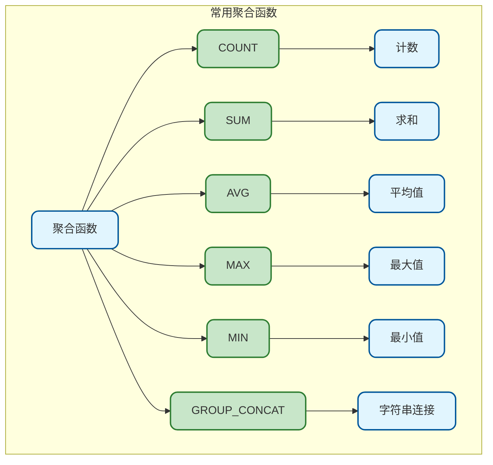
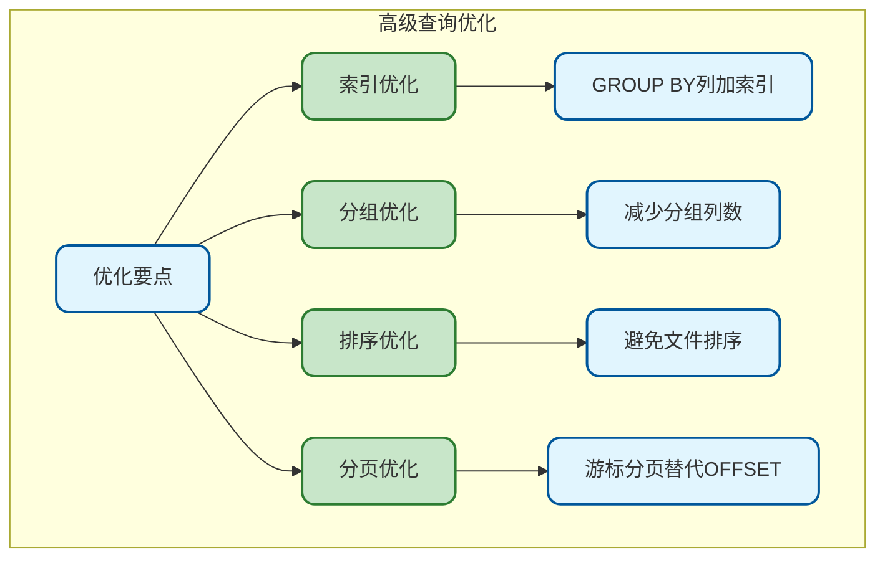

# MySQL高级查询与聚合

## 聚合函数概述

聚合函数用于对一组值进行计算并返回单个结果，是数据统计和分析的核心工具。



## COUNT计数

### 基本用法

```sql
-- 统计总行数
SELECT COUNT(*) FROM user;

-- 统计非NULL值数量
SELECT COUNT(email) FROM user;  -- 不包含email为NULL的行

-- 统计去重后的数量
SELECT COUNT(DISTINCT status) FROM user;

-- 条件计数
SELECT COUNT(*) FROM user WHERE status = 1;
```

### COUNT(*)、COUNT(1)、COUNT(列)的区别

| 方式 | 说明 | 性能 |
|------|------|------|
| COUNT(*) | 统计所有行 | 优化器优化，推荐使用 |
| COUNT(1) | 统计所有行 | 与COUNT(*)相同 |
| COUNT(列) | 统计该列非NULL行数 | 需要判断NULL |
| COUNT(DISTINCT 列) | 统计去重后的数量 | 需要去重计算 |

```sql
-- 实际效果对比
SELECT 
    COUNT(*) as total,
    COUNT(1) as total_1,
    COUNT(email) as has_email,
    COUNT(DISTINCT status) as status_count
FROM user;
```

### 条件计数技巧

```sql
-- 使用SUM + CASE实现条件计数
SELECT 
    COUNT(*) as total,
    SUM(CASE WHEN status = 1 THEN 1 ELSE 0 END) as active_count,
    SUM(CASE WHEN status = 0 THEN 1 ELSE 0 END) as inactive_count,
    SUM(CASE WHEN age >= 18 THEN 1 ELSE 0 END) as adult_count
FROM user;

-- 使用COUNT + IF
SELECT 
    COUNT(IF(status = 1, 1, NULL)) as active_count,
    COUNT(IF(status = 0, 1, NULL)) as inactive_count
FROM user;

-- MySQL 8.0+ 使用FILTER（通过CASE模拟）
SELECT 
    COUNT(*) FILTER (WHERE status = 1) as active_count  -- 标准SQL，MySQL暂不支持
FROM user;
```

## SUM求和

```sql
-- 基本求和
SELECT SUM(amount) FROM `order`;

-- 条件求和
SELECT SUM(amount) FROM `order` WHERE status = 1;

-- 多列求和
SELECT 
    SUM(amount) as total_amount,
    SUM(discount) as total_discount,
    SUM(amount - discount) as actual_total
FROM `order`;

-- 条件求和
SELECT 
    SUM(CASE WHEN status = 1 THEN amount ELSE 0 END) as paid_amount,
    SUM(CASE WHEN status = 0 THEN amount ELSE 0 END) as unpaid_amount
FROM `order`;

-- NULL处理
SELECT SUM(COALESCE(amount, 0)) FROM `order`;  -- 避免NULL影响
```

## AVG平均值

```sql
-- 基本平均值
SELECT AVG(price) FROM product;

-- 条件平均值
SELECT AVG(price) FROM product WHERE category_id = 1;

-- 保留小数位
SELECT ROUND(AVG(price), 2) as avg_price FROM product;

-- 加权平均
SELECT 
    SUM(price * quantity) / SUM(quantity) as weighted_avg
FROM order_item;

-- AVG会忽略NULL值
SELECT AVG(score) FROM user;  -- NULL不参与计算
SELECT AVG(COALESCE(score, 0)) FROM user;  -- NULL当作0处理
```

## MAX和MIN

```sql
-- 数值最大最小
SELECT MAX(price), MIN(price) FROM product;

-- 日期最大最小
SELECT 
    MAX(created_at) as latest_order,
    MIN(created_at) as earliest_order
FROM `order`;

-- 字符串最大最小（按字典序）
SELECT MAX(username), MIN(username) FROM user;

-- 结合子查询获取完整记录
SELECT * FROM product WHERE price = (SELECT MAX(price) FROM product);

-- 每组的最大最小
SELECT 
    category_id,
    MAX(price) as max_price,
    MIN(price) as min_price
FROM product
GROUP BY category_id;
```

## GROUP_CONCAT字符串聚合

将分组中的多个值连接成字符串：

```sql
-- 基本用法
SELECT GROUP_CONCAT(username) FROM user WHERE status = 1;
-- 结果：zhangsan,lisi,wangwu

-- 自定义分隔符
SELECT GROUP_CONCAT(username SEPARATOR '; ') FROM user;
-- 结果：zhangsan; lisi; wangwu

-- 排序后连接
SELECT GROUP_CONCAT(username ORDER BY created_at DESC) FROM user;

-- 去重连接
SELECT GROUP_CONCAT(DISTINCT category) FROM product;

-- 分组使用
SELECT 
    order_id,
    GROUP_CONCAT(product_name SEPARATOR ', ') as products
FROM order_item oi
INNER JOIN product p ON oi.product_id = p.id
GROUP BY order_id;

-- 限制长度（默认1024字节）
SET SESSION group_concat_max_len = 10000;
SELECT GROUP_CONCAT(description) FROM product;
```

## GROUP BY分组

### 基本用法

```sql
-- 单列分组
SELECT status, COUNT(*) as count
FROM user
GROUP BY status;

-- 多列分组
SELECT status, gender, COUNT(*) as count
FROM user
GROUP BY status, gender;

-- 分组统计
SELECT 
    category_id,
    COUNT(*) as product_count,
    AVG(price) as avg_price,
    SUM(stock) as total_stock
FROM product
GROUP BY category_id;
```

### GROUP BY执行流程


### 分组规则

```sql
-- SELECT中的非聚合列必须在GROUP BY中
SELECT category_id, product_name, COUNT(*)  -- 错误！product_name不在GROUP BY中
FROM product
GROUP BY category_id;

-- 正确写法
SELECT category_id, COUNT(*) as count
FROM product
GROUP BY category_id;

-- 或者使用ANY_VALUE（MySQL 5.7+）
SELECT category_id, ANY_VALUE(product_name), COUNT(*)
FROM product
GROUP BY category_id;

-- GROUP BY可以使用列别名（MySQL特性）
SELECT 
    DATE_FORMAT(created_at, '%Y-%m') as month,
    COUNT(*) as count
FROM `order`
GROUP BY month;

-- GROUP BY可以使用表达式
SELECT 
    YEAR(created_at) as year,
    MONTH(created_at) as month,
    COUNT(*)
FROM `order`
GROUP BY YEAR(created_at), MONTH(created_at);
```

### WITH ROLLUP汇总

生成分组小计和总计：

```sql
-- 基本ROLLUP
SELECT 
    COALESCE(category, '总计') as category,
    SUM(amount) as total
FROM sales
GROUP BY category WITH ROLLUP;

-- 多级ROLLUP
SELECT 
    COALESCE(year, '总计') as year,
    COALESCE(month, '小计') as month,
    SUM(amount) as total
FROM sales
GROUP BY year, month WITH ROLLUP;

-- 使用GROUPING()区分NULL和汇总行
SELECT 
    IF(GROUPING(category), '总计', category) as category,
    SUM(amount) as total
FROM sales
GROUP BY category WITH ROLLUP;
```

## HAVING过滤分组

HAVING用于过滤分组后的结果：

```sql
-- WHERE vs HAVING
-- WHERE：分组前过滤行
-- HAVING：分组后过滤组

-- 示例：查询订单数大于5的用户
SELECT user_id, COUNT(*) as order_count
FROM `order`
GROUP BY user_id
HAVING COUNT(*) > 5;

-- HAVING可以使用列别名
SELECT user_id, COUNT(*) as order_count
FROM `order`
GROUP BY user_id
HAVING order_count > 5;

-- WHERE和HAVING组合使用
SELECT 
    user_id, 
    SUM(amount) as total_amount
FROM `order`
WHERE status = 1              -- 先过滤已完成订单
GROUP BY user_id
HAVING total_amount > 1000;   -- 再过滤总金额大于1000的用户
```

**WHERE vs HAVING对比：**

| 特性 | WHERE | HAVING |
|------|-------|--------|
| 执行时机 | 分组前 | 分组后 |
| 过滤对象 | 行 | 组 |
| 能否用聚合函数 | 不能 | 能 |
| 能否用列别名 | 不能 | 能（MySQL） |
| 性能 | 更优 | - |

```sql
-- 性能优化：能用WHERE就不用HAVING
-- 不推荐
SELECT category_id, COUNT(*) as count
FROM product
GROUP BY category_id
HAVING category_id IN (1, 2, 3);

-- 推荐
SELECT category_id, COUNT(*) as count
FROM product
WHERE category_id IN (1, 2, 3)
GROUP BY category_id;
```

## ORDER BY排序

### 基本用法

```sql
-- 升序（默认）
SELECT * FROM product ORDER BY price ASC;
SELECT * FROM product ORDER BY price;

-- 降序
SELECT * FROM product ORDER BY price DESC;

-- 多列排序
SELECT * FROM product ORDER BY category_id ASC, price DESC;

-- 使用列别名排序
SELECT 
    product_name,
    price * quantity as total
FROM order_item
ORDER BY total DESC;

-- 使用列序号排序（不推荐）
SELECT product_name, price FROM product ORDER BY 2 DESC;

-- 表达式排序
SELECT * FROM product ORDER BY price * 0.9 DESC;
```

### NULL值排序

```sql
-- 默认NULL排在最前面（升序）或最后面（降序）
SELECT * FROM user ORDER BY email ASC;   -- NULL在最前
SELECT * FROM user ORDER BY email DESC;  -- NULL在最后

-- 控制NULL位置
SELECT * FROM user ORDER BY email IS NULL, email ASC;  -- NULL在最后
SELECT * FROM user ORDER BY email IS NOT NULL, email ASC;  -- NULL在最前

-- 使用COALESCE
SELECT * FROM user ORDER BY COALESCE(email, 'ZZZZZ') ASC;
```

### 自定义排序

```sql
-- FIELD函数自定义顺序
SELECT * FROM `order`
ORDER BY FIELD(status, 1, 2, 0, 3);  -- 按1,2,0,3顺序排列

-- CASE自定义排序
SELECT * FROM product
ORDER BY 
    CASE category_id
        WHEN 1 THEN 1
        WHEN 3 THEN 2
        WHEN 2 THEN 3
        ELSE 4
    END;

-- 置顶排序
SELECT * FROM article
ORDER BY is_top DESC, created_at DESC;
```

### 随机排序

```sql
-- 随机排序（小表）
SELECT * FROM product ORDER BY RAND() LIMIT 10;

-- 大表随机优化
SELECT * FROM product
WHERE id >= (SELECT FLOOR(RAND() * (SELECT MAX(id) FROM product)))
ORDER BY id
LIMIT 10;
```

## LIMIT分页

### 基本用法

```sql
-- 限制返回行数
SELECT * FROM user LIMIT 10;

-- 分页查询
SELECT * FROM user LIMIT 0, 10;   -- 第1页，每页10条
SELECT * FROM user LIMIT 10, 10;  -- 第2页
SELECT * FROM user LIMIT 20, 10;  -- 第3页

-- 使用OFFSET
SELECT * FROM user LIMIT 10 OFFSET 0;   -- 更清晰的语法
SELECT * FROM user LIMIT 10 OFFSET 10;
```

### 分页公式

```
OFFSET = (页码 - 1) * 每页条数
LIMIT 每页条数 OFFSET 偏移量
```

```sql
-- 假设每页10条，查询第5页
SELECT * FROM user 
ORDER BY id
LIMIT 10 OFFSET 40;  -- (5-1)*10=40
```

### 深度分页优化


```sql
-- 问题：深度分页性能差
SELECT * FROM user ORDER BY id LIMIT 10 OFFSET 100000;  -- 慢！

-- 优化1：使用游标分页（推荐）
-- 第一页
SELECT * FROM user WHERE id > 0 ORDER BY id LIMIT 10;
-- 后续页（传入上一页最后一条的id）
SELECT * FROM user WHERE id > 12345 ORDER BY id LIMIT 10;

-- 优化2：子查询优化
SELECT * FROM user
WHERE id >= (SELECT id FROM user ORDER BY id LIMIT 100000, 1)
ORDER BY id
LIMIT 10;

-- 优化3：延迟关联
SELECT u.* FROM user u
INNER JOIN (
    SELECT id FROM user ORDER BY id LIMIT 100000, 10
) t ON u.id = t.id;
```

## 窗口函数（MySQL 8.0+）

### 基本概念

窗口函数在不减少结果行数的情况下进行计算：

```sql
-- 语法
function_name() OVER (
    [PARTITION BY column_list]
    [ORDER BY column_list]
    [ROWS/RANGE frame_clause]
)
```

### 排名函数

```sql
-- ROW_NUMBER：行号，无重复
-- RANK：排名，有间隙
-- DENSE_RANK：排名，无间隙

SELECT 
    username,
    score,
    ROW_NUMBER() OVER (ORDER BY score DESC) as row_num,
    RANK() OVER (ORDER BY score DESC) as rank_num,
    DENSE_RANK() OVER (ORDER BY score DESC) as dense_rank_num
FROM user_score;

-- 结果示例：
-- username | score | row_num | rank_num | dense_rank_num
-- 张三     | 100   | 1       | 1        | 1
-- 李四     | 100   | 2       | 1        | 1
-- 王五     | 90    | 3       | 3        | 2  -- RANK有间隙，DENSE_RANK无间隙
```

### 分区排名

```sql
-- 每个部门内的薪资排名
SELECT 
    department_id,
    employee_name,
    salary,
    RANK() OVER (PARTITION BY department_id ORDER BY salary DESC) as dept_rank
FROM employee;

-- 获取每个部门薪资最高的员工
SELECT * FROM (
    SELECT 
        department_id,
        employee_name,
        salary,
        RANK() OVER (PARTITION BY department_id ORDER BY salary DESC) as rn
    FROM employee
) t
WHERE rn = 1;
```

### 聚合窗口函数

```sql
-- 累计求和
SELECT 
    order_date,
    amount,
    SUM(amount) OVER (ORDER BY order_date) as running_total
FROM `order`;

-- 移动平均
SELECT 
    order_date,
    amount,
    AVG(amount) OVER (ORDER BY order_date ROWS BETWEEN 2 PRECEDING AND CURRENT ROW) as moving_avg
FROM `order`;

-- 分区累计
SELECT 
    user_id,
    order_date,
    amount,
    SUM(amount) OVER (PARTITION BY user_id ORDER BY order_date) as user_running_total
FROM `order`;
```

### 偏移函数

```sql
-- LAG：获取前N行的值
-- LEAD：获取后N行的值

SELECT 
    order_date,
    amount,
    LAG(amount, 1) OVER (ORDER BY order_date) as prev_amount,
    LEAD(amount, 1) OVER (ORDER BY order_date) as next_amount,
    amount - LAG(amount, 1) OVER (ORDER BY order_date) as diff
FROM `order`;

-- 计算环比增长
SELECT 
    month,
    revenue,
    LAG(revenue, 1) OVER (ORDER BY month) as prev_revenue,
    ROUND((revenue - LAG(revenue, 1) OVER (ORDER BY month)) / 
          LAG(revenue, 1) OVER (ORDER BY month) * 100, 2) as growth_rate
FROM monthly_sales;
```

### FIRST_VALUE和LAST_VALUE

```sql
-- 获取每组的第一个和最后一个值
SELECT 
    department_id,
    employee_name,
    salary,
    FIRST_VALUE(salary) OVER (PARTITION BY department_id ORDER BY salary DESC) as max_salary,
    LAST_VALUE(salary) OVER (
        PARTITION BY department_id 
        ORDER BY salary DESC
        ROWS BETWEEN UNBOUNDED PRECEDING AND UNBOUNDED FOLLOWING
    ) as min_salary
FROM employee;
```

## 复杂查询示例

### 销售统计报表

```sql
SELECT 
    DATE_FORMAT(o.created_at, '%Y-%m') as month,
    COUNT(DISTINCT o.id) as order_count,
    COUNT(DISTINCT o.user_id) as user_count,
    SUM(o.amount) as total_amount,
    ROUND(AVG(o.amount), 2) as avg_amount,
    MAX(o.amount) as max_amount
FROM `order` o
WHERE o.status = 1
  AND o.created_at >= '2024-01-01'
GROUP BY DATE_FORMAT(o.created_at, '%Y-%m')
HAVING total_amount > 10000
ORDER BY month DESC;
```

### 用户行为分析

```sql
-- 用户留存分析
SELECT 
    first_order_date,
    COUNT(DISTINCT user_id) as cohort_size,
    COUNT(DISTINCT CASE 
        WHEN DATEDIFF(order_date, first_order_date) BETWEEN 1 AND 7 
        THEN user_id 
    END) as retained_7d
FROM (
    SELECT 
        user_id,
        order_date,
        MIN(order_date) OVER (PARTITION BY user_id) as first_order_date
    FROM `order`
) t
GROUP BY first_order_date
ORDER BY first_order_date;
```

### 商品热度排行

```sql
SELECT 
    p.id,
    p.product_name,
    COUNT(DISTINCT oi.order_id) as order_count,
    SUM(oi.quantity) as total_sold,
    SUM(oi.quantity * oi.price) as total_revenue,
    RANK() OVER (ORDER BY SUM(oi.quantity) DESC) as sales_rank
FROM product p
LEFT JOIN order_item oi ON p.id = oi.product_id
LEFT JOIN `order` o ON oi.order_id = o.id AND o.status = 1
WHERE p.status = 1
GROUP BY p.id, p.product_name
ORDER BY total_sold DESC
LIMIT 20;
```

## 查询优化总结



**核心要点：**

1. **聚合函数**：理解COUNT、SUM、AVG、MAX、MIN的特点
2. **分组查询**：GROUP BY + HAVING的正确使用
3. **排序分页**：ORDER BY + LIMIT的优化
4. **窗口函数**：MySQL 8.0的强大新特性
5. **性能意识**：深度分页、大数据量分组需要优化