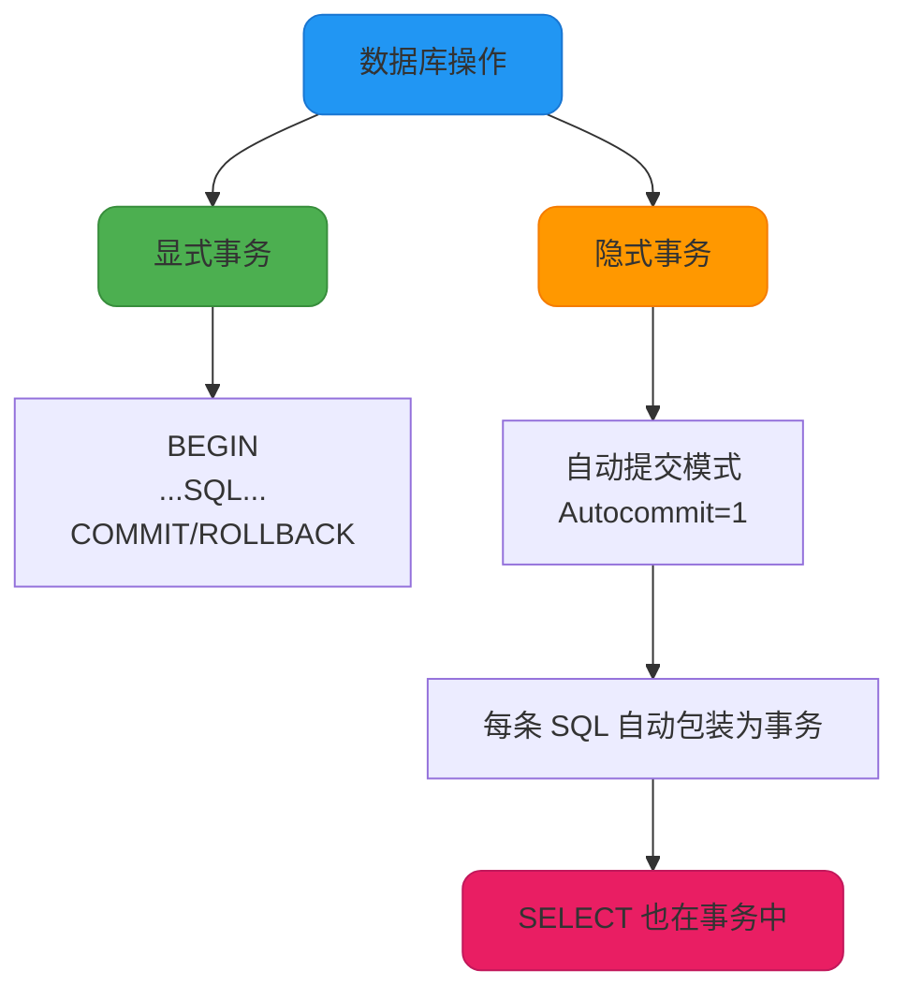

import PaidCTA from '@site/src/components/PaidCTA';

# MySQL事务优化实战

## SELECT 查询与事务的关系

很多开发者认为只有 INSERT、UPDATE、DELETE 等写操作才会使用事务，而 SELECT 查询不涉及事务。这个认识是不准确的。

### SELECT 也在事务中执行

在 InnoDB 存储引擎中，**所有的数据库操作都在事务的上下文中执行**，包括 SELECT 查询语句。即使没有显式开启事务，InnoDB 也会为每个查询自动创建一个隐式事务。



### 自动提交事务（Autocommit）

MySQL 默认开启了自动提交模式（`autocommit=1`），在这种模式下：

```sql
-- 查看自动提交状态
SHOW VARIABLES LIKE 'autocommit';
-- 返回：autocommit = ON

-- 执行查询
SELECT * FROM product_info WHERE product_id = 1001;
-- 等价于：
BEGIN;
SELECT * FROM product_info WHERE product_id = 1001;
COMMIT;
```

每条 SQL 语句自动被包装在一个事务中，执行完毕后立即提交。

### SELECT 在事务中的特点

虽然 SELECT 查询也在事务中执行，但它与写操作有明显区别：

<PaidCTA />