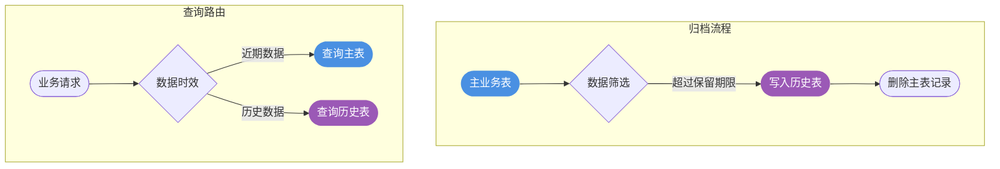
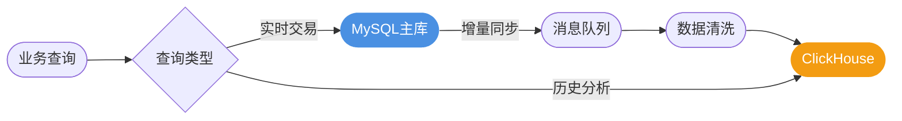
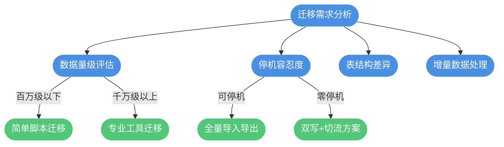
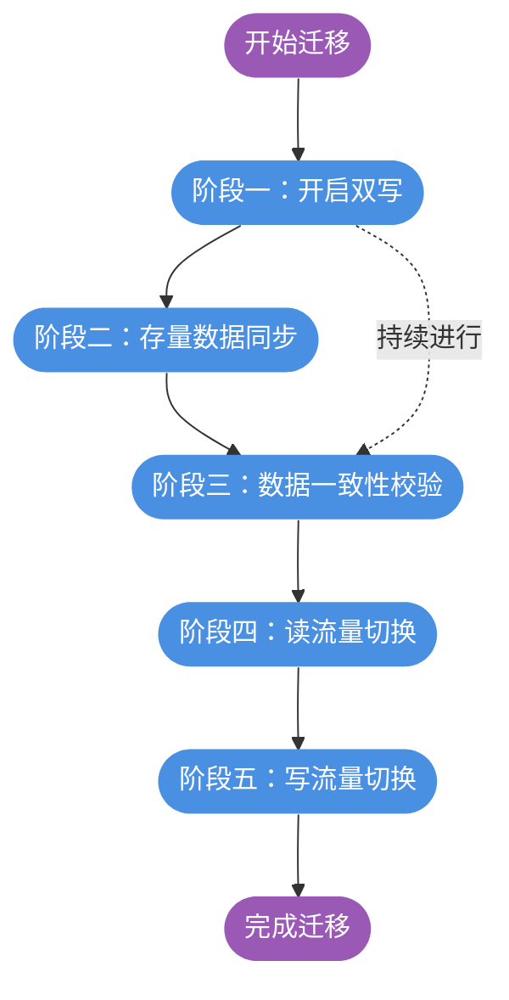
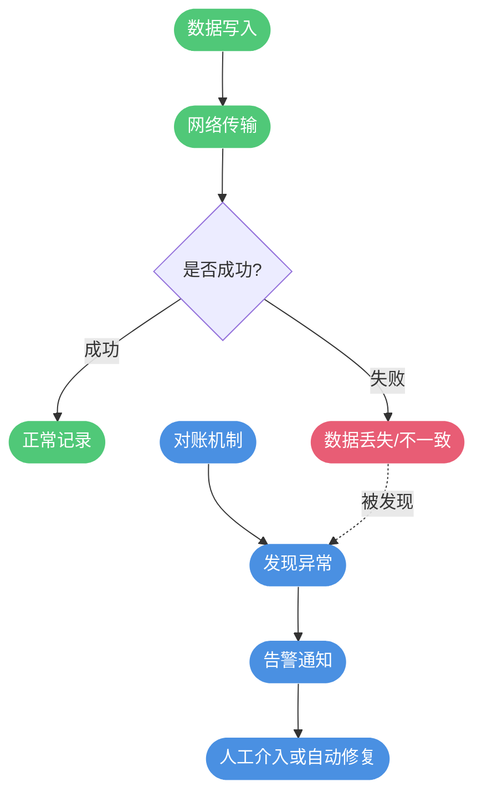
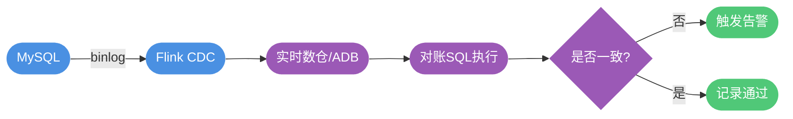
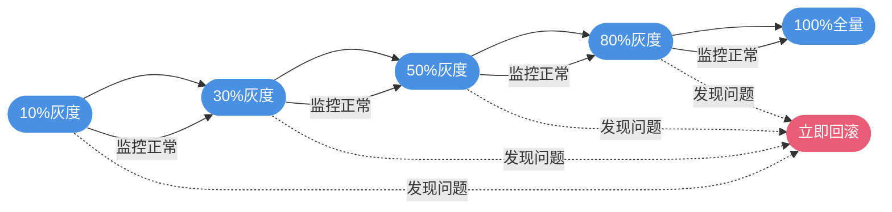

# 数据归档与平滑迁移实战

## 数据归档概述

### 为什么需要数据归档

随着业务持续运行，数据库中会积累大量历史数据。这些数据虽然对日常业务操作价值不大，但对于审计、分析等场景仍有保留必要。**数据归档**就是将这些不再频繁访问的历史数据从主库迁移到低成本存储位置的过程。


数据归档也被称为**冷热分离**。热数据是指近期产生、访问频繁的数据；冷数据则是时间较久、几乎不再操作的历史数据。合理的冷热分离策略能够显著提升系统性能并降低运营成本。

### 归档方案对比

| 方案 | 适用场景 | 实现难度 | 是否支持查询 | 查询效率 |
|-----|---------|---------|------------|---------|
| 分库分表归档 | 通用场景 | 较低 | 支持 | 一般 |
| 分区表归档 | 按时间划分 | 较低 | 支持 | 一般 |
| 数据备份导出 | 合规留存 | 较低 | 不支持 | 无 |
| 分布式存储归档 | 大数据查询 | 较高 | 支持 | 较高 |
| 离线数仓归档 | 数据分析 | 较高 | 支持 | 较低 |

## 常见归档实现方案

### 分库分表归档

这是最常用的归档方式，核心思路是在主库之外创建结构相同的历史表，定期将冷数据迁移过去。



以电商订单系统为例，将超过半年的已完成订单归档到历史表：

```sql
-- 将超过180天的已完成订单归档
INSERT INTO order_archive 
SELECT * FROM order_main 
WHERE order_status = 'COMPLETED' 
  AND update_time < DATE_SUB(NOW(), INTERVAL 180 DAY);

-- 确认归档成功后删除主表数据
DELETE FROM order_main 
WHERE order_status = 'COMPLETED' 
  AND update_time < DATE_SUB(NOW(), INTERVAL 180 DAY);
```

### 分区表归档

MySQL 原生支持分区表功能，可以按照时间维度自动将数据分配到不同分区，无需手动迁移。

```sql
-- 创建按年份分区的交易流水表
CREATE TABLE transaction_log (
    id BIGINT NOT NULL AUTO_INCREMENT,
    account_id VARCHAR(32) NOT NULL,
    amount DECIMAL(15,2) NOT NULL,
    trans_time DATETIME NOT NULL,
    PRIMARY KEY (id, trans_time)
) PARTITION BY RANGE (YEAR(trans_time)) (
    PARTITION p_2023 VALUES LESS THAN (2024),
    PARTITION p_2024 VALUES LESS THAN (2025),
    PARTITION p_2025 VALUES LESS THAN (2026),
    PARTITION p_future VALUES LESS THAN MAXVALUE
);
```

分区表的优势在于数据自动分布，查询时可以利用分区裁剪减少扫描范围。旧分区的数据访问量下降后，自然就成为了冷数据。

### 数据备份导出

对于只需留存而不需在线查询的数据，可以导出到文件系统或对象存储：

```bash
# 导出指定时间范围的日志数据
mysqldump -u dbuser -p production_db audit_log \
  --where="log_time < '2023-01-01'" > audit_2022.sql

# 压缩后上传到云存储
gzip audit_2022.sql
aws s3 cp audit_2022.sql.gz s3://backup-bucket/archive/
```

此方案适用于满足合规要求的数据留存场景，如金融审计日志需保留5年以上。

### 分布式存储归档

当历史数据仍需高效查询时，可以迁移到 ClickHouse、Elasticsearch 等分布式存储系统：



这种方案适合需要对历史数据进行复杂分析查询的场景，分布式系统在大数据量下的查询性能远优于传统关系型数据库。

### 离线数仓归档

对于数据分析和报表场景，可以将历史数据同步到离线数仓（如 Hive、MaxCompute）：

数仓通常具备自动数据同步能力，配置好数据源连接后可以定时拉取增量数据。虽然查询延迟较高，但存储成本低廉且支持海量数据分析。

## 平滑数据迁移

### 迁移场景分析

数据迁移的触发因素多种多样：

- 数据库架构升级（如单库拆分为分库分表）
- 存储引擎更换（如 MySQL 迁移到 TiDB）
- 业务重构导致表结构变化
- 历史数据量过大需要归档处理

根据业务需求，需要评估以下关键因素：



### 存量与增量数据

迁移过程中的数据分为两类：

- **存量数据**：迁移开始前已存在于原库中的历史数据
- **增量数据**：迁移过程中业务持续产生的新数据

以某个时间节点为分界，之后新插入的记录属于增量数据。需要注意的是，对存量记录的更新和删除操作需要特殊处理，确保变更能够正确同步到目标库。

### 迁移核心流程

一次完整的平滑迁移包含以下阶段：



### 双写机制详解

双写是保证迁移期间数据不丢失的关键机制，即同时向新旧两个库写入数据。

**实现方式一：基于工具的增量同步**

使用 Canal、Flink CDC 等工具监听原库的 binlog，自动将变更同步到目标库：


**实现方式二：代码层面双写**

在业务代码中实现双写逻辑，先写原库再写新库：

```java
public class OrderRepository {
    
    @Resource
    private OldOrderDao oldOrderDao;
    @Resource
    private NewOrderDao newOrderDao;
    @Resource
    private MigrationConfig migrationConfig;
    
    public void saveOrder(Order order) {
        // 根据当前阶段决定写入策略
        if (migrationConfig.getPhase() == Phase.WRITE_OLD_FIRST) {
            // 阶段一：保证旧库成功，新库允许失败
            oldOrderDao.insert(order);
            tryWriteNewDb(order);
        } else if (migrationConfig.getPhase() == Phase.WRITE_NEW_FIRST) {
            // 阶段二：保证新库成功，旧库允许失败
            newOrderDao.insert(order);
            tryWriteOldDb(order);
        }
    }
    
    private void tryWriteNewDb(Order order) {
        try {
            newOrderDao.insert(order);
        } catch (Exception e) {
            log.warn("同步新库失败，等待后续补偿", e);
            // 记录失败数据，后续通过对账补偿
        }
    }
}
```

**实现方式三：消息队列异步双写**

通过消息队列实现解耦，适合数据量大的场景：

```java
public void createMemberRecord(Member member) {
    // 写入主库
    memberDao.insert(member);
    
    // 发送消息异步同步到新库
    MigrationMessage message = new MigrationMessage();
    message.setOperation("INSERT");
    message.setTableName("member");
    message.setData(member);
    
    mqProducer.send("migration-topic", message);
}
```

### 增量数据的变更处理

在双写期间，存量数据的更新和删除需要特殊处理：

```java
public void updateRecord(Long recordId, RecordUpdate update) {
    // 判断该记录是否已同步到新库
    boolean existsInNewDb = newRecordDao.exists(recordId);
    
    if (existsInNewDb) {
        // 增量数据：同时更新新旧两库
        oldRecordDao.update(recordId, update);
        newRecordDao.update(recordId, update);
    } else {
        // 存量数据：仅更新旧库，后续全量同步会带过来
        oldRecordDao.update(recordId, update);
    }
}
```

### 存量数据迁移策略

存量数据迁移需要考虑以下几个关键点：

**1. 数据完整性保证**

使用标记字段记录迁移状态，支持断点续传：

```sql
-- 为原表添加迁移标记字段
ALTER TABLE product_info ADD COLUMN migration_flag TINYINT DEFAULT 0;

-- 分批迁移数据
INSERT INTO new_product_info (id, name, price, category)
SELECT id, name, price, category 
FROM product_info 
WHERE migration_flag = 0 
LIMIT 5000;

-- 更新迁移标记
UPDATE product_info SET migration_flag = 1 
WHERE id IN (SELECT id FROM new_product_info WHERE create_time > @last_sync_time);
```

**2. 避免覆盖增量数据**

在插入前检查目标库是否已存在该记录：

```java
public void syncBatchData(List<Product> products) {
    for (Product product : products) {
        // 检查新库是否已有该数据（可能是增量双写写入的）
        if (!newProductDao.exists(product.getId())) {
            newProductDao.insert(product);
        }
        // 更新原表迁移标记
        oldProductDao.markAsMigrated(product.getId());
    }
}
```

**3. 分批处理提升性能**

使用分布式任务框架并行处理：

```java
@XxlJob("productMigrationJob")
public void migrateProducts() {
    // 获取未迁移数据的主键范围
    Long minId = productDao.getMinUnmigratedId();
    Long maxId = productDao.getMaxUnmigratedId();
    
    // 按主键范围分片处理
    int shardIndex = XxlJobHelper.getShardIndex();
    int shardTotal = XxlJobHelper.getShardTotal();
    
    Long rangeStart = minId + (maxId - minId) / shardTotal * shardIndex;
    Long rangeEnd = minId + (maxId - minId) / shardTotal * (shardIndex + 1);
    
    migrationService.migrateRange(rangeStart, rangeEnd);
}
```

## 数据对账机制

### 对账的重要性

在分布式系统中，由于网络延迟、服务故障等原因，数据不一致的情况时有发生。尤其在数据迁移场景下，对账机制是发现问题、保障数据质量的最后一道防线。



### 对账时效分类

**离线对账（D+1）**

每日凌晨对前一天的数据进行全量比对，适用于对实时性要求不高的场景：

```sql
-- 在数仓中比对两个系统的订单金额
SELECT 
    a.order_id,
    a.amount AS system_a_amount,
    b.amount AS system_b_amount,
    ABS(a.amount - b.amount) AS diff
FROM dw_order_system_a a
LEFT JOIN dw_order_system_b b ON a.order_id = b.order_id
WHERE a.biz_date = DATE_SUB(CURDATE(), INTERVAL 1 DAY)
  AND (b.order_id IS NULL OR a.amount != b.amount);
```

**准实时对账**

通过监听数据库变更，实现秒级延迟的数据比对：



### 对账实现方案

**方案一：SQL直接比对**

将需要对账的数据同步到同一个数据库实例（如 AnalyticDB），直接通过 SQL 进行比对：

```sql
-- 比对库存系统与订单系统的商品数量
SELECT 
    i.product_id,
    i.stock_quantity AS inventory_qty,
    COALESCE(SUM(o.quantity), 0) AS order_qty
FROM inventory_snapshot i
LEFT JOIN order_detail o ON i.product_id = o.product_id 
    AND o.status IN ('PAID', 'SHIPPED')
GROUP BY i.product_id, i.stock_quantity
HAVING i.stock_quantity != COALESCE(SUM(o.quantity), 0);
```

**方案二：旁路验证**

在业务读取时同时查询新旧两个数据源，异步比对结果：

```java
public Order queryOrder(String orderId) {
    // 主路径：从当前数据源读取
    Order primaryResult = currentDataSource.getOrder(orderId);
    
    // 旁路验证：异步从另一数据源读取并比对
    CompletableFuture.runAsync(() -> {
        Order secondaryResult = otherDataSource.getOrder(orderId);
        if (!Objects.equals(primaryResult, secondaryResult)) {
            alertService.sendMismatchAlert(orderId, primaryResult, secondaryResult);
        }
    });
    
    return primaryResult;
}
```

### 告警与处理策略

对账发现问题后的处理原则：

- **告警必须人工跟进**：避免告警疲劳，每条告警都应有人负责处理
- **支持延迟重试**：对于已知会有短暂不一致的场景，可设置延迟二次对账
- **阈值控制**：设置合理的告警阈值，避免小概率事件造成大量告警

```java
@Component
public class ReconciliationAlertHandler {
    
    @Value("${reconciliation.retry.delay:300}")
    private int retryDelaySeconds;
    
    public void handleMismatch(ReconciliationResult result) {
        // 首次发现不一致，加入延迟重试队列
        if (result.getRetryCount() == 0) {
            retryQueue.addWithDelay(result, retryDelaySeconds, TimeUnit.SECONDS);
            return;
        }
        
        // 重试后仍不一致，触发告警
        if (result.getRetryCount() >= 2) {
            alertService.sendCriticalAlert(result);
            // 记录到异常表，人工处理
            exceptionLogDao.insert(result);
        }
    }
}
```

## 流量切换与回滚

### 灰度切流策略

在数据验证通过后，逐步将流量切换到新系统：



### 开关配置管理

通过配置中心动态控制迁移各阶段的行为：

```java
@Component
public class MigrationSwitch {
    
    @NacosValue(value = "${migration.read.source:OLD}", autoRefreshed = true)
    private String readSource;
    
    @NacosValue(value = "${migration.write.mode:DUAL}", autoRefreshed = true)
    private String writeMode;
    
    @NacosValue(value = "${migration.gray.percentage:0}", autoRefreshed = true)
    private int grayPercentage;
    
    public DataSource getReadDataSource(String userId) {
        // 根据灰度比例决定读取数据源
        if (shouldUseNewDb(userId)) {
            return newDataSource;
        }
        return oldDataSource;
    }
    
    private boolean shouldUseNewDb(String userId) {
        // 基于用户ID哈希值决定是否进入灰度
        int hash = Math.abs(userId.hashCode() % 100);
        return hash < grayPercentage;
    }
}
```

### 监控与预警

迁移全程需要完善的监控覆盖：

- **双写成功率**：监控新库写入的成功率
- **对账差异率**：监控两库数据不一致的比例
- **查询响应时间**：对比新旧库的查询性能
- **业务指标**：监控核心业务指标是否异常
