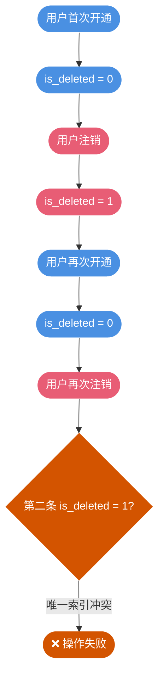
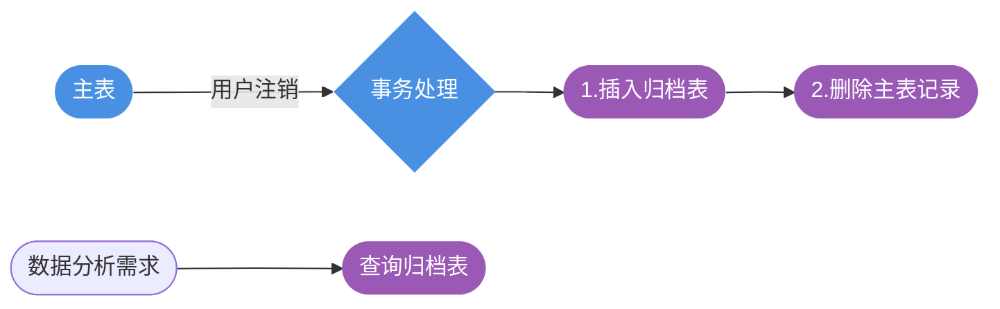
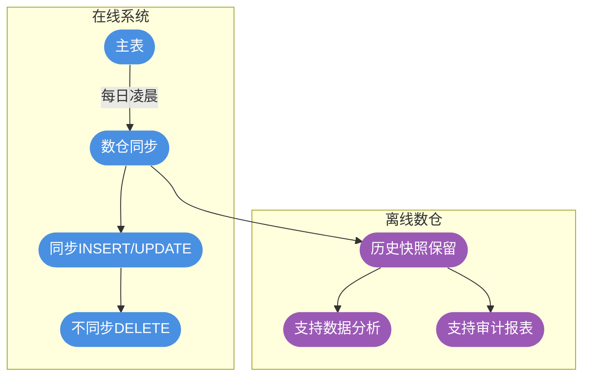
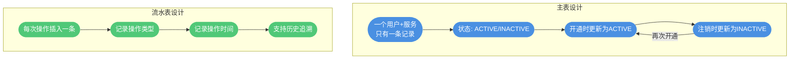
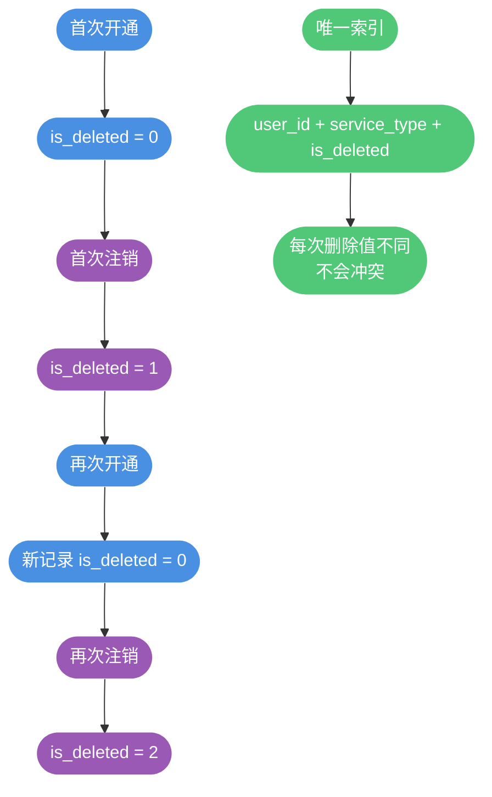
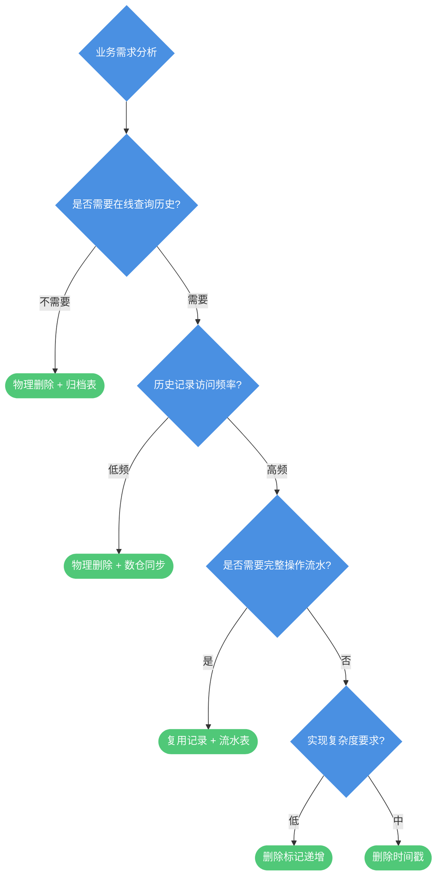
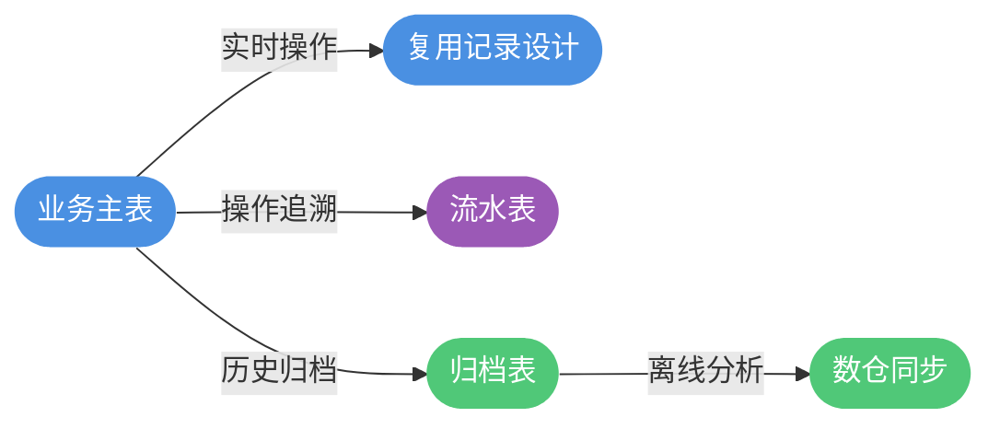

# 逻辑删除与唯一性约束设计

## 逻辑删除的业务背景

### 为什么采用逻辑删除

在实际业务系统中，数据删除通常采用逻辑删除而非物理删除。物理删除意味着数据彻底消失，无法用于后续的数据分析、审计追溯和业务报表生成。


以会员服务开通系统为例，表结构设计如下：

| 字段名 | 数据类型 | 允许为空 | 说明 |
|--------|---------|---------|------|
| id | BIGINT | 否 | 主键 |
| create_time | DATETIME | 否 | 创建时间 |
| update_time | DATETIME | 否 | 更新时间 |
| user_phone | VARCHAR(20) | 否 | 用户手机号 |
| service_code | VARCHAR(50) | 否 | 服务编码 |
| status | VARCHAR(20) | 否 | 状态 |
| is_deleted | TINYINT | 否 | 删除标记 0-正常 1-已删除 |

### 唯一性约束的困境

当用户注销服务时，我们将 `is_deleted` 设置为 1 表示逻辑删除。但问题随之而来：如何防止同一用户重复开通同一服务？

**常规思路是使用唯一索引**，但直接对 `user_phone + service_code` 建立唯一索引会导致：

- 用户无法重新开通曾经注销过的服务
- 因为逻辑删除的记录仍然存在，唯一索引会判定为重复

**尝试加入删除标记**，对 `user_phone + service_code + is_deleted` 建立唯一索引：

- 可以区分正常记录和已删除记录
- 但用户多次开通再注销后，会存在多条 `is_deleted = 1` 的记录，导致唯一索引冲突



## 解决方案详解

### 方案一：物理删除 + 归档表

最直接的解决思路是回归物理删除，但通过归档表保留历史数据以满足审计需求。



**实现示例**（以酒店预订系统为例）：

```sql
-- 创建预订归档表（结构与主表一致）
CREATE TABLE hotel_booking_archive LIKE hotel_booking;

-- 用户取消预订时，在同一事务中归档并删除
START TRANSACTION;

INSERT INTO hotel_booking_archive
SELECT * FROM hotel_booking 
WHERE guest_id = '10086' AND room_type = 'DELUXE';

DELETE FROM hotel_booking 
WHERE guest_id = '10086' AND room_type = 'DELUXE';

COMMIT;
```

主表现在可以安全地对 `guest_id + room_type` 建立唯一索引，而历史数据仍可在归档表中查询。

### 方案二：物理删除 + 离线数仓同步

如果业务已对接离线数仓，可以利用数仓的增量同步机制：



**方案限制**：

- 数仓通常每日凌晨全量同步，当天删除的数据需等到次日才会保留到数仓
- 需要业务层面配合，如限制当天取消后不能立即重新预订

```java
public void cancelBooking(String bookingId) {
    Booking booking = bookingDao.getById(bookingId);
    
    // 业务规则：当天取消的预订，需等待24小时后才能重新预订同一房型
    if (isCreatedToday(booking)) {
        // 当天预订当天取消，标记为待删除，凌晨批量处理
        booking.setStatus("PENDING_DELETE");
        bookingDao.update(booking);
    } else {
        // 非当天预订，直接物理删除（数仓已同步）
        bookingDao.delete(bookingId);
    }
}
```

### 方案三：复用记录 + 流水表

对于需要完整追溯操作历史的场景，可以采用主表复用 + 流水表记录的设计。

**核心思想**：主表始终只保留一条记录，通过状态流转表示当前状态；流水表记录每次操作的详细信息。



**表结构设计**：

```sql
-- 会员服务主表（同一用户+服务只有一条记录）
CREATE TABLE member_service (
    id BIGINT PRIMARY KEY AUTO_INCREMENT,
    user_id VARCHAR(32) NOT NULL,
    service_type VARCHAR(50) NOT NULL,
    status VARCHAR(20) NOT NULL COMMENT 'ACTIVE-生效 INACTIVE-失效',
    last_active_time DATETIME,
    last_inactive_time DATETIME,
    UNIQUE KEY uk_user_service (user_id, service_type)
);

-- 会员服务流水表（记录每次操作）
CREATE TABLE member_service_log (
    id BIGINT PRIMARY KEY AUTO_INCREMENT,
    user_id VARCHAR(32) NOT NULL,
    service_type VARCHAR(50) NOT NULL,
    operation_type VARCHAR(20) NOT NULL COMMENT 'ACTIVATE-开通 DEACTIVATE-注销 FREEZE-冻结',
    operation_time DATETIME NOT NULL,
    operator_id VARCHAR(32),
    remark VARCHAR(500)
);
```

**业务代码实现**：

```java
public void activateService(String userId, String serviceType) {
    // 查询是否已有记录
    MemberService existing = serviceDao.findByUserAndType(userId, serviceType);
    
    if (existing == null) {
        // 首次开通，插入新记录
        MemberService service = new MemberService();
        service.setUserId(userId);
        service.setServiceType(serviceType);
        service.setStatus("ACTIVE");
        service.setLastActiveTime(new Date());
        serviceDao.insert(service);
    } else {
        // 重新开通，更新状态
        existing.setStatus("ACTIVE");
        existing.setLastActiveTime(new Date());
        serviceDao.update(existing);
    }
    
    // 记录操作流水
    MemberServiceLog log = new MemberServiceLog();
    log.setUserId(userId);
    log.setServiceType(serviceType);
    log.setOperationType("ACTIVATE");
    log.setOperationTime(new Date());
    logDao.insert(log);
}
```

### 方案四：删除标记递增

保持逻辑删除设计，但改变删除标记的使用方式：**未删除为 0，删除后设置为递增值**。



**优化实现**：使用主键ID作为删除标记值，保证全局唯一

```sql
-- 创建联合唯一索引
CREATE UNIQUE INDEX uk_user_service_deleted 
ON subscription_record(user_id, plan_code, is_deleted);

-- 用户注销时，将主键ID设置为删除标记
UPDATE subscription_record 
SET is_deleted = id, 
    update_time = NOW() 
WHERE user_id = 'U12345' 
  AND plan_code = 'PREMIUM' 
  AND is_deleted = 0;
```

**业务代码**：

```java
public void deactivateSubscription(String userId, String planCode) {
    SubscriptionRecord record = subscriptionDao.findActive(userId, planCode);
    
    if (record == null) {
        throw new BusinessException("未找到有效订阅记录");
    }
    
    // 使用主键作为删除标记，保证唯一性
    record.setIsDeleted(record.getId());
    record.setUpdateTime(new Date());
    subscriptionDao.update(record);
}
```

**查询时过滤已删除记录**：

```sql
-- 查询有效订阅（is_deleted = 0 表示未删除）
SELECT * FROM subscription_record 
WHERE user_id = 'U12345' AND is_deleted = 0;

-- 查询所有记录（包含历史）
SELECT * FROM subscription_record 
WHERE user_id = 'U12345' ORDER BY create_time DESC;
```

### 方案五：引入删除时间戳

在方案四基础上更进一步，引入删除时间戳字段，既能区分记录又保留了业务信息。

```sql
-- 表结构
CREATE TABLE license_record (
    id BIGINT PRIMARY KEY AUTO_INCREMENT,
    company_id VARCHAR(32) NOT NULL,
    license_type VARCHAR(50) NOT NULL,
    status VARCHAR(20) NOT NULL,
    create_time DATETIME NOT NULL,
    update_time DATETIME NOT NULL,
    deleted_time BIGINT DEFAULT 0 COMMENT '删除时间戳，0表示未删除'
);

-- 联合唯一索引
CREATE UNIQUE INDEX uk_company_license 
ON license_record(company_id, license_type, deleted_time);
```

**删除操作**：

```java
public void revokeLicense(String companyId, String licenseType) {
    // 使用当前时间戳作为删除标记
    long deletedTime = System.currentTimeMillis();
    
    licenseDao.softDelete(companyId, licenseType, deletedTime);
}
```

**判断是否已删除**：

```java
public boolean isDeleted(LicenseRecord record) {
    // deleted_time > 0 表示已删除
    return record.getDeletedTime() != null && record.getDeletedTime() > 0;
}
```

## 方案对比与选型



| 方案 | 优点 | 缺点 | 适用场景 |
|-----|------|-----|---------|
| 物理删除+归档表 | 主表简洁，无额外字段 | 需要额外维护归档表 | 历史数据仅用于审计 |
| 物理删除+数仓 | 无需额外表，自动同步 | 依赖数仓能力，有延迟 | 已对接数仓的系统 |
| 复用记录+流水表 | 主表唯一，流水完整 | 表设计较复杂 | 需要完整操作追溯 |
| 删除标记递增 | 改动最小，易实现 | 需注意并发问题 | 快速实现需求 |
| 删除时间戳 | 保留删除时间信息 | 增加冗余字段 | 需要删除时间的场景 |

## 最佳实践建议

### 综合方案设计

在实际项目中，往往需要多种方案组合使用：



### 并发场景保护

无论采用哪种方案，都建议配合分布式锁使用，数据库唯一索引作为最后兜底：

```java
public void processServiceActivation(String userId, String serviceType) {
    String lockKey = "service:activate:" + userId + ":" + serviceType;
    
    boolean locked = distributedLock.tryLock(lockKey, 5, TimeUnit.SECONDS);
    if (!locked) {
        throw new BusinessException("操作过于频繁，请稍后重试");
    }
    
    try {
        // 业务处理逻辑
        doActivateService(userId, serviceType);
    } finally {
        distributedLock.unlock(lockKey);
    }
}
```

### 数据一致性检查

定期校验主表与流水表的数据一致性：

```sql
-- 检查主表ACTIVE状态与最近一条流水是否匹配
SELECT m.user_id, m.service_type, m.status, l.operation_type
FROM member_service m
LEFT JOIN (
    SELECT user_id, service_type, operation_type,
           ROW_NUMBER() OVER (PARTITION BY user_id, service_type ORDER BY operation_time DESC) as rn
    FROM member_service_log
) l ON m.user_id = l.user_id AND m.service_type = l.service_type AND l.rn = 1
WHERE (m.status = 'ACTIVE' AND l.operation_type != 'ACTIVATE')
   OR (m.status = 'INACTIVE' AND l.operation_type NOT IN ('DEACTIVATE', 'FREEZE'));
```

通过合理的方案选择和组合使用，可以在保证数据完整性的同时，有效解决逻辑删除场景下的唯一性约束问题。
