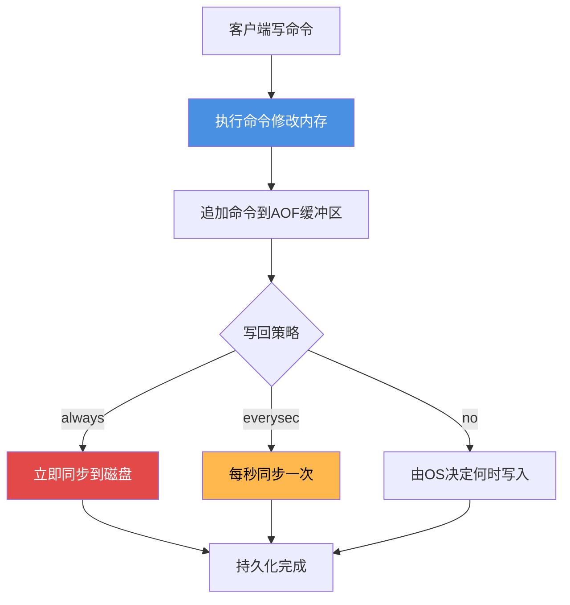
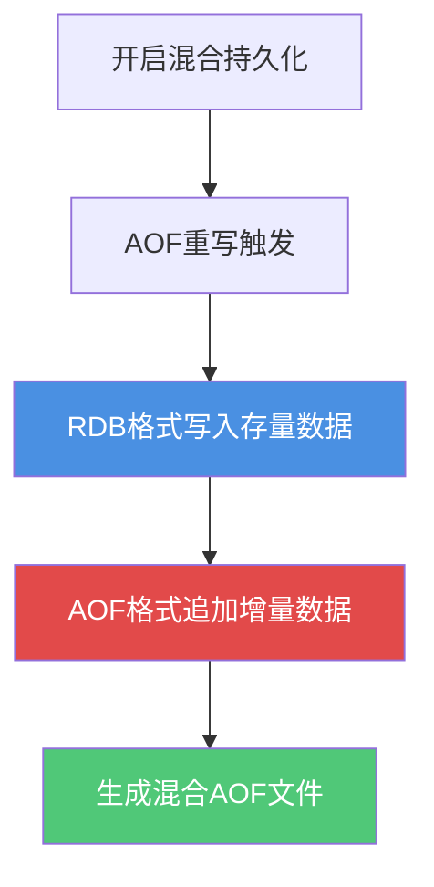
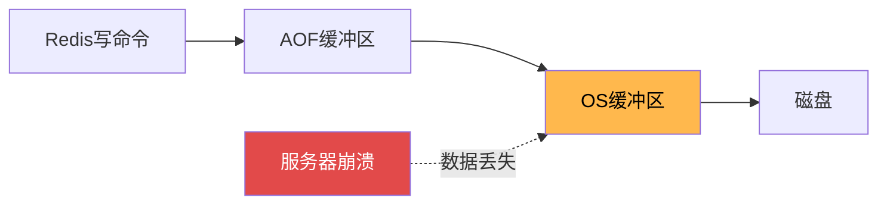
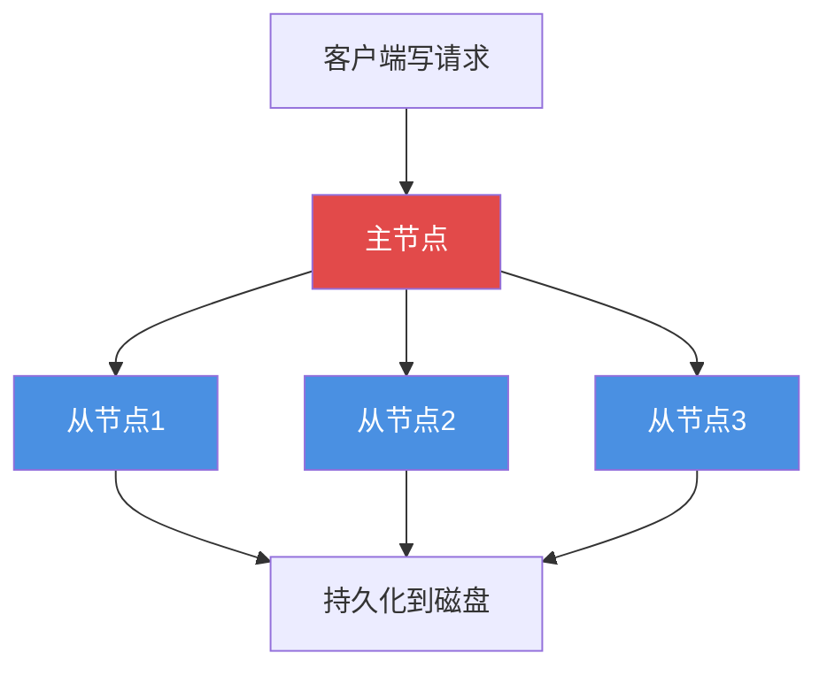
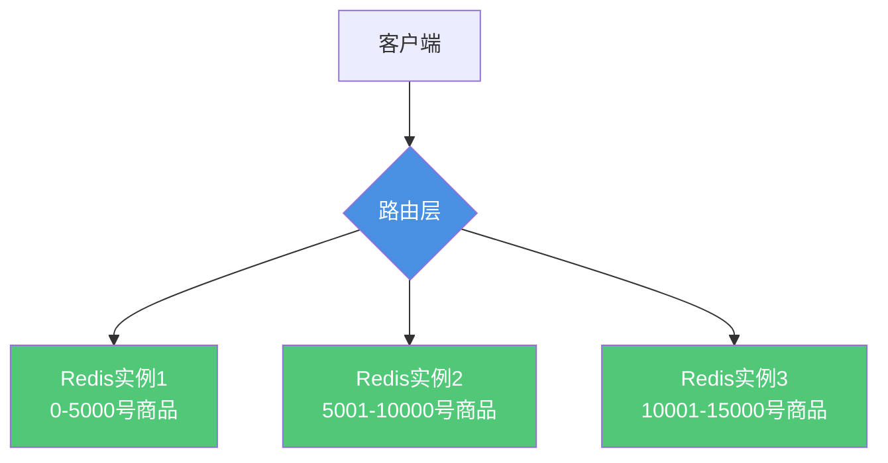

## Redis持久化机制概述

Redis作为内存数据库,数据主要存储在内存中。为了防止进程异常退出或服务器断电导致数据丢失,Redis提供了两种持久化机制:RDB和AOF。

### RDB - 快照持久化

RDB(Redis Database)将Redis内存中的数据定期保存到磁盘,生成数据快照文件。

#### RDB的工作原理


**触发方式:**

1. **手动触发**: 
   - `SAVE`: 阻塞Redis主进程直到RDB完成
   - `BGSAVE`: 后台fork子进程执行,不阻塞主进程

2. **自动触发**:
   ```
   save 900 1      # 900秒内至少1个key被修改
   save 300 10     # 300秒内至少10个key被修改
   save 60 10000   # 60秒内至少10000个key被修改
   ```

#### RDB的优缺点

**优点:**

- **文件体积小**: 数据经过压缩,占用空间少
- **恢复速度快**: 直接加载二进制文件,速度远超AOF
- **适合备份**: 定期备份RDB文件可用于灾难恢复

**缺点:**

- **可能丢失数据**: 两次快照之间的数据可能丢失
- **fork耗时**: 数据量大时,fork子进程会阻塞主进程数毫秒
- **不适合实时性要求高的场景**: 定期保存无法做到秒级持久化

### AOF - 追加式持久化

AOF(Append Only File)将Redis的每个写操作追加到AOF文件末尾,记录所有修改命令。

#### AOF的工作原理



**写回策略:**

1. **always**: 每个写命令立即同步到磁盘
   - 最安全,几乎不丢数据
   - 性能最差,每次都有磁盘I/O

2. **everysec** (默认推荐):
   - 每秒同步一次
   - 最多丢失1秒数据
   - 性能和安全性的平衡

3. **no**: 由操作系统决定何时写入
   - 性能最好
   - 可能丢失较多数据

#### AOF重写机制

随着时间推移,AOF文件会越来越大。Redis提供了AOF重写功能来压缩文件:

```java
// 原始AOF文件可能包含:
SET product:stock:A 100
SET product:stock:A 95
SET product:stock:A 90
DECR product:stock:A
DECR product:stock:A

// 重写后简化为:
SET product:stock:A 88
```

**重写触发条件:**

```
auto-aof-rewrite-percentage 100  # AOF文件大小是上次重写后的100%时触发
auto-aof-rewrite-min-size 64mb   # AOF文件至少达到64MB
```

#### AOF的优缺点

**优点:**

- **数据更安全**: 最多丢失1秒数据(everysec模式)
- **可读性强**: 文本文件,可直接查看和编辑
- **支持增量备份**: 可基于时间点恢复数据

**缺点:**

- **文件体积大**: 记录所有写操作,体积远大于RDB
- **恢复速度慢**: 需要重新执行所有命令
- **性能开销**: 每次写操作都需要记录日志

### 持久化方案对比

| 特性 | RDB | AOF |
|------|-----|-----|
| 数据完整性 | 可能丢失最后一次快照后的数据 | 最多丢失1秒数据(everysec) |
| 文件大小 | 小,压缩存储 | 大,记录所有写操作 |
| 恢复速度 | 快,直接加载 | 慢,重放命令 |
| 性能影响 | fork时有短暂阻塞 | 持续写入有性能开销 |
| 适用场景 | 定期备份,快速恢复 | 数据安全性要求高 |

### 混合持久化 - 最佳实践

Redis 4.0引入了RDB-AOF混合持久化,结合两者优点。

#### 混合持久化原理



**配置开启:**

```
aof-use-rdb-preamble yes
```

**文件结构:**

```
[RDB格式的完整数据快照] + [AOF格式的增量写命令]
```

#### 混合持久化优势

1. **快速恢复**: RDB部分快速加载主体数据
2. **数据完整**: AOF部分补充最新的增量数据
3. **降低丢失风险**: 结合两种机制的优点

**缺点:**

- 文件可读性差,不能直接编辑
- 不向下兼容,旧版本Redis无法读取

## Redis能完全避免数据丢失吗?

### 持久化的局限性

即使使用了最严格的AOF always策略,Redis仍然**无法100%保证数据不丢失**。

#### 无法避免的数据丢失场景

**场景1: 操作系统缓冲区延迟**



即使Redis调用了fsync,操作系统也会先将数据写入内核缓冲区,真正写入磁盘可能有延迟。如果此时服务器崩溃,缓冲区数据会丢失。

**场景2: 磁盘写入延迟**

机械硬盘的写入由旋转速度和寻道时间决定:

- 7200转硬盘平均延迟约8ms
- 在这8ms内,如果服务器断电,数据会丢失

**场景3: 硬件故障**

- 磁盘损坏导致RDB/AOF文件损坏
- 内存故障导致数据错误
- 主板故障导致数据无法写入磁盘

#### 实战案例

```java
// 金融支付场景
// 用户支付1000元
SET payment:order:123456 1000   // 写入Redis
// Redis执行always策略,立即调用fsync

// 此时发生的潜在问题:
// 1. 数据在OS缓冲区,还未真正写入磁盘
// 2. 磁盘正在寻道,延迟5ms
// 3. 突然断电,数据丢失
// 结果: 用户已扣款,但Redis无支付记录
```

### 如何最大程度保证数据安全

#### 方案1: 双写机制

```java
// 关键业务同时写入数据库和Redis
@Transactional
public void processPayment(String orderId, BigDecimal amount) {
    // 1. 写入MySQL(ACID保证)
    paymentMapper.insert(orderId, amount);
    
    // 2. 写入Redis(提升查询性能)
    redisTemplate.set("payment:" + orderId, amount);
}

// 查询时优先从Redis读,缺失则查DB并回填
```

#### 方案2: 集群主从复制



通过主从复制,数据在多个节点都有备份,单节点故障不会导致数据丢失。

#### 方案3: 分层存储

- **热数据**: 存Redis,追求性能
- **温数据**: 定期归档到MySQL
- **冷数据**: 归档到对象存储

### 核心理念

**Redis的定位是缓存,不是持久化数据库。**

需要100%数据安全的场景,应该使用关系型数据库(MySQL、PostgreSQL)或专业的分布式数据库。Redis更适合作为:

- 缓存层,提升查询性能
- 会话存储,允许短时丢失
- 计数器,实时统计
- 排行榜,允许重建

## 虚拟内存机制(已废弃)

### 虚拟内存的设计初衷

Redis早期版本(2.4之前)提供了虚拟内存机制,将不常用的数据交换到磁盘,释放内存空间。

**工作原理:**

当Redis内存超过阈值时:
1. 自动将冷数据转移到磁盘
2. 访问时再加载回内存
3. 类似操作系统的虚拟内存

### 为什么被废弃

虽然虚拟内存能节省内存,但带来了严重问题:

#### 问题1: 性能严重下降

```
内存访问速度: 纳秒级
磁盘访问速度: 毫秒级
性能差距: 1000000倍
```

频繁的磁盘I/O严重拖累Redis性能,违背了Redis追求极致速度的设计理念。

#### 问题2: 复杂性增加

- 需要管理内存-磁盘的数据交换
- 增加了调试和运维难度
- 引入了新的故障点

#### 问题3: 硬件成本下降

随着内存价格的下降:
- 服务器内存从GB级升到TB级
- 配置大内存比使用虚拟内存更经济
- 虚拟内存的价值大幅降低

### 现代替代方案

**方案1: 增加物理内存**

直接升级服务器内存,简单有效。

**方案2: 数据分片**



通过Redis Cluster或客户端分片,将数据分散到多个实例。

**方案3: 冷热分离**

- 热数据存Redis
- 冷数据存MySQL或HBase
- 通过业务逻辑区分冷热数据

### 总结

Redis 2.4版本后废弃虚拟内存功能,推荐用户:

1. 配置足够的物理内存
2. 使用数据分片管理大数据集
3. 通过缓存策略控制内存使用
4. 冷数据降级到持久化存储

这样的演进体现了Redis"专注于内存存储,追求极致性能"的设计哲学。
