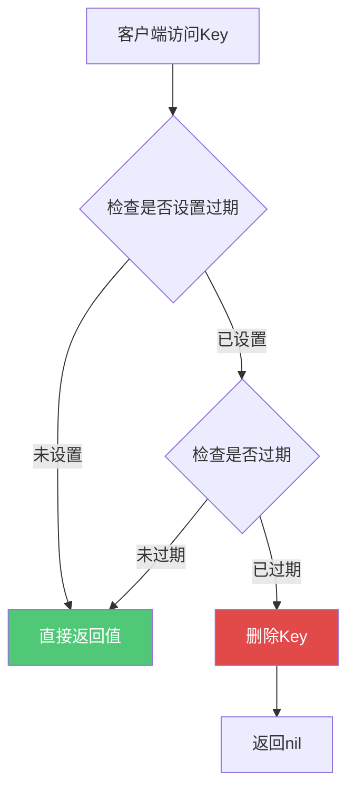
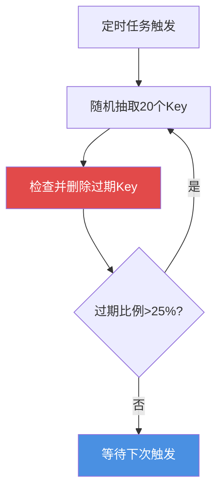
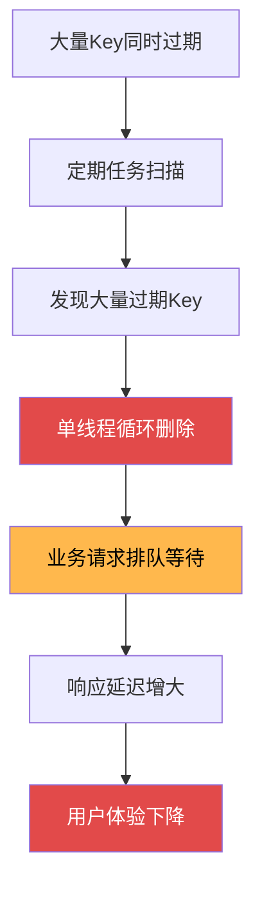
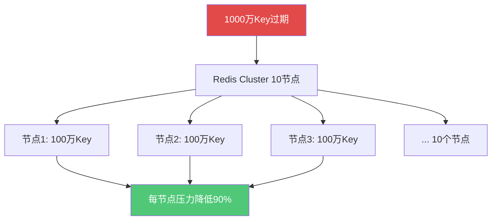
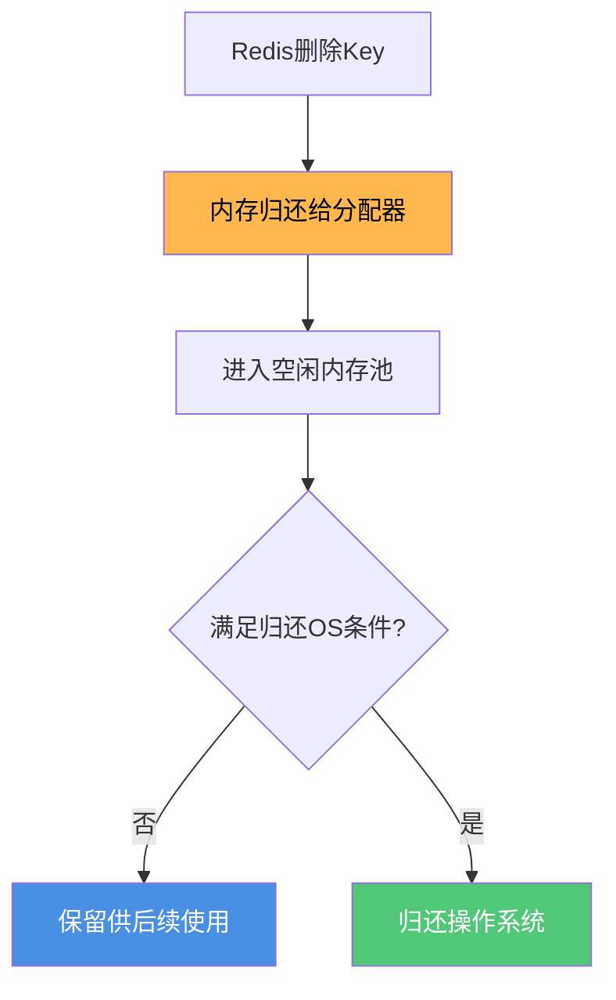
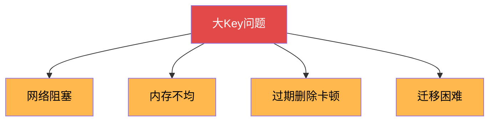

## Redis内存管理策略

Redis作为内存数据库,合理的内存管理对于系统稳定运行至关重要。Redis提供了完善的过期策略和淘汰策略来管理内存。

### 过期策略 - 如何删除过期Key

Redis通过设置过期时间来控制键值对的生命周期,相关命令包括:

```java
// 设置过期时间的几种方式
EXPIRE key 3600              // 设置3600秒后过期
EXPIREAT key 1735689600      // 设置到指定时间戳过期
SETEX session:token 1800 "abc123"  // 创建时直接设置过期时间
PERSIST key                  // 移除过期时间
```

#### 惰性删除策略

**工作原理:**

键过期后不会立即删除,而是在访问时才检查并删除。



**优点:**

- 对CPU友好,不消耗额外CPU时间扫描
- 只在需要时才检查,延迟删除

**缺点:**

- 已过期但未访问的Key会一直占用内存
- 可能导致内存泄漏

**实战案例:**

```java
// 场景: 验证码过期
SET sms:code:13800138000 "123456" EX 300  // 5分钟过期

// 5分钟后,用户未使用验证码
// Key仍然占用内存,直到:
// 1. 用户尝试验证 -> 触发惰性删除
// 2. 定期删除扫描到
```

#### 定期删除策略

**工作原理:**

Redis默认每100ms执行一次过期扫描:

1. 从过期字典中随机抽取一批Key
2. 检查这些Key是否过期
3. 删除已过期的Key
4. 如果过期Key比例超过25%,重复步骤1



**优点:**

- 主动清理过期Key,避免内存泄漏
- 通过随机采样降低CPU开销

**缺点:**

- 占用CPU资源
- 可能影响Redis性能

#### 组合策略

**Redis同时使用惰性删除和定期删除:**

- 惰性删除: 访问时保证返回的一定不是过期数据
- 定期删除: 定期清理未被访问的过期数据

这种组合在CPU开销和内存占用之间取得了良好平衡。

### 大批量Key过期引发的性能问题

#### 问题描述

当Redis中有大量的Key同时过期时,会导致其他Key的读写效率明显降低,业务访问延时增大。

**核心原因:**

Redis的定期删除任务在主线程中执行,而不是在后台线程。当大量Key同时过期时:



#### 实战场景

**场景1: 秒杀活动结束**

```java
// 秒杀活动: 100万个商品库存Key,均在同一时刻过期
// 活动时间: 2023-12-12 20:00:00 ~ 20:05:00

for (int i = 0; i < 1000000; i++) {
    SETEX seckill:stock:20231212:product:{i} 300 1000
}
// 300秒后,100万个Key同时过期

// 20:05:00 时刻:
// 定期任务扫描到大量过期Key
// 需要删除100万个Key,占用主线程数秒时间

// 这期间的业务请求:
GET user:info:10086  // 需要等待删除任务完成
SET order:status:123456 "paid"  // 被阻塞
// 用户感知: 系统卡顿数秒
```

**场景2: 整点批量缓存失效**

```java
// 凌晨2:00:00 批量刷新缓存,500万个Key设置同一过期时间

// 每天凌晨2点定时任务
for (Product p : getAllProducts()) {
    // 错误: 所有商品都在明天6:00过期
    SETEX product:cache:{p.id} 14400 p.toJson()  // 4小时后过期
}

// 第二天6:00:00:
// 500万个Key同时过期
// 定期删除任务占用CPU,引发性能拖活
// 同时大量用户访问触发缓存重建 -> 缓存雪崩
```

#### 性能影响分析

```java
// 测试数据: 100万个Key同时过期

// 正常情况:
GET user:info:10086  // 响应时间: 0.5ms

// 大量删除期间:
GET user:info:10086  // 响应时间: 50-100ms (增长100-200倍)

// 原因:
// 1. 单线程模型,删除和查询串行执行
// 2. 大量删除操作占据主线程
// 3. 正常业务请求被迫等待
```

### 解决方案

#### 方案1: 设置随机过期时间

**核心思想:** 将过期时间打散,避免集中过期

```java
// 错误做法: 固定过期时间
for (int i = 0; i < 1000000; i++) {
    SETEX cache:product:{i} 3600 data  // 所有Key 1小时后过期
}

// 正确做法: 随机过期时间
import java.util.Random;

Random random = new Random();
for (int i = 0; i < 1000000; i++) {
    // 基础时间 3600秒 ± 随机300秒 (3300-3900秒)
    int expireTime = 3600 + random.nextInt(600) - 300;
    jedis.setex("cache:product:" + i, expireTime, data);
}

// 效果:
// - 过期时间分散在600秒范围内
// - 每次定期扫描只删除小批量Key
// - 避免瞬时高并发删除
```

#### 方案2: 使用惰性删除

**适用场景:** 对内存占用不敏感,优先保证性能

```java
// 策略: 不设置过期时间,依赖内存淘汰策略

// 配置内存淘汰
maxmemory 4gb
maxmemory-policy allkeys-lru  // 内存满时LRU淘汰

// 业务代码
for (int i = 0; i < 1000000; i++) {
    // 不设置过期时间
    jedis.set("cache:product:" + i, data);
}

// 优点:
// - 无大量同时过期问题
// - 惰性删除,不占用主线程
// 缺点:
// - 内存占用可能较高
// - 需要合理设置maxmemory
```

#### 方案3: 分批设置过期时间

**适用场景:** 大量数据初始化

```java
// 场景: 秒杀活动预热100万个商品

// 错误: 一次性全部设置相同过期时间
for (int i = 0; i < 1000000; i++) {
    SETEX seckill:stock:{i} 3600 1000
}

// 正确: 分批设置不同过期时间  
int batchSize = 10000;  // 每批次处理1万
int baseExpire = 3600;

for (int batch = 0; batch < 100; batch++) {
    // 每批次增加10秒的过期时间偏移
    int expireOffset = batch * 10;
    
    for (int i = 0; i < batchSize; i++) {
        int productId = batch * batchSize + i;
        int expire = baseExpire + expireOffset + random.nextInt(10);
        jedis.setex("seckill:stock:" + productId, expire, "1000");
    }
}

// 效果:
// - 100万Key的过期时间分散在10分钟内
// - 避免瞬时大量删除
```

#### 方案4: 使用Redis Cluster分散压力

**适用场景:** 数据量巨大,单机无法承载



```java
// 使用Redis Cluster自动分散数据

JedisCluster cluster = new JedisCluster(nodes);

// 数据自动分散到10个节点
for (int i = 0; i < 10000000; i++) {
    cluster.setex("product:" + i, 3600, data);
}

// 优势:
// - 每个节点只负责100万Key
// - 删除压力分散到10个节点
// - 单节点影响降低90%
```

### 最佳实践总结

| 场景 | 推荐方案 | 理由 |
|------|---------|------|
| 秒杀活动 | 随机过期 + 分批设置 | 避免活动结束后集中删除 |
| 商品缓存 | 随机过期时间 | 分散缓存失效时间点 |
| 会话存储 | 惰性删除 + LRU | 内存可控,性能优先 |
| 大数据量 | Redis Cluster | 分散压力,水平扩展 |
| 临时数据 | 短过期 + 随机 | 快速释放,避免积压 |

### 内存释放的真相

即使Redis删除了Key,内存也不一定立即归还操作系统。

#### 内存分配器的工作机制

Redis使用jemalloc(或tcmalloc)等内存分配器,而非直接使用malloc/free。



**为什么要池化:**

1. **性能优化**: 避免频繁的系统调用(malloc/free开销大)
2. **快速复用**: 内存分配器缓存的内存可快速分配给新数据
3. **减少碎片**: 分配器可以更好地管理内存碎片

**实际表现:**

```bash
# 删除大量数据后
INFO memory
used_memory: 500MB        # Redis认为的使用量(减少了)
used_memory_rss: 800MB    # 操作系统看到的物理内存(未明显减少)

# 原因: 500MB空闲内存在jemalloc的内存池中,未归还OS
```

**何时归还OS:**

- 空闲内存块非常大
- 总空闲内存超过阈值
- 满足分配器的特定条件

## 内存淘汰策略

当Redis内存达到`maxmemory`限制时,需要通过淘汰策略删除部分数据腾出空间。

### 八种淘汰策略

**配置方式:**

```
maxmemory 2gb                    # 设置最大内存
maxmemory-policy allkeys-lru     # 设置淘汰策略
```

#### 不淘汰策略

**noeviction** (默认):

- 不删除任何Key
- 内存满时返回错误
- 只读操作仍可执行

适用场景: 对数据完整性要求极高,宁可拒绝服务也不丢数据

#### LRU策略(最近最少使用)

**allkeys-lru**:
- 从所有Key中淘汰最近最少使用的
- **推荐用于缓存场景**

**volatile-lru**:
- 从设置了过期时间的Key中淘汰
- 适合半缓存半持久化场景

**原理:**

```java
// 模拟LRU淘汰
// 场景: 商品详情缓存,最大容量100个

GET product:detail:10001  // 访问时间: T1
GET product:detail:10002  // 访问时间: T2
GET product:detail:10003  // 访问时间: T3

// 内存满时,淘汰最久未访问的10001
```

#### LFU策略(最不经常使用)

**allkeys-lfu** (Redis 4.0+):
- 淘汰访问频率最低的Key
- 适合热点数据明显的场景

**volatile-lfu**:
- 从有过期时间的Key中淘汰访问频率最低的

**LRU vs LFU:**

```java
// LRU场景
Key A: 1小时前访问1000次,最近未访问 -> 被淘汰
Key B: 刚刚访问1次 -> 保留

// LFU场景  
Key A: 总访问1000次 -> 保留
Key B: 总访问1次 -> 被淘汰

// LFU更适合识别真正的热点数据
```

#### 随机淘汰策略

**allkeys-random**:
- 从所有Key中随机淘汰

**volatile-random**:
- 从有过期时间的Key中随机淘汰

适用场景: 所有Key访问概率相同,或无明显热点

#### TTL策略

**volatile-ttl**:
- 淘汰剩余过期时间最短的Key
- 优先删除即将过期的数据

```java
// 场景示例
SET cache:news:001 "内容1" EX 60    // 剩余60秒
SET cache:news:002 "内容2" EX 300   // 剩余300秒
SET cache:news:003 "内容3" EX 120   // 剩余120秒

// 内存不足时,先淘汰cache:news:001
```

### 淘汰策略选择指南

| 场景 | 推荐策略 | 理由 |
|------|---------|------|
| 纯缓存 | allkeys-lru | 默认最优,淘汰最久未使用 |
| 热点数据明显 | allkeys-lfu | 保留高频访问数据 |
| 部分数据需持久 | volatile-lru | 只淘汰缓存数据 |
| 临时会话存储 | volatile-ttl | 优先删除即将过期 |
| 所有数据同等重要 | allkeys-random | 随机淘汰,公平对待 |

**云厂商默认配置:**

- 阿里云Redis: volatile-lru
- 腾讯云Redis: noeviction (建议修改为allkeys-lru)

### 实战案例

```java
// 电商场景: 商品详情缓存
@Configuration
public class RedisConfig {
    
    @Bean
    public RedisTemplate<String, Object> redisTemplate() {
        // 配置连接
        RedisTemplate<String, Object> template = new RedisTemplate<>();
        
        // 建议配置
        // maxmemory: 根据服务器内存设置,预留30%给系统
        // maxmemory-policy: allkeys-lru
        
        return template;
    }
}

// 业务代码
public ProductDetail getProductDetail(Long productId) {
    String key = "product:detail:" + productId;
    
    // 1. 尝试从Redis读取
    ProductDetail detail = redisTemplate.opsForValue().get(key);
    
    if (detail != null) {
        return detail;
    }
    
    // 2. Redis未命中,查询数据库
    detail = productMapper.selectById(productId);
    
    // 3. 写入Redis,不设置过期时间
    // 依靠allkeys-lru自动淘汰冷数据
    redisTemplate.opsForValue().set(key, detail);
    
    return detail;
}
```

## Key和Value设计原则

合理的Key/Value设计能显著提升Redis性能并降低内存占用。

### Key设计原则

#### 1. 可读性优先

```java
// 推荐: 清晰的命名
user:profile:10086
order:detail:20231201001
product:stock:sku:12345

// 不推荐: 含糊不清
u:p:10086
o:20231201001
```

#### 2. 使用命名空间

通过冒号分隔不同层级:

```java
// 格式: 业务模块:数据类型:业务ID:字段
user:basic:10086:name          // 用户基本信息-姓名
user:basic:10086:age           // 用户基本信息-年龄
user:order:10086:list          // 用户订单列表
user:order:10086:count         // 用户订单数量
```

#### 3. 简洁性

```java
// 好: 简洁但有意义
session:token:abc123

// 不好: 过于冗长
user_session_authentication_token_for_mobile_app:abc123
```

#### 4. 避免特殊字符

**允许的字符:**
- 大小写字母
- 数字
- 下划线(_)
- 连字符(-)
- 点号(.)
- 冒号(:)

**避免使用:**
- 空格
- 中文
- 特殊符号(@#$%等)

#### 5. 长度控制

```java
// Key过长的问题:
// 1. 占用额外内存
// 2. 影响查询性能
// 3. 降低可读性

// 建议长度: 20-50个字符
// 超过100个字符需要优化
```

### Value设计原则

#### 1. 选择合适的数据类型

```java
// 场景: 存储用户信息

// 方案1: String (不推荐)
SET user:10086 '{"name":"张三","age":25,"city":"北京"}'

// 方案2: Hash (推荐)
HSET user:10086 name "张三"
HSET user:10086 age 25
HSET user:10086 city "北京"

// Hash优势:
// - 可单独修改字段
// - 内存占用更少(小对象时)
// - 操作更灵活
```

#### 2. 避免大Key问题

**什么是大Key:**

- String类型: value > 10KB
- List/Set/ZSet: 元素数量 > 5000
- Hash: field数量 > 5000

**大Key的危害:**



**解决方案:**

```java
// 问题: 用户浏览历史,可能有上万条
// 不好的设计
LPUSH user:browse:10086 "商品1"
LPUSH user:browse:10086 "商品2"
// ... 10000条数据,形成大Key

// 好的设计: 拆分
// 只保留最近100条
LPUSH user:browse:10086 "商品1"
LTRIM user:browse:10086 0 99  // 只保留最新100条

// 历史数据降级到MySQL
INSERT INTO user_browse_history VALUES (10086, "商品1", now());
```

#### 3. 数据压缩

```java
// 场景: 存储商品详情(大量文本)

// 方案1: 直接存储JSON (可能10KB+)
SET product:10001 "{...大量JSON数据...}"

// 方案2: 压缩后存储
String json = toJson(product);
byte[] compressed = gzip(json);
SET product:10001 compressed

// 读取时解压
byte[] data = redisTemplate.get("product:10001");
String json = gunzip(data);
```

#### 4. 设置合理的过期时间

```java
// 不同数据类型的过期时间建议

// 验证码: 短期
SET sms:code:138xxx "123456" EX 300  // 5分钟

// 用户会话: 中期  
SET session:token:abc123 "..." EX 7200  // 2小时

// 商品缓存: 长期
SET product:detail:10001 "..." EX 86400  // 24小时

// 配置数据: 不设置过期,手动更新
SET system:config:xxx "..."  // 无过期时间
```

#### 5. 利用编码优化

Redis会根据数据特点自动选择编码:

```java
// ZipList优化条件
hash-max-ziplist-entries 512
hash-max-ziplist-value 64

// 利用这个特性
// 好: 小对象使用Hash,自动用ZipList
HSET user:profile:10086 name "张三"
HSET user:profile:10086 age "25"

// 不好: 超过阈值,无法使用ZipList
HSET user:data:10086 big_field "超过64字节的大量数据..."
```

### 综合实战

```java
// 场景: 电商秒杀活动

// Key设计
seckill:stock:20231212:product:10001     // 库存
seckill:order:20231212:user:10086        // 用户订单
seckill:limit:20231212:user:10086        // 限购控制

// Value设计
// 1. 库存: String类型,简单高效
SET seckill:stock:20231212:product:10001 1000

// 2. 限购: String类型+过期时间
SET seckill:limit:20231212:user:10086 1 EX 86400

// 3. 订单列表: List类型,控制长度
LPUSH seckill:order:20231212:user:10086 "order:001"
LTRIM seckill:order:20231212:user:10086 0 9  // 只保留最新10单

// 4. 活动结束后自动清理
EXPIRE seckill:stock:20231212:product:10001 172800  // 2天后过期
```

通过合理的内存管理和Key/Value设计,可以让Redis在有限的内存资源下发挥最大性能。

