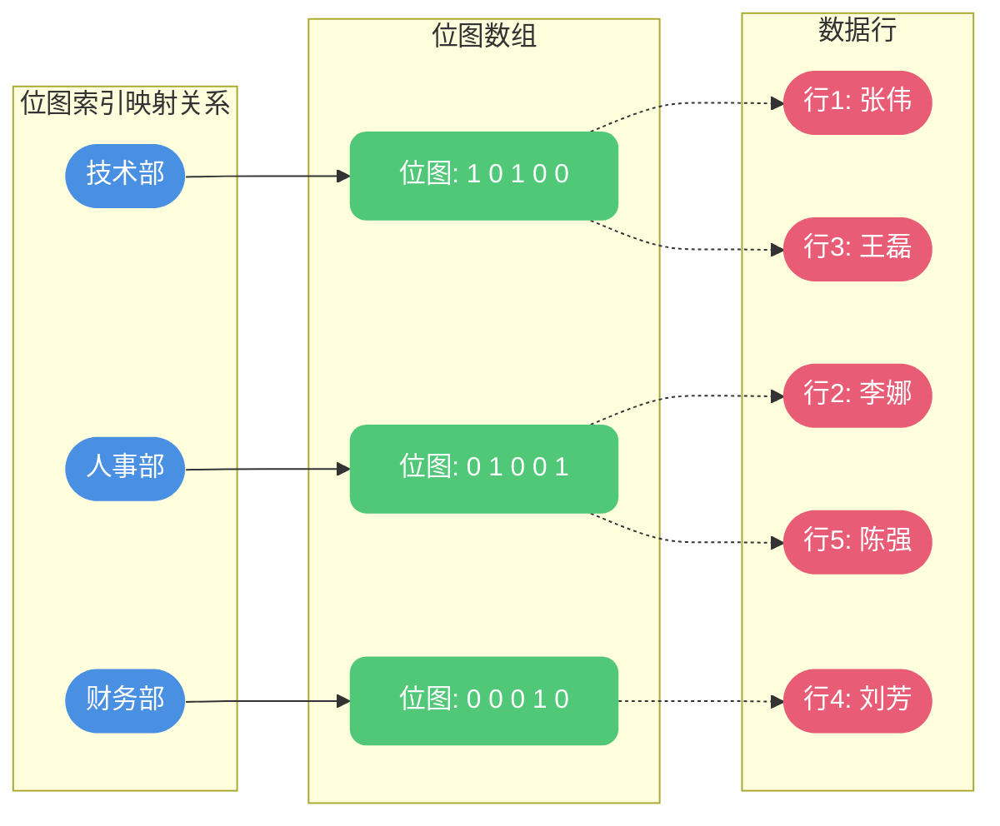
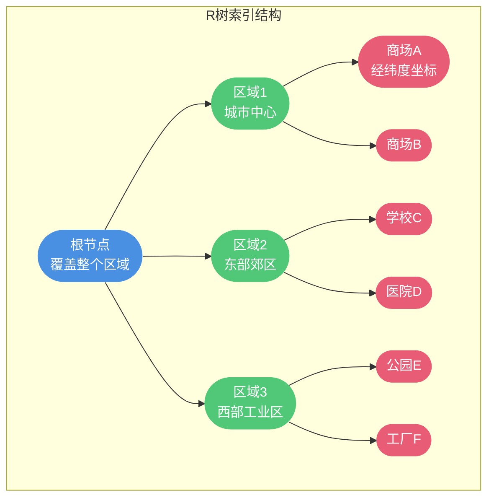

# Oracle索引技术全面解析

## 索引类型概览

Oracle数据库在索引技术方面提供了比MySQL更加丰富的支持方案。从数据结构层面来看,Oracle支持B+树索引、位图索引、R树索引以及Quad树索引等多种索引类型。合理选择和使用这些索引类型,能够显著提升数据库查询性能。


## B+树索引深度解析

### B+树还是B树?

很多开发者在讨论Oracle索引时,常常说Oracle使用的是B-树索引。这个说法既对也不对,需要辨证地看待这个问题。

首先明确一点:**Oracle实际使用的是B+树结构,而非B树**。但Oracle官方文档中确实称其为"B-Tree Index",这容易造成混淆。

**B树与B+树的核心区别:**

1. **数据存储位置不同**
   - B树:数据存储在叶子节点和非叶子节点
   - B+树:数据只存储在叶子节点,非叶子节点仅存储键值

2. **叶子节点链接方式不同**
   - B树:叶子节点相互独立,没有指针连接
   - B+树:叶子节点通过双向指针形成链表

### Oracle索引的真实结构

让我们通过Oracle官方给出的索引结构图来验证其实际采用的数据结构:


**结构特征分析:**

- 非叶子节点只包含索引值和指向子节点的指针
- 叶子节点包含索引值和ROWID(指向实际数据行)
- 叶子节点之间通过双向指针连接成链表

这些特征完全符合B+树的定义,而非B树。

**为何Oracle官方称为"B-Tree"?**

这是一个历史遗留的命名问题。在计算机科学领域,"B-tree"常被用作广义术语,泛指B树家族的所有变体(包括B+树)。Oracle在早期文档中采用了这一命名方式,并沿用至今。

### B+树索引的技术优势

Oracle选择B+树作为主要索引结构,是因为它具有以下显著优势:

**1. 高效的范围查询支持**

B+树在执行范围查询时,只需定位到起始叶子节点,然后沿着链表顺序扫描即可,无需回溯到父节点。

```sql
-- 查询订单系统中指定日期范围的订单
SELECT order_id, customer_name, total_amount
FROM orders
WHERE order_date BETWEEN DATE '2024-01-01' AND DATE '2024-03-31';
```

执行流程:定位到2024-01-01对应的叶子节点→沿链表扫描→直到2024-03-31

**2. 天然的排序特性**

B+树的叶子节点按索引键值有序存储,可直接支持ORDER BY操作,提升排序效率。

```sql
-- 按订单金额排序
SELECT order_id, total_amount
FROM orders
WHERE customer_id = 1001
ORDER BY total_amount DESC;
```

**3. 优化的磁盘预读机制**

B+树的节点大小通常设计为磁盘页大小(如16KB),使得单次磁盘I/O能够读取一个完整节点,充分利用磁盘预读特性。

**4. 更高的缓存命中率**

非叶子节点不存储数据,只存储索引键值和指针,使得单个节点能容纳更多的索引项,提高了缓存的利用效率。

## 位图索引技术

### 位图索引的原理

位图索引使用位数组(bitmap)来表示数据记录的存在性。对于索引列的每个不同值,都维护一个位图,位图中的每一位对应表中的一行数据。

**存储结构示例:**

假设有员工表,按部门建立位图索引:

| 员工ID | 姓名 | 部门 | 薪资 |
|--------|------|------|------|
| 1001 | 张伟 | 技术部 | 15000 |
| 1002 | 李娜 | 人事部 | 12000 |
| 1003 | 王磊 | 技术部 | 16000 |
| 1004 | 刘芳 | 财务部 | 13000 |
| 1005 | 陈强 | 人事部 | 11000 |

位图索引结构:

```
技术部: 1 0 1 0 0
人事部: 0 1 0 0 1
财务部: 0 0 0 1 0
```



### 位图索引的适用场景

位图索引与B+树索引的使用场景恰好相反,它**特别适合高重复度、低变化频率的字段**。

**典型应用场景:**

1. **性别字段**(男/女,重复度极高)
2. **婚姻状态**(已婚/未婚/离异,值域固定)
3. **会员等级**(普通/银卡/金卡/钻石,分类有限)
4. **订单状态**(待支付/已支付/已发货/已完成/已取消)

**创建位图索引:**

```sql
-- 为员工表的部门字段创建位图索引
CREATE BITMAP INDEX idx_emp_dept ON employees(department);

-- 为订单表的状态字段创建位图索引
CREATE BITMAP INDEX idx_order_status ON orders(status);
```

### 位图索引的查询优化

位图索引在处理多条件查询时表现优异,因为可以直接对位图进行位运算。

```sql
-- 查询技术部且薪资大于14000的员工
SELECT employee_id, name, salary
FROM employees
WHERE department = '技术部' AND salary > 14000;
```

执行过程:
1. 获取"技术部"的位图: `1 0 1 0 0`
2. 获取薪资>14000的位图: `1 0 1 0 0`
3. 进行位AND运算: `1 0 1 0 0`
4. 根据结果位图直接定位数据行

### 使用限制

位图索引并非万能,存在以下使用限制:

1. **不适合高频更新场景**:对表的任何更新都可能导致位图重建
2. **占用空间较大**:当唯一值较多时,需要维护大量位图
3. **不适合高并发写入**:位图更新时需要锁定较大范围

## 反向键索引技术

### 反向键索引的原理

反向键索引是Oracle特有的一种索引类型,它将索引键值的字节序反转后存储。

**示例:**
- 原始值: `TECH2024`
- 反转后: `4202HCET`


### 反向键索引的应用价值

**1. 优化LIKE模糊查询**

反向键索引可以将后缀匹配转换为前缀匹配,从而利用索引。

```sql
-- 创建反向键索引
CREATE INDEX idx_product_code_rev ON products(product_code) REVERSE;

-- 查询所有以"_MOBILE"结尾的产品编码
-- 实际执行时会将查询转换为: ELIBOM_% 的前缀匹配
SELECT product_id, product_code, product_name
FROM products
WHERE product_code LIKE '%_MOBILE';
```

**2. 解决热点块问题**

在高并发插入场景下,如果使用顺序递增的主键(如订单号、流水号),会导致索引的同一个叶子节点被频繁访问和修改,形成"热点块"。

**问题场景:**
```sql
-- 秒杀系统中的订单表
CREATE TABLE flash_sale_orders (
    order_id NUMBER PRIMARY KEY,  -- 顺序递增
    product_id NUMBER,
    user_id NUMBER,
    create_time TIMESTAMP
);
```

连续插入的订单ID:
- 20240001
- 20240002
- 20240003

这些连续的值会集中存储在同一个索引叶子节点,造成I/O热点。

**解决方案:**
```sql
-- 使用反向键索引
CREATE INDEX idx_order_id_rev ON flash_sale_orders(order_id) REVERSE;
```

反转后的索引键:
- 10004202
- 20004202
- 30004202

存储位置被分散到不同的索引节点,有效缓解热点问题。


### 使用约束

反向键索引存在明显的局限性:

**不支持范围查询**

由于键值反转后,原本连续的数值在物理存储上变得不连续,无法支持高效的范围扫描。

```sql
-- 此查询无法利用反向键索引
SELECT * FROM flash_sale_orders
WHERE order_id BETWEEN 20240001 AND 20240100;
```

**使用建议:**
- 仅在高并发插入场景下使用
- 查询模式以等值查询为主
- 不涉及范围查询需求

## 函数索引技术

### 函数索引的作用

在SQL查询中使用函数通常会导致索引失效,这是性能优化的常见陷阱。Oracle提供的函数索引功能,可以完美解决这个问题。

**常见索引失效场景:**

```sql
-- 场景1: 对索引列使用UPPER函数
SELECT user_id, username, email
FROM users
WHERE UPPER(username) = 'ZHANGWEI';

-- 场景2: 对索引列进行计算
SELECT order_id, total_amount
FROM orders
WHERE total_amount * 0.9 > 1000;

-- 场景3: 使用日期函数
SELECT log_id, log_time, log_content
FROM system_logs
WHERE TO_CHAR(log_time, 'YYYY-MM-DD') = '2024-12-01';
```

### 创建函数索引

Oracle允许基于函数表达式创建索引,查询时如果使用相同的函数表达式,就能利用该索引。

```sql
-- 为UPPER函数创建索引
CREATE INDEX idx_username_upper ON users(UPPER(username));

-- 为计算表达式创建索引
CREATE INDEX idx_discounted_amount ON orders(total_amount * 0.9);

-- 为日期格式化创建索引
CREATE INDEX idx_log_date ON system_logs(TO_CHAR(log_time, 'YYYY-MM-DD'));
```

**查询优化效果:**

```sql
-- 此时可以利用函数索引
SELECT user_id, username, email
FROM users
WHERE UPPER(username) = 'ZHANGWEI';
```

### 函数索引的应用场景

**1. 不区分大小写的查询**

```sql
-- 创建索引
CREATE INDEX idx_email_lower ON users(LOWER(email));

-- 查询时使用
SELECT * FROM users WHERE LOWER(email) = 'zhangwei@example.com';
```

**2. 计算列查询**

```sql
-- 电商系统中查询折扣后价格
CREATE INDEX idx_final_price ON products(price * (1 - discount_rate));

SELECT product_id, product_name, price
FROM products
WHERE price * (1 - discount_rate) < 100;
```

**3. 复合表达式查询**

```sql
-- 计算商品的利润率
CREATE INDEX idx_profit_margin ON sales(
    (revenue - cost) / NULLIF(cost, 0) * 100
);

SELECT * FROM sales
WHERE (revenue - cost) / NULLIF(cost, 0) * 100 > 30;
```

### 注意事项

1. **表达式必须完全匹配**:查询中的函数表达式必须与索引定义完全一致
2. **维护成本**:函数索引会增加INSERT/UPDATE的开销
3. **存储空间**:需要额外的存储空间保存计算结果

## 空间索引技术

### 空间索引概述

Oracle Spatial是专门用于存储、管理和检索地理空间数据的高级功能模块,支持R树索引和Quad树索引两种空间索引类型。

### R树索引

R树索引特别适合处理二维和多维空间数据,广泛应用于地理信息系统(GIS)、位置服务等领域。

**应用场景:**
- 地图服务中的位置搜索
- 查找附近的商家或设施
- 区域范围查询
- 路径规划和距离计算



**创建R树索引:**

```sql
-- 为POI表创建空间索引
CREATE INDEX idx_poi_location ON poi_data(location)
INDEXTYPE IS MDSYS.SPATIAL_INDEX
PARAMETERS ('sdo_indx_dims=2');
```

**空间查询示例:**

```sql
-- 查找指定位置5公里范围内的所有商场
SELECT poi_id, poi_name, poi_type
FROM poi_data
WHERE SDO_WITHIN_DISTANCE(
    location,
    SDO_GEOMETRY(2001, 8307, 
        SDO_POINT_TYPE(116.397128, 39.916527, NULL), 
        NULL, NULL
    ),
    'distance=5 unit=KM'
) = 'TRUE';
```

### Quad树索引

Quad树(四叉树)索引通过递归地将空间划分为四个象限,实现空间数据的快速检索。

**工作原理:**


**适用场景:**
- 大规模空间数据集的管理
- 需要频繁更新的地理位置数据
- 点、线、面等多种几何类型的混合查询

## 索引选择策略

根据不同的业务场景和数据特征,选择合适的索引类型至关重要:

| 索引类型 | 适用场景 | 数据特征 | 典型应用 |
|---------|---------|---------|---------|
| B+树索引 | 通用场景 | 唯一值较多,查询模式多样 | 主键、外键、常规查询字段 |
| 位图索引 | 数据仓库、OLAP | 重复度高,更新频率低 | 性别、状态、类别字段 |
| 反向键索引 | 高并发插入 | 顺序递增,等值查询为主 | 流水号、订单号 |
| 函数索引 | 函数查询 | 需要对列进行函数运算 | 大小写转换、日期格式化 |
| R树索引 | 地理位置查询 | 二维/多维空间数据 | GIS系统、位置服务 |
| Quad树索引 | 大规模空间数据 | 频繁更新的地理数据 | 实时位置跟踪 |

## 索引维护最佳实践

### 定期分析索引

```sql
-- 分析表和索引统计信息
ANALYZE TABLE employees COMPUTE STATISTICS;

-- 分析特定索引
ANALYZE INDEX idx_emp_dept VALIDATE STRUCTURE;
```

### 重建碎片化索引

```sql
-- 检查索引碎片
SELECT index_name, pct_used, pct_free
FROM user_indexes
WHERE table_name = 'EMPLOYEES';

-- 重建索引
ALTER INDEX idx_emp_dept REBUILD;
```

### 监控索引使用情况

```sql
-- 启用索引监控
ALTER INDEX idx_emp_dept MONITORING USAGE;

-- 查看索引使用情况
SELECT * FROM v$object_usage
WHERE index_name = 'IDX_EMP_DEPT';
```

通过深入理解Oracle提供的各种索引技术,并根据实际业务场景合理选择和使用,可以大幅提升数据库查询性能,为应用系统提供强有力的数据支撑。
