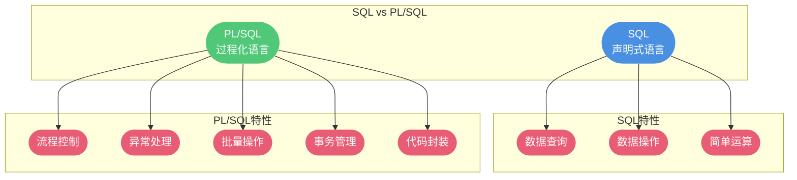
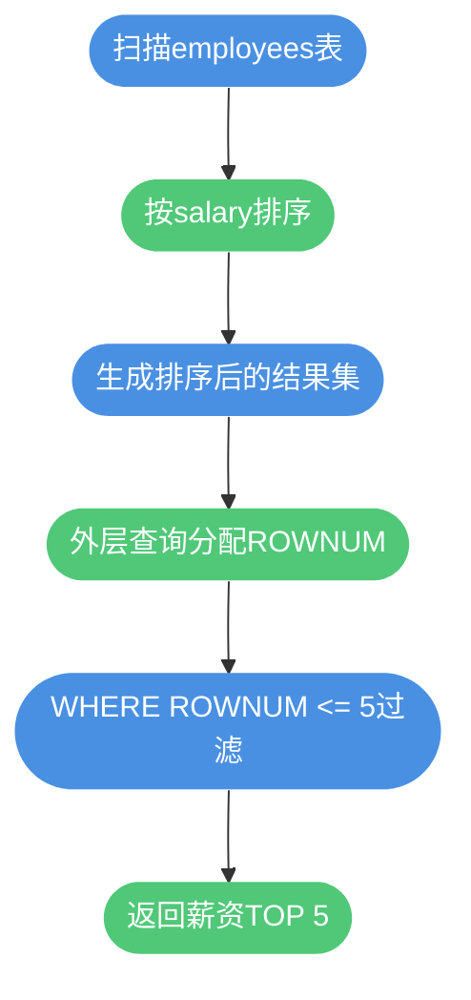
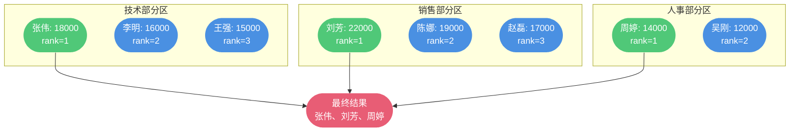
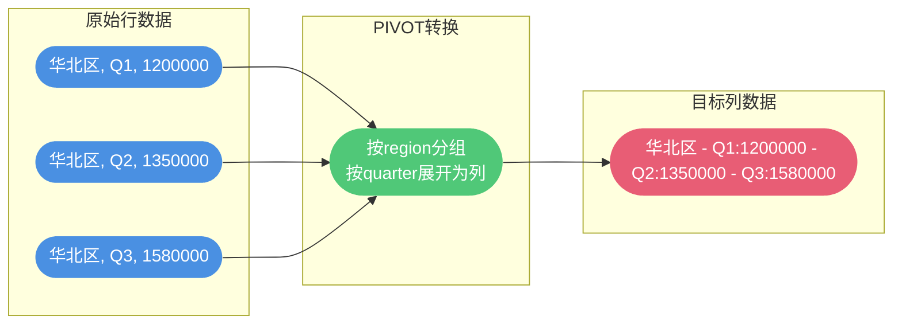

# Oracle核心语法与特性

## PL/SQL过程化编程语言

### PL/SQL概述

PL/SQL(Procedural Language/SQL)是Oracle数据库提供的过程化编程语言扩展,它将SQL的数据操作能力与过程化语言的逻辑控制能力完美结合,为数据库应用开发提供了更强大的编程工具。

**PL/SQL的核心价值:**
- 提供复杂的业务逻辑处理能力
- 减少网络传输开销
- 提高代码复用性和可维护性
- 增强数据库安全性



### 为什么使用PL/SQL而非纯SQL

#### 强大的逻辑控制能力

SQL作为声明式语言,缺乏流程控制功能。对于需要条件判断、循环处理的复杂业务逻辑,纯SQL难以胜任。PL/SQL通过提供IF-THEN-ELSE、LOOP、FOR、WHILE等控制结构,让开发者能够编写复杂的业务逻辑。

**业务场景:** 库存管理系统中的智能调价策略

```sql
DECLARE
  v_stock_level NUMBER;
  v_current_price NUMBER;
  v_product_id NUMBER := 2001;
BEGIN
  -- 获取库存数量和当前价格
  SELECT stock_quantity, unit_price 
  INTO v_stock_level, v_current_price
  FROM inventory
  WHERE product_id = v_product_id;
  
  -- 根据库存情况动态调整价格
  IF v_stock_level > 1000 THEN
    -- 库存过高,降价促销
    UPDATE inventory
    SET unit_price = v_current_price * 0.85,
        price_update_time = SYSDATE
    WHERE product_id = v_product_id;
    DBMS_OUTPUT.PUT_LINE('库存充足,价格下调15%促销');
    
  ELSIF v_stock_level < 100 THEN
    -- 库存紧张,适当涨价
    UPDATE inventory
    SET unit_price = v_current_price * 1.15,
        price_update_time = SYSDATE
    WHERE product_id = v_product_id;
    DBMS_OUTPUT.PUT_LINE('库存紧张,价格上调15%');
    
  ELSE
    -- 库存正常,保持原价
    DBMS_OUTPUT.PUT_LINE('库存正常,价格保持不变');
  END IF;
  
  COMMIT;
END;
```

#### 批量操作与性能优化

使用纯SQL处理大量数据时,需要多次往返于应用程序和数据库之间,造成大量网络开销。PL/SQL支持批量处理,可以在一次数据库调用中完成大量操作,显著提升性能。

**业务场景:** 月度销售数据汇总分析

```sql
DECLARE
  -- 定义记录类型
  TYPE sales_record IS RECORD (
    region_id NUMBER,
    total_sales NUMBER,
    order_count NUMBER
  );
  
  -- 定义表类型
  TYPE sales_table IS TABLE OF sales_record;
  v_sales_data sales_table;
  
BEGIN
  -- 使用BULK COLLECT批量读取
  SELECT region_id, 
         SUM(order_amount), 
         COUNT(*)
  BULK COLLECT INTO v_sales_data
  FROM monthly_sales
  WHERE sale_month = '2024-11'
  GROUP BY region_id;
  
  -- 使用FORALL批量插入汇总表
  FORALL i IN INDICES OF v_sales_data
    INSERT INTO region_sales_summary (
      region_id, 
      summary_month, 
      total_sales, 
      order_count,
      create_time
    )
    VALUES (
      v_sales_data(i).region_id,
      '2024-11',
      v_sales_data(i).total_sales,
      v_sales_data(i).order_count,
      SYSDATE
    );
  
  COMMIT;
  DBMS_OUTPUT.PUT_LINE('成功处理 ' || v_sales_data.COUNT || ' 个区域的销售数据');
END;
```

**性能对比:**

| 处理方式 | 数据量 | 网络往返次数 | 执行时间 |
|---------|-------|------------|---------|
| 逐条SQL | 10000条 | 10000次 | 约120秒 |
| PL/SQL批量处理 | 10000条 | 1次 | 约8秒 |

#### 完善的异常处理机制

纯SQL无法主动处理异常,只能返回错误信息。PL/SQL提供了EXCEPTION块,可以优雅地捕获和处理各种异常情况,确保程序的健壮性。

**业务场景:** 用户充值系统的异常保护

```sql
DECLARE
  v_user_id NUMBER := 10001;
  v_recharge_amount NUMBER := 500;
  v_current_balance NUMBER;
  
BEGIN
  -- 查询当前余额
  SELECT account_balance INTO v_current_balance
  FROM user_accounts
  WHERE user_id = v_user_id
  FOR UPDATE;  -- 加行锁,防止并发问题
  
  -- 更新余额
  UPDATE user_accounts
  SET account_balance = account_balance + v_recharge_amount,
      last_recharge_time = SYSDATE
  WHERE user_id = v_user_id;
  
  -- 记录充值流水
  INSERT INTO recharge_records (
    user_id, recharge_amount, recharge_time, balance_after
  )
  VALUES (
    v_user_id, v_recharge_amount, SYSDATE, 
    v_current_balance + v_recharge_amount
  );
  
  COMMIT;
  DBMS_OUTPUT.PUT_LINE('充值成功,当前余额: ' || 
    TO_CHAR(v_current_balance + v_recharge_amount));
  
EXCEPTION
  WHEN NO_DATA_FOUND THEN
    -- 用户不存在
    DBMS_OUTPUT.PUT_LINE('错误: 用户账户不存在');
    ROLLBACK;
    
  WHEN DUP_VAL_ON_INDEX THEN
    -- 违反唯一性约束
    DBMS_OUTPUT.PUT_LINE('错误: 充值记录重复');
    ROLLBACK;
    
  WHEN VALUE_ERROR THEN
    -- 数值错误
    DBMS_OUTPUT.PUT_LINE('错误: 充值金额无效');
    ROLLBACK;
    
  WHEN OTHERS THEN
    -- 其他未知异常
    DBMS_OUTPUT.PUT_LINE('系统异常: ' || SQLERRM);
    ROLLBACK;
END;
```

#### 灵活的事务控制

PL/SQL允许在代码块内部根据业务逻辑灵活控制事务的提交和回滚,实现复杂的事务处理需求。

**业务场景:** 电商订单处理的事务控制

```sql
DECLARE
  v_order_id NUMBER := 20240001;
  v_product_stock NUMBER;
  v_user_credit NUMBER;
  v_order_total NUMBER;
  
BEGIN
  -- 获取订单总额
  SELECT total_amount INTO v_order_total
  FROM orders
  WHERE order_id = v_order_id;
  
  -- 检查用户信用额度
  SELECT credit_limit INTO v_user_credit
  FROM users
  WHERE user_id = (
    SELECT user_id FROM orders WHERE order_id = v_order_id
  );
  
  -- 判断是否满足发货条件
  IF v_user_credit >= v_order_total THEN
    -- 扣减库存
    UPDATE inventory
    SET stock_quantity = stock_quantity - 
      (SELECT quantity FROM order_items WHERE order_id = v_order_id)
    WHERE product_id = 
      (SELECT product_id FROM order_items WHERE order_id = v_order_id);
    
    -- 更新订单状态
    UPDATE orders
    SET order_status = 'SHIPPED',
        ship_time = SYSDATE
    WHERE order_id = v_order_id;
    
    COMMIT;
    DBMS_OUTPUT.PUT_LINE('订单已发货,事务提交成功');
    
  ELSE
    -- 信用额度不足,不发货
    ROLLBACK;
    DBMS_OUTPUT.PUT_LINE('用户信用额度不足,事务已回滚');
    
    -- 记录审核日志
    INSERT INTO order_review_log (order_id, review_result, review_time)
    VALUES (v_order_id, '信用额度不足', SYSDATE);
    COMMIT;  -- 单独提交日志记录
  END IF;
  
END;
```

#### 代码重用与模块化

PL/SQL支持创建存储过程、函数、触发器等数据库对象,实现代码的封装和重用,提高开发效率和代码可维护性。

**存储过程示例:** 绩效考核系统的薪资调整

```sql
CREATE OR REPLACE PROCEDURE adjust_salary (
  p_performance_score IN NUMBER,
  p_employee_id IN NUMBER
) IS
  v_adjustment_rate NUMBER;
  v_current_salary NUMBER;
  
BEGIN
  -- 根据绩效评分确定调薪比例
  CASE
    WHEN p_performance_score >= 90 THEN
      v_adjustment_rate := 1.20;  -- 优秀,涨薪20%
    WHEN p_performance_score >= 75 THEN
      v_adjustment_rate := 1.10;  -- 良好,涨薪10%
    WHEN p_performance_score >= 60 THEN
      v_adjustment_rate := 1.03;  -- 合格,涨薪3%
    ELSE
      v_adjustment_rate := 1.00;  -- 不合格,不调薪
  END CASE;
  
  -- 获取当前薪资
  SELECT salary INTO v_current_salary
  FROM employees
  WHERE employee_id = p_employee_id;
  
  -- 更新薪资
  UPDATE employees
  SET salary = v_current_salary * v_adjustment_rate,
      salary_update_time = SYSDATE
  WHERE employee_id = p_employee_id;
  
  -- 记录调薪历史
  INSERT INTO salary_history (
    employee_id, old_salary, new_salary, 
    adjustment_reason, effective_date
  )
  VALUES (
    p_employee_id, v_current_salary, 
    v_current_salary * v_adjustment_rate,
    '绩效考核调薪', SYSDATE
  );
  
  COMMIT;
  DBMS_OUTPUT.PUT_LINE('员工 ' || p_employee_id || 
    ' 薪资调整完成,调整比例: ' || 
    TO_CHAR((v_adjustment_rate - 1) * 100) || '%');
    
EXCEPTION
  WHEN NO_DATA_FOUND THEN
    DBMS_OUTPUT.PUT_LINE('错误: 员工不存在');
    ROLLBACK;
  WHEN OTHERS THEN
    DBMS_OUTPUT.PUT_LINE('系统错误: ' || SQLERRM);
    ROLLBACK;
END adjust_salary;
```

**调用存储过程:**

```sql
-- 为员工10001调整薪资,绩效评分92分
BEGIN
  adjust_salary(92, 10001);
END;
```

### PL/SQL与SQL的核心区别

| 特性维度 | SQL | PL/SQL |
|---------|-----|--------|
| 语言类型 | 声明式语言 | 过程化语言 |
| 主要功能 | 数据查询和操作 | 复杂业务逻辑处理 |
| 控制结构 | 不支持 | 支持IF、LOOP、CASE等 |
| 异常处理 | 被动返回错误 | 主动捕获和处理异常 |
| 批量处理 | 单条语句执行 | 支持批量操作和游标 |
| 代码封装 | 不支持 | 支持存储过程、函数、包 |
| 执行方式 | 逐条执行 | 块执行,减少网络开销 |
| 变量使用 | 不支持 | 支持变量声明和使用 |
| 事务控制 | 基础事务支持 | 灵活的事务控制逻辑 |

## 行号函数对比

### ROWNUM伪列

ROWNUM是Oracle提供的伪列,为查询结果的每一行自动分配递增的行号。理解ROWNUM的工作机制,对于编写正确的分页和TOP-N查询至关重要。

**ROWNUM的核心特性:**

1. **在数据提取时分配**:行号在从表中提取数据时就已确定
2. **与排序无关**:不依赖ORDER BY子句
3. **从1开始递增**:第一行的ROWNUM总是1


**基础用法示例:**

```sql
-- 查询前10条记录
SELECT employee_id, employee_name, salary
FROM employees
WHERE ROWNUM <= 10;
```

**常见误区:** ROWNUM与ORDER BY的执行顺序

很多开发者认为ROWNUM是在排序后分配的,这是错误的理解。

```sql
-- 错误写法:试图查询薪资最高的前5名
SELECT employee_id, employee_name, salary
FROM employees
WHERE ROWNUM <= 5
ORDER BY salary DESC;
```

**执行过程分析:**
1. 扫描表,前5行被选中(无论薪资高低)
2. ROWNUM已分配为1-5
3. 对这5行按salary排序
4. 返回结果(并非真正的TOP 5)

**正确写法:** 使用子查询

```sql
-- 正确写法:先排序,再限制行数
SELECT employee_id, employee_name, salary
FROM (
  SELECT employee_id, employee_name, salary
  FROM employees
  ORDER BY salary DESC
)
WHERE ROWNUM <= 5;
```

**执行流程:**



### ROW_NUMBER()窗口函数

ROW_NUMBER()是Oracle提供的窗口函数,根据指定的排序规则为结果集中的每一行分配唯一的序号。

**ROW_NUMBER()的核心特性:**

1. **基于排序分配**:严格按照ORDER BY指定的顺序分配行号
2. **支持分区**:可以在分组内独立分配行号
3. **计算在排序后**:行号反映真实的排序顺序

**基础语法:**

```sql
ROW_NUMBER() OVER (
  [PARTITION BY 分区列]
  ORDER BY 排序列
)
```

**业务场景1:** 查询各部门薪资最高的员工

```sql
SELECT department_id, employee_name, salary, salary_rank
FROM (
  SELECT 
    department_id,
    employee_name,
    salary,
    ROW_NUMBER() OVER (
      PARTITION BY department_id 
      ORDER BY salary DESC
    ) AS salary_rank
  FROM employees
)
WHERE salary_rank = 1;
```

**执行逻辑可视化:**



**业务场景2:** 分页查询实现

```sql
-- 查询第21-30条销售记录(按交易金额降序)
SELECT order_id, customer_name, transaction_amount
FROM (
  SELECT 
    order_id,
    customer_name,
    transaction_amount,
    ROW_NUMBER() OVER (ORDER BY transaction_amount DESC) AS rn
  FROM sales_orders
)
WHERE rn BETWEEN 21 AND 30;
```

### ROWNUM vs ROW_NUMBER()

| 对比维度 | ROWNUM | ROW_NUMBER() |
|---------|--------|-------------|
| 分配时机 | 数据提取时 | 排序完成后 |
| 排序依赖 | 不依赖ORDER BY | 必须指定ORDER BY |
| 分区支持 | 不支持 | 支持PARTITION BY |
| 使用复杂度 | 简单,但容易误用 | 语法稍复杂,但语义明确 |
| 典型应用 | 简单的TOP-N查询 | 分组排名、分页查询 |
| 性能表现 | 可能更快(无需排序) | 需要排序,开销稍大 |

**选择建议:**

- 简单限制返回行数,且无需排序:使用ROWNUM
- 需要按特定字段排序后取TOP-N:使用ROW_NUMBER()
- 需要分组内排名:必须使用ROW_NUMBER()
- 实现通用分页功能:推荐ROW_NUMBER()

## 行列转换技术

### PIVOT:行转列

PIVOT操作将行数据转换为列数据,常用于数据聚合和报表展示场景。

**业务场景:** 销售数据透视分析

原始数据表(quarterly_sales):

| 销售区域 | 季度 | 销售额 |
|---------|------|-------|
| 华北区 | Q1 | 1200000 |
| 华北区 | Q2 | 1350000 |
| 华北区 | Q3 | 1580000 |
| 华东区 | Q1 | 1800000 |
| 华东区 | Q2 | 1950000 |
| 华东区 | Q3 | 2100000 |
| 华南区 | Q1 | 1500000 |
| 华南区 | Q2 | 1680000 |
| 华南区 | Q3 | 1750000 |

**目标格式:**

| 销售区域 | Q1 | Q2 | Q3 |
|---------|----|----|---|
| 华北区 | 1200000 | 1350000 | 1580000 |
| 华东区 | 1800000 | 1950000 | 2100000 |
| 华南区 | 1500000 | 1680000 | 1750000 |

**PIVOT实现:**

```sql
SELECT *
FROM quarterly_sales
PIVOT (
  SUM(sales_amount) 
  FOR quarter IN ('Q1' AS Q1, 'Q2' AS Q2, 'Q3' AS Q3)
)
ORDER BY region;
```

**数据转换过程:**



**高级应用:** 多维度透视

```sql
-- 按产品类别和季度透视销售数据
SELECT product_category, Q1, Q2, Q3, Q4,
       Q1 + Q2 + Q3 + Q4 AS annual_total
FROM product_sales
PIVOT (
  SUM(sales_amount)
  FOR quarter IN ('Q1' AS Q1, 'Q2' AS Q2, 'Q3' AS Q3, 'Q4' AS Q4)
)
ORDER BY annual_total DESC;
```

### UNPIVOT:列转行

UNPIVOT操作将列数据转换为行数据,便于进行标准化数据分析和处理。

**业务场景:** 员工技能评分标准化

原始数据表(employee_skills):

| 员工姓名 | Java | Python | SQL |
|---------|------|--------|-----|
| 张伟 | 85 | 78 | 92 |
| 李娜 | 90 | 88 | 85 |
| 王磊 | 75 | 82 | 88 |

**目标格式:**

| 员工姓名 | 技能类型 | 评分 |
|---------|---------|-----|
| 张伟 | Java | 85 |
| 张伟 | Python | 78 |
| 张伟 | SQL | 92 |
| 李娜 | Java | 90 |
| 李娜 | Python | 88 |
| 李娜 | SQL | 85 |
| 王磊 | Java | 75 |
| 王磊 | Python | 82 |
| 王磊 | SQL | 88 |

**UNPIVOT实现:**

```sql
SELECT employee_name, skill_type, score
FROM employee_skills
UNPIVOT (
  score FOR skill_type IN (
    Java AS 'Java', 
    Python AS 'Python', 
    SQL AS 'SQL'
  )
)
ORDER BY employee_name, skill_type;
```

**实际应用:**统计分析

```sql
-- 基于列转行后的数据进行统计分析
SELECT skill_type,
       AVG(score) AS avg_score,
       MAX(score) AS max_score,
       MIN(score) AS min_score,
       COUNT(*) AS employee_count
FROM (
  SELECT employee_name, skill_type, score
  FROM employee_skills
  UNPIVOT (
    score FOR skill_type IN (Java, Python, SQL)
  )
)
GROUP BY skill_type
ORDER BY avg_score DESC;
```

### 行列转换的应用场景总结

**PIVOT适用场景:**
- 数据报表生成
- 多维度数据对比
- 交叉表分析
- 财务数据汇总

**UNPIVOT适用场景:**
- 宽表转长表
- 数据标准化处理
- 统计分析准备
- 数据挖掘预处理

通过掌握PL/SQL编程、行号函数和行列转换等Oracle核心特性,开发者能够更高效地处理复杂的数据库业务逻辑,构建高性能的企业级应用系统。