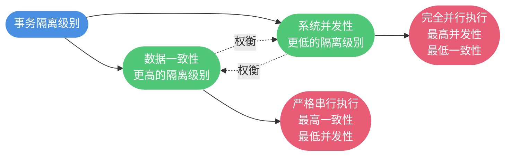
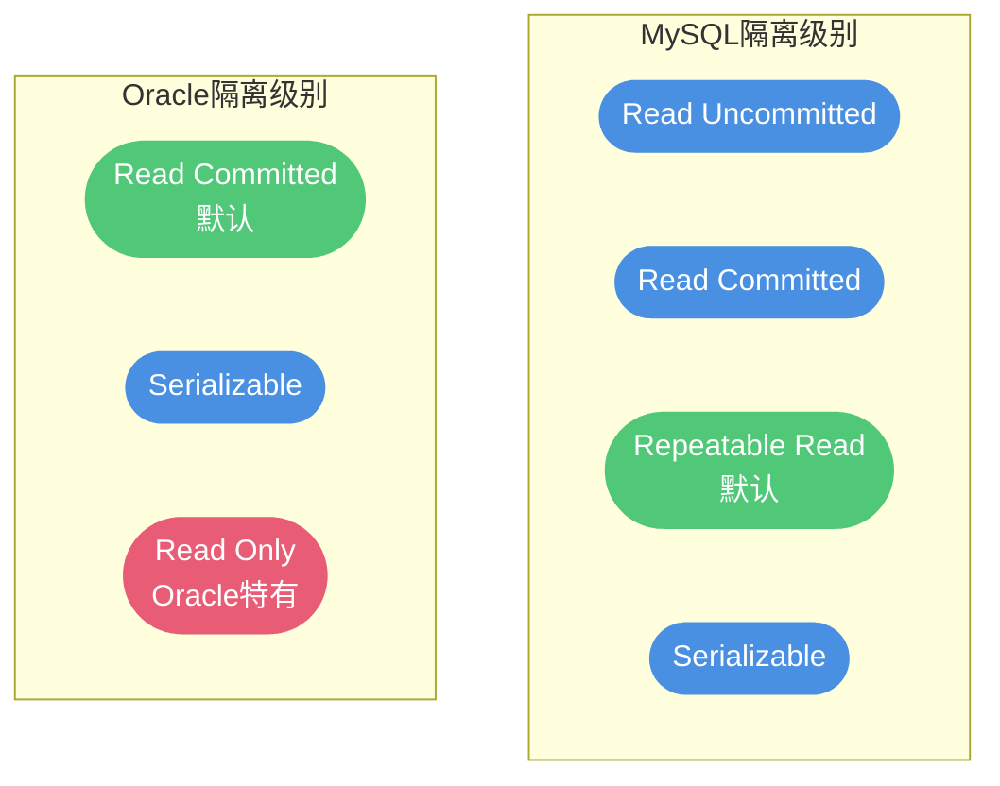
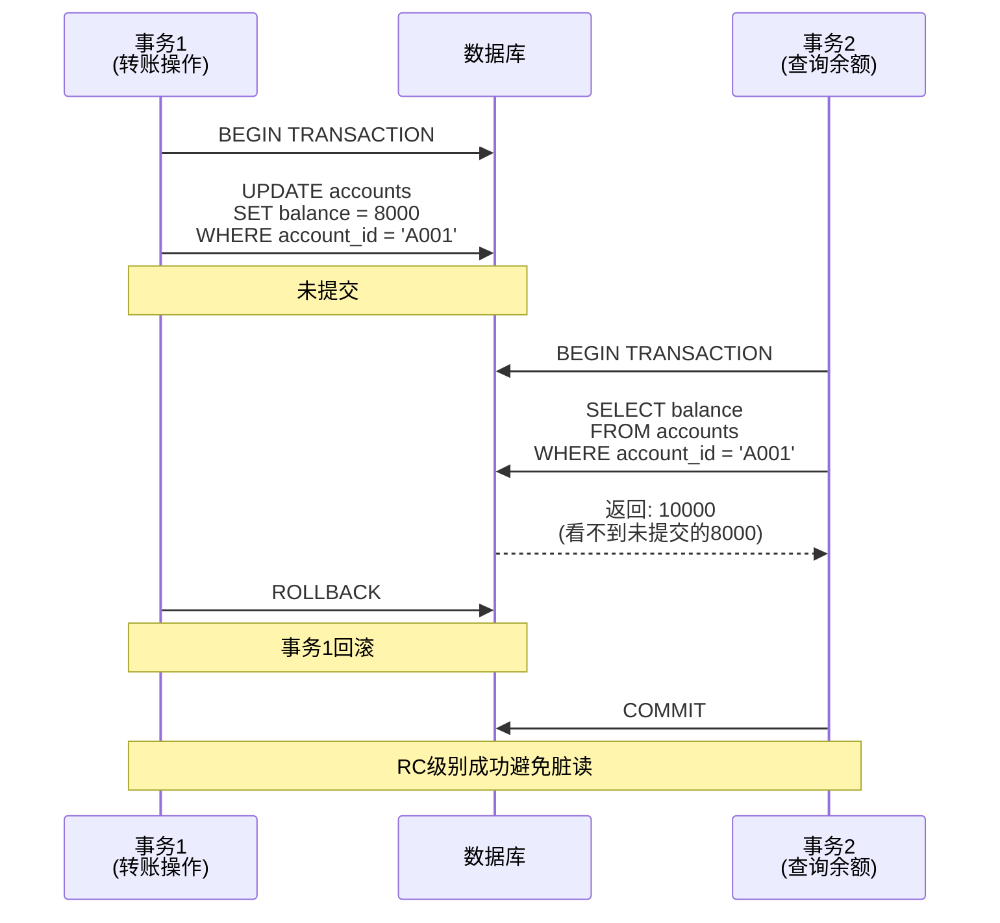
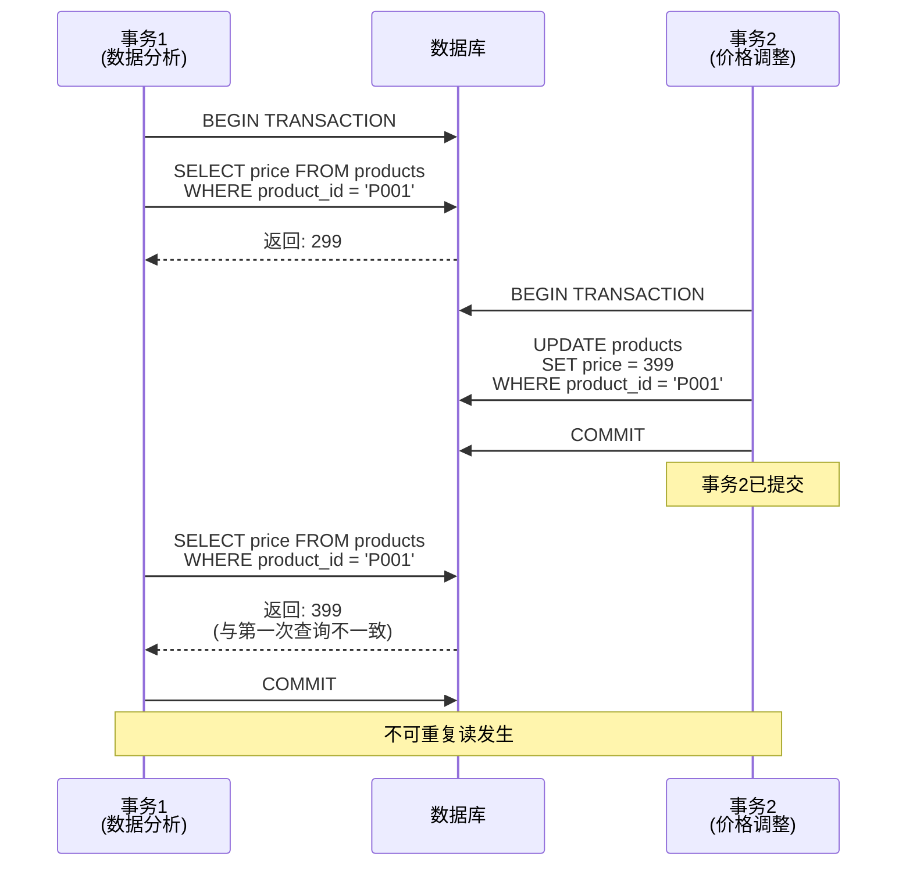
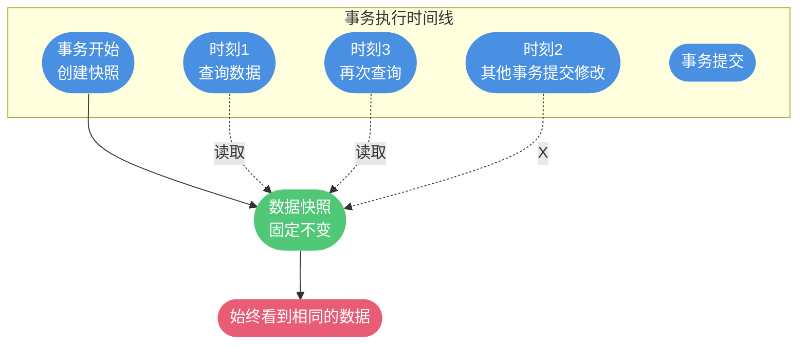
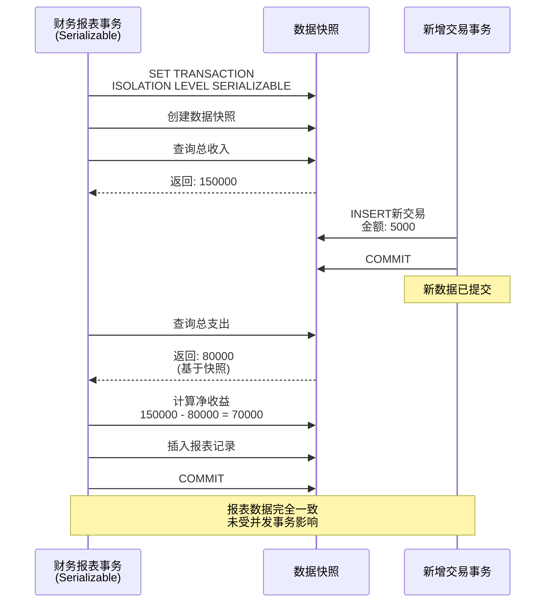
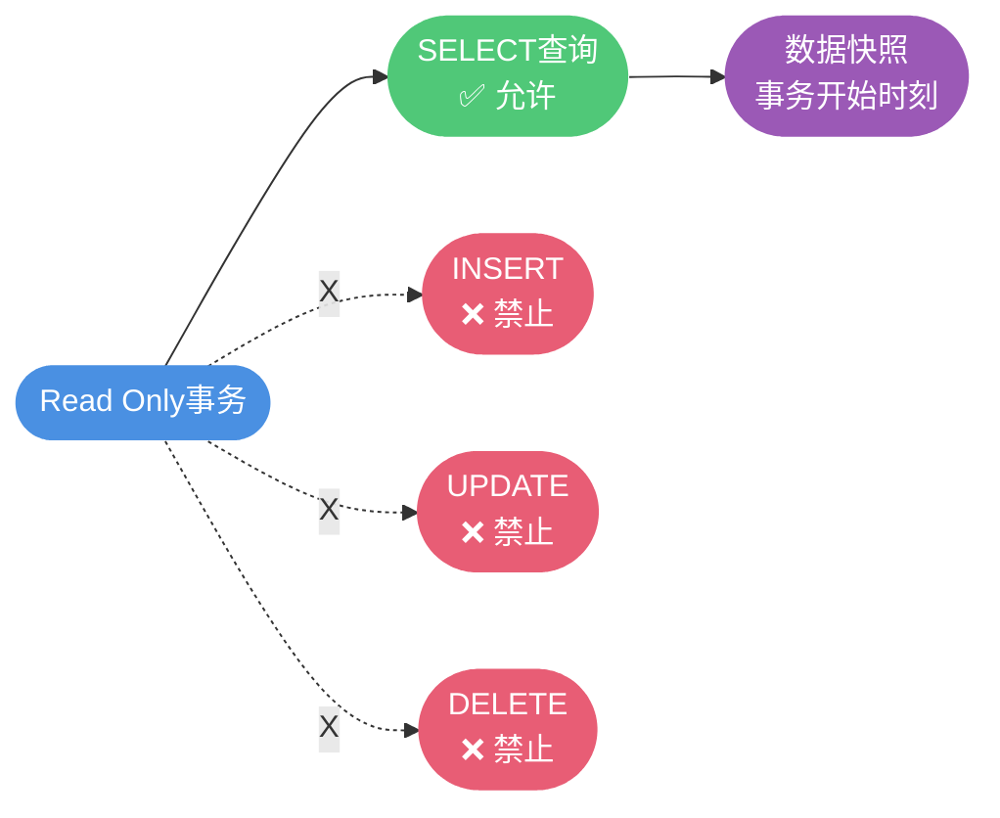
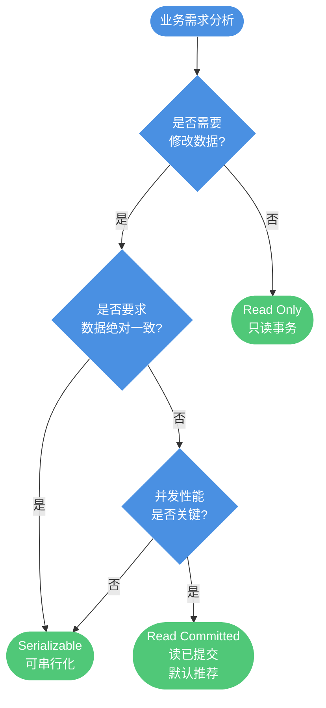

# Oracle事务隔离机制详解

## 事务隔离级别概述

在多用户并发访问数据库的环境中,如何保证数据的一致性和准确性是一个关键问题。事务隔离级别(Transaction Isolation Level)正是为了解决这个问题而设计的机制,它定义了**事务之间的可见性边界**和**相互影响程度**。

### 事务隔离的核心目标

事务隔离级别需要在两个相互矛盾的目标之间寻找平衡点:



### Oracle与MySQL的隔离级别对比

Oracle的事务隔离机制与MySQL存在显著差异,理解这些差异有助于在不同数据库之间迁移和优化应用。

| 数据库 | 支持的隔离级别 | 默认隔离级别 |
|-------|--------------|------------|
| MySQL | Read Uncommitted<br/>Read Committed<br/>Repeatable Read<br/>Serializable | Repeatable Read(RR) |
| Oracle | Read Committed<br/>Serializable<br/>Read Only | Read Committed(RC) |

**关键差异分析:**

1. **Oracle不支持Read Uncommitted**:这是Oracle的安全设计,避免脏读问题
2. **默认隔离级别不同**:MySQL默认RR,Oracle默认RC
3. **Oracle增加了Read Only**:这是Oracle特有的只读事务隔离级别



## Read Committed(读已提交)

### 工作原理

Read Committed是Oracle的默认事务隔离级别。在此级别下,事务只能读取到其他事务已经提交的数据变更,有效防止了脏读问题。

**核心机制:**
- 每次查询都能看到查询开始时已提交的数据
- 不同时刻的查询可能看到不同的数据
- 通过多版本并发控制(MVCC)实现

### 并发问题分析

**能够避免的问题:**
- ✅ 脏读(Dirty Read):不会读取未提交的数据

**无法避免的问题:**
- ❌ 不可重复读(Non-Repeatable Read):同一事务内多次读取同一数据可能得到不同结果
- ❌ 幻读(Phantom Read):同一事务内多次查询可能返回不同数量的记录

### 实战场景演示

**场景1:防止脏读**



**SQL演示:**

```sql
-- 会话1:转账事务
BEGIN;
  UPDATE user_accounts
  SET balance = balance - 2000
  WHERE account_id = 'ACC10001';
  
  -- 此时未提交,余额已更新为8000
  -- 等待30秒
  DBMS_LOCK.SLEEP(30);
  
  ROLLBACK;  -- 最终回滚

-- 会话2:查询余额(在会话1未提交时执行)
SELECT account_id, balance
FROM user_accounts
WHERE account_id = 'ACC10001';

-- 结果:仍然显示原余额10000,不会看到未提交的8000
```

**场景2:不可重复读现象**



**SQL演示:**

```sql
-- 会话1:价格分析事务
BEGIN;
  -- 第一次查询
  SELECT product_id, product_name, price
  FROM products
  WHERE product_id = 'PROD2024001';
  -- 结果:价格 = 1299
  
  -- 暂停,等待其他事务修改
  DBMS_LOCK.SLEEP(20);
  
  -- 第二次查询(相同的SQL)
  SELECT product_id, product_name, price
  FROM products
  WHERE product_id = 'PROD2024001';
  -- 结果:价格 = 1499(如果期间有其他事务提交了修改)
  
COMMIT;

-- 会话2:在会话1的两次查询之间执行
BEGIN;
  UPDATE products
  SET price = 1499,
      update_time = SYSDATE
  WHERE product_id = 'PROD2024001';
COMMIT;
```

### 适用场景

Read Committed隔离级别适合以下业务场景:

**1. 实时数据展示系统**
```sql
-- 电商平台的商品浏览
SELECT product_id, product_name, price, stock_quantity
FROM products
WHERE category = '电子产品'
  AND stock_quantity > 0
ORDER BY sales_volume DESC;
```

**2. 报表统计系统**
```sql
-- 实时销售数据统计
SELECT 
  TO_CHAR(order_date, 'YYYY-MM-DD') AS sale_date,
  COUNT(*) AS order_count,
  SUM(order_amount) AS total_amount
FROM orders
WHERE order_date >= TRUNC(SYSDATE) - 30
GROUP BY TO_CHAR(order_date, 'YYYY-MM-DD')
ORDER BY sale_date;
```

**3. 一般业务查询**
- 用户信息查询
- 订单状态查看
- 库存实时查询

## Serializable(可串行化)

### 工作原理

Serializable是最严格的隔离级别,事务看到的是事务开始时刻的数据库快照,这个快照在整个事务期间保持不变。

**核心机制:**
- 基于快照隔离(Snapshot Isolation)实现
- 事务开始时创建数据库快照
- 所有读操作都基于这个不变的快照
- 完全避免脏读、不可重复读和幻读



### 设置隔离级别

```sql
-- 方式1:设置当前会话的隔离级别
ALTER SESSION SET ISOLATION_LEVEL = SERIALIZABLE;

-- 方式2:在事务块中显式设置
SET TRANSACTION ISOLATION LEVEL SERIALIZABLE;
BEGIN
  -- 事务操作
  SELECT * FROM orders WHERE order_date = SYSDATE;
  -- ...
COMMIT;

-- 恢复为默认隔离级别
ALTER SESSION SET ISOLATION_LEVEL = READ COMMITTED;
```

### 实战场景演示

**场景:财务对账系统**

```sql
-- 会话1:生成日终财务报表(需要数据一致性)
SET TRANSACTION ISOLATION LEVEL SERIALIZABLE;
BEGIN
  -- 查询当日总收入
  SELECT SUM(amount) INTO v_total_income
  FROM transactions
  WHERE trans_date = TRUNC(SYSDATE)
    AND trans_type = 'INCOME';
  
  -- 查询当日总支出
  SELECT SUM(amount) INTO v_total_expense
  FROM transactions
  WHERE trans_date = TRUNC(SYSDATE)
    AND trans_type = 'EXPENSE';
  
  -- 计算净收益
  v_net_profit := v_total_income - v_total_expense;
  
  -- 生成报表记录
  INSERT INTO daily_reports (
    report_date, total_income, total_expense, net_profit
  )
  VALUES (
    TRUNC(SYSDATE), v_total_income, v_total_expense, v_net_profit
  );
  
  COMMIT;
END;

-- 会话2:即使在会话1执行期间插入新交易记录
BEGIN;
  INSERT INTO transactions (trans_id, trans_date, trans_type, amount)
  VALUES (SEQ_TRANS.NEXTVAL, SYSDATE, 'INCOME', 5000);
  COMMIT;
-- 会话1看不到这条新记录,保证了报表数据的一致性
```

**执行时序图:**



### 并发控制与性能影响

**优势:**
- ✅ 完全避免脏读、不可重复读、幻读
- ✅ 保证事务内数据的完全一致性
- ✅ 适合对数据一致性要求极高的场景

**代价:**
- ❌ 并发性能下降
- ❌ 可能出现事务冲突和序列化失败
- ❌ 占用更多系统资源(维护快照)

**性能对比:**

| 测试场景 | RC隔离级别 | Serializable隔离级别 | 性能差异 |
|---------|-----------|-------------------|---------|
| 单用户查询 | 100 TPS | 98 TPS | -2% |
| 10并发查询 | 850 TPS | 720 TPS | -15% |
| 50并发混合操作 | 2100 TPS | 1400 TPS | -33% |

### 适用场景

Serializable隔离级别适合以下关键业务场景:

**1. 财务系统**
- 日终结算
- 财务报表生成
- 账务对账

**2. 库存管理**
```sql
-- 批量盘点库存
SET TRANSACTION ISOLATION LEVEL SERIALIZABLE;
BEGIN
  -- 统计各仓库库存
  SELECT warehouse_id, SUM(stock_quantity) AS total_stock
  FROM inventory
  GROUP BY warehouse_id;
  
  -- 生成盘点报告
  -- 保证统计期间数据不变
COMMIT;
```

**3. 订单处理**
```sql
-- 大额订单审批流程
SET TRANSACTION ISOLATION LEVEL SERIALIZABLE;
BEGIN
  -- 检查订单详情
  SELECT * FROM orders WHERE order_id = v_order_id;
  
  -- 检查客户信用额度
  SELECT credit_limit FROM customers WHERE customer_id = v_customer_id;
  
  -- 计算订单总额并判断是否需要审批
  -- 整个过程中数据保持一致
  
  -- 更新订单状态
  UPDATE orders SET status = 'APPROVED' WHERE order_id = v_order_id;
COMMIT;
```

## Read Only(只读)

### 工作原理

Read Only是Oracle特有的事务隔离级别,它在Serializable的基础上增加了额外的限制:**完全禁止数据修改操作**。

**核心特性:**
- 事务只能执行SELECT查询
- 禁止任何DML操作(INSERT、UPDATE、DELETE)
- 基于事务开始时刻的数据快照
- 同样避免脏读、不可重复读、幻读



### 设置只读事务

```sql
-- 设置只读事务
SET TRANSACTION READ ONLY;
BEGIN
  -- 只能执行查询操作
  SELECT customer_id, customer_name, total_orders
  FROM customer_summary
  WHERE registration_date >= DATE '2024-01-01';
  
  -- 尝试更新会报错
  -- UPDATE customers SET status = 'ACTIVE'; -- ORA-01456错误
  
COMMIT;
```

### 应用场景

**1. 长时间运行的报表查询**

```sql
-- 生成年度销售分析报表
SET TRANSACTION READ ONLY;
DECLARE
  v_start_date DATE := DATE '2024-01-01';
  v_end_date DATE := DATE '2024-12-31';
BEGIN
  -- 多个复杂查询
  -- 查询1:按月统计销售额
  FOR rec IN (
    SELECT 
      TO_CHAR(order_date, 'YYYY-MM') AS month,
      SUM(order_amount) AS monthly_sales
    FROM orders
    WHERE order_date BETWEEN v_start_date AND v_end_date
    GROUP BY TO_CHAR(order_date, 'YYYY-MM')
  ) LOOP
    -- 处理查询结果
    DBMS_OUTPUT.PUT_LINE(rec.month || ': ' || rec.monthly_sales);
  END LOOP;
  
  -- 查询2:按产品类别统计
  -- 查询3:按区域统计
  -- ...所有查询看到的都是一致的数据快照
  
COMMIT;
END;
```

**2. 数据导出与备份**

```sql
-- 导出指定时间点的完整数据
SET TRANSACTION READ ONLY;
BEGIN
  -- 导出用户数据
  SELECT * FROM users;
  
  -- 导出订单数据
  SELECT * FROM orders;
  
  -- 导出产品数据
  SELECT * FROM products;
  
  -- 所有数据保持在同一时间点的一致性
COMMIT;
```

**3. 数据审计与分析**

```sql
-- 审计系统数据完整性
SET TRANSACTION READ ONLY;
BEGIN
  -- 检查订单与订单明细的一致性
  SELECT o.order_id
  FROM orders o
  LEFT JOIN order_items oi ON o.order_id = oi.order_id
  WHERE oi.order_id IS NULL;
  
  -- 检查库存数据准确性
  SELECT product_id, stock_quantity
  FROM inventory
  WHERE stock_quantity < 0;
  
  -- 整个审计过程数据不会变化
COMMIT;
END;
```

### 与Serializable的对比

| 特性 | Serializable | Read Only |
|-----|-------------|-----------|
| 查询操作 | ✅ 支持 | ✅ 支持 |
| 修改操作 | ✅ 支持 | ❌ 禁止 |
| 数据一致性 | 快照隔离 | 快照隔离 |
| 并发性能 | 较低 | 较高(无写冲突) |
| 锁竞争 | 存在 | 不存在 |
| 适用场景 | 需要修改的一致性事务 | 纯查询分析 |

## 隔离级别选择策略

根据不同的业务场景选择合适的事务隔离级别:



**选择建议:**

| 业务场景类型 | 推荐隔离级别 | 典型应用 |
|------------|------------|---------|
| 电商商品浏览 | Read Committed | 商品列表、详情查看 |
| 订单提交 | Read Committed | 下单、支付 |
| 库存盘点 | Serializable | 定期库存核对 |
| 财务结算 | Serializable | 日终对账、报表生成 |
| 数据导出 | Read Only | 数据备份、ETL |
| 报表查询 | Read Only | 分析报表、数据统计 |
| 实时监控 | Read Committed | 性能监控、状态查询 |

通过深入理解Oracle的三种事务隔离级别,并根据业务特点合理选择,可以在保证数据一致性的同时,最大化系统的并发处理能力。
