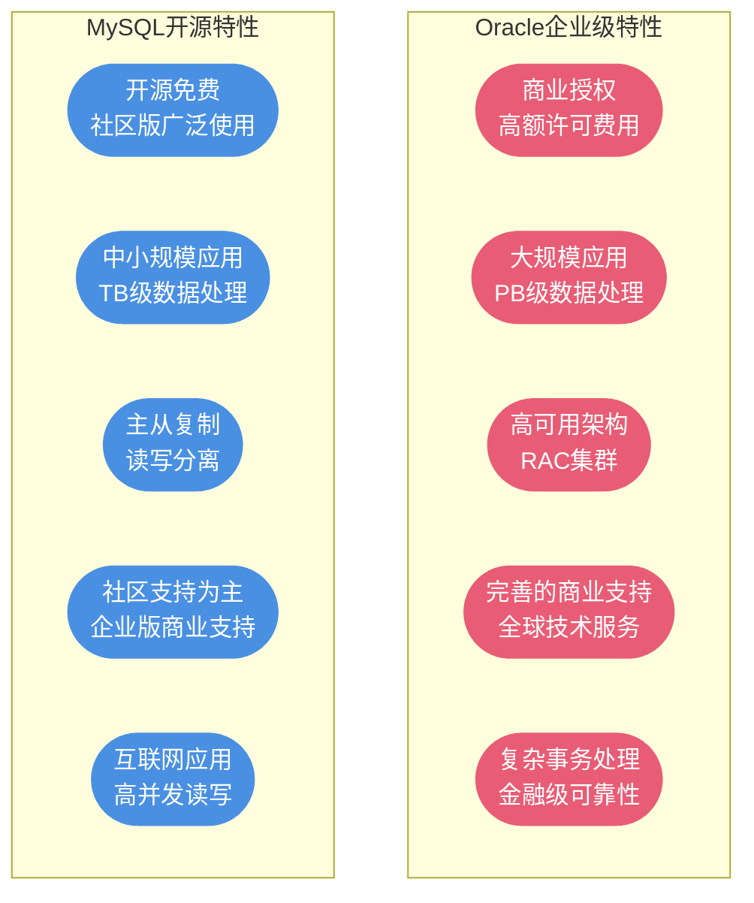

# Oracle与MySQL全面对比

## 数据库定位差异

Oracle和MySQL作为两大主流关系型数据库,在设计理念、目标用户和应用场景上存在本质差异。理解这些差异,有助于在项目中做出正确的技术选型决策。



### Oracle:企业级数据库系统

Oracle数据库是一款面向大型企业的商业数据库产品,具有以下显著特征:

**1. 强大的处理能力**

Oracle能够处理PB级别的海量数据,支持数千个并发连接,适合大型企业的核心业务系统。

**典型应用场景:**
- 银行核心交易系统
- 电信计费系统
- 大型ERP系统(如SAP、Oracle EBS)
- 证券交易所实时交易系统

**2. 高可用性技术**

Oracle提供Real Application Clusters(RAC)技术,支持多节点集群,实现负载均衡和故障自动切换。


**3. 完善的商业支持**

Oracle提供全球性的7×24小时技术支持服务,包括:
- 专业的技术支持团队
- 定期的产品升级和补丁
- 完整的培训和认证体系
- 咨询服务和最佳实践指导

### MySQL:开源轻量级数据库

MySQL是一款开源的关系型数据库,以灵活、高效、易用著称,广泛应用于互联网领域。

**1. 开源生态优势**

MySQL采用GPL开源协议(社区版),具有以下优势:
- 零成本使用(社区版免费)
- 活跃的开源社区
- 丰富的第三方工具和插件
- 广泛的技术文档和教程

**2. 高性能读写能力**

MySQL特别适合高并发的读写操作,在互联网应用中表现优异。

**典型应用场景:**
- 电商平台(如淘宝早期架构)
- 内容管理系统(WordPress、Drupal)
- 社交网络应用
- 日志分析系统

**3. 灵活的架构设计**

MySQL支持主从复制、读写分离等架构模式,易于水平扩展。


## 核心技术对比

### 事务隔离级别

两个数据库在事务隔离级别的设计上体现了不同的设计哲学。

| 对比维度 | Oracle | MySQL |
|---------|--------|-------|
| 默认隔离级别 | Read Committed(RC) | Repeatable Read(RR) |
| 设计理念 | 倾向并发性能 | 倾向数据一致性 |
| 幻读处理 | RC下允许幻读 | RR下通过间隙锁避免幻读 |
| 锁机制 | MVCC为主,锁为辅 | MVCC + 多种行锁 |

**影响分析:**

Oracle选择RC作为默认级别,牺牲部分一致性换取更高的并发性能,适合OLTP(联机事务处理)系统。

MySQL选择RR作为默认级别,提供更强的一致性保证,但可能产生更多的锁等待。

**实战建议:**
- 互联网高并发场景:MySQL可以考虑降级为RC
- 金融核心系统:建议使用Oracle的Serializable级别
- 一般业务系统:使用各自的默认级别即可

### 存储引擎架构

| 特性 | Oracle | MySQL |
|-----|--------|-------|
| 引擎架构 | 单一存储引擎 | 可插拔式多引擎 |
| 默认引擎 | Oracle存储引擎 | InnoDB(5.5+) |
| 引擎选择 | 无需选择 | 可根据场景选择 |

**MySQL存储引擎对比:**

| 引擎 | 事务支持 | 锁粒度 | 适用场景 |
|-----|---------|-------|---------|
| InnoDB | ✅ 支持 | 行级锁 | OLTP事务处理 |
| MyISAM | ❌ 不支持 | 表级锁 | 只读查询、数据仓库 |
| Memory | ❌ 不支持 | 表级锁 | 临时表、缓存 |

**Oracle的优势:**
- 统一的存储引擎,管理简单
- 无需考虑引擎选择问题
- 功能完整,无需组合使用

**MySQL的优势:**
- 灵活选择最适合的引擎
- 不同表可使用不同引擎
- 针对特定场景优化

### SQL语法差异

#### PL/SQL vs 标准SQL

**Oracle:支持PL/SQL过程化编程**

```sql
-- Oracle存储过程示例
CREATE OR REPLACE PROCEDURE calculate_bonus (
  p_employee_id IN NUMBER,
  p_bonus_rate IN NUMBER
) IS
  v_base_salary NUMBER;
  v_bonus_amount NUMBER;
BEGIN
  -- 查询基本工资
  SELECT salary INTO v_base_salary
  FROM employees
  WHERE employee_id = p_employee_id;
  
  -- 计算奖金
  v_bonus_amount := v_base_salary * p_bonus_rate;
  
  -- 发放奖金
  UPDATE employees
  SET bonus = v_bonus_amount,
      bonus_date = SYSDATE
  WHERE employee_id = p_employee_id;
  
  COMMIT;
  
EXCEPTION
  WHEN NO_DATA_FOUND THEN
    DBMS_OUTPUT.PUT_LINE('员工不存在');
    ROLLBACK;
END;
```

**MySQL:支持标准SQL和存储过程**

```sql
-- MySQL存储过程示例
DELIMITER //
CREATE PROCEDURE calculate_bonus(
  IN p_employee_id INT,
  IN p_bonus_rate DECIMAL(5,2)
)
BEGIN
  DECLARE v_base_salary DECIMAL(10,2);
  DECLARE v_bonus_amount DECIMAL(10,2);
  
  -- 查询基本工资
  SELECT salary INTO v_base_salary
  FROM employees
  WHERE employee_id = p_employee_id;
  
  -- 计算奖金
  SET v_bonus_amount = v_base_salary * p_bonus_rate;
  
  -- 发放奖金
  UPDATE employees
  SET bonus = v_bonus_amount,
      bonus_date = NOW()
  WHERE employee_id = p_employee_id;
  
END //
DELIMITER ;
```

#### 事务提交机制

| 数据库 | 默认提交方式 | 修改方式 |
|-------|-----------|---------|
| Oracle | 手动提交 | 默认即手动 |
| MySQL | 自动提交 | SET autocommit=0 |

**Oracle事务控制:**

```sql
-- Oracle默认需要手动提交
BEGIN
  INSERT INTO orders (order_id, customer_id, order_amount)
  VALUES (10001, 2001, 999.99);
  
  UPDATE customers
  SET total_orders = total_orders + 1
  WHERE customer_id = 2001;
  
  -- 必须显式提交
  COMMIT;
END;
```

**MySQL事务控制:**

```sql
-- MySQL默认自动提交,需要关闭
SET autocommit = 0;

START TRANSACTION;
  INSERT INTO orders (order_id, customer_id, order_amount)
  VALUES (10001, 2001, 999.99);
  
  UPDATE customers
  SET total_orders = total_orders + 1
  WHERE customer_id = 2001;
  
COMMIT;
```

#### 主键生成策略

| 数据库 | 主键生成方式 | 使用示例 |
|-------|------------|---------|
| Oracle | 序列(Sequence) | SEQ_ORDER.NEXTVAL |
| MySQL | 自增列(AUTO_INCREMENT) | 列定义时指定 |

**Oracle序列方式:**

```sql
-- 创建序列
CREATE SEQUENCE seq_order_id
START WITH 1
INCREMENT BY 1
NOCACHE;

-- 使用序列
INSERT INTO orders (order_id, customer_id, order_amount)
VALUES (seq_order_id.NEXTVAL, 2001, 999.99);
```

**MySQL自增方式:**

```sql
-- 创建表时定义自增列
CREATE TABLE orders (
  order_id INT PRIMARY KEY AUTO_INCREMENT,
  customer_id INT,
  order_amount DECIMAL(10,2)
);

-- 插入时无需指定主键
INSERT INTO orders (customer_id, order_amount)
VALUES (2001, 999.99);
```

#### 分页查询实现

**Oracle分页:使用ROWNUM或ROW_NUMBER()**

```sql
-- 方式1:使用ROWNUM(需要嵌套查询)
SELECT *
FROM (
  SELECT a.*, ROWNUM rn
  FROM (
    SELECT order_id, order_date, order_amount
    FROM orders
    ORDER BY order_date DESC
  ) a
  WHERE ROWNUM <= 30
)
WHERE rn > 20;

-- 方式2:使用ROW_NUMBER()(推荐)
SELECT order_id, order_date, order_amount
FROM (
  SELECT 
    order_id, order_date, order_amount,
    ROW_NUMBER() OVER (ORDER BY order_date DESC) AS rn
  FROM orders
)
WHERE rn BETWEEN 21 AND 30;
```

**MySQL分页:使用LIMIT**

```sql
-- MySQL分页简洁明了
SELECT order_id, order_date, order_amount
FROM orders
ORDER BY order_date DESC
LIMIT 20, 10;  -- 跳过20条,取10条

-- 或使用OFFSET语法(更直观)
SELECT order_id, order_date, order_amount
FROM orders
ORDER BY order_date DESC
LIMIT 10 OFFSET 20;
```

#### 字符串连接

| 数据库 | 连接方式 | 示例 |
|-------|---------|-----|
| Oracle | 使用 &#124;&#124; 运算符 | 'Hello' &#124;&#124; ' ' &#124;&#124; 'World' |
| MySQL | CONCAT函数 | CONCAT('Hello', ' ', 'World') |

**Oracle字符串连接:**

```sql
-- 拼接用户全名
SELECT 
  employee_id,
  last_name || ', ' || first_name AS full_name
FROM employees;

-- 拼接地址信息
SELECT 
  customer_id,
  province || city || district || street AS full_address
FROM customer_addresses;
```

**MySQL字符串连接:**

```sql
-- 拼接用户全名
SELECT 
  employee_id,
  CONCAT(last_name, ', ', first_name) AS full_name
FROM employees;

-- 拼接地址信息
SELECT 
  customer_id,
  CONCAT(province, city, district, street) AS full_address
FROM customer_addresses;
```

### 索引技术对比

| 索引类型 | Oracle | MySQL |
|---------|--------|-------|
| B+树索引 | ✅ 支持 | ✅ 支持 |
| 位图索引 | ✅ 支持 | ❌ 不支持 |
| 反向键索引 | ✅ 支持 | ❌ 不支持 |
| 函数索引 | ✅ 支持 | ✅ 支持(8.0+) |
| 全文索引 | ✅ 支持 | ✅ 支持 |
| 空间索引 | ✅ 支持(R树、Quad树) | ✅ 支持(R树) |
| 哈希索引 | ❌ 不支持 | ✅ 支持(Memory引擎) |

**Oracle索引优势:**
- 位图索引适合数据仓库场景
- 反向键索引解决热点块问题
- 空间索引支持更丰富(Quad树)

**MySQL索引优势:**
- 哈希索引提供O(1)查询性能
- 全文索引在文本搜索中表现优异
- 索引实现简洁高效

### 数据恢复机制

| 特性 | Oracle | MySQL |
|-----|--------|-------|
| 高可用方案 | RAC集群 | 主从复制 |
| 故障切换 | 自动切换 | 需要中间件(如MHA) |
| 数据同步 | 共享存储 | binlog日志同步 |
| 扩展性 | 垂直扩展为主 | 水平扩展容易 |

**Oracle RAC集群:**
- 多节点共享存储
- 节点故障自动切换
- 负载均衡
- 成本高昂

**MySQL主从复制:**
- 基于binlog异步复制
- 读写分离
- 扩展简单
- 成本较低

## 技术选型指南

### 选择Oracle的场景

**1. 大型企业核心业务系统**
- 银行、证券、保险核心交易系统
- 大型ERP系统(SAP、Oracle EBS)
- 电信计费系统

**2. 数据量巨大的系统**
- 单表数据量超过10亿条
- 数据库总容量超过10TB
- 需要复杂的数据分析

**3. 对可靠性要求极高的系统**
- 金融级数据安全要求
- 需要7×24小时不间断服务
- 数据丢失风险不可接受

**4. 预算充足的项目**
- 能够承担高额许可费用
- 需要专业技术支持服务

### 选择MySQL的场景

**1. 互联网应用系统**
- 电商平台
- 社交网络
- 内容管理系统

**2. 中小规模业务系统**
- 创业公司初期产品
- 中小企业管理系统
- 单表数据量在亿级以下

**3. 高并发读写场景**
- 日活跃用户百万级的应用
- 读多写少的业务场景
- 需要快速水平扩展

**4. 成本敏感的项目**
- 预算有限的项目
- 开源优先的技术栈
- 社区支持可满足需求

### 混合使用方案

在大型系统中,可以根据不同业务模块的特点,混合使用Oracle和MySQL:


**分层使用策略:**
- **核心层(Oracle)**:交易数据、账务数据、资金流水
- **应用层(MySQL)**:用户信息、商品信息、订单信息
- **日志层(MySQL/NoSQL)**:操作日志、访问日志、审计日志

## 总结对比表

| 对比维度 | Oracle | MySQL | 建议 |
|---------|--------|-------|-----|
| 定位 | 企业级商业数据库 | 开源轻量级数据库 | 根据项目规模选择 |
| 成本 | 高(许可费+维护费) | 低(社区版免费) | 成本敏感选MySQL |
| 性能 | 大规模数据处理强 | 高并发读写优秀 | 看业务类型 |
| 扩展性 | RAC垂直扩展 | 主从水平扩展 | 互联网选MySQL |
| 可靠性 | 金融级可靠性 | 需要架构保证 | 核心业务选Oracle |
| 学习成本 | 较高 | 较低 | 团队技能考虑 |
| 社区支持 | 商业支持为主 | 开源社区活跃 | 看支持需求 |

通过全面了解Oracle和MySQL的差异,结合项目的实际需求、预算约束和团队能力,可以做出最适合的技术选型决策。
