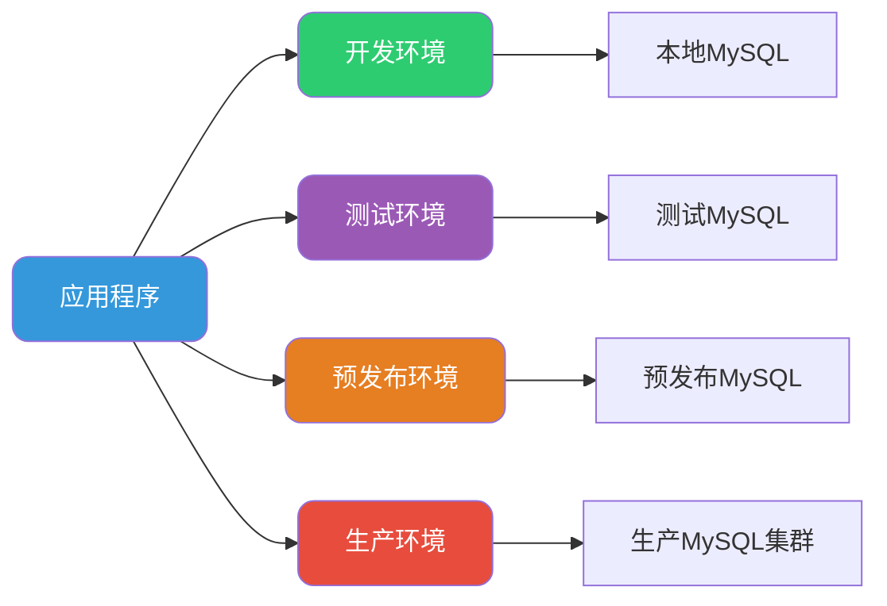
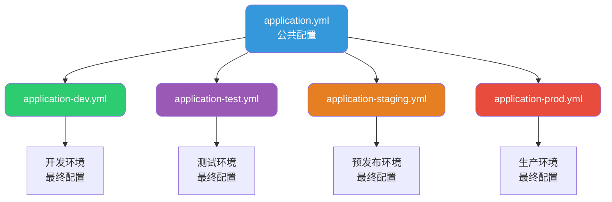
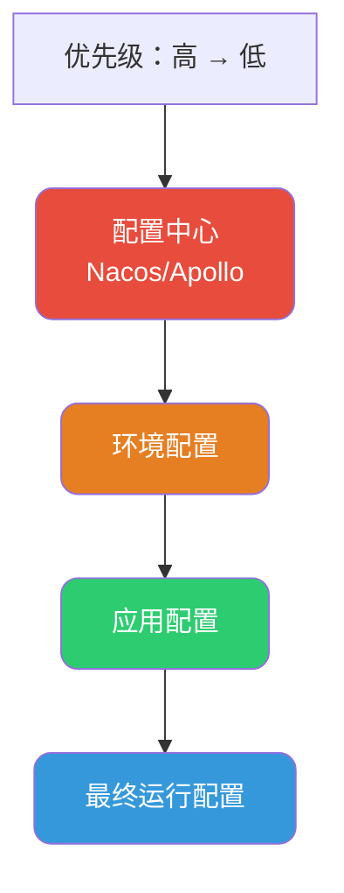

# SpringBoot多环境配置详解

## 多环境配置的必要性

在企业级应用开发中，一个项目通常会经历多个环境阶段：**开发环境（dev）**、**测试环境（test）**、**预发布环境（staging）** 以及 **生产环境（prod）**。每个环境的配置参数往往存在差异，比如数据库连接信息、第三方服务地址、日志级别等。

如果每次部署都需要手动修改配置文件，不仅效率低下，还容易出现配置错误导致的生产事故。因此，如何优雅地管理多环境配置，是每个后端开发者必须掌握的技能。



## Spring Profile机制详解

### Profile的核心概念

Spring的**Profile**机制提供了一种条件化配置的能力，允许我们为不同的运行环境定义特定的配置集合。当应用启动时，Spring容器会根据当前激活的Profile，选择性地加载对应的Bean定义和配置属性。

Profile的核心价值在于：

- **配置隔离**：不同环境的配置互不干扰
- **部署简化**：同一份代码包可以在任意环境运行
- **风险降低**：避免生产环境误用开发配置

### 基于@Profile注解的配置类

最直接的方式是在配置类上使用`@Profile`注解，明确指定该配置仅在特定环境生效。

以消息队列服务为例，开发环境可能使用内存队列便于调试，而生产环境则使用RabbitMQ：

```java
/**
 * 开发环境消息队列配置
 * 使用内存队列，便于本地调试
 */
@Configuration
@Profile("dev")
public class DevMessageQueueConfig {
    
    @Bean
    public MessageQueue messageQueue() {
        return new InMemoryMessageQueue();
    }
    
    @Bean
    public MessageSender messageSender(MessageQueue queue) {
        return new SyncMessageSender(queue);
    }
}

/**
 * 生产环境消息队列配置
 * 使用RabbitMQ，保证消息可靠性
 */
@Configuration
@Profile("prod")
public class ProdMessageQueueConfig {
    
    @Value("${rabbitmq.host}")
    private String host;
    
    @Value("${rabbitmq.port}")
    private int port;
    
    @Bean
    public ConnectionFactory connectionFactory() {
        CachingConnectionFactory factory = new CachingConnectionFactory();
        factory.setHost(host);
        factory.setPort(port);
        return factory;
    }
    
    @Bean
    public MessageQueue messageQueue(ConnectionFactory connectionFactory) {
        return new RabbitMessageQueue(connectionFactory);
    }
}
```

### 方法级别的@Profile应用

除了类级别，`@Profile`也可以应用在单个`@Bean`方法上，实现更细粒度的控制：

```java
@Configuration
public class CacheConfig {
    
    /**
     * 开发环境使用本地缓存
     */
    @Bean
    @Profile("dev")
    public CacheManager localCacheManager() {
        SimpleCacheManager cacheManager = new SimpleCacheManager();
        cacheManager.setCaches(Arrays.asList(
            new ConcurrentMapCache("orderCache"),
            new ConcurrentMapCache("productCache")
        ));
        return cacheManager;
    }
    
    /**
     * 生产环境使用Redis缓存
     */
    @Bean
    @Profile("prod")
    public CacheManager redisCacheManager(RedisConnectionFactory factory) {
        RedisCacheConfiguration config = RedisCacheConfiguration.defaultCacheConfig()
            .entryTtl(Duration.ofMinutes(30))
            .serializeKeysWith(RedisSerializationContext.SerializationPair
                .fromSerializer(new StringRedisSerializer()));
        return RedisCacheManager.builder(factory)
            .cacheDefaults(config)
            .build();
    }
}
```

## 配置文件的多环境管理

### 配置文件命名规范

SpringBoot支持通过特定的命名规范来实现配置文件的环境隔离：

```
application.yml           # 公共配置（所有环境共享）
application-dev.yml       # 开发环境配置
application-test.yml      # 测试环境配置
application-staging.yml   # 预发布环境配置
application-prod.yml      # 生产环境配置
```



### 配置文件示例

以订单服务为例，展示不同环境的配置差异：

**application.yml（公共配置）**：

```yaml
# 公共配置
spring:
  application:
    name: order-service
  jackson:
    date-format: yyyy-MM-dd HH:mm:ss
    time-zone: Asia/Shanghai

server:
  servlet:
    context-path: /api/order
```

**application-dev.yml（开发环境）**：

```yaml
spring:
  datasource:
    url: jdbc:mysql://localhost:3306/order_db_dev
    username: root
    password: 123456
    
logging:
  level:
    com.example.order: DEBUG
    org.hibernate.SQL: DEBUG

# 开发环境禁用限流
rate-limit:
  enabled: false
```

**application-prod.yml（生产环境）**：

```yaml
spring:
  datasource:
    url: jdbc:mysql://mysql-cluster.prod.internal:3306/order_db
    username: ${DB_USERNAME}
    password: ${DB_PASSWORD}
    hikari:
      maximum-pool-size: 50
      minimum-idle: 10
      
logging:
  level:
    com.example.order: WARN
    org.hibernate.SQL: ERROR

# 生产环境开启限流
rate-limit:
  enabled: true
  qps: 1000
```

## Profile的激活方式

SpringBoot提供了多种激活Profile的方式，按优先级从高到低排列：

### 命令行参数

这是生产部署中最常用的方式，优先级最高：

```bash
# 方式一：使用--spring.profiles.active参数
java -jar order-service.jar --spring.profiles.active=prod

# 方式二：使用-D参数设置系统属性
java -Dspring.profiles.active=prod -jar order-service.jar
```

### 环境变量

适用于容器化部署场景，如Docker或Kubernetes：

```bash
# Linux/Mac
export SPRING_PROFILES_ACTIVE=prod
java -jar order-service.jar

# Docker运行时指定
docker run -e SPRING_PROFILES_ACTIVE=prod order-service:latest
```

**Kubernetes Deployment配置**：

```yaml
apiVersion: apps/v1
kind: Deployment
metadata:
  name: order-service
spec:
  template:
    spec:
      containers:
        - name: order-service
          image: order-service:latest
          env:
            - name: SPRING_PROFILES_ACTIVE
              value: "prod"
```

### 配置文件指定

在`application.yml`中预设默认激活的Profile：

```yaml
spring:
  profiles:
    active: dev  # 默认激活开发环境，可被命令行覆盖
```

### 编程式激活

在应用启动类中通过代码设置：

```java
@SpringBootApplication
public class OrderServiceApplication {
    
    public static void main(String[] args) {
        SpringApplication app = new SpringApplication(OrderServiceApplication.class);
        
        // 根据条件动态设置Profile
        String env = System.getenv("DEPLOY_ENV");
        if ("production".equals(env)) {
            app.setAdditionalProfiles("prod", "secure");
        } else {
            app.setAdditionalProfiles("dev");
        }
        
        app.run(args);
    }
}
```

## 多Profile组合使用

### 场景描述

实际项目中，除了按环境划分，还可能需要按功能模块划分Profile。例如，可以同时激活"prod"环境和"mysql"数据库类型：

```bash
java -jar order-service.jar --spring.profiles.active=prod,mysql
```

### Profile组配置

SpringBoot 2.4+支持Profile组的概念，可以将多个Profile归为一组：

```yaml
spring:
  profiles:
    group:
      prod: 
        - prod-db
        - prod-cache
        - prod-mq
      dev:
        - dev-db
        - dev-cache
```

激活`prod`时，会自动激活`prod-db`、`prod-cache`、`prod-mq`三个子Profile。

## 最佳实践建议

### 配置安全性

生产环境的敏感配置（如数据库密码、API密钥）不应直接写在配置文件中：

```yaml
# 推荐：使用环境变量或配置中心
spring:
  datasource:
    password: ${DB_PASSWORD}

# 不推荐：明文密码
spring:
  datasource:
    password: MySecretPassword123
```

### 配置分层设计



### 默认Profile设置

为避免未指定Profile时应用启动失败，建议设置合理的默认值：

```yaml
spring:
  profiles:
    default: dev  # 未指定时默认使用dev
```

### 运行时Profile检测

在代码中可以通过注入`Environment`来检测当前激活的Profile：

```java
@Service
public class FeatureToggleService {
    
    @Autowired
    private Environment environment;
    
    public boolean isProductionMode() {
        return Arrays.asList(environment.getActiveProfiles()).contains("prod");
    }
    
    public void executeWithEnvCheck() {
        if (isProductionMode()) {
            // 生产环境特定逻辑
            log.info("Running in production mode");
        } else {
            // 非生产环境逻辑
            log.debug("Running in development mode");
        }
    }
}
```

## 总结

Spring Profile机制为多环境配置管理提供了优雅的解决方案。通过合理使用`@Profile`注解、配置文件分离以及灵活的激活方式，我们可以实现：

- **代码与配置解耦**：同一份代码在不同环境无缝切换
- **配置安全隔离**：避免开发配置泄露到生产环境
- **部署流程标准化**：通过环境变量或命令行即可控制应用行为

掌握多环境配置是构建企业级应用的基础能力，也是DevOps实践中的重要一环。
