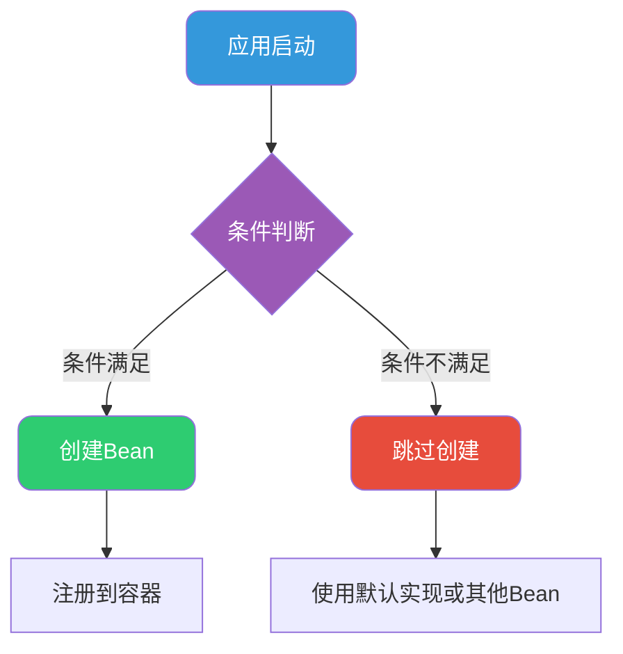
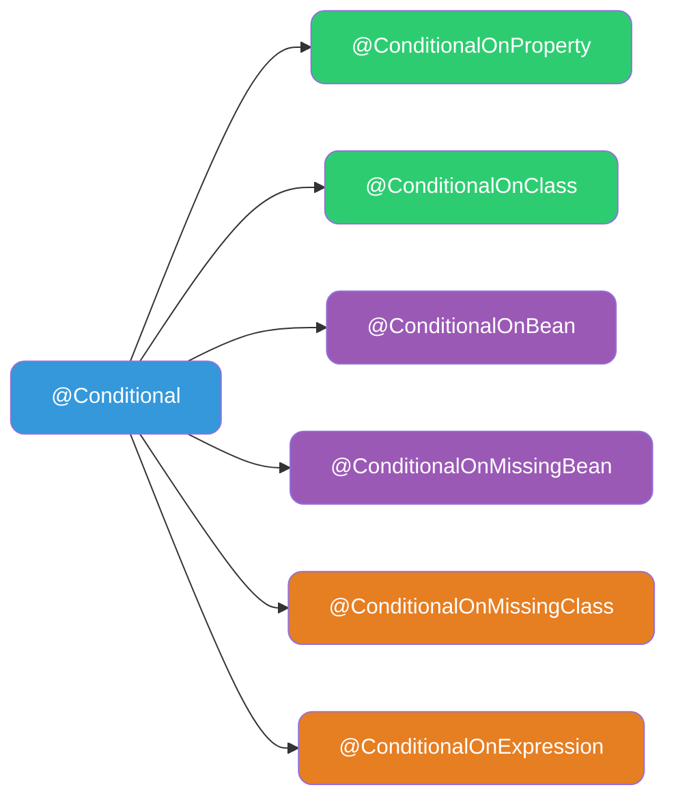
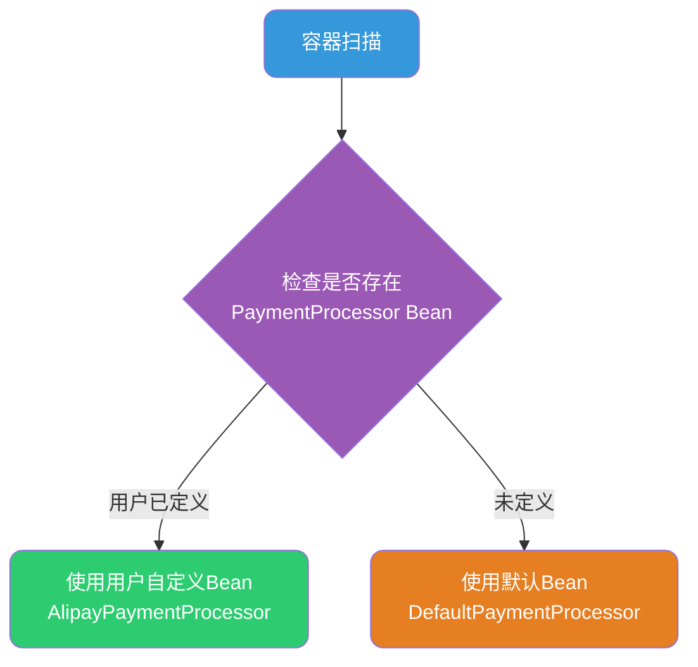
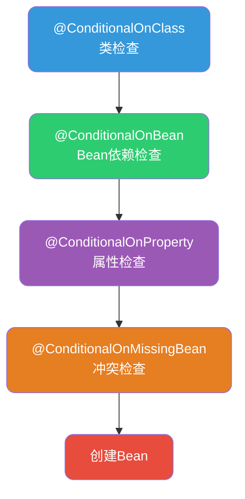

# SpringBoot条件化Bean配置详解

## 条件化配置的应用场景

在SpringBoot应用开发中，我们经常遇到需要根据特定条件动态创建Bean的场景：

- **多数据源切换**：根据配置决定使用MySQL还是PostgreSQL
- **功能开关控制**：通过配置启用或禁用某些功能模块
- **环境适配**：开发环境使用Mock实现，生产环境使用真实服务
- **框架自动装配**：检测到特定依赖时自动配置相关组件

Spring提供了强大的条件化配置机制，让我们能够灵活地控制Bean的创建逻辑。



## @Conditional注解体系

### 基础@Conditional注解

`@Conditional`是Spring条件化配置的基石，它接收一个实现了`Condition`接口的类，通过`matches`方法决定是否创建Bean。

以短信服务为例，根据配置决定是否启用短信发送功能：

```java
/**
 * 短信服务启用条件
 */
public class SmsEnabledCondition implements Condition {
    
    @Override
    public boolean matches(ConditionContext context, AnnotatedTypeMetadata metadata) {
        // 从环境变量或配置文件读取开关
        String enabled = context.getEnvironment()
            .getProperty("sms.service.enabled", "false");
        return Boolean.parseBoolean(enabled);
    }
}

@Configuration
public class SmsServiceConfig {
    
    @Bean
    @Conditional(SmsEnabledCondition.class)
    public SmsService smsService() {
        return new AliyunSmsService();
    }
}
```

配置文件：

```yaml
sms:
  service:
    enabled: true  # 设为true时才会创建SmsService Bean
```

## SpringBoot常用条件注解详解

SpringBoot在`@Conditional`基础上封装了一系列开箱即用的条件注解，大大简化了条件判断逻辑。



### @ConditionalOnProperty

根据配置属性的值决定是否创建Bean，这是使用最广泛的条件注解之一。

以文件存储服务为例，根据配置决定使用本地存储还是云存储：

```java
@Configuration
public class FileStorageConfig {
    
    /**
     * 当storage.type=local时，使用本地文件存储
     */
    @Bean
    @ConditionalOnProperty(name = "storage.type", havingValue = "local")
    public FileStorage localStorage() {
        return new LocalFileStorage("/data/uploads");
    }
    
    /**
     * 当storage.type=oss时，使用阿里云OSS存储
     */
    @Bean
    @ConditionalOnProperty(name = "storage.type", havingValue = "oss")
    public FileStorage ossStorage(OssProperties properties) {
        return new AliyunOssStorage(properties);
    }
    
    /**
     * 当storage.type=s3时，使用AWS S3存储
     */
    @Bean
    @ConditionalOnProperty(name = "storage.type", havingValue = "s3")
    public FileStorage s3Storage(S3Properties properties) {
        return new AwsS3Storage(properties);
    }
}
```

配置示例：

```yaml
# 开发环境使用本地存储
storage:
  type: local
  
# 生产环境使用OSS
storage:
  type: oss
  oss:
    endpoint: oss-cn-hangzhou.aliyuncs.com
    bucket: my-bucket
```

`@ConditionalOnProperty`的高级用法：

```java
// 当属性不存在时，默认创建Bean
@Bean
@ConditionalOnProperty(name = "cache.enabled", matchIfMissing = true)
public CacheManager defaultCacheManager() {
    return new SimpleCacheManager();
}

// 属性值为空或不存在时创建
@Bean
@ConditionalOnProperty(name = "feature.legacy", havingValue = "false", matchIfMissing = true)
public ModernService modernService() {
    return new ModernService();
}
```

### @ConditionalOnClass与@ConditionalOnMissingClass

根据类路径中是否存在特定类来决定是否创建Bean，这是实现自动装配的核心机制。

以HTTP客户端为例，根据依赖自动选择实现：

```java
@Configuration
public class HttpClientAutoConfig {
    
    /**
     * 当OkHttp在类路径中时，使用OkHttp客户端
     */
    @Bean
    @ConditionalOnClass(name = "okhttp3.OkHttpClient")
    public HttpClient okHttpClient() {
        return new OkHttpClientAdapter();
    }
    
    /**
     * 当Apache HttpClient在类路径中时，使用Apache实现
     */
    @Bean
    @ConditionalOnClass(CloseableHttpClient.class)
    @ConditionalOnMissingClass("okhttp3.OkHttpClient")  // OkHttp优先级更高
    public HttpClient apacheHttpClient() {
        return new ApacheHttpClientAdapter();
    }
    
    /**
     * 都没有时使用JDK原生HttpURLConnection
     */
    @Bean
    @ConditionalOnMissingClass({
        "okhttp3.OkHttpClient", 
        "org.apache.http.impl.client.CloseableHttpClient"
    })
    public HttpClient jdkHttpClient() {
        return new JdkHttpClientAdapter();
    }
}
```

### @ConditionalOnBean

**当容器中已存在指定类型的Bean时**，才创建当前Bean。常用于构建依赖链或扩展已有功能。

以订单通知服务为例，只有当通知渠道Bean存在时才创建通知服务：

```java
@Configuration
public class NotificationConfig {
    
    /**
     * 邮件通知渠道
     */
    @Bean
    @ConditionalOnProperty(name = "notification.email.enabled", havingValue = "true")
    public NotificationChannel emailChannel() {
        return new EmailNotificationChannel();
    }
    
    /**
     * 短信通知渠道
     */
    @Bean
    @ConditionalOnProperty(name = "notification.sms.enabled", havingValue = "true")
    public NotificationChannel smsChannel() {
        return new SmsNotificationChannel();
    }
    
    /**
     * 只有当存在NotificationChannel时才创建NotificationService
     * 避免没有任何通知渠道时创建无用的服务
     */
    @Bean
    @ConditionalOnBean(NotificationChannel.class)
    public NotificationService notificationService(List<NotificationChannel> channels) {
        return new CompositeNotificationService(channels);
    }
}
```

指定具体Bean名称的用法：

```java
@Configuration
public class SecurityConfig {
    
    @Bean
    public AuthenticationProvider jwtAuthProvider() {
        return new JwtAuthenticationProvider();
    }
    
    /**
     * 只有当名为"jwtAuthProvider"的Bean存在时才创建
     */
    @Bean
    @ConditionalOnBean(name = "jwtAuthProvider")
    public SecurityFilter jwtSecurityFilter(AuthenticationProvider provider) {
        return new JwtSecurityFilter(provider);
    }
}
```

### @ConditionalOnMissingBean

**当容器中不存在指定类型的Bean时**，才创建当前Bean。这是实现默认配置可覆盖的核心注解，在自动装配中极为重要。

典型应用场景——提供默认实现，允许用户自定义覆盖：

```java
/**
 * 框架提供的自动配置
 */
@Configuration
public class PaymentAutoConfiguration {
    
    /**
     * 默认支付处理器
     * 只有当用户没有自定义PaymentProcessor时才创建
     */
    @Bean
    @ConditionalOnMissingBean(PaymentProcessor.class)
    public PaymentProcessor defaultPaymentProcessor() {
        return new DefaultPaymentProcessor();
    }
    
    /**
     * 默认支付结果回调处理器
     */
    @Bean
    @ConditionalOnMissingBean(PaymentCallbackHandler.class)
    public PaymentCallbackHandler defaultCallbackHandler() {
        return new LoggingPaymentCallbackHandler();
    }
}

/**
 * 用户自定义配置（优先级更高）
 */
@Configuration
public class CustomPaymentConfig {
    
    /**
     * 用户自定义的支付处理器，会覆盖默认实现
     */
    @Bean
    public PaymentProcessor paymentProcessor() {
        return new AlipayPaymentProcessor();
    }
}
```



指定Bean名称的用法：

```java
@Bean
@ConditionalOnMissingBean(name = "primaryDataSource")
public DataSource defaultDataSource() {
    return DataSourceBuilder.create()
        .url("jdbc:h2:mem:testdb")
        .build();
}
```

### @ConditionalOnExpression

支持SpEL表达式，实现复杂的条件逻辑判断：

```java
@Configuration
public class FeatureConfig {
    
    /**
     * 同时满足多个条件时才创建
     * 表达式：功能开关开启 且 非生产环境
     */
    @Bean
    @ConditionalOnExpression(
        "${feature.experimental.enabled:false} && !'${spring.profiles.active}'.contains('prod')"
    )
    public ExperimentalFeature experimentalFeature() {
        return new ExperimentalFeature();
    }
    
    /**
     * 根据数值比较创建Bean
     */
    @Bean
    @ConditionalOnExpression("${server.thread-pool.size:10} >= 20")
    public ThreadPoolExecutor highCapacityExecutor() {
        return new ThreadPoolExecutor(20, 100, 60, TimeUnit.SECONDS, 
            new LinkedBlockingQueue<>(1000));
    }
}
```

## 使用@ConfigurationProperties绑定配置

`@ConfigurationProperties`注解可以将配置文件中的属性自动绑定到Java对象，结合条件注解可以实现更灵活的动态配置。

以邮件服务为例：

```java
/**
 * 邮件配置属性类
 */
@ConfigurationProperties(prefix = "mail")
@Validated
public class MailProperties {
    
    /**
     * 是否启用邮件服务
     */
    private boolean enabled = false;
    
    /**
     * SMTP服务器地址
     */
    @NotBlank(message = "SMTP服务器地址不能为空")
    private String host;
    
    /**
     * SMTP端口
     */
    private int port = 25;
    
    /**
     * 发件人账号
     */
    private String username;
    
    /**
     * 发件人密码
     */
    private String password;
    
    /**
     * 是否开启SSL
     */
    private boolean ssl = false;
    
    // getter和setter省略
}

@Configuration
@EnableConfigurationProperties(MailProperties.class)
public class MailServiceConfig {
    
    @Bean
    @ConditionalOnProperty(name = "mail.enabled", havingValue = "true")
    public JavaMailSender mailSender(MailProperties properties) {
        JavaMailSenderImpl sender = new JavaMailSenderImpl();
        sender.setHost(properties.getHost());
        sender.setPort(properties.getPort());
        sender.setUsername(properties.getUsername());
        sender.setPassword(properties.getPassword());
        
        Properties props = sender.getJavaMailProperties();
        if (properties.isSsl()) {
            props.put("mail.smtp.ssl.enable", "true");
        }
        props.put("mail.smtp.auth", "true");
        
        return sender;
    }
    
    @Bean
    @ConditionalOnBean(JavaMailSender.class)
    public MailService mailService(JavaMailSender sender, MailProperties properties) {
        return new DefaultMailService(sender, properties);
    }
}
```

配置文件：

```yaml
mail:
  enabled: true
  host: smtp.company.com
  port: 465
  username: noreply@company.com
  password: ${MAIL_PASSWORD}
  ssl: true
```

## 编程式Bean注册

对于更复杂的场景，可以通过实现`BeanDefinitionRegistryPostProcessor`接口，在容器启动阶段动态注册Bean。

详情可以跳转到：[Spring后置处理器详解](/framework/spring/post-processor)

## 条件注解的执行顺序

多个条件注解组合使用时，需要理解其执行顺序：



在自动配置类中的典型组合：

```java
@Configuration
@ConditionalOnClass(RedisTemplate.class)  // 首先检查Redis依赖是否存在
@ConditionalOnProperty(name = "cache.type", havingValue = "redis")  // 然后检查配置
public class RedisCacheAutoConfiguration {
    
    @Bean
    @ConditionalOnMissingBean  // 最后检查用户是否已自定义
    public RedisCacheManager cacheManager(RedisConnectionFactory factory) {
        return RedisCacheManager.builder(factory)
            .cacheDefaults(RedisCacheConfiguration.defaultCacheConfig())
            .build();
    }
}
```

## 实战：自定义Starter中的条件配置

将上述技术综合应用到自定义Starter中：

```java
@Configuration
@ConditionalOnClass(RateLimiter.class)
@ConditionalOnProperty(name = "ratelimit.enabled", havingValue = "true", matchIfMissing = false)
@EnableConfigurationProperties(RateLimitProperties.class)
public class RateLimitAutoConfiguration {
    
    /**
     * 默认使用内存限流器
     */
    @Bean
    @ConditionalOnMissingBean(RateLimiter.class)
    @ConditionalOnMissingClass("org.redisson.api.RRateLimiter")
    public RateLimiter memoryRateLimiter(RateLimitProperties properties) {
        return new MemoryRateLimiter(properties.getQps());
    }
    
    /**
     * 有Redisson依赖时使用分布式限流器
     */
    @Bean
    @ConditionalOnMissingBean(RateLimiter.class)
    @ConditionalOnClass(name = "org.redisson.api.RRateLimiter")
    @ConditionalOnBean(RedissonClient.class)
    public RateLimiter redisRateLimiter(RedissonClient client, RateLimitProperties properties) {
        return new RedisRateLimiter(client, properties.getQps());
    }
    
    /**
     * 限流拦截器
     */
    @Bean
    @ConditionalOnBean(RateLimiter.class)
    public RateLimitInterceptor rateLimitInterceptor(RateLimiter limiter) {
        return new RateLimitInterceptor(limiter);
    }
}
```

## 总结

Spring的条件化Bean配置机制为我们提供了强大的动态配置能力：

| 注解 | 应用场景 |
|------|----------|
| `@ConditionalOnProperty` | 根据配置开关控制Bean创建 |
| `@ConditionalOnClass` | 检测类路径依赖，实现自动装配 |
| `@ConditionalOnMissingClass` | 类不存在时的降级方案 |
| `@ConditionalOnBean` | 依赖其他Bean存在时创建 |
| `@ConditionalOnMissingBean` | 提供可覆盖的默认实现 |
| `@ConditionalOnExpression` | 复杂条件的SpEL表达式 |

合理运用这些条件注解，可以构建出灵活、可扩展的Spring应用架构，也是理解SpringBoot自动装配原理的关键所在。
