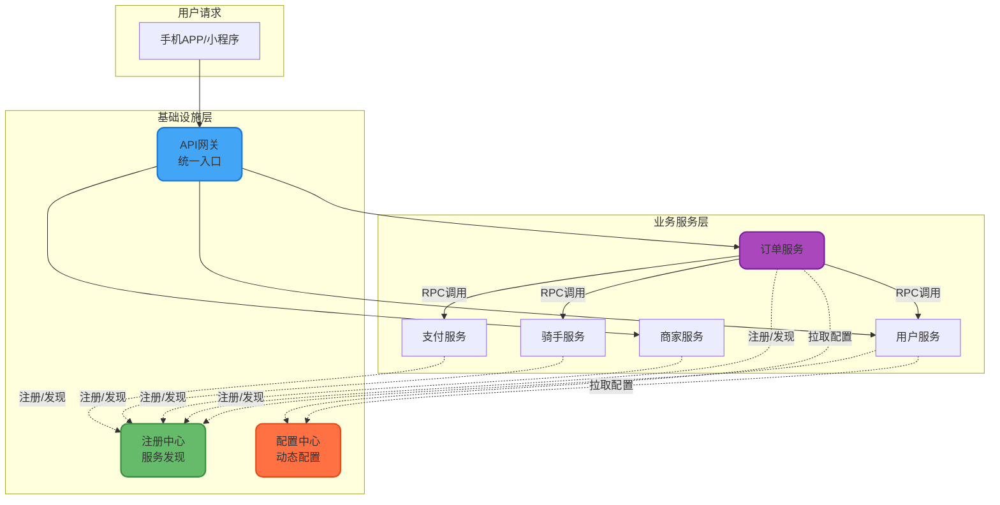
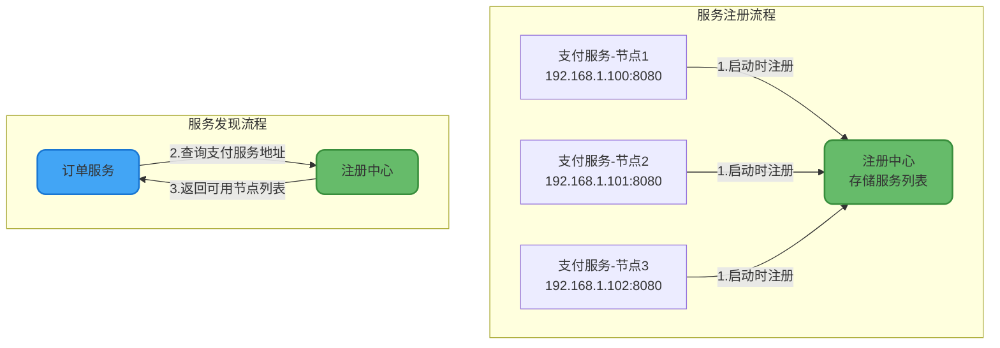
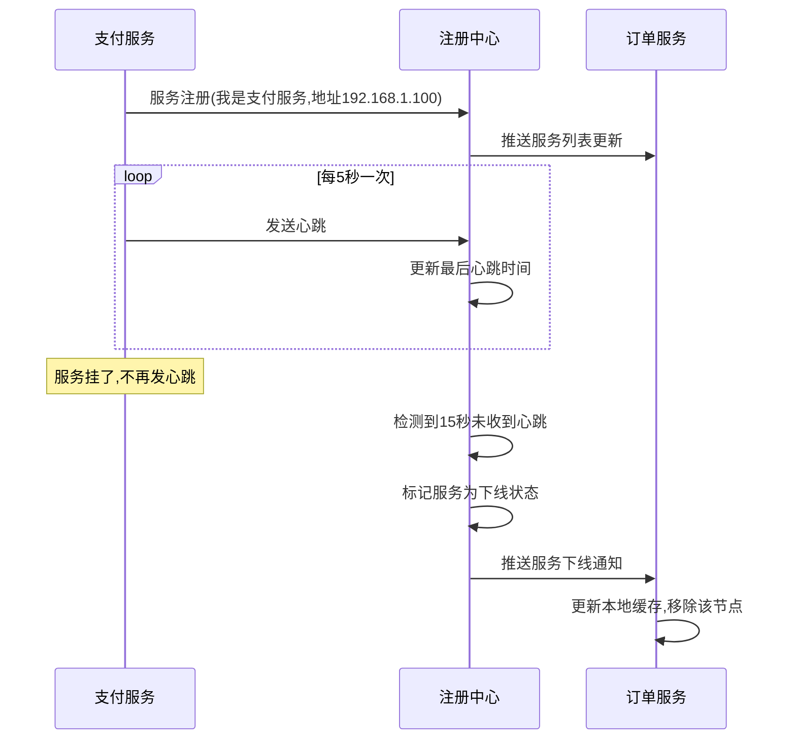
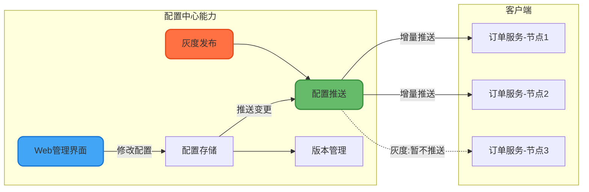
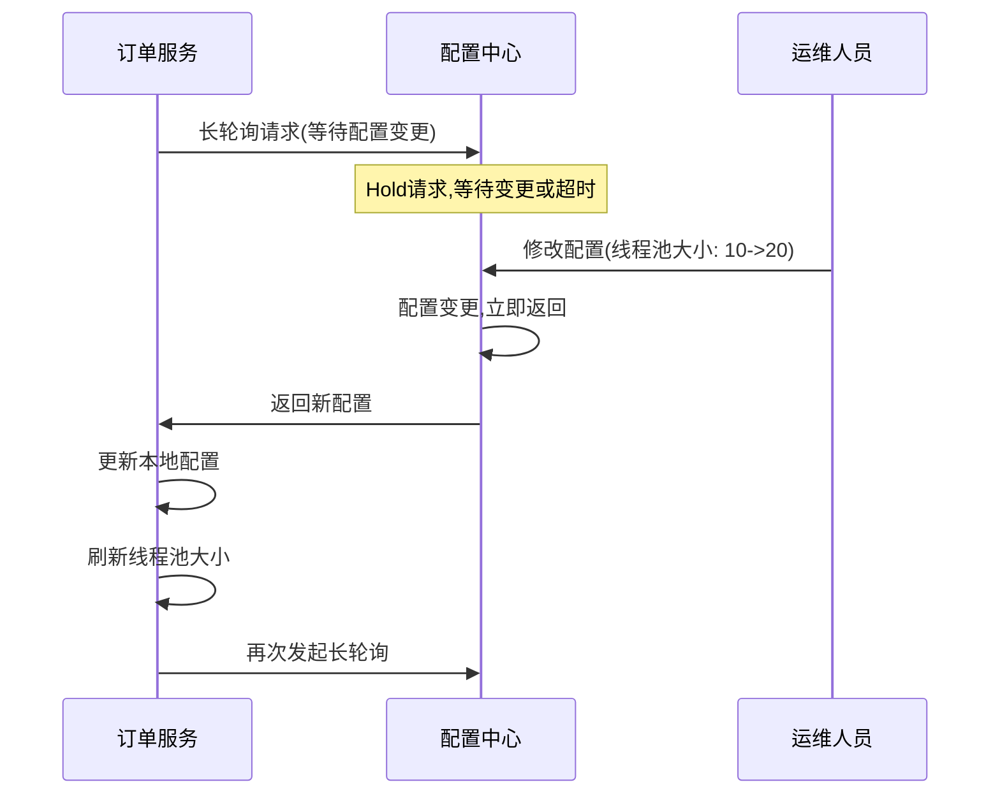
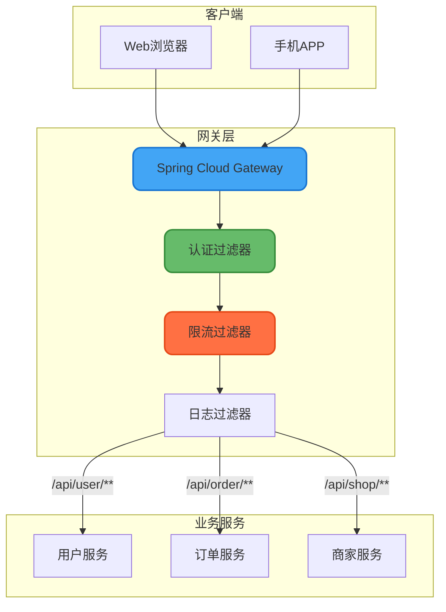
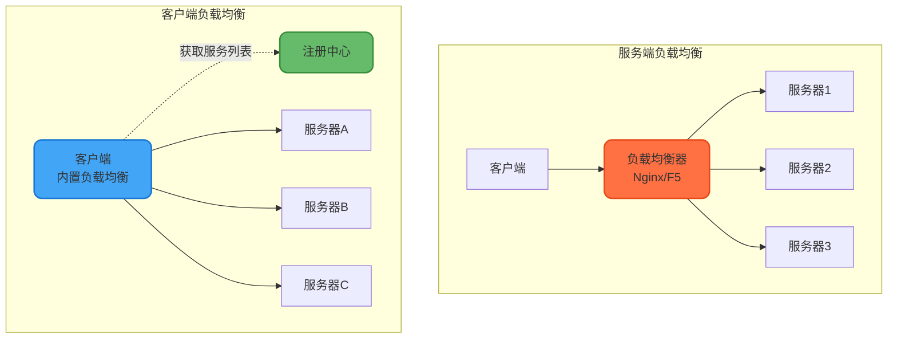
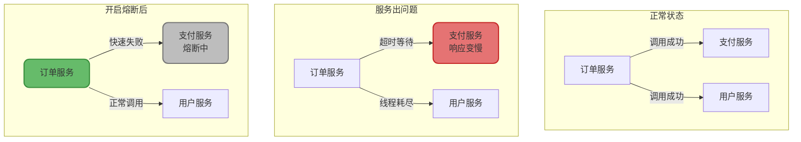

# 微服务核心组件与基础设施

## 从一个真实场景说起

想象一下你在运营一个外卖平台，刚开始业务量小的时候，所有代码都写在一个项目里——用户下单、商家接单、骑手配送、支付结算，全都揉在一起。代码量上去之后，每次改一个小功能都要把整个系统重新部署，改个订单模块的bug，结果支付模块莫名其妙挂了。

后来业务量起来了，你把系统拆成了好几个服务：用户服务、订单服务、商家服务、骑手服务、支付服务。问题来了——这些服务怎么互相找到对方？配置文件改了怎么不停机生效？外部请求怎么统一入口？某个服务挂了会不会把整个系统拖垮？

这些问题，就是微服务基础设施要解决的核心痛点。



## 服务注册与发现：服务之间怎么找到彼此？

### 没有注册中心的日子有多难

在没有服务注册发现之前，服务之间的调用地址都是写死在配置文件里的。比如订单服务要调用支付服务，配置文件里就写着`payment.service.url=192.168.1.100:8080`。

这样做有几个致命问题：

**场景一**：双十一来了，支付服务压力山大，你想加几台机器分担压力。加完之后呢？得手动改所有调用支付服务的配置文件，然后挨个重启服务。等你改完重启完，活动都快结束了。

**场景二**：凌晨三点，支付服务的一台机器硬盘坏了，机器直接宕机。结果其他服务还在傻傻地往这个地址发请求，全部超时失败，用户投诉电话打爆了。

**场景三**：测试环境、预发布环境、生产环境，每个环境的服务地址都不一样，配置文件管理简直是噩梦。

### 注册中心是怎么解决这些问题的

注册中心的思路其实很简单：搞一个"电话簿"，所有服务启动的时候都来登个记，告诉电话簿"我是谁、我在哪"。需要调用别的服务时，先查电话簿拿到对方地址，再发起调用。



这样一来：
- 加机器？新机器启动后自动注册，其他服务下次查询就能发现新节点
- 机器挂了？注册中心通过心跳检测发现节点失联，自动把它从列表里踢掉
- 多环境管理？不同环境连不同的注册中心就行

### 心跳机制：怎么知道服务还活着

光注册还不够，万一服务启动后过了一会儿挂了呢？注册中心得有办法知道服务还活着。

最常见的做法是**心跳机制**：服务每隔一段时间（比如5秒）给注册中心发一个"我还活着"的信号。如果注册中心连续几次都没收到心跳（比如15秒），就认为这个服务挂了，把它从可用列表里删掉，并且通知订阅了这个服务的其他服务。



### 主流注册中心怎么选

目前市面上主流的注册中心有三个：Nacos、Eureka、ZooKeeper。说实话，现在新项目基本都用Nacos了，但面试的时候可能还会问到它们的区别。

**ZooKeeper**：本来不是干这个的，它是做分布式协调的，只是早年Dubbo用它当注册中心，用的人多了大家就习惯了。它保证的是CP（一致性优先），也就是说在选主的时候服务可能短暂不可用。对于注册中心这个场景，其实可用性更重要，所以现在不太推荐用ZooKeeper做注册中心了。

**Eureka**：Netflix出品，Spring Cloud生态原生支持。它保证的是AP（可用性优先），即使集群中有节点挂了，只要还有一个节点能用，注册中心就能继续工作，只是数据可能不是最新的。但遗憾的是，Eureka 2.x被Netflix放弃了，Spring Cloud也逐渐在移除Netflix组件。

**Nacos**：阿里出品，后起之秀。既能当注册中心，又能当配置中心，而且同时支持CP和AP模式。文档丰富，社区活跃，和Spring Cloud、Dubbo、K8s都能无缝对接。性能也很强，官方说能支持百万级服务实例。

我的建议是：新项目直接用Nacos，省心省力。

### 实战：基于Nacos的服务注册发现

先看看怎么把一个Spring Boot服务接入Nacos：

```java
// 1. 引入依赖（pom.xml）
// <dependency>
//     <groupId>com.alibaba.cloud</groupId>
//     <artifactId>spring-cloud-starter-alibaba-nacos-discovery</artifactId>
// </dependency>

// 2. 配置Nacos地址（application.yml）
// spring:
//   application:
//     name: rider-service
//   cloud:
//     nacos:
//       discovery:
//         server-addr: nacos.example.com:8848
//         namespace: dev
//         group: DELIVERY_GROUP

// 3. 启动类添加注解
@SpringBootApplication
@EnableDiscoveryClient
public class RiderServiceApplication {
    public static void main(String[] args) {
        SpringApplication.run(RiderServiceApplication.class, args);
    }
}

// 4. 通过服务名调用其他服务
@Service
public class RiderDispatchService {
    
    @Autowired
    private DiscoveryClient discoveryClient;
    
    @Autowired
    private RestTemplate restTemplate;
    
    /**
     * 获取订单详情用于派单
     */
    public OrderInfo getOrderForDispatch(String orderId) {
        // 方式一：手动获取服务实例
        List<ServiceInstance> instances = discoveryClient.getInstances("order-service");
        if (instances.isEmpty()) {
            throw new ServiceNotFoundException("订单服务暂不可用");
        }
        // 简单轮询选一个实例
        ServiceInstance instance = instances.get(orderId.hashCode() % instances.size());
        String url = String.format("http://%s:%d/api/orders/%s", 
                instance.getHost(), instance.getPort(), orderId);
        return restTemplate.getForObject(url, OrderInfo.class);
    }
    
    /**
     * 方式二：使用@LoadBalanced注解，自动负载均衡
     * 需要给RestTemplate加上@LoadBalanced注解
     */
    public OrderInfo getOrderSimple(String orderId) {
        // 直接用服务名代替IP，框架自动做服务发现和负载均衡
        String url = "http://order-service/api/orders/" + orderId;
        return restTemplate.getForObject(url, OrderInfo.class);
    }
}
```

## 配置中心：配置怎么做到不停机生效？

### 配置文件管理的那些坑

你有没有经历过这种场景：

- 改个数据库连接池大小，得重新发布服务
- 开关一个功能，改完配置文件还得重启
- 配置散落在各个服务的配置文件里，想查个配置得登好几台机器
- 生产环境的数据库密码写在配置文件里，谁都能看到

这些问题用配置中心都能解决。

### 配置中心能干什么

一个成熟的配置中心至少要具备这些能力：

**集中管理**：所有服务的配置统一放在一个地方，有个Web界面能看能改。

**实时生效**：改完配置不用重启服务，几秒钟就能生效。这个太重要了，想象一下大促期间发现某个配置有问题，要是必须重启服务才能改，那损失可就大了。

**版本管理**：每次改配置都有记录，谁在什么时间改了什么，一清二楚。发现改错了还能一键回滚。

**权限控制**：不是谁都能改生产环境的配置，得有审批流程。

**灰度发布**：新配置先让一小部分机器生效，观察没问题再全量推送。



### Nacos和Apollo怎么选

目前主流的配置中心是Nacos和Apollo。

**Nacos**：阿里出品，既能当注册中心又能当配置中心，一石二鸟。配置功能相对简单直接，够用就行的话选它没错。

**Apollo**：携程出品，专门做配置中心的，功能更全面。灰度发布做得更细致，支持按IP、按机房灰度。有完善的权限管理和发布审核流程。如果你对配置管理要求比较高，Apollo是更好的选择。

| 对比项 | Nacos | Apollo |
|-------|-------|--------|
| 功能定位 | 注册中心+配置中心 | 纯配置中心 |
| 配置实时生效 | 支持（长轮询） | 支持（长轮询） |
| 灰度发布 | 基础支持 | 功能丰富 |
| 权限管理 | 基础支持 | 细粒度控制 |
| 学习成本 | 低 | 中等 |
| 适用场景 | 中小项目 | 大型项目 |

### 配置热更新原理

配置中心怎么做到改完配置几秒钟就生效的？关键在于**长轮询**机制。

传统的轮询是客户端每隔几秒问一次服务端"配置变了没"，这样做效率太低。长轮询的做法是：客户端发起请求后，如果配置没变化，服务端不会立即返回，而是hold住这个请求（比如30秒）。在这30秒内如果配置变了，服务端立即返回新配置；如果30秒到了配置还没变，返回空让客户端重新发起请求。



### 实战：配置热更新

来看个实际的例子——动态调整线程池大小：

```java
@Component
@RefreshScope  // 关键注解,支持配置热刷新
public class AsyncTaskExecutorConfig {
    
    @Value("${async.executor.core-size:10}")
    private int corePoolSize;
    
    @Value("${async.executor.max-size:50}")
    private int maxPoolSize;
    
    @Value("${async.executor.queue-capacity:1000}")
    private int queueCapacity;
    
    private ThreadPoolExecutor executor;
    
    @PostConstruct
    public void init() {
        this.executor = new ThreadPoolExecutor(
            corePoolSize,
            maxPoolSize,
            60, TimeUnit.SECONDS,
            new LinkedBlockingQueue<>(queueCapacity),
            new ThreadFactoryBuilder().setNameFormat("async-task-%d").build(),
            new ThreadPoolExecutor.CallerRunsPolicy()
        );
        log.info("线程池初始化完成, core={}, max={}, queue={}", 
                corePoolSize, maxPoolSize, queueCapacity);
    }
    
    /**
     * 监听配置变更事件
     */
    @EventListener
    public void onConfigChange(RefreshScopeRefreshedEvent event) {
        // 配置变更后,动态调整线程池参数
        executor.setCorePoolSize(corePoolSize);
        executor.setMaximumPoolSize(maxPoolSize);
        log.info("线程池参数已更新, core={}, max={}", corePoolSize, maxPoolSize);
    }
    
    public void submitTask(Runnable task) {
        executor.submit(task);
    }
}
```

再来个更复杂的场景——功能开关：

```java
@Service
public class PromotionService {
    
    @Autowired
    private NacosConfigManager configManager;
    
    /**
     * 判断是否开启新版优惠计算逻辑
     * 通过配置中心动态控制,无需发布即可切换
     */
    public BigDecimal calculateDiscount(Order order) {
        boolean useNewAlgorithm = getFeatureSwitch("promotion.new-algorithm.enabled");
        
        if (useNewAlgorithm) {
            return calculateDiscountV2(order);
        } else {
            return calculateDiscountV1(order);
        }
    }
    
    private boolean getFeatureSwitch(String key) {
        try {
            String config = configManager.getConfigService()
                    .getConfig("feature-switches", "DEFAULT_GROUP", 3000);
            Properties props = new Properties();
            props.load(new StringReader(config));
            return Boolean.parseBoolean(props.getProperty(key, "false"));
        } catch (Exception e) {
            log.warn("获取功能开关失败,使用默认值false", e);
            return false;
        }
    }
    
    private BigDecimal calculateDiscountV1(Order order) {
        // 老版本优惠计算逻辑
        return order.getTotalAmount().multiply(new BigDecimal("0.9"));
    }
    
    private BigDecimal calculateDiscountV2(Order order) {
        // 新版本优惠计算逻辑,支持多级折扣
        BigDecimal amount = order.getTotalAmount();
        if (amount.compareTo(new BigDecimal("500")) > 0) {
            return amount.multiply(new BigDecimal("0.85"));
        } else if (amount.compareTo(new BigDecimal("200")) > 0) {
            return amount.multiply(new BigDecimal("0.9"));
        }
        return amount.multiply(new BigDecimal("0.95"));
    }
}
```

## API网关：统一入口怎么设计？

### 为什么需要网关

没有网关的时候，前端调用后端服务是这样的：调用户接口就访问`user.example.com`，调订单接口就访问`order.example.com`，调支付接口就访问`pay.example.com`。每个服务都直接暴露给外网，想想都觉得乱。

有了网关之后，所有请求都走一个入口`api.example.com`，由网关根据请求路径转发到对应的后端服务。这样做的好处：

- **统一入口**：前端只需要知道一个地址
- **安全管控**：认证、鉴权、限流都在网关做
- **协议转换**：外部是HTTPS，内部可以是HTTP
- **请求聚合**：一个请求聚合多个服务的响应
- **灰度路由**：按用户特征路由到不同版本的服务



### Spring Cloud Gateway核心概念

Spring Cloud Gateway是Spring官方的网关组件，基于WebFlux响应式编程，性能很强。它有三个核心概念：

**Route（路由）**：定义请求转发规则，比如`/api/order/**`转发到订单服务。

**Predicate（断言）**：判断请求是否匹配某个路由，可以根据路径、请求头、参数等判断。

**Filter（过滤器）**：在请求转发前后做一些处理，比如添加请求头、记录日志、限流等。

```yaml
spring:
  cloud:
    gateway:
      routes:
        # 用户服务路由
        - id: user-service-route
          uri: lb://user-service  # lb表示负载均衡
          predicates:
            - Path=/api/user/**
          filters:
            - StripPrefix=1  # 去掉前缀/api
            - AddRequestHeader=X-Source, gateway
        
        # 订单服务路由
        - id: order-service-route
          uri: lb://order-service
          predicates:
            - Path=/api/order/**
            - Header=X-Request-Id, \d+  # 必须带请求ID
          filters:
            - StripPrefix=1
            - name: RequestRateLimiter  # 限流
              args:
                redis-rate-limiter.replenishRate: 100
                redis-rate-limiter.burstCapacity: 200
```

### 实战：自定义过滤器

来实现几个常用的过滤器：

```java
/**
 * 全局认证过滤器
 * 校验请求中的Token,不通过直接返回401
 */
@Component
public class AuthenticationFilter implements GlobalFilter, Ordered {
    
    @Autowired
    private TokenService tokenService;
    
    // 不需要认证的白名单
    private static final List<String> WHITE_LIST = Arrays.asList(
            "/api/user/login",
            "/api/user/register",
            "/api/public/**"
    );
    
    @Override
    public Mono<Void> filter(ServerWebExchange exchange, GatewayFilterChain chain) {
        ServerHttpRequest request = exchange.getRequest();
        String path = request.getPath().value();
        
        // 白名单直接放行
        if (isWhiteListed(path)) {
            return chain.filter(exchange);
        }
        
        // 获取Token
        String token = request.getHeaders().getFirst("Authorization");
        if (StringUtils.isBlank(token)) {
            return unauthorized(exchange, "缺少认证信息");
        }
        
        // 校验Token
        try {
            UserInfo userInfo = tokenService.parseToken(token.replace("Bearer ", ""));
            // 把用户信息放到请求头传递给下游服务
            ServerHttpRequest newRequest = request.mutate()
                    .header("X-User-Id", String.valueOf(userInfo.getUserId()))
                    .header("X-User-Name", userInfo.getUserName())
                    .build();
            return chain.filter(exchange.mutate().request(newRequest).build());
        } catch (TokenExpiredException e) {
            return unauthorized(exchange, "登录已过期");
        } catch (Exception e) {
            return unauthorized(exchange, "认证失败");
        }
    }
    
    private Mono<Void> unauthorized(ServerWebExchange exchange, String message) {
        ServerHttpResponse response = exchange.getResponse();
        response.setStatusCode(HttpStatus.UNAUTHORIZED);
        response.getHeaders().setContentType(MediaType.APPLICATION_JSON);
        
        String body = String.format("{\"code\":401,\"message\":\"%s\"}", message);
        DataBuffer buffer = response.bufferFactory().wrap(body.getBytes(StandardCharsets.UTF_8));
        return response.writeWith(Mono.just(buffer));
    }
    
    private boolean isWhiteListed(String path) {
        return WHITE_LIST.stream().anyMatch(pattern -> 
                new AntPathMatcher().match(pattern, path));
    }
    
    @Override
    public int getOrder() {
        return -100; // 优先级最高
    }
}

/**
 * 请求日志过滤器
 * 记录每个请求的耗时和结果
 */
@Component
@Slf4j
public class RequestLoggingFilter implements GlobalFilter, Ordered {
    
    @Override
    public Mono<Void> filter(ServerWebExchange exchange, GatewayFilterChain chain) {
        long startTime = System.currentTimeMillis();
        String requestId = UUID.randomUUID().toString().replace("-", "");
        String path = exchange.getRequest().getPath().value();
        String method = exchange.getRequest().getMethod().name();
        
        // 添加请求ID到响应头
        exchange.getResponse().getHeaders().add("X-Request-Id", requestId);
        
        return chain.filter(exchange).then(Mono.fromRunnable(() -> {
            long duration = System.currentTimeMillis() - startTime;
            int statusCode = exchange.getResponse().getStatusCode().value();
            
            if (statusCode >= 400) {
                log.warn("[{}] {} {} -> {} ({}ms)", requestId, method, path, statusCode, duration);
            } else {
                log.info("[{}] {} {} -> {} ({}ms)", requestId, method, path, statusCode, duration);
            }
        }));
    }
    
    @Override
    public int getOrder() {
        return -200; // 比认证过滤器更早执行
    }
}
```

## 服务调用：OpenFeign声明式调用

### 传统调用方式的问题

用RestTemplate调用服务虽然能用，但代码写起来很繁琐：

```java
// 传统写法,又臭又长
public OrderInfo getOrder(String orderId) {
    String url = "http://order-service/api/orders/" + orderId;
    ResponseEntity<OrderInfo> response = restTemplate.getForEntity(url, OrderInfo.class);
    if (!response.getStatusCode().is2xxSuccessful()) {
        throw new ServiceException("调用订单服务失败");
    }
    return response.getBody();
}
```

OpenFeign提供了声明式的调用方式，像调用本地方法一样调用远程服务：

```java
// 定义Feign客户端,像定义接口一样简单
@FeignClient(name = "order-service", fallback = OrderClientFallback.class)
public interface OrderClient {
    
    @GetMapping("/api/orders/{orderId}")
    OrderInfo getOrder(@PathVariable("orderId") String orderId);
    
    @PostMapping("/api/orders")
    OrderInfo createOrder(@RequestBody CreateOrderRequest request);
    
    @GetMapping("/api/orders")
    List<OrderInfo> listOrders(@RequestParam("userId") Long userId,
                               @RequestParam("status") String status);
}

// 使用时直接注入调用,像本地方法一样
@Service
public class RiderService {
    
    @Autowired
    private OrderClient orderClient;
    
    public void dispatchOrder(String orderId, Long riderId) {
        // 一行代码搞定远程调用
        OrderInfo order = orderClient.getOrder(orderId);
        // 后续处理...
    }
}

// 降级处理类
@Component
public class OrderClientFallback implements OrderClient {
    
    @Override
    public OrderInfo getOrder(String orderId) {
        log.warn("获取订单{}失败,触发降级", orderId);
        return null;  // 或者返回缓存数据
    }
    
    @Override
    public OrderInfo createOrder(CreateOrderRequest request) {
        throw new ServiceException("订单服务暂不可用,请稍后重试");
    }
    
    @Override
    public List<OrderInfo> listOrders(Long userId, String status) {
        return Collections.emptyList();
    }
}
```

## 负载均衡：请求怎么分发到多个节点

### 客户端负载均衡 vs 服务端负载均衡

负载均衡有两种方式：

**服务端负载均衡**：请求先到负载均衡器（如Nginx、F5），由负载均衡器转发到后端服务器。客户端不知道后端有多少台机器。

**客户端负载均衡**：客户端从注册中心拉取服务列表，自己决定调用哪个节点。Spring Cloud用的就是这种方式。



### 常见负载均衡策略

**轮询（Round Robin）**：依次分配，简单公平。

**加权轮询**：性能好的机器多分配一些请求。

**随机**：随机选一个，实现简单。

**最少连接**：选当前连接数最少的节点。

**一致性哈希**：相同的请求参数总是路由到同一个节点，适合有状态场景。

```java
/**
 * 自定义负载均衡策略示例
 * 根据用户ID路由,保证同一用户的请求总是落到同一个节点
 */
@Component
public class UserAffinityLoadBalancer implements ReactorServiceInstanceLoadBalancer {
    
    private final String serviceId;
    private final ObjectProvider<ServiceInstanceListSupplier> supplier;
    
    @Override
    public Mono<Response<ServiceInstance>> choose(Request request) {
        return supplier.getIfAvailable().get().next()
                .map(instances -> {
                    if (instances.isEmpty()) {
                        return new EmptyResponse();
                    }
                    
                    // 获取用户ID
                    String userId = extractUserId(request);
                    if (StringUtils.isNotBlank(userId)) {
                        // 一致性哈希选择节点
                        int index = Math.abs(userId.hashCode()) % instances.size();
                        return new DefaultResponse(instances.get(index));
                    }
                    
                    // 默认轮询
                    return new DefaultResponse(instances.get(
                            ThreadLocalRandom.current().nextInt(instances.size())));
                });
    }
    
    private String extractUserId(Request request) {
        // 从请求头或Cookie中提取用户ID
        if (request.getContext() instanceof RequestDataContext) {
            RequestData data = ((RequestDataContext) request.getContext()).getClientRequest();
            return data.getHeaders().getFirst("X-User-Id");
        }
        return null;
    }
}
```

## 限流熔断：怎么保护服务不被压垮

### 为什么需要限流熔断

想象一个场景：用户服务出问题了，响应变慢。订单服务调用用户服务超时，线程一直等着。调用量一大，订单服务的线程池也满了，订单服务也开始超时。接着支付服务、商家服务都被拖慢了……

这就是**服务雪崩**，一个服务出问题，连锁反应导致整个系统崩溃。

限流熔断就是为了解决这个问题：

**限流**：控制请求的速率，超过阈值的请求直接拒绝。就像高速公路入口的红绿灯，车太多就让你等着。

**熔断**：发现下游服务异常时，暂时停止调用，直接返回失败或降级结果。就像家里的保险丝，电流过大就断开保护电路。

**降级**：非核心功能出问题时，保证核心功能可用。比如推荐服务挂了，就返回默认推荐列表，不影响下单。



### Sentinel实战

Sentinel是阿里开源的流量防护组件，可以做限流、熔断、热点防护等。

```java
/**
 * 订单服务限流熔断示例
 */
@Service
@Slf4j
public class OrderCreationService {
    
    @Autowired
    private InventoryClient inventoryClient;
    
    @Autowired
    private PaymentClient paymentClient;
    
    /**
     * 创建订单 - 带限流保护
     * 
     * @SentinelResource 定义资源,配置降级策略
     */
    @SentinelResource(
            value = "createOrder",
            blockHandler = "createOrderBlocked",
            fallback = "createOrderFallback"
    )
    public OrderResult createOrder(OrderRequest request) {
        // 1. 扣减库存
        boolean deducted = inventoryClient.deductStock(
                request.getSkuId(), request.getQuantity());
        if (!deducted) {
            return OrderResult.fail("库存不足");
        }
        
        // 2. 创建订单
        Order order = new Order();
        order.setOrderNo(generateOrderNo());
        order.setUserId(request.getUserId());
        order.setSkuId(request.getSkuId());
        order.setAmount(calculateAmount(request));
        orderRepository.save(order);
        
        // 3. 发起支付
        paymentClient.createPayment(order.getOrderNo(), order.getAmount());
        
        return OrderResult.success(order.getOrderNo());
    }
    
    /**
     * 限流后的处理方法
     * 参数列表要和原方法一致,最后加BlockException
     */
    public OrderResult createOrderBlocked(OrderRequest request, BlockException ex) {
        log.warn("下单请求被限流, userId={}", request.getUserId());
        return OrderResult.fail("系统繁忙,请稍后重试");
    }
    
    /**
     * 异常降级方法
     */
    public OrderResult createOrderFallback(OrderRequest request, Throwable ex) {
        log.error("下单异常,触发降级, userId={}", request.getUserId(), ex);
        // 可以尝试写入消息队列,异步处理
        asyncOrderQueue.offer(request);
        return OrderResult.fail("订单提交成功,正在处理中");
    }
}
```

配置限流规则（可以通过Sentinel Dashboard动态配置）：

```java
@Configuration
public class SentinelRulesConfig {
    
    @PostConstruct
    public void initRules() {
        // 限流规则：每秒最多1000个请求
        FlowRule flowRule = new FlowRule();
        flowRule.setResource("createOrder");
        flowRule.setGrade(RuleConstant.FLOW_GRADE_QPS);
        flowRule.setCount(1000);
        flowRule.setLimitApp("default");
        FlowRuleManager.loadRules(Collections.singletonList(flowRule));
        
        // 熔断规则：异常比例超过50%时熔断
        DegradeRule degradeRule = new DegradeRule();
        degradeRule.setResource("createOrder");
        degradeRule.setGrade(CircuitBreakerStrategy.ERROR_RATIO.getType());
        degradeRule.setCount(0.5);  // 50%异常率
        degradeRule.setTimeWindow(30);  // 熔断30秒
        degradeRule.setMinRequestAmount(10);  // 最少10个请求才计算
        DegradeRuleManager.loadRules(Collections.singletonList(degradeRule));
    }
}
```

## 消息队列与分布式事务

微服务架构下还有两个重要组件简单提一下：

**RocketMQ**：阿里开源的消息队列，用于服务间异步通信和削峰填谷。比如订单创建成功后，发个消息通知库存服务扣减库存，发个消息通知用户服务扣积分，发个消息通知推送服务发通知。

**Seata**：阿里开源的分布式事务解决方案。比如下单涉及订单服务、库存服务、支付服务，要保证这三个操作要么都成功，要么都失败。Seata提供了AT、TCC、SAGA等多种事务模式。

这两个组件内容比较多，后面单独讲。

## 小结

微服务基础设施就像是一套"水电煤"，虽然业务代码不直接体现，但没有它们微服务就玩不转：

| 组件 | 解决的问题 | 推荐方案 |
|-----|----------|---------|
| 注册中心 | 服务怎么互相找到对方 | Nacos |
| 配置中心 | 配置怎么集中管理、动态更新 | Nacos / Apollo |
| API网关 | 统一入口、认证鉴权、限流 | Spring Cloud Gateway |
| 服务调用 | 简化远程调用代码 | OpenFeign |
| 负载均衡 | 请求怎么分发到多个节点 | Spring Cloud LoadBalancer |
| 限流熔断 | 防止服务雪崩 | Sentinel |

把这些基础设施搭好，才能专心写业务代码，而不是整天处理服务发现、配置管理这些"杂活"。
