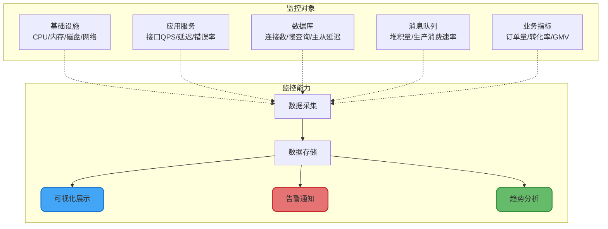
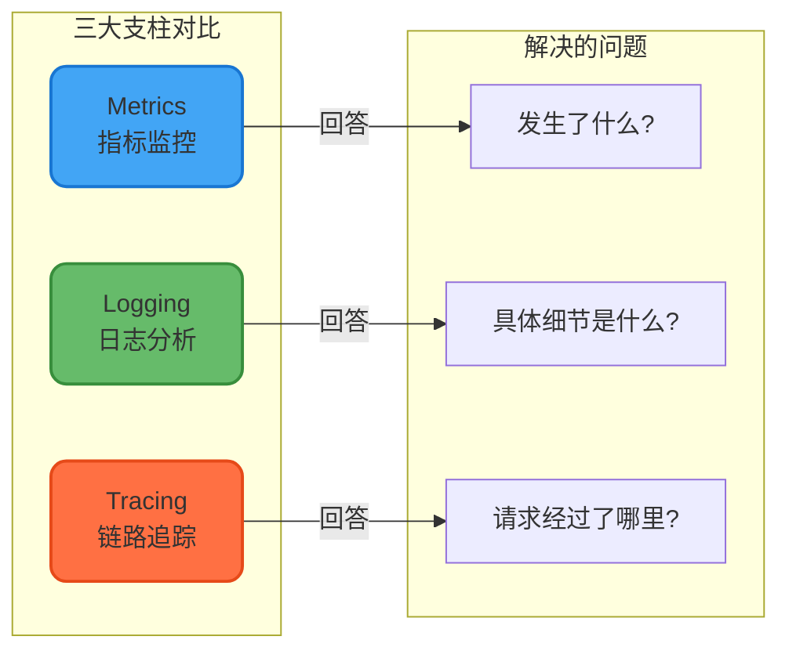
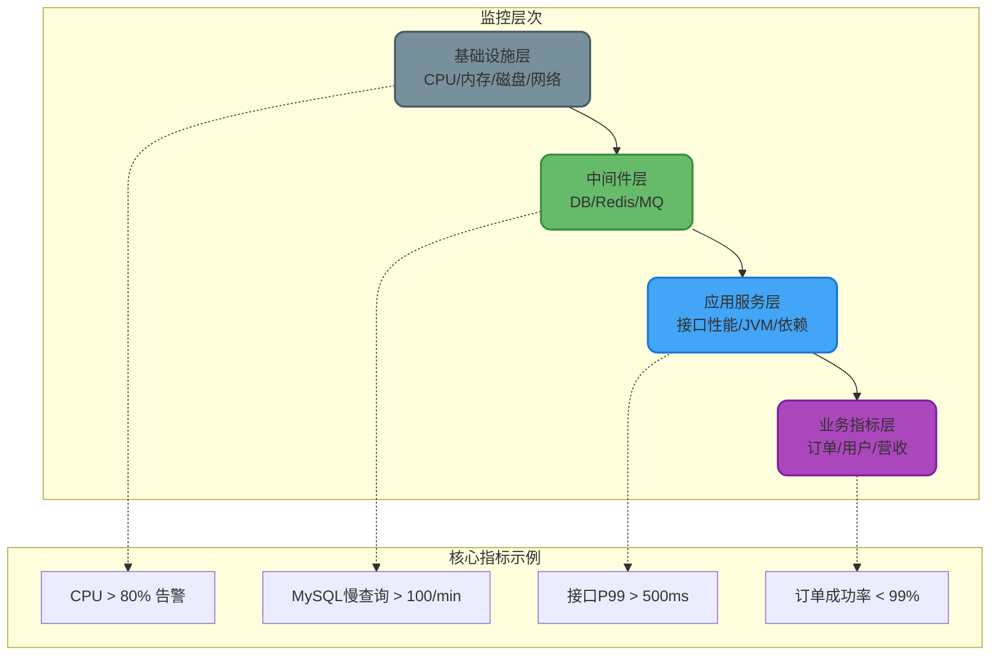
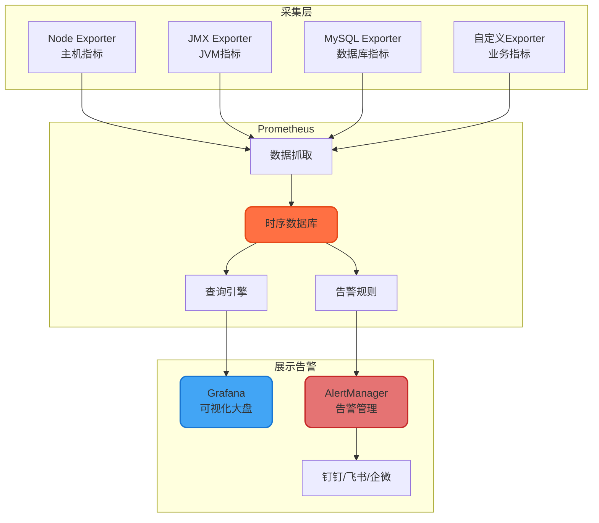
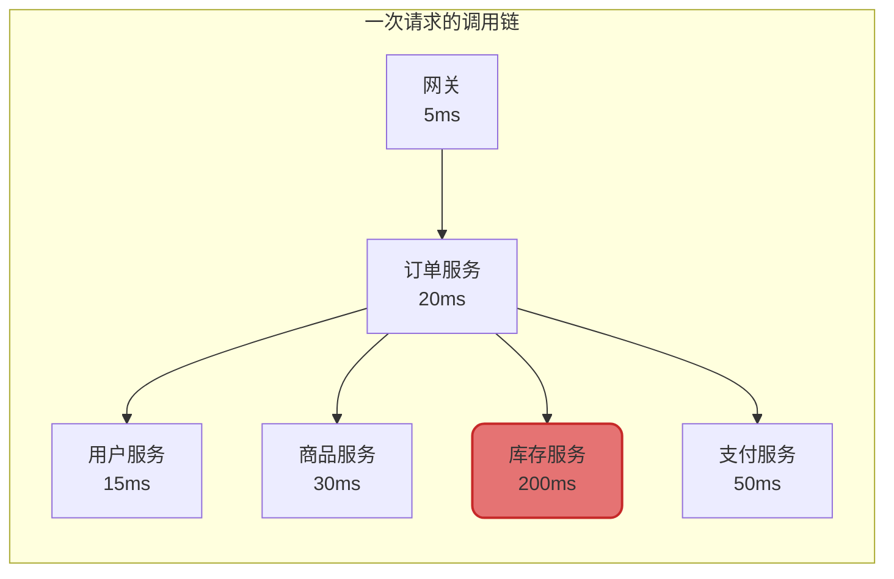
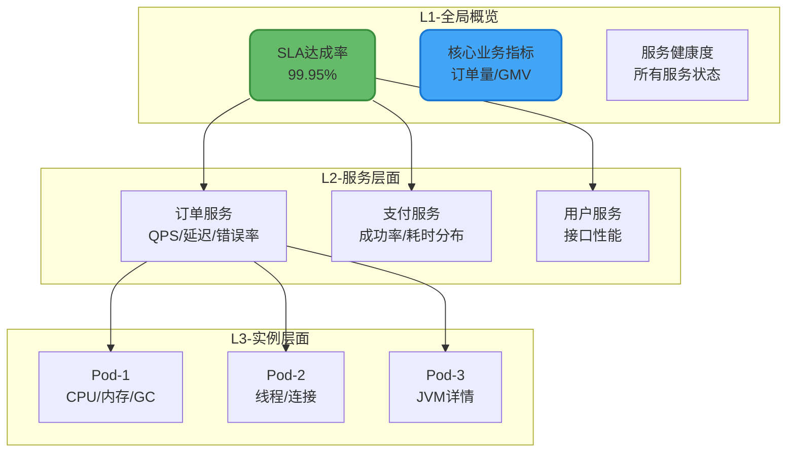

# 微服务可观测性与监控体系

## 为什么说监控是微服务的生命线

有个说法叫"出了线上事故，先别管哪里有问题，监控肯定是有问题的"。话虽然有点极端，但道理没毛病——如果监控做得好，问题早就发现了，哪还会等到事故发生？

微服务架构下，一个用户请求可能经过十几个服务，任何一个环节出问题都可能导致整体异常。没有完善的监控体系，定位问题就像大海捞针。

### 监控能帮我们做什么

**趋势分析，提前预警**

通过持续收集指标数据，我们能预测未来可能出现的问题。比如监控磁盘使用量的增长趋势，发现某台机器磁盘每天增长2GB，按这个速度10天后就满了，提前扩容或者清理日志。

**故障定位，快速恢复**

半夜三点收到告警，说订单成功率下降了。有监控的话，5分钟就能定位到是支付服务的某个接口超时导致的。没监控的话，可能折腾两小时还在猜是哪里出了问题。

**数据可视化，一目了然**

打开监控大盘，服务的健康状态、请求量、错误率、延迟分布，一眼就能看清。不用登录服务器敲命令，也不用翻日志。

**容量规划，心中有数**

通过历史数据分析，知道每天高峰期的QPS是多少，CPU使用率会到多少，从而合理规划机器配置和扩容策略。



## 可观测性的三大支柱

现在经常提到"可观测性"这个词，它比"监控"的概念更广。可观测性有三大支柱：Metrics（指标）、Logging（日志）、Tracing（链路追踪），三者结合才能全面掌握系统状态。

### Metrics：用数字说话

指标是用数值描述的系统状态，通常是时序数据。比如"过去1分钟的请求量是1000"、"当前CPU使用率是60%"、"平均响应时间是50ms"。

指标的特点是**聚合性强、存储成本低**。你可以快速知道"订单接口的P99延迟是多少"，但没法知道"那个超时的请求具体是怎么处理的"。

### Logging：记录现场

日志记录的是离散事件，包含详细的上下文信息。当你想知道某个请求为什么失败的时候，就得看日志。

日志的特点是**信息丰富、查询灵活**，但存储成本高、查询性能相对较差。大促期间一天几百GB的日志很常见。

### Tracing：串联全链路

链路追踪记录的是一个请求在各个服务之间的调用关系和耗时。当请求经过多个服务时，能清楚看到每一步花了多长时间，哪里是瓶颈。

链路追踪在微服务架构下特别重要，因为一个请求可能涉及十几个服务的调用，没有链路追踪根本没法定位问题。



## 该监控什么：从基础到业务

### 基础设施监控

这是最底层的监控，不管什么业务都要做：

**服务器资源**
- CPU使用率：超过80%就要警觉
- 内存使用率：注意内存泄漏
- 磁盘使用率和IO：磁盘满了服务就挂了
- 网络流量和连接数：带宽是不是瓶颈

**容器/K8s**
- Pod状态和重启次数
- 资源limit和request的使用情况
- 节点负载分布

### 中间件监控

数据库、缓存、消息队列这些中间件的健康状态：

**数据库（MySQL）**
- 连接数：是否逼近max_connections
- QPS和TPS：当前压力大不大
- 慢查询数量：超过1秒的SQL有多少
- 主从延迟：从库是否跟得上

**缓存（Redis）**
- 内存使用率
- 命中率：低于90%就要查原因
- 连接数
- 大Key监控

**消息队列（Kafka/RocketMQ）**
- 消息堆积量：消费跟不上生产了吗
- 生产消费速率
- 分区分布是否均匀

### 应用服务监控

这是业务开发最关心的部分：

**接口监控**
- 请求量（QPS）
- 响应时间（P50/P95/P99）
- 错误率（4XX/5XX）
- 超时率

**JVM监控**
- GC次数和耗时
- 各内存区域使用情况
- 线程数和死锁检测

**依赖调用**
- 外部接口的成功率和延迟
- 第三方服务的可用性

### 业务监控

这个往往被忽视，但其实很关键：

- 订单量、成交额
- 用户注册量、活跃度
- 转化率
- 关键业务流程的成功率



## 监控技术选型：从老牌到新生代

### 老牌监控系统

**Zabbix**

大概是最知名的老牌监控系统了，很多公司的运维都是从Zabbix入门的。功能很全面，支持各种采集方式，但问题也明显：

- 用MySQL存储时序数据，数据量大了性能扛不住
- 界面比较老，操作也相对繁琐
- 对云原生和容器支持不太友好

现在新项目基本不会选Zabbix了，但一些传统企业还在用。

**Nagios**

比Zabbix还老，1999年就有了。主要做主机和服务的存活监控，功能比较基础。免费版功能有限，商业版又太贵，现在用的人越来越少了。

### 新一代监控系统

**Prometheus + Grafana：当前的主流选择**

Prometheus是CNCF毕业的项目，基本上是云原生时代的监控标配。它的特点：

- 自带高性能时序数据库，存储效率高
- 强大的PromQL查询语言
- 基于Pull模式主动采集，对被监控服务侵入小
- 支持服务发现，和K8s配合得很好
- 生态丰富，各种Exporter拿来就用

Grafana是可视化神器，可以对接各种数据源做漂亮的监控大盘。Prometheus负责采集存储，Grafana负责展示告警，这俩组合基本是行业标准了。



**Open-Falcon**

小米开源的监控系统，在国内有一定用户基础。它针对Zabbix的痛点做了改进，支持数据分片，能监控更大规模的集群。但社区活跃度一般，和云原生的结合也没Prometheus好。

## Prometheus实战：从搭建到使用

### 快速搭建

最简单的方式是用Docker Compose：

```yaml
version: '3'
services:
  prometheus:
    image: prom/prometheus:v2.45.0
    container_name: prometheus
    ports:
      - "9090:9090"
    volumes:
      - ./prometheus.yml:/etc/prometheus/prometheus.yml
      - prometheus_data:/prometheus
    command:
      - '--config.file=/etc/prometheus/prometheus.yml'
      - '--storage.tsdb.path=/prometheus'
      - '--storage.tsdb.retention.time=15d'

  grafana:
    image: grafana/grafana:10.0.0
    container_name: grafana
    ports:
      - "3000:3000"
    volumes:
      - grafana_data:/var/lib/grafana
    environment:
      - GF_SECURITY_ADMIN_PASSWORD=your_password

  alertmanager:
    image: prom/alertmanager:v0.25.0
    container_name: alertmanager
    ports:
      - "9093:9093"
    volumes:
      - ./alertmanager.yml:/etc/alertmanager/alertmanager.yml

volumes:
  prometheus_data:
  grafana_data:
```

prometheus.yml配置文件：

```yaml
global:
  scrape_interval: 15s     # 采集间隔
  evaluation_interval: 15s  # 规则评估间隔

alerting:
  alertmanagers:
    - static_configs:
        - targets: ['alertmanager:9093']

rule_files:
  - "alert_rules.yml"

scrape_configs:
  # 监控Prometheus自己
  - job_name: 'prometheus'
    static_configs:
      - targets: ['localhost:9090']

  # 监控Node Exporter（主机指标）
  - job_name: 'node'
    static_configs:
      - targets: ['node-exporter:9100']

  # 监控Spring Boot应用
  - job_name: 'spring-boot-apps'
    metrics_path: '/actuator/prometheus'
    static_configs:
      - targets: 
        - 'order-service:8080'
        - 'user-service:8080'
        - 'payment-service:8080'
    relabel_configs:
      - source_labels: [__address__]
        regex: '(.*):\d+'
        target_label: instance
        replacement: '$1'

  # 基于K8s服务发现
  - job_name: 'kubernetes-pods'
    kubernetes_sd_configs:
      - role: pod
    relabel_configs:
      - source_labels: [__meta_kubernetes_pod_annotation_prometheus_io_scrape]
        action: keep
        regex: true
      - source_labels: [__meta_kubernetes_pod_annotation_prometheus_io_path]
        action: replace
        target_label: __metrics_path__
        regex: (.+)
```

### Spring Boot集成Prometheus

只需要加几个依赖和配置：

```java
// pom.xml依赖
// <dependency>
//     <groupId>org.springframework.boot</groupId>
//     <artifactId>spring-boot-starter-actuator</artifactId>
// </dependency>
// <dependency>
//     <groupId>io.micrometer</groupId>
//     <artifactId>micrometer-registry-prometheus</artifactId>
// </dependency>

// application.yml配置
// management:
//   endpoints:
//     web:
//       exposure:
//         include: prometheus,health,info
//   metrics:
//     tags:
//       application: ${spring.application.name}

/**
 * 自定义业务指标示例
 */
@Component
@Slf4j
public class OrderMetrics {
    
    private final Counter orderCreatedCounter;
    private final Counter orderFailedCounter;
    private final Timer orderProcessTimer;
    private final AtomicInteger pendingOrderGauge;
    
    public OrderMetrics(MeterRegistry registry) {
        // 计数器：订单创建成功数
        this.orderCreatedCounter = Counter.builder("order_created_total")
                .description("订单创建成功总数")
                .tag("service", "order-service")
                .register(registry);
        
        // 计数器：订单创建失败数
        this.orderFailedCounter = Counter.builder("order_failed_total")
                .description("订单创建失败总数")
                .tag("service", "order-service")
                .register(registry);
        
        // 计时器：订单处理耗时
        this.orderProcessTimer = Timer.builder("order_process_duration")
                .description("订单处理耗时")
                .publishPercentiles(0.5, 0.95, 0.99)  // 输出P50/P95/P99
                .register(registry);
        
        // 仪表盘：待处理订单数
        this.pendingOrderGauge = new AtomicInteger(0);
        Gauge.builder("order_pending_count", pendingOrderGauge, AtomicInteger::get)
                .description("待处理订单数")
                .register(registry);
    }
    
    /**
     * 记录订单创建成功
     */
    public void recordOrderCreated() {
        orderCreatedCounter.increment();
    }
    
    /**
     * 记录订单创建失败
     */
    public void recordOrderFailed(String reason) {
        Counter.builder("order_failed_total")
                .tag("reason", reason)
                .register(Metrics.globalRegistry)
                .increment();
    }
    
    /**
     * 记录订单处理耗时
     */
    public void recordProcessTime(long startTimeNanos) {
        long duration = System.nanoTime() - startTimeNanos;
        orderProcessTimer.record(duration, TimeUnit.NANOSECONDS);
    }
    
    /**
     * 更新待处理订单数
     */
    public void updatePendingOrderCount(int count) {
        pendingOrderGauge.set(count);
    }
}

/**
 * 在业务代码中使用
 */
@Service
@Slf4j
public class OrderService {
    
    @Autowired
    private OrderMetrics metrics;
    
    public OrderResult createOrder(OrderRequest request) {
        long startTime = System.nanoTime();
        
        try {
            // 业务处理逻辑...
            Order order = doCreateOrder(request);
            
            metrics.recordOrderCreated();
            return OrderResult.success(order);
            
        } catch (StockNotEnoughException e) {
            metrics.recordOrderFailed("stock_not_enough");
            return OrderResult.fail("库存不足");
            
        } catch (Exception e) {
            metrics.recordOrderFailed("system_error");
            throw e;
            
        } finally {
            metrics.recordProcessTime(startTime);
        }
    }
}
```

### PromQL查询入门

PromQL是Prometheus的查询语言，掌握常用语法就够用了：

```promql
# 查询最近1分钟的请求量
sum(rate(http_requests_total[1m]))

# 按服务分组查询QPS
sum by(service) (rate(http_requests_total[1m]))

# 计算错误率
sum(rate(http_requests_total{status=~"5.."}[5m])) 
/ 
sum(rate(http_requests_total[5m])) * 100

# 查询P99响应时间
histogram_quantile(0.99, 
  sum by(le) (rate(http_request_duration_seconds_bucket[5m])))

# CPU使用率超过80%的机器
node_cpu_seconds_total{mode="idle"} < 0.2

# 内存使用率
(1 - node_memory_MemAvailable_bytes / node_memory_MemTotal_bytes) * 100

# 磁盘使用率
(1 - node_filesystem_avail_bytes / node_filesystem_size_bytes) * 100
```

## 告警配置：该告什么，怎么告

### 告警设计原则

告警配置最怕两种情况：**告警太多麻木了**和**该告的没告**。好的告警应该满足：

1. **可执行**：收到告警就知道该干嘛，不需要处理的告警就不要发
2. **分级清晰**：紧急的要能立刻通知到人，不紧急的可以次日处理
3. **收敛合理**：同一个问题不要重复发送刷屏
4. **有上下文**：告警信息要包含足够的定位信息

### 告警规则示例

```yaml
# alert_rules.yml
groups:
  - name: 服务可用性告警
    rules:
      # 服务宕机告警
      - alert: ServiceDown
        expr: up == 0
        for: 1m
        labels:
          severity: critical
        annotations:
          summary: "服务不可用: {{ $labels.instance }}"
          description: "{{ $labels.job }} 的实例 {{ $labels.instance }} 已经down了超过1分钟"

      # 接口错误率过高
      - alert: HighErrorRate
        expr: |
          sum by(service) (rate(http_requests_total{status=~"5.."}[5m])) 
          / 
          sum by(service) (rate(http_requests_total[5m])) > 0.05
        for: 5m
        labels:
          severity: warning
        annotations:
          summary: "接口错误率过高: {{ $labels.service }}"
          description: "{{ $labels.service }} 的5XX错误率超过5%，当前值: {{ $value | printf \"%.2f\" }}%"

      # 响应时间过长
      - alert: HighLatency
        expr: |
          histogram_quantile(0.95, 
            sum by(service, le) (rate(http_request_duration_seconds_bucket[5m]))
          ) > 1
        for: 5m
        labels:
          severity: warning
        annotations:
          summary: "接口响应时间过长: {{ $labels.service }}"
          description: "{{ $labels.service }} 的P95响应时间超过1秒"

  - name: 基础设施告警
    rules:
      # CPU使用率过高
      - alert: HighCPU
        expr: 100 - (avg by(instance) (rate(node_cpu_seconds_total{mode="idle"}[5m])) * 100) > 85
        for: 10m
        labels:
          severity: warning
        annotations:
          summary: "CPU使用率过高: {{ $labels.instance }}"
          description: "CPU使用率持续10分钟超过85%，当前: {{ $value | printf \"%.1f\" }}%"

      # 内存使用率过高
      - alert: HighMemory
        expr: (1 - node_memory_MemAvailable_bytes / node_memory_MemTotal_bytes) * 100 > 90
        for: 5m
        labels:
          severity: critical
        annotations:
          summary: "内存使用率过高: {{ $labels.instance }}"
          description: "内存使用率超过90%，当前: {{ $value | printf \"%.1f\" }}%"

      # 磁盘空间不足
      - alert: DiskSpaceLow
        expr: (1 - node_filesystem_avail_bytes{fstype=~"ext4|xfs"} / node_filesystem_size_bytes) * 100 > 85
        for: 5m
        labels:
          severity: warning
        annotations:
          summary: "磁盘空间不足: {{ $labels.instance }}"
          description: "磁盘 {{ $labels.mountpoint }} 使用率超过85%"

  - name: 业务指标告警
    rules:
      # 订单成功率下降
      - alert: OrderSuccessRateLow
        expr: |
          sum(rate(order_created_total[5m])) 
          / 
          (sum(rate(order_created_total[5m])) + sum(rate(order_failed_total[5m]))) < 0.95
        for: 5m
        labels:
          severity: critical
        annotations:
          summary: "订单成功率下降"
          description: "订单创建成功率低于95%，当前: {{ $value | printf \"%.2f\" }}"

      # 消息堆积
      - alert: MessageBacklog
        expr: kafka_consumer_lag > 10000
        for: 10m
        labels:
          severity: warning
        annotations:
          summary: "消息堆积: {{ $labels.topic }}"
          description: "消费者 {{ $labels.consumer_group }} 在topic {{ $labels.topic }} 上堆积超过1万条"
```

### AlertManager配置

```yaml
# alertmanager.yml
global:
  resolve_timeout: 5m

route:
  receiver: 'default-receiver'
  group_by: ['alertname', 'service']
  group_wait: 30s      # 等待30秒收集同组告警
  group_interval: 5m   # 同组告警间隔5分钟
  repeat_interval: 4h  # 重复告警间隔4小时
  
  routes:
    # 紧急告警走电话
    - match:
        severity: critical
      receiver: 'critical-receiver'
      group_wait: 10s
      repeat_interval: 30m
    
    # 一般告警走钉钉
    - match:
        severity: warning
      receiver: 'warning-receiver'

receivers:
  - name: 'default-receiver'
    webhook_configs:
      - url: 'http://dingtalk-webhook:8060/dingtalk/default/send'
        send_resolved: true

  - name: 'critical-receiver'
    webhook_configs:
      - url: 'http://dingtalk-webhook:8060/dingtalk/oncall/send'
        send_resolved: true
      - url: 'http://phone-alert-service/api/call'
        send_resolved: false

  - name: 'warning-receiver'
    webhook_configs:
      - url: 'http://dingtalk-webhook:8060/dingtalk/dev-team/send'
        send_resolved: true

inhibit_rules:
  # 如果服务挂了，抑制其他相关告警
  - source_match:
      alertname: ServiceDown
    target_match_re:
      alertname: (HighLatency|HighErrorRate)
    equal: ['service']
```

## 链路追踪：请求到底经过了哪里

### 为什么需要链路追踪

假设用户反馈"下单很慢"，在微服务架构下，一个下单请求可能经过：

网关 → 订单服务 → 用户服务 → 商品服务 → 库存服务 → 支付服务

到底是哪个环节慢？没有链路追踪的话，只能挨个服务看日志、查监控，效率很低。有了链路追踪，一眼就能看到每个环节的耗时。



一眼就能看出来，库存服务耗时200ms是瓶颈，需要优化。

### 链路追踪的核心概念

**Trace**：代表一次完整的请求，从入口到结束。每个Trace有唯一的TraceId。

**Span**：Trace中的一个操作单元，比如一次RPC调用、一次数据库查询。每个Span有SpanId和父SpanId，通过父子关系形成调用树。

**Tag**：Span上的标签，记录一些元数据，比如HTTP状态码、请求URL等。

**Log**：Span上的日志，记录某个时刻发生的事件。

### 常用链路追踪方案

**SkyWalking**：Apache顶级项目，国内用得比较多。基于Java Agent，对代码零侵入，接入成本低。

**Jaeger**：Uber开源的，CNCF毕业项目，和Prometheus、Kubernetes配合得好。

**Zipkin**：Twitter开源的，老牌链路追踪系统，社区成熟。

**OpenTelemetry**：现在的趋势是往OpenTelemetry统一，它定义了标准的数据格式和API，各家追踪系统都在适配。

### SkyWalking接入示例

SkyWalking接入特别简单，只需要加个Java Agent：

```bash
# 下载SkyWalking Agent
wget https://archive.apache.org/dist/skywalking/java-agent/8.16.0/apache-skywalking-java-agent-8.16.0.tgz
tar -xzf apache-skywalking-java-agent-8.16.0.tgz

# 启动应用时加上agent参数
java -javaagent:/path/to/skywalking-agent/skywalking-agent.jar \
     -Dskywalking.agent.service_name=order-service \
     -Dskywalking.collector.backend_service=skywalking-oap:11800 \
     -jar order-service.jar
```

如果需要记录业务信息，可以手动加Span：

```java
@Service
public class PaymentService {
    
    public PaymentResult processPayment(PaymentRequest request) {
        // 创建自定义Span
        AbstractSpan span = ContextManager.createLocalSpan("processPayment");
        span.tag("orderId", request.getOrderId());
        span.tag("amount", String.valueOf(request.getAmount()));
        
        try {
            // 1. 调用第三方支付
            ThirdPartyResult result = callThirdPartyPayment(request);
            span.tag("thirdParty", result.getChannel());
            
            // 2. 更新订单状态
            updateOrderStatus(request.getOrderId(), result.isSuccess());
            
            return result.isSuccess() 
                    ? PaymentResult.success() 
                    : PaymentResult.fail(result.getMessage());
                    
        } catch (Exception e) {
            span.errorOccurred();
            span.log(e);
            throw e;
        } finally {
            ContextManager.stopSpan();
        }
    }
}
```

## 监控体系搭建最佳实践

### 监控大盘设计

一个好的监控大盘应该分层组织，先看整体，再看细节：

**L1-全局概览**：核心业务指标、关键服务健康度、SLA达成情况
**L2-服务层面**：各服务的QPS、延迟、错误率、依赖健康度
**L3-实例层面**：单个实例的详细指标，用于深入排查



### 告警治理

定期做告警复盘：

1. **无效告警梳理**：过去一个月触发但不需要处理的告警，调整阈值或删除
2. **告警覆盖检查**：是否有重要指标没有监控
3. **告警响应统计**：平均响应时间、恢复时间，有没有改进空间
4. **告警分级调整**：某些告警的级别是否合理

### OnCall机制

有了告警还得有人响应。建议建立OnCall机制：

- 排班轮值，保证随时有人能响应
- 告警升级，如果主OnCall没响应，自动升级给备OnCall
- 故障复盘，每次事故后分析根因并改进监控
- 知识沉淀，常见问题的处理手册

## 小结

微服务监控体系是个系统工程，不是装几个工具就完事的。总结几个关键点：

| 维度 | 关键点 | 推荐方案 |
|-----|-------|---------|
| 指标监控 | 多层次、可下钻 | Prometheus + Grafana |
| 日志管理 | 集中存储、快速检索 | ELK / Loki |
| 链路追踪 | 全链路、低侵入 | SkyWalking / Jaeger |
| 告警管理 | 分级、收敛、可执行 | AlertManager |

监控不是一劳永逸的事，需要持续迭代：

- 业务迭代时同步更新监控
- 每次故障后补充相关监控
- 定期清理无效告警和过期指标
- 不断优化告警阈值和规则

只有监控做好了，你才能在晚上安心睡觉。否则每次半夜被叫起来，都是一场不知道敌人在哪的战斗。
