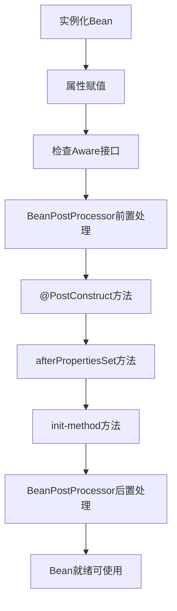

# 超级八股文系列来了！

欢迎来到**超级八股文**系列！这是一套精心打造的 Java 全栈技术知识库，专注于帮助你系统化地掌握面试必备知识，轻松应对技术面试的各种挑战。

## 什么是超级八股文？

所谓"八股文"，是指技术面试中常见的基础理论问题。传统的八股文往往停留在概念层面，让人死记硬背却难以真正理解。

**超级八股文**则不同——它不仅告诉你"是什么"，更深入讲解"为什么"和"怎么用"。通过详细的原理剖析、生动的代码示例、清晰的流程图解，让你真正理解每一个技术点，做到**知其然，更知其所以然**。

## 超级八股文的核心优势

### 1. 技术的深度详解

每一个知识点都经过精心梳理，从基础概念到底层原理，层层递进。我们不满足于表面的定义解释，而是深入到技术的本质。

以 MySQL 索引为例，我们不仅讲解索引的作用，还会详细分析：
- 为什么不选择哈希表作为索引结构？
- 为什么不使用二叉查找树、AVL树、红黑树？
- B+树相比B树有哪些优势？
- InnoDB的数据页与B+树是如何关联的？

这种**追根溯源式的讲解**，让你在面试中能够侃侃而谈，展现真正的技术深度。

### 2. 丰富的代码示例

理论再好，不如代码来得直观。超级八股文中的每个知识点都配有**精心设计的代码示例**，让你不仅能理解概念，还能动手实践。

```java
// Bean生命周期示例 - 展示初始化顺序
@Service
public class InitOrderDemo implements InitializingBean {
    
    public InitOrderDemo() {
        System.out.println("1. 构造函数执行");
    }
    
    @PostConstruct
    public void postConstruct() {
        System.out.println("2. @PostConstruct执行");
    }
    
    @Override
    public void afterPropertiesSet() {
        System.out.println("3. afterPropertiesSet执行");
    }
}
```

代码示例覆盖了各种场景：
- **正确用法**：展示最佳实践
- **错误示范**：避免常见陷阱
- **对比分析**：不同方案的优劣比较

### 3. 清晰的流程图解

复杂的技术概念往往需要图形化展示才能更好理解。超级八股文大量使用 **Mermaid 流程图**，将抽象的概念可视化：



通过流程图，你可以：
- 一目了然地掌握复杂流程
- 理解组件之间的关系
- 记忆关键的执行顺序

### 4. 重点内容的醒目标注

为了帮助你快速抓住重点，超级八股文使用了多种标注方式：

:::tip 重要提示
关键知识点会用醒目的提示框标注，让你不会错过任何重要内容。
:::

:::info 知识拓展
相关的扩展知识会单独标注，帮助你建立更完整的知识体系。
:::

- **粗体强调**：核心概念和关键术语
- **代码高亮**：重要的代码片段和命令
- **对比表格**：不同技术方案的横向对比

### 5. 体系化的知识结构

超级八股文不是零散知识点的堆砌，而是一套**完整的知识体系**。从开发工具到计算机基础，从 Java 核心到框架生态，从数据库到分布式架构，形成了完整的技术能力图谱。

每个模块都按照由浅入深的顺序编排，让你能够循序渐进地学习，构建扎实的技术基础。

### 6. 面试导向的内容设计

所有内容都围绕**面试高频考点**设计，直击面试官最爱问的问题：
- 基础概念的准确定义
- 底层原理的深入分析
- 不同方案的对比选型
- 实际场景的应用实践
- 常见问题的排查解决

## 超级八股文内容一览

超级八股文涵盖了 Java 技术栈的方方面面，以下是完整的内容目录：

### 1. Java

#### 面试技巧
- 面试应该如何准备

#### 基础知识
- Java语言特性与核心概念
- 面向对象核心概念
- 异常处理与final-finally-finalize
- 基本类型与包装类
- 面向对象编程基础
- 接口与抽象类
- String类详解
- 泛型详解
- Java数值与金额精度
- 反射与动态代理
- Java序列化详解
- JDK新版本特性详解
- static关键字与枚举详解
- 注解机制详解
- 日期时间处理与线程安全
- UUID与唯一标识生成
- 字符编码详解
- equals与hashCode方法详解
- Arrays排序算法详解
- ClassNotFoundException异常分析

#### 集合
- Java集合框架详解
- Set集合与排序机制详解
- 集合遍历修改与并发安全

**HashMap相关**
- HashMap核心原理与数据结构
- HashMap的哈希算法与索引计算
- HashMap的存取删除操作详解
- HashMap的扩容与容量优化
- Hash冲突原理与解决方案
- HashMap线程安全问题与解决方案
- HashMap遍历与操作最佳实践

**ConcurrentHashMap相关**
- ConcurrentHashMap线程安全机制详解
- ConcurrentHashMap架构演进与设计权衡
- ConcurrentHashMap高级特性与最佳实践

#### IO相关
- Java IO基础与流操作
- Java IO设计模式详解
- IO模型与并发处理策略
- BIO、NIO与AIO核心原理
- NIO核心组件与零拷贝
- IO多路复用技术详解

#### JVM

**内存分布**
- JVM运行时内存区域详解
- Java进程内存结构与方法区演进
- 对象创建与内存分配策略
- 对象存活判断与GC Roots
- 常量池机制与内存结构深度解析

**内存回收**
- JVM垃圾回收机制深度解析
- 垃圾回收流程与触发机制
- 内存分配与回收原则

**垃圾回收**
- 垃圾收集器详解
- G1垃圾收集器原理与优化
- ZGC低延迟垃圾收集器
- Java版本GC演进对比
- 垃圾收集器对比与选型策略

**诊断与调优**
- JIT与AOT编译技术深度解析
- 内存异常处理与JVM稳定性保障
- JVM参数配置与性能调优
- JVM诊断分析工具实战

#### 类加载
- 类的生命周期与加载时机
- 类加载详细流程解析
- 类加载器与双亲委派机制
- 双亲委派破坏与安全机制
- Class文件结构深度解析

#### 并发多线程
- 并发编程基础概念
- 线程调度与上下文切换
- 线程通信与协作机制
- 线程安全与并发控制
- 线程同步与数据一致性
- 线程异常处理机制
- CAS机制深度剖析
- 虚拟线程与现代并发编程

**内存模型**
- Java内存模型核心原理
- Happens-Before原则详解
- 内存屏障与指令重排
- Volatile关键字深入解析

**锁**
- Java锁机制分类与对比
- 锁的公平性与竞争机制
- 死锁与活锁问题分析
- Synchronized并发特性保证
- Synchronized实现原理与核心机制
- Synchronized锁升级与优化策略
- Volatile与Synchronized对比分析

**线程池**
- 线程池核心原理与最佳实践
- 线程池高级特性与调优策略

**并发工具**
- AQS抽象队列同步器深度解析
- ThreadLocal线程局部变量详解
- TransmittableThreadLocal线程池上下文传递
- JUC并发工具包详解
- Unsafe底层操作详解
- 并发集合深入剖析
- 异步编程与CompletableFuture实战
- 并发同步工具实战指南

#### 设计模式
- 设计模式概述与基本原则
- 单例模式深度解析
- 工厂模式体系详解
- 行为型设计模式实践
- 结构型设计模式应用
- MVC架构模式与设计模式实战

#### Stream流相关
- Lambda表达式与语法糖机制详解
- Stream API核心操作详解
- Stream并行流原理与性能优化

#### 恶意攻击
- Web安全攻击与防护
- 网络层攻击与防护
- 权限控制与越权漏洞
- 密码学基础与加密技术

---

### 2. 开发工具

#### Maven
- Maven项目管理工具详解
- Maven依赖管理与冲突解决
- Maven插件系统与开发实践

#### Git
- Git版本控制系统全面解析
- Git代码回滚与分支合并策略
- GitHub高效使用技巧与实践

#### Docker
- Docker容器技术核心概念
- Docker安装配置与实战操作
- Dockerfile镜像构建与容器编排

#### 日志
- Java日志框架与门面模式
- 日志性能优化实践
- 分布式日志系统架构

---

### 3. 基础内功

#### 操作系统
- 进程线程与协程
- 进程通信与调度
- 内存管理与虚拟地址
- CPU缓存与一致性协议
- 系统性能监控
- IO优化与零拷贝
- 线程实现机制

#### 网络
- 网络基础与协议模型
- TCP协议深入解析
- HTTP协议演进与特性
- 网络工具与地址解析
- 网络架构与优化
- 网络诊断与监控

#### 数据结构
- 线性数据结构
- 树形结构基础
- 平衡树与搜索树
- 特殊树结构
- 图结构

---

### 4. 数据库

#### MySQL

**MySQL锁**
- MySQL锁机制概述
- MySQL锁的粒度与层级
- MySQL行级锁详解
- MySQL乐观锁与悲观锁实战
- MySQL死锁问题分析与解决

**MySQL事务**
- MySQL事务机制与ACID特性
- MySQL事务执行流程与两阶段提交
- MySQL事务隔离级别详解
- MySQL隔离级别实现原理
- MySQL幻读问题深度剖析
- MySQL事务优化实战
- MySQL事务隔离级别选择策略

**MySQL索引**
- MySQL索引基础与底层原理
- MySQL索引类型与存储结构
- MySQL联合索引与查询优化
- MySQL索引失效问题排查
- MySQL索引设计最佳实践

**MySQL慢SQL调优**
- 执行计划深度解析与实战
- ORDER BY排序机制与优化
- JOIN查询优化与实战
- SQL性能调优全面指南
- MySQL分页查询原理与深度优化

**MySQL特征**
- MySQL架构与执行流程
- MySQL存储引擎与高级特性
- MySQL主从复制与同步机制详解
- MySQL版本特性与演进
- MySQL查询缓存机制详解

**MySQL使用的优化**
- MySQL字段类型与设计规范
- MySQL主键设计与自增机制
- MySQL性能优化与开发规范
- MySQL数据存储优化策略
- MySQL高级特性与最佳实践
- MySQL热点数据更新优化方案
- MySQL数据加密与安全实践

**MySQL进阶实战**
- 大表在线DDL操作实战
- 千万级数据查询优化实战
- 热点数据更新与缓存策略
- 数据归档与平滑迁移实战
- 逻辑删除与唯一性约束设计

#### Redis
- Redis核心数据类型与底层实现
- Redis线程模型与性能优化
- Redis高级数据结构实现原理
- Redis持久化与数据安全
- Redis内存管理与优化策略
- Redis分布式特性与对比分析
- Redis集群架构与高可用方案
- Redis事务与原子性操作
- Redis消息队列与通信模式
- Redis原子性操作与命令详解
- Redis分布式锁实战指南
- Redis乐观锁机制与并发控制
- Redisson分布式锁核心实现原理
- Redisson Watchdog自动续期机制深度剖析
- Redisson lock与tryLock使用对比
- RedLock算法原理与实践
- Redis与数据库一致性保障方案
- Redis性能问题诊断与优化实战
- Redis 8.0版本新特性详解
- Redis Cluster集群操作限制与解决方案
- Redis实战应用场景详解
- Redis操作最佳实践与遍历技巧

#### Oracle
- Oracle索引技术全面解析
- Oracle核心语法与特性
- Oracle事务隔离机制详解
- Oracle与MySQL全面对比
- Oracle视图与数据安全

---

### 5. 框架中间件

#### Spring
- Spring核心概念详解
- Bean生命周期与依赖注入
- Spring高级特性与应用
- Spring循环依赖解决方案详解

**Spring事务**
- Spring事务管理核心详解
- Spring事务传播机制与隔离级别
- Spring事务实现原理与注解详解
- Spring事务失效场景与解决方案
- Spring事务高级应用场景

**SpringBoot**
- SpringBoot核心特性与设计理念
- SpringBoot自动配置原理深度剖析
- SpringBoot启动与Web容器
- SpringBoot自定义Starter开发
- SpringBoot3与Spring6新特性
- SpringBoot Bean加载顺序控制
- SpringBoot启动原理

#### Mybatis
- MyBatis基础与核心概念
- MyBatis工作原理与核心组件
- MyBatis参数处理与SQL注入防护
- MyBatis动态SQL详解
- MyBatis结果映射与类型处理
- MyBatis分页实现方案
- MyBatis缓存机制详解
- MyBatis插件机制与拦截器
- MyBatis延迟加载与关联查询
- MyBatis连接池与数据源配置
- MyBatis-Plus增强特性详解

#### SpringCloud
- SpringCloud核心概念与架构
- API网关技术选型与对比
- Eureka核心机制深度解析
- Hystrix熔断与容错机制详解
- Nacos架构与核心功能详解
- Nacos服务注册与发现机制深度剖析
- Nacos配置中心实现原理与通信机制
- Nacos一致性协议与高可用设计
- 微服务负载均衡技术详解
- Feign核心概念与技术对比
- Feign配置与超时管理
- Feign性能优化与负载均衡

#### Zookeeper
- Zookeeper核心架构与数据模型
- Zookeeper一致性保障机制
- Zookeeper选举机制详解
- Zookeeper监听机制与通知
- Zookeeper典型应用场景

#### Kafka
- Kafka基础架构与核心概念
- Kafka消息可靠性保障机制
- Kafka消息发送与存储原理
- Kafka消费机制详解
- Kafka事务与一致性保障
- Kafka重平衡机制深度解析
- Kafka高级特性与核心机制

#### RocketMQ
- RocketMQ架构设计与工作流程
- RocketMQ消息可靠性保障机制
- RocketMQ消费模式与消息分发
- RocketMQ顺序消息与幂等性保障
- RocketMQ高级特性与事务消息
- RocketMQ性能优化与故障处理

#### RabbitMQ
- RabbitMQ架构与工作模式
- 消息可靠性保障机制
- 高级特性与应用场景
- 消费者流控与幂等性保障
- 集群架构与高可用方案

#### Elasticsearch
- Elasticsearch基础与数据类型
- 倒排索引原理与性能优势
- 集群架构与节点角色
- 数据精度处理与并发控制
- 深度分页问题与解决方案
- 索引生命周期管理
- 性能优化最佳实践
- 数据同步与一致性保障

#### Dubbo
- RPC与Dubbo基础概念
- Dubbo核心架构与调用流程
- Dubbo序列化与通信协议
- Dubbo负载均衡与服务治理
- Dubbo扩展机制SPI详解
- Dubbo高级特性与应用

#### Netty
- Netty核心架构与线程模型
- Netty设计模式深度剖析
- Netty零拷贝技术详解
- ByteBuf核心机制与内存管理
- Netty性能优化技术全解析
- Netty序列化与粘包拆包处理

#### XXL-JOB
- XXL-JOB调度机制与一致性保障
- XXL-JOB时间轮算法详解
- XXL-JOB分片任务与并行调度

#### Tomcat
- Tomcat核心架构与启动流程
- Tomcat请求处理机制详解
- Tomcat类加载器与类加载机制
- Tomcat IO模型详解

---

### 6. 进阶设计与性能优化

#### 微服务相关
- 微服务架构设计理念
- 微服务拆分策略与实践
- 微服务间通信技术详解
- 微服务治理与稳定性保障
- 微服务发布与部署策略

#### 分布式相关理论
- 分布式系统一致性理论详解
- 一致性哈希算法原理与实践
- 分布式共识算法与拜占庭问题

#### 分布式ID
- 分布式ID生成方案详解

#### 限流与熔断
- 限流算法原理与实现
- 熔断降级机制与实践
- 高级限流策略与应用
- 高并发系统设计实践

#### 缓存的设计
- 缓存淘汰策略详解
- 本地缓存实现与应用
- 本地缓存一致性保障方案
- 多级缓存架构设计与实践

#### 布隆过滤器
- 布隆过滤器原理与实战应用

#### 问题故障解决
- JVM诊断工具命令详解
- 堆内存分析与Dump文件处理
- 字节码插桩技术与性能监控
- Linux日志分析与问题排查实战

#### 分库分表
- 分库分表核心概念与应用场景
- 分表字段选择与数据倾斜治理
- 分片算法与ShardingJDBC路由策略
- 容量规划与扩容策略
- 分布式ID生成方案
- 跨库查询与性能优化
- 分布式数据库核心原理与选型实践

#### 分布式事务
- 分布式事务基础概念与解决方案
- 两阶段与三阶段提交协议
- TCC分布式事务详解
- 基于消息的分布式事务方案
- 本地消息表实现与优化

#### Seata
- Seata分布式事务框架核心原理
- Seata事务模式详解与选型指南
- AT模式深度剖析与隔离性问题

#### DDD
- 领域驱动设计核心思想与价值
- DDD分层架构模式详解
- 领域模型核心构建要素
- 领域事件与DDD落地实践

#### AI
- 大模型核心概念与技术原理
- DeepSeek技术架构解析
- RAG检索增强生成技术
- AI Agent与工具调用协议
- Spring AI开发框架实践

#### 方案设计
- 秒杀系统架构与库存扣减设计
- 消息队列设计与消息乱序处理
- 高并发计数系统设计
- 缓存系统设计与预热策略
- 订单支付并发冲突处理
- 敏感词过滤算法与实现

---

## 如何使用超级八股文？

### 系统学习

如果你是 Java 初学者或想系统复习，建议按照以下顺序学习：

1. **基础内功** → 打好计算机基础
2. **Java核心** → 掌握语言特性和核心API
3. **数据库** → 理解数据存储和查询优化
4. **框架中间件** → 学习主流技术栈
5. **进阶设计** → 提升架构设计能力

### 面试突击

如果你即将面试，可以重点关注：

- **高频考点**：集合、JVM、并发、MySQL、Redis、Spring
- **原理深挖**：HashMap原理、线程池、事务机制、索引优化
- **场景设计**：秒杀系统、分布式锁、缓存一致性

### 查漏补缺

遇到不熟悉的知识点时，可以通过搜索快速定位到相关文档，进行针对性学习。

## 开始你的学习之旅

准备好了吗？让我们一起开启超级八股文的学习之旅，用系统的知识武装自己，在面试中脱颖而出！

:::tip 学习建议
- 不要死记硬背，理解原理才是王道
- 动手敲代码，实践出真知
- 多思考"为什么"，建立知识关联
- 定期复习，巩固记忆
:::

祝你学习愉快，面试顺利！
